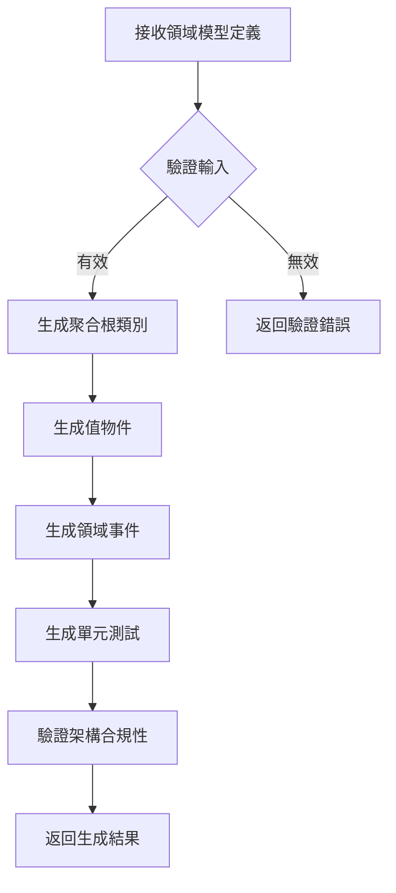

# DDD Aggregate Generator Skill

**版本**: 1.0
**用途**: 根據 DDD 戰術模式生成聚合根（Aggregate Root）程式碼
**Kiro 映射**: Idempotency + Immutable Input + Stateless Handler

---

## Skill 描述

此 Skill 負責生成符合 DDD 標準的聚合根類別，確保：
1. **冪等性（Idempotency）**: 相同的領域需求產生相同的程式碼結構
2. **不可變輸入（Immutable Input）**: 使用 Record 實作值物件
3. **無狀態處理（Stateless Handler）**: Skill 本身不保留狀態

---

## 輸入規格

```yaml
input:
  aggregateName: string        # 聚合根名稱（例如：Order）
  boundedContext: string       # 有界上下文（例如：Order）
  valueObjects: array          # 值物件列表
    - name: string
      fields: array
  entities: array              # 實體列表
    - name: string
      fields: array
  businessMethods: array       # 業務方法列表
    - name: string
      params: array
      returnType: string
```

---

## 生成模板

### 1. 聚合根類別

```java
package solid.humank.genaidemo.domain.{boundedContext}.model.aggregate;

import solid.humank.genaidemo.domain.common.aggregate.AggregateRoot;
import solid.humank.genaidemo.domain.common.annotations.AggregateRoot as AggregateRootAnnotation;
import java.time.LocalDateTime;
import java.util.*;

/**
 * {aggregateName} 聚合根
 *
 * 設計原則：
 * - Idempotency: 使用不可變的值物件
 * - Event Collection: 收集領域事件，不直接發布
 * - Boundary Control: 所有狀態變更透過業務方法
 */
@AggregateRootAnnotation(
    name = "{aggregateName}",
    description = "{aggregateName} 聚合根",
    boundedContext = "{boundedContext}",
    version = "1.0"
)
public class {aggregateName} extends AggregateRoot {

    // Identity (不可變)
    private final {aggregateName}Id id;

    // State (透過業務方法變更)
    private {aggregateName}Status status;

    // Timestamps
    private final LocalDateTime createdAt;
    private LocalDateTime updatedAt;

    /**
     * 建構子 - 建立新的聚合根
     * Kiro Pattern: Immutable Input + Fail-Fast Validation
     */
    public {aggregateName}({aggregateName}Id id, /* 其他參數 */) {
        // Fail-Fast Validation
        Objects.requireNonNull(id, "{aggregateName} ID 不能為空");

        this.id = id;
        this.status = {aggregateName}Status.CREATED;
        this.createdAt = LocalDateTime.now();
        this.updatedAt = this.createdAt;

        // 收集領域事件（Event-Driven Pattern）
        collectEvent({aggregateName}CreatedEvent.create(this.id));
    }

    /**
     * 重建建構子 - 從持久化重建
     * Kiro Pattern: Reconstruction 不觸發事件
     */
    @AggregateReconstruction.ReconstructionConstructor
    protected {aggregateName}(
        {aggregateName}Id id,
        {aggregateName}Status status,
        LocalDateTime createdAt,
        LocalDateTime updatedAt
    ) {
        this.id = id;
        this.status = status;
        this.createdAt = createdAt;
        this.updatedAt = updatedAt;
        // Note: 重建時不發布事件
    }

    // Getters (只暴露不可變副本)
    public {aggregateName}Id getId() { return id; }
    public {aggregateName}Status getStatus() { return status; }

    @Override
    public boolean equals(Object o) {
        if (this == o) return true;
        if (o instanceof {aggregateName} other) {
            return Objects.equals(id, other.id);
        }
        return false;
    }

    @Override
    public int hashCode() {
        return Objects.hash(id);
    }
}
```

### 2. 聚合根 ID（值物件）

```java
package solid.humank.genaidemo.domain.{boundedContext}.model.valueobject;

import solid.humank.genaidemo.domain.common.annotations.ValueObject;
import java.util.Objects;
import java.util.UUID;

/**
 * {aggregateName}Id 值物件
 * Kiro Pattern: Immutable Input + Fail-Fast Validation
 */
@ValueObject(name = "{aggregateName}Id", description = "{aggregateName} 唯一標識符")
public record {aggregateName}Id(String value) {

    /**
     * 緊湊建構子 - Fail-Fast 驗證
     */
    public {aggregateName}Id {
        Objects.requireNonNull(value, "{aggregateName} ID 不能為空");
        if (value.isBlank()) {
            throw new IllegalArgumentException("{aggregateName} ID 不能為空白");
        }
    }

    /**
     * 生成新 ID
     * Kiro Pattern: Idempotency - 可預測的 ID 生成
     */
    public static {aggregateName}Id generate() {
        return new {aggregateName}Id(UUID.randomUUID().toString());
    }

    /**
     * 從字串創建
     */
    public static {aggregateName}Id of(String id) {
        return new {aggregateName}Id(id);
    }

    @Override
    public String toString() {
        return value;
    }
}
```

### 3. 領域事件

```java
package solid.humank.genaidemo.domain.{boundedContext}.events;

import solid.humank.genaidemo.domain.common.event.DomainEvent;
import java.time.LocalDateTime;
import java.util.UUID;

/**
 * {aggregateName}CreatedEvent 領域事件
 * Kiro Pattern: Immutable Input + Event-Driven Architecture
 */
public record {aggregateName}CreatedEvent(
    {aggregateName}Id aggregateId,
    UUID eventId,
    LocalDateTime occurredOn
) implements DomainEvent {

    /**
     * 工廠方法 - 自動設定 eventId 和 occurredOn
     * Kiro Pattern: Idempotency - 一致的事件建立方式
     */
    public static {aggregateName}CreatedEvent create({aggregateName}Id aggregateId) {
        var metadata = DomainEvent.createEventMetadata();
        return new {aggregateName}CreatedEvent(
            aggregateId,
            metadata.eventId(),
            metadata.occurredOn()
        );
    }

    @Override
    public String getEventType() {
        return DomainEvent.getEventTypeFromClass(this.getClass());
    }

    @Override
    public String getAggregateId() {
        return aggregateId.value();
    }
}
```

---

## 使用方式

### 1. 呼叫 Skill

在 Claude Code 中使用 `/skill ddd-aggregate-generator` 並提供領域模型定義：

```
/skill ddd-aggregate-generator

請生成以下聚合根：
- 名稱: Product
- 有界上下文: Product
- 值物件: ProductId, ProductName, Price
- 狀態: DRAFT, PUBLISHED, ARCHIVED
- 業務方法: publish(), archive(), updatePrice(Price newPrice)
```

### 2. Skill 執行流程



---

## Kiro 技巧映射

| Kiro 技巧 | Claude Code 實作 | 具體好處 |
|----------|----------------|---------|
| **Idempotency** | 相同輸入產生相同程式碼結構 | 可重複生成、可預測 |
| **Immutable Input** | 使用 Record 實作值物件 | 防止狀態變更、執行緒安全 |
| **Stateless Handler** | Skill 不保留狀態 | 可並行執行、易於測試 |
| **Boundary Control** | 建構子驗證、Fail-Fast | 防止無效狀態、及早發現錯誤 |
| **Event-Driven** | 收集領域事件 | 跨聚合通訊、事件溯源 |
| **Single Responsibility** | 一個 Skill 只生成聚合根 | 職責清晰、易於維護 |

---

## 限制與約束

1. **輸入格式**: 必須提供完整的領域模型定義
2. **命名規範**: 遵循 Java 命名慣例（PascalCase, camelCase）
3. **套件結構**: 固定為 `domain.{boundedContext}.model.aggregate`
4. **依賴項**: 依賴 `domain.common` 的基礎類別

---

## 品質保證

### 自動檢查

生成後自動執行：
1. ArchUnit 驗證（架構合規性）
2. Checkstyle 檢查（程式碼風格）
3. 單元測試生成與執行

### 驗證命令

```bash
./gradlew archUnit  # 驗證架構規則
./gradlew test      # 執行單元測試
```

---

**版本歷史**:
- v1.0 (2025-11-16): 初始版本，支援基本聚合根生成

**維護者**: Architecture Team
