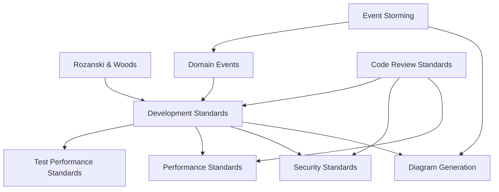

# 轉向規則指南

## 🚀 快速開始

### 我需要

- **編寫程式碼**: 從 [Development Standards](development-standards.md) 開始
- **審查程式碼**: 使用 [Code Review Standards](code-review-standards.md)
- **編寫文件**: 參考 [Development Standards](development-standards.md) 和 [Diagram Generation Standards](diagram-generation-standards.md)
- **設計架構**: 查看 [Rozanski & Woods Methodology](rozanski-woods-architecture-methodology.md)
- **最佳化效能**: 檢閱 [Performance Standards](performance-standards.md)
- **實作安全性**: 遵循 [Security Standards](security-standards.md)

## 📚 文件分類

### 核心標準（優先閱讀）

日常開發工作的必要標準。

| 文件 | 目的 | 何時使用 |
|----------|---------|-------------|
| [Development Standards](development-standards.md) | 主要開發指南 | 日常編碼、測試、架構 |
| [Code Review Standards](code-review-standards.md) | 審查流程和清單 | 程式碼審查期間 |

### 專業標準（領域特定）

針對特定領域的深入標準。

| 文件 | 目的 | 何時使用 |
|----------|---------|-------------|
| [Rozanski & Woods Methodology](rozanski-woods-architecture-methodology.md) | 架構觀點 | 設計系統架構 |
| [Event Storming Standards](event-storming-standards.md) | 協作領域建模 | 進行 Event Storming 工作坊 |
| [Security Standards](security-standards.md) | 安全性實作 | 實作認證、加密等 |
| [Performance Standards](performance-standards.md) | 效能最佳化 | 最佳化系統效能 |
| [Domain Events](domain-events.md) | DDD 事件模式 | 實作領域事件 |
| [Diagram Standards](diagram-standards.md) | 何時使用 ASCII/Mermaid/PlantUML/Excalidraw | 建立任何圖表 |
| [Diagram Generation](diagram-generation-standards.md) | PlantUML 生成詳細資訊 | 生成 PlantUML 圖表 |

### 參考標準（深入探討）

特定主題的詳細技術參考。

| 文件 | 目的 | 何時使用 |
|----------|---------|-------------|
| [Test Performance Standards](test-performance-standards.md) | 測試效能深入探討 | 解決測試效能問題 |

## 🎯 常見場景

### 啟動新功能

1. 檢閱 [Development Standards](development-standards.md) - 架構和測試
2. 查看 [Rozanski & Woods Methodology](rozanski-woods-architecture-methodology.md) - 觀點分析
3. 進行 [Event Storming](event-storming-standards.md) - 領域發現
4. 遵循 [Domain Events](domain-events.md) - 如果使用 DDD 模式
5. 使用 [Diagram Standards](diagram-standards.md) 建立圖表 - 選擇正確格式

### 修復效能問題

1. 從 [Performance Standards](performance-standards.md) 開始 - 一般最佳化
2. 測試效能: [Test Performance Standards](test-performance-standards.md)
3. 檢閱 [Development Standards](development-standards.md) - 資料庫和快取模式

### 編寫文件

1. 遵循 [Development Standards](development-standards.md) - 文件指南
2. 使用 [Diagram Standards](diagram-standards.md) 選擇圖表格式 - ASCII/Mermaid/PlantUML/Excalidraw
3. 使用 [Diagram Generation Standards](diagram-generation-standards.md) 生成 PlantUML - 複雜 UML
4. 記錄 [Event Storming Sessions](event-storming-standards.md) - 工作坊結果

## 📖 文件關係

## 🔄 最近變更

- **2025-01-XX**: 整合語言和文件標準
- **2025-01-XX**: 移除重複的測試效能內容
- **2025-01-XX**: 將 BDD/TDD 原則合併到開發標準
- **2025-01-XX**: 重新設計 README 以提高導覽性

## 📝 貢獻

更新轉向規則時:

1. 避免在檔案間重複內容
2. 使用交叉參考處理相關內容
3. 遵循標準文件結構
4. 如果新增文件請更新此 README

---

**總文件數**: 17
**最後更新**: 2025-11-08
**所有者**: 開發團隊
