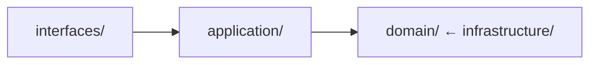
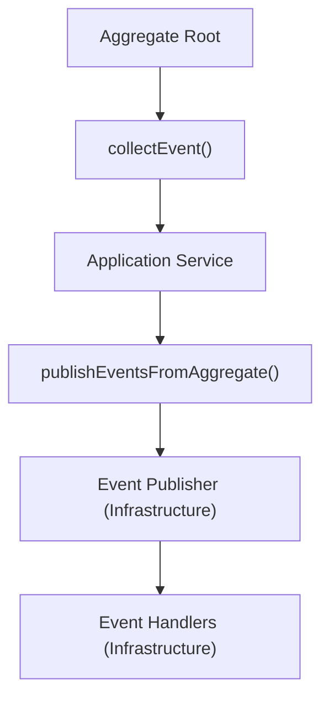

# 架構約束

## 概述

本文件根據 Hexagonal Architecture (Ports and Adapters) 和 Domain-Driven Design 定義了本專案的強制性架構約束。

**目的**: 為層級依賴和套件組織提供明確的規則。
**詳細指南**: 請參閱 `.kiro/examples/architecture/` 以獲得全面的架構指南。

---

## 層級依賴

### 依賴規則



### 必須遵循

- [ ] **Domain 層**: 不依賴任何其他層
- [ ] **Application 層**: 僅依賴 domain 層
- [ ] **Infrastructure 層**: 依賴 domain 層（實作介面）
- [ ] **Interfaces 層**: 依賴 application 和 domain 層

### 必須避免

- [ ] ❌ Domain 依賴 infrastructure
- [ ] ❌ Domain 依賴 application
- [ ] ❌ 層級間圓形依賴
- [ ] ❌ Infrastructure 依賴 interfaces

**詳細架構**: #[[file:../examples/architecture/hexagonal-architecture.md]]

---

## 套件結構標準

### Domain 層

```text
domain/
├── {context}/
│   ├── model/
│   │   ├── aggregate/      # Aggregate roots
│   │   ├── entity/         # Entities (non-root)
│   │   ├── valueobject/    # Value objects
│   │   └── specification/  # Business rules
│   ├── events/             # Domain events
│   ├── repository/         # Repository interfaces
│   ├── service/            # Domain services
│   └── validation/         # Validation logic
└── shared/                 # Shared kernel
    └── valueobject/        # Shared value objects
```

### Application 層

```text
application/
└── {context}/
    ├── {UseCase}ApplicationService.java
    ├── command/            # Command objects
    ├── query/              # Query objects
    └── dto/                # Data transfer objects
```

### Infrastructure 層

```text
infrastructure/
└── {context}/
    ├── persistence/        # Repository implementations
    │   ├── entity/        # JPA entities
    │   ├── mapper/        # Domain ↔ Entity mappers
    │   └── repository/    # JPA repositories
    ├── messaging/          # Event publishers
    ├── external/           # External service adapters
    └── config/             # Infrastructure configuration
```

### Interfaces 層

```text
interfaces/
├── rest/
│   └── {context}/
│       ├── controller/     # REST controllers
│       ├── dto/            # Request/Response DTOs
│       └── mapper/         # DTO ↔ Domain mappers
└── web/                    # Web UI controllers
```

---

## Bounded Context 規則

### 必須遵循

- [ ] 每個 context 都是獨立且自成一體的
- [ ] Context 間通訊僅透過 domain events
- [ ] 沒有 bounded contexts 之間的直接依賴
- [ ] `domain/shared/` 中的 shared kernel 用於常見概念
- [ ] Context map 已記錄

### Context 隔離

```java
// ✅ 好：透過事件通訊
@Component
public class OrderSubmittedEventHandler {
    private final InventoryService inventoryService;

    @EventListener
    public void handle(OrderSubmittedEvent event) {
        inventoryService.reserveItems(event.orderId());
    }
}

// ❌ 壞：Contexts 間直接依賴
public class OrderService {
    private final InventoryRepository inventoryRepository; // 錯誤!
}
```

### 本專案中的 Bounded Contexts

- Customer Context
- Order Context
- Product Context
- Inventory Context
- Payment Context
- Shipping/Logistics Context
- Promotion Context
- Notification Context
- Review Context
- Shopping Cart Context
- Pricing Context
- Seller Context
- Delivery Context

---

## 跨領域關切

### 必須遵循

- [ ] **Logging**: Infrastructure 層僅有
- [ ] **Metrics**: Infrastructure 層僅有
- [ ] **Security**: Infrastructure 層僅有
- [ ] **Tracing**: Infrastructure 層僅有
- [ ] **Caching**: Infrastructure 層僅有

### 實作位置

```text
infrastructure/
├── logging/
├── metrics/
├── security/
├── tracing/
└── cache/
```

---

## 依賴注入規則

### 必須遵循

- [ ] 使用 constructor injection
- [ ] 注入介面，不是實作
- [ ] 不在欄位上使用 `@Autowired`
- [ ] 為注入的依賴使用 `final`

### 範例

```java
// ✅ 好：使用介面進行 constructor injection
@Service
public class OrderApplicationService {
    private final OrderRepository orderRepository;
    private final DomainEventApplicationService eventService;

    public OrderApplicationService(
        OrderRepository orderRepository,
        DomainEventApplicationService eventService
    ) {
        this.orderRepository = orderRepository;
        this.eventService = eventService;
    }
}

// ❌ 壞：欄位注入
@Service
public class OrderApplicationService {
    @Autowired
    private OrderRepository orderRepository;
}
```

---

## 組態管理

### 必須遵循

- [ ] `config/` 套件中的組態
- [ ] 使用 `@Configuration` classes
- [ ] 針對特定設定檔的組態
- [ ] 外部化敏感資料

### 組態結構

```text
config/
├── DatabaseConfiguration.java
├── RedisConfiguration.java
├── SecurityConfiguration.java
├── ObservabilityConfiguration.java
└── ProfileConfiguration.java
```

---

## API 設計約束

### REST API 結構

```text
interfaces/rest/{context}/
├── controller/
│   └── {Entity}Controller.java
├── dto/
│   ├── request/
│   └── response/
└── mapper/
    └── {Entity}DtoMapper.java
```

### 必須遵循

- [ ] RESTful URL 慣例
- [ ] 適當的 HTTP 方法 (GET, POST, PUT, DELETE)
- [ ] 一致的回應格式
- [ ] API 版本化 (`/api/v1/`)

---

## Event-Driven 架構

### 事件流



### 必須遵循

- [ ] Aggregates 蒐集事件，不發布
- [ ] Application services 在成功的交易後發布
- [ ] 事件處理程式在 infrastructure 層
- [ ] 使用 `@TransactionalEventListener(phase = AFTER_COMMIT)`

---

## 測試架構

### 測試套件結構

```text
test/
├── unit/                   # Unit tests (domain logic)
├── integration/            # Integration tests
├── e2e/                    # End-to-end tests
└── bdd/                    # BDD/Cucumber tests
```

### 必須遵循

- [ ] Domain 邏輯的 Unit tests
- [ ] Infrastructure 的 Integration tests
- [ ] 完整流程的 E2E tests
- [ ] 商務場景的 BDD tests

---

## 驗證命令

### 架構合規性

```bash
./gradlew archUnit  # 驗證所有架構規則
```

### ArchUnit 規則

```java
// Layer dependency rules
@ArchTest
static final ArchRule domainLayerRules = classes()
    .that().resideInAPackage("..domain..")
    .should().onlyDependOnClassesThat()
    .resideInAnyPackage("..domain..", "java..");

// Package structure rules
@ArchTest
static final ArchRule aggregateRootRules = classes()
    .that().areAnnotatedWith(AggregateRoot.class)
    .should().resideInAPackage("..domain..model.aggregate..");

// Naming convention rules
@ArchTest
static final ArchRule repositoryRules = classes()
    .that().haveSimpleNameEndingWith("Repository")
    .and().areInterfaces()
    .should().resideInAPackage("..domain..repository..");
```

---

## 快速參考

| 層 | 依賴 | 位置 | 目的 |
|-------|--------------|----------|---------|
| Domain | 無 | `domain/` | 商務邏輯和規則 |
| Application | Domain | `application/` | Use case 協調 |
| Infrastructure | Domain | `infrastructure/` | 技術實作 |
| Interfaces | Application, Domain | `interfaces/` | 外部通訊 |

---

## 相關文件

- **核心原則**: #[[file:core-principles.md]]
- **DDD 模式**: #[[file:ddd-tactical-patterns.md]]
- **設計原則**: #[[file:design-principles.md]]
- **架構範例**: #[[file:../examples/architecture/]]

---

**文件版本**: 1.0
**最後更新**: 2025-01-17
**所有者**: 架構團隊
