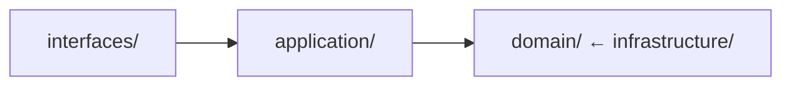

# Core Development Principles

## Overview

本文件定義指導本專案所有開發工作的基本原則。這些原則是強制性的，所有團隊成員都必須遵守。

**Purpose**: 提供核心原則的簡潔參考，不包含詳細範例。
**Detailed Examples**: 查看 `.kiro/examples/` 以獲取完整的實作指南。

---

## Architecture Principles

### Must Follow

- [ ] **DDD + Hexagonal Architecture**: Domain-Driven Design with ports and adapters
- [ ] **Event-Driven Design**: 使用 domain events 進行跨 context 溝通
- [ ] **Bounded Context Isolation**: 每個 context 都是獨立且自包含的
- [ ] **Dependency Rule**: Domain layer 不依賴於 infrastructure

### Architecture Layers



**Detailed Guide**: #[[file:../examples/architecture/hexagonal-architecture.md]]

---

## Domain Model Principles

### Aggregate Roots

- [ ] 擴展 `AggregateRoot` base class
- [ ] 使用 `@AggregateRoot` annotation
- [ ] Aggregates 收集 events，application services 發布它們
- [ ] Domain layer 不直接存取 repository

### Domain Events

- [ ] 使用 Record implementation 確保不可變性
- [ ] 實作 `DomainEvent` interface
- [ ] 使用 factory method 搭配 `createEventMetadata()`
- [ ] Events 是不可變的並包含所有必要資料

### Value Objects

- [ ] 使用 Record 確保不可變性
- [ ] 在 constructor 中驗證
- [ ] 沒有 setters
- [ ] 基於值實作 equals/hashCode

**Detailed Patterns**: #[[file:ddd-tactical-patterns.md]]

---

## Code Quality Principles

### SOLID Principles

- [ ] **Single Responsibility**: 一個類別，一個變更的理由
- [ ] **Open/Closed**: 對擴展開放，對修改封閉
- [ ] **Liskov Substitution**: 子類型必須可替代
- [ ] **Interface Segregation**: 小而專注的介面
- [ ] **Dependency Inversion**: 依賴於抽象，而非具體實作

### Clean Code Standards

- [ ] **Meaningful Names**: 清楚、描述性的命名
- [ ] **Small Functions**: 每個方法 < 20 lines
- [ ] **Single Level of Abstraction**: 每個函數一個抽象層級
- [ ] **No Duplication**: DRY principle
- [ ] **Error Handling**: 使用帶有上下文的特定 exceptions

**Detailed Principles**: #[[file:design-principles.md]]
**Quality Checklist**: #[[file:code-quality-checklist.md]]

---

## Test-First Development

### BDD/TDD Approach

- [ ] 在實作前編寫 Gherkin scenarios
- [ ] 先寫失敗的測試 (Red)
- [ ] 撰寫最少的程式碼以通過測試 (Green)
- [ ] 重構以提高品質 (Refactor)

### Test Pyramid

- **Unit Tests (80%)**: < 50ms, < 5MB
- **Integration Tests (15%)**: < 500ms, < 50MB
- **E2E Tests (5%)**: < 3s, < 500MB

**Testing Strategy**: #[[file:testing-strategy.md]]

---

## Technology Stack

### Backend

- Spring Boot 3.4.5 + Java 21 + Gradle 8.x
- Spring Data JPA + Hibernate + Flyway
- H2 (dev/test) + PostgreSQL (prod)
- SpringDoc OpenAPI 3 + Swagger UI

### Frontend

- CMC Management: Next.js 14 + React 18 + TypeScript
- Consumer App: Angular 18 + TypeScript

### Testing

- JUnit 5 + Mockito + AssertJ
- Cucumber 7 (BDD) + Gherkin
- ArchUnit (Architecture Testing)

### Infrastructure

- AWS EKS + RDS + ElastiCache + MSK
- AWS CDK for Infrastructure as Code
- CloudWatch + X-Ray + Grafana for Observability

---

## Development Workflow

### Daily Development

```bash
./gradlew quickTest              # Fast feedback (< 2 min)
./gradlew preCommitTest          # Pre-commit verification (< 5 min)
./gradlew fullTest               # Complete test suite
```

### Code Review

- [ ] 所有測試通過
- [ ] 程式碼覆蓋率 > 80%
- [ ] ArchUnit 規則通過
- [ ] 沒有安全漏洞
- [ ] 文件已更新

**Review Guide**: #[[file:../examples/process/code-review-guide.md]]

---

## Validation Commands

### Architecture Compliance

```bash
./gradlew archUnit               # Verify architecture rules
```

### Code Quality

```bash
./gradlew test jacocoTestReport  # Check test coverage
./gradlew pmdMain                # Check code smells
./gradlew checkstyleMain         # Check code style
```

### Documentation

```bash
./scripts/validate-diagrams.sh   # Validate diagrams
./scripts/validate-links.sh      # Check broken links
```

---

## Quick Reference

| Principle | Key Rule | Validation |
|-----------|----------|------------|
| Architecture | Domain 不依賴於 infrastructure | `./gradlew archUnit` |
| Domain Model | Aggregates 收集 events，services 發布 | Code review |
| Code Quality | SOLID + Clean Code | `./gradlew pmdMain` |
| Testing | Test-first, > 80% coverage | `./gradlew test` |

---

## Related Documentation

- **Design Principles**: #[[file:design-principles.md]]
- **DDD Patterns**: #[[file:ddd-tactical-patterns.md]]
- **Architecture Constraints**: #[[file:architecture-constraints.md]]
- **Code Quality Checklist**: #[[file:code-quality-checklist.md]]
- **Testing Strategy**: #[[file:testing-strategy.md]]

---

**Document Version**: 1.0
**Last Updated**: 2025-01-17
**Owner**: Architecture Team
