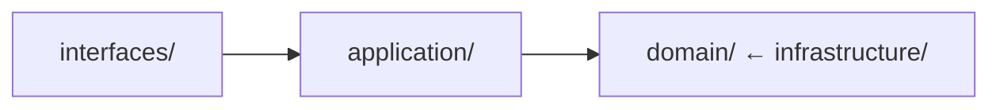

# 開發標準與指南

## 技術堆疊需求

### Backend 技術

- Spring Boot 3.4.5 + Java 21 + Gradle 8.x
- Spring Data JPA + Hibernate + Flyway
- H2 (dev/test) + PostgreSQL (prod)
- SpringDoc OpenAPI 3 + Swagger UI
- Spring Boot Actuator + AWS X-Ray + Micrometer

### Frontend 技術

- CMC Management: Next.js 14 + React 18 + TypeScript
- Consumer App: Angular 18 + TypeScript
- UI Components: shadcn/ui + Radix UI

### 測試框架

- JUnit 5 + Mockito + AssertJ
- Cucumber 7 (BDD) + Gherkin
- ArchUnit (Architecture Testing)

### 文件和圖表

> **📊 圖表標準**: 完整的圖表生成和管理標準請參考 [Diagram Generation Standards](diagram-generation-standards.md)

**快速參考**:

- **主要格式**: PNG (GitHub 文檔推薦)
- **生成命令**: `./scripts/generate-diagrams.sh --format=png`
- **PlantUML**: 複雜 UML 圖表和詳細系統架構
- **Mermaid**: 簡單流程圖和基本架構圖表

#### 文件日期標準

> **⚠️ 重要**: 所有文件必須使用當前實際日期來建立或更新。

**強制要求**:

- **務必**在建立/更新任何文件前執行 `date +%Y-%m-%d` 以取得當前日期
- **絕不**使用佔位符日期如 "YYYY-MM-DD"、"2025-01-XX" 或寫死的日期
- **務必**使用當前日期更新以下欄位:
  - Frontmatter 的 `last_updated` 欄位
  - 文件標題的 `Last Updated` 欄位
  - Change History 表格項目
  - ADR 日期欄位
  - 任何時間戳欄位

**範例 - 正確用法**:

```bash
# 先取得當前日期
CURRENT_DATE=$(date +%Y-%m-%d)

# 然後在文件中使用它
---
last_updated: "2025-10-22"  # ✅ 實際當前日期
---

> **Last Updated**: 2025-10-22  # ✅ 實際當前日期
```

**範例 - 錯誤用法**:

```markdown
---
last_updated: "2025-01-22"  # ❌ 寫死的舊日期
---

> **Last Updated**: YYYY-MM-DD  # ❌ 佔位符
```

**理由**: 準確的時間戳對以下事項至關重要:

- 追蹤文件的新鮮度
- 識別過時內容
- 稽核軌跡和合規性
- 團隊協作和維護排程

## 錯誤處理標準

### Exception 設計模式

#### 自訂 Exception 階層

```java
// Base domain exception
public abstract class DomainException extends RuntimeException {
    private final String errorCode;
    private final Map<String, Object> context;

    protected DomainException(String errorCode, String message, Map<String, Object> context) {
        super(message);
        this.errorCode = errorCode;
        this.context = context != null ? context : Map.of();
    }

    public String getErrorCode() { return errorCode; }
    public Map<String, Object> getContext() { return context; }
}

// Business rule violation
public class BusinessRuleViolationException extends DomainException {
    public BusinessRuleViolationException(String rule, String message) {
        super("BUSINESS_RULE_VIOLATION", message, Map.of("rule", rule));
    }
}

// Resource not found
public class ResourceNotFoundException extends DomainException {
    public ResourceNotFoundException(String resourceType, String resourceId) {
        super("RESOURCE_NOT_FOUND",
              String.format("%s with id %s not found", resourceType, resourceId),
              Map.of("resourceType", resourceType, "resourceId", resourceId));
    }
}
```

#### 錯誤代碼標準

- 格式: `{DOMAIN}_{ERROR_TYPE}_{SPECIFIC_ERROR}`
- 範例:
  - `CUSTOMER_VALIDATION_INVALID_EMAIL`
  - `ORDER_BUSINESS_RULE_INSUFFICIENT_INVENTORY`
  - `PAYMENT_INTEGRATION_GATEWAY_TIMEOUT`

#### 全域 Exception Handler

```java
@RestControllerAdvice
public class GlobalExceptionHandler {

    @ExceptionHandler(DomainException.class)
    public ResponseEntity<ErrorResponse> handleDomainException(DomainException ex) {
        ErrorResponse response = ErrorResponse.builder()
            .errorCode(ex.getErrorCode())
            .message(ex.getMessage())
            .context(ex.getContext())
            .timestamp(Instant.now())
            .build();

        return ResponseEntity.badRequest().body(response);
    }

    @ExceptionHandler(ValidationException.class)
    public ResponseEntity<ErrorResponse> handleValidation(ValidationException ex) {
        // Handle validation errors with field-level details
    }
}
```

### 日誌標準

#### 結構化日誌格式

```java
// Use structured logging with consistent fields
log.info("Order processed successfully",
    kv("orderId", order.getId()),
    kv("customerId", order.getCustomerId()),
    kv("amount", order.getTotalAmount()),
    kv("processingTimeMs", processingTime));

// Error logging with context
log.error("Payment processing failed",
    kv("orderId", orderId),
    kv("paymentMethod", paymentMethod),
    kv("errorCode", ex.getErrorCode()),
    ex);
```

#### 日誌級別使用

- **ERROR**: 系統錯誤、需要立即關注的異常
- **WARN**: 業務規則違反、可恢復的錯誤
- **INFO**: 重要的業務事件、API 呼叫、狀態變更
- **DEBUG**: 詳細執行流程、變數值
- **TRACE**: 非常詳細的除錯資訊

## API 設計標準

### REST API 慣例

#### URL 命名標準

```text
GET    /api/v1/customers                    # List customers
GET    /api/v1/customers/{id}               # Get customer by ID
POST   /api/v1/customers                    # Create customer
PUT    /api/v1/customers/{id}               # Update customer (full)
PATCH  /api/v1/customers/{id}               # Update customer (partial)
DELETE /api/v1/customers/{id}               # Delete customer

# Nested resources
GET    /api/v1/customers/{id}/orders        # Get customer's orders
POST   /api/v1/customers/{id}/orders        # Create order for customer

# Actions (non-CRUD operations)
POST   /api/v1/orders/{id}/cancel           # Cancel order
POST   /api/v1/orders/{id}/ship             # Ship order
```

#### HTTP 狀態碼標準

- **200 OK**: 成功的 GET、PUT、PATCH
- **201 Created**: 成功的 POST
- **204 No Content**: 成功的 DELETE
- **400 Bad Request**: 驗證錯誤、格式錯誤的請求
- **401 Unauthorized**: 需要認證
- **403 Forbidden**: 授權失敗
- **404 Not Found**: 資源未找到
- **409 Conflict**: 業務規則違反
- **422 Unprocessable Entity**: 語意驗證錯誤
- **500 Internal Server Error**: 系統錯誤

#### Request/Response 格式標準

```java
// Request DTO
public record CreateCustomerRequest(
    @NotBlank String name,
    @Email String email,
    @Valid AddressDto address
) {}

// Response DTO
public record CustomerResponse(
    String id,
    String name,
    String email,
    AddressDto address,
    Instant createdAt,
    Instant updatedAt
) {}

// Error Response
public record ErrorResponse(
    String errorCode,
    String message,
    Map<String, Object> context,
    Instant timestamp,
    List<FieldError> fieldErrors
) {}
```

#### API 版本控制策略

- 使用 URL 版本控制: `/api/v1/`、`/api/v2/`
- 維護至少 2 個版本的向後相容性
- 舊版本的棄用標頭:

  ```
  Deprecation: true
  Sunset: 2024-12-31T23:59:59Z
  Link: </api/v2/customers>; rel="successor-version"
  ```

## 架構約束

### Package 結構標準

- `domain/{context}/model/` - Aggregate roots、entities、value objects
- `domain/{context}/events/` - Domain events (Records)
- `application/{context}/` - Use case 實作
- `infrastructure/{context}/persistence/` - Persistence adapters

### 層級依賴規則



### Domain Event 設計約束

- 使用不可變的 Records 實作
- Aggregate roots 收集 events，application services 發布 events
- Event handlers 位於 infrastructure 層

## 測試標準

### 測試層級需求 (Test Pyramid)

- Unit Tests (80%): < 50ms, < 5MB
- Integration Tests (15%): < 500ms, < 50MB
- E2E Tests (5%): < 3s, < 500MB

### 測試分類標準

#### Unit Tests (首選)

- **Annotation**: `@ExtendWith(MockitoExtension.class)`
- **適用**: 純業務邏輯、工具程式、配置類別
- **禁止**: Spring context
- **使用時機**:
  - 單獨測試 domain 邏輯
  - 驗證業務規則
  - 測試工具函式
  - 驗證計算和轉換

#### 整合 Tests (謹慎使用)

- **Annotation**: `@DataJpaTest`、`@WebMvcTest`、`@JsonTest`
- **適用**: Database 整合、外部服務
- **需求**: 部分 Spring context
- **使用時機**:
  - 測試 repository 實作
  - 驗證資料庫查詢
  - 測試 API endpoints
  - 驗證序列化/反序列化

#### E2E Tests (最少使用)

- **Annotation**: `@SpringBootTest(webEnvironment = RANDOM_PORT)`
- **適用**: 完整業務流程驗證
- **需求**: 完整 Spring context
- **使用時機**:
  - 測試完整的使用者旅程
  - 驗證系統整合
  - 冒煙測試關鍵路徑

### 測試場景分類

#### Domain 邏輯測試 (Unit)

```java
@ExtendWith(MockitoExtension.class)
class CustomerUnitTest {

    @Test
    void should_throw_exception_when_email_is_invalid() {
        // Test business rule validation
        assertThatThrownBy(() -> new Customer("John", "invalid-email"))
            .isInstanceOf(InvalidEmailException.class)
            .hasMessage("Email format is invalid");
    }

    @Test
    void should_calculate_discount_correctly_for_premium_customer() {
        // Test business calculation
        Customer customer = createPremiumCustomer();
        Order order = createOrder(100.0);

        BigDecimal discount = customer.calculateDiscount(order);

        assertThat(discount).isEqualTo(new BigDecimal("10.00"));
    }
}
```

#### Repository 測試 (整合)

```java
@DataJpaTest
@ActiveProfiles("test")
class CustomerRepositoryTest {

    @Autowired
    private TestEntityManager entityManager;

    @Autowired
    private CustomerRepository repository;

    @Test
    void should_find_customers_by_email_domain() {
        // Given
        Customer customer1 = createCustomer("john@company.com");
        Customer customer2 = createCustomer("jane@company.com");
        Customer customer3 = createCustomer("bob@other.com");

        entityManager.persistAndFlush(customer1);
        entityManager.persistAndFlush(customer2);
        entityManager.persistAndFlush(customer3);

        // When
        List<Customer> results = repository.findByEmailDomain("company.com");

        // Then
        assertThat(results).hasSize(2)
            .extracting(Customer::getEmail)
            .containsExactlyInAnyOrder("john@company.com", "jane@company.com");
    }
}
```

#### API 測試 (整合)

```java
@WebMvcTest(CustomerController.class)
class CustomerControllerTest {

    @Autowired
    private MockMvc mockMvc;

    @MockBean
    private CustomerService customerService;

    @Test
    void should_return_customer_when_valid_id_provided() throws Exception {
        // Given
        Customer customer = createCustomer();
        when(customerService.findById("123")).thenReturn(customer);

        // When & Then
        mockMvc.perform(get("/api/v1/customers/123"))
            .andExpect(status().isOk())
            .andExpect(jsonPath("$.id").value("123"))
            .andExpect(jsonPath("$.name").value("John Doe"));
    }
}
```

### Mock 策略指南

#### 何時使用 Mock

- 外部服務 (payment gateways、email services)
- 服務測試中的 repositories
- 時間相依操作
- 獨立測試的複雜依賴

#### 何時不使用 Mock

- Value objects 和 entities
- 簡單資料結構
- 正在測試的 domain 邏輯
- 可輕易替換的基礎設施 (in-memory 實作)

#### Mock 最佳實踐

```java
// ✅ 好: 具體、專注的 mocking
@Test
void should_send_welcome_email_when_customer_created() {
    // Given
    Customer customer = createCustomer();
    when(emailService.sendWelcomeEmail(customer.getEmail()))
        .thenReturn(EmailResult.success());

    // When
    customerService.createCustomer(customer);

    // Then
    verify(emailService).sendWelcomeEmail(customer.getEmail());
}

// ❌ 壞: 過度 mocking，測試實作細節
@Test
void should_create_customer() {
    when(customerRepository.save(any())).thenReturn(customer);
    when(eventPublisher.publish(any())).thenReturn(true);
    when(validator.validate(any())).thenReturn(ValidationResult.valid());
    // ... 太多 mocks
}
```

### 測試資料管理

#### 測試資料 Builders

```java
public class CustomerTestDataBuilder {
    private String name = "John Doe";
    private String email = "john@example.com";
    private CustomerType type = CustomerType.REGULAR;

    public static CustomerTestDataBuilder aCustomer() {
        return new CustomerTestDataBuilder();
    }

    public CustomerTestDataBuilder withName(String name) {
        this.name = name;
        return this;
    }

    public CustomerTestDataBuilder withEmail(String email) {
        this.email = email;
        return this;
    }

    public CustomerTestDataBuilder premium() {
        this.type = CustomerType.PREMIUM;
        return this;
    }

    public Customer build() {
        return new Customer(name, email, type);
    }
}

// Usage
Customer customer = aCustomer()
    .withName("Jane Smith")
    .withEmail("jane@example.com")
    .premium()
    .build();
```

#### 測試資料庫管理

```java
@TestConfiguration
public class TestDatabaseConfiguration {

    @Bean
    @Primary
    public DataSource testDataSource() {
        return new EmbeddedDatabaseBuilder()
            .setType(EmbeddedDatabaseType.H2)
            .addScript("classpath:schema-test.sql")
            .addScript("classpath:test-data.sql")
            .build();
    }
}
```

### 測試標籤系統

```java
@Target(ElementType.TYPE)
@Retention(RetentionPolicy.RUNTIME)
@Tag("unit")
public @interface UnitTest {}

@Target(ElementType.TYPE)
@Retention(RetentionPolicy.RUNTIME)
@Tag("integration")
public @interface IntegrationTest {}

@Target(ElementType.TYPE)
@Retention(RetentionPolicy.RUNTIME)
@Tag("slow")
public @interface SlowTest {}

@Target(ElementType.TYPE)
@Retention(RetentionPolicy.RUNTIME)
@Tag("smoke")
public @interface SmokeTest {}
```

### 效能基準要求

- Unit tests: < 50ms, < 5MB, 成功率 > 99%
- Integration tests: < 500ms, < 50MB, 成功率 > 95%
- End-to-end tests: < 3s, < 500MB, 成功率 > 90%

### 測試效能監控

> **🧪 測試效能標準**: 有關全面的測試效能監控、資源管理和最佳化，請參閱 [Test Performance Standards](test-performance-standards.md)

**快速參考:**

- 使用 `@TestPerformanceExtension` 進行自動效能監控
- Integration tests: < 500ms, < 50MB
- E2E tests: < 3s, < 500MB
- 產生報告: `./gradlew generatePerformanceReport`

**主要功能:**

- 自動測試執行時間和記憶體追蹤
- 效能衰退偵測
- 資源清理和記憶體管理
- 詳細的 HTML 和 CSV 報告

### 測試環境隔離

#### Database 隔離

```java
@Transactional
@Rollback
public abstract class DatabaseTestBase {

    @BeforeEach
    void setUp() {
        // Clean database state
        cleanDatabase();
        // Set up test data
        setupTestData();
    }

    @AfterEach
    void tearDown() {
        // Cleanup is automatic with @Rollback
    }
}
```

#### 外部服務隔離

```java
@TestConfiguration
public class TestExternalServiceConfiguration {

    @Bean
    @Primary
    public PaymentService mockPaymentService() {
        return Mockito.mock(PaymentService.class);
    }

    @Bean
    @Primary
    public EmailService inMemoryEmailService() {
        return new InMemoryEmailService();
    }
}
```

## 測試任務組織

### Gradle 測試任務

```bash
# Daily development - fast feedback
./gradlew quickTest              # Unit tests only (< 2 minutes)

# Pre-commit verification
./gradlew preCommitTest          # Unit + Integration tests (< 5 minutes)

# Pre-release verification
./gradlew fullTest               # All test types including E2E and Cucumber

# Specific test types
./gradlew unitTest               # Fast unit tests (~5MB, ~50ms each)
./gradlew integrationTest        # Integration tests (~50MB, ~500ms each)
./gradlew e2eTest               # End-to-end tests (~500MB, ~3s each)
./gradlew cucumber              # BDD Cucumber tests
```

> **🧪 進階測試配置**: 有關詳細的 Gradle 測試任務配置、JVM 調校、記憶體管理和效能報告產生，請參閱 [Test Performance Standards](test-performance-standards.md)

## BDD/TDD 開發流程

### 概述

Behavior-Driven Development (BDD) 和 Test-Driven Development (TDD) 是核心開發實踐，確保程式碼品質和與業務需求的一致性。

### BDD 原則

#### Gherkin 場景

- 使用 Given-When-Then 格式
- 在實作前編寫場景
- 專注於業務行為
- 使用通用語言

#### 範例場景

```gherkin
Feature: Customer Registration
  Scenario: Successful customer registration
    Given a new customer with valid information
    When they submit the registration form
    Then they should receive a confirmation email
    And their account should be created
```

### TDD 原則

#### Red-Green-Refactor 循環

1. **Red**: 編寫失敗的測試
2. **Green**: 編寫最少程式碼使其通過
3. **Refactor**: 改善程式碼品質

#### 測試結構

- **Arrange**: 設定測試資料
- **Act**: 執行行為
- **Assert**: 驗證結果

### 強制開發步驟

1. 編寫 Gherkin 場景 (`src/test/resources/features/`)
2. 實作 step definitions (Red)
3. TDD 實作 domain 邏輯 (Green)
4. Refactor 最佳化 (Refactor)

### 最佳實踐

- 測試行為，而非實作
- 使用描述性測試名稱
- 保持測試簡單且專注
- 維護測試獨立性

### 工具與框架

- JUnit 5 用於單元測試
- Cucumber 用於 BDD 場景
- Mockito 用於 mocking
- AssertJ 用於斷言

### 品質關卡

- 所有測試在合併前必須通過
- 程式碼覆蓋率 > 80%
- CI/CD 中沒有跳過的測試
- 所有使用者故事都需要 BDD 場景

## 程式碼標準

### 命名慣例

```java
// Aggregate root
@AggregateRoot
public class Customer implements AggregateRootInterface { }

// Value object
@ValueObject
public record CustomerId(String value) { }

// Domain event
public record CustomerCreatedEvent(...) implements DomainEvent { }

// Test class
@ExtendWith(MockitoExtension.class)
class CustomerServiceUnitTest { }

// Test performance utilities (to avoid naming conflicts)
@TestComponent
public class TestPerformanceResourceManager { }

public class TestPerformanceMonitor implements BeforeAllCallback { }

@TestConfiguration
public class TestPerformanceConfiguration { }
```

**測試工具命名標準:**

- 使用 `TestPerformance*` 前綴用於效能相關的測試工具
- 使用 `Test*` 前綴用於一般測試工具
- 在測試 packages 中避免使用泛型名稱如 `ResourceManager` 或 `Monitor`
- 包含描述性後綴: `Manager`、`Monitor`、`Configuration`、`Extension`

### Mock 使用規則

- 僅 mock 測試中實際使用的互動
- 避免全域 stubbing
- 處理 null 情況

## ArchUnit 規則

### 強制架構規則

- 層級依賴檢查
- DDD tactical pattern 驗證
- Package 命名慣例檢查

### 禁止的反模式

```java
// ❌ 錯誤: Configuration 類別測試不需要完整 Spring context
@SpringBootTest
class DatabaseConfigurationTest { ... }

// ✅ 正確: 使用 unit tests
@ExtendWith(MockitoExtension.class)
class DatabaseConfigurationUnitTest { ... }
```

## 品質標準

### 必須達成的指標

- 程式碼覆蓋率 > 80%
- 測試執行時間 < 15s (unit tests)
- 測試失敗率 < 1%
- 架構合規性 100%

### BDD 場景覆蓋率需求

- 核心業務流程 100% 覆蓋
- Exception 處理場景覆蓋
- 使用者體驗關鍵路徑覆蓋

## 開發工作流程

### 新功能開發順序

1. BDD 場景設計
2. Domain 建模 (DDD)
3. TDD 實作
4. Integration 測試
5. ArchUnit 驗證

### 每日開發命令

```bash
./gradlew quickTest              # Development quick feedback (2s)
./gradlew unitTest               # Pre-commit full verification (11s)
./gradlew integrationTest        # PR integration test check
./gradlew test                   # Pre-release full test
```
