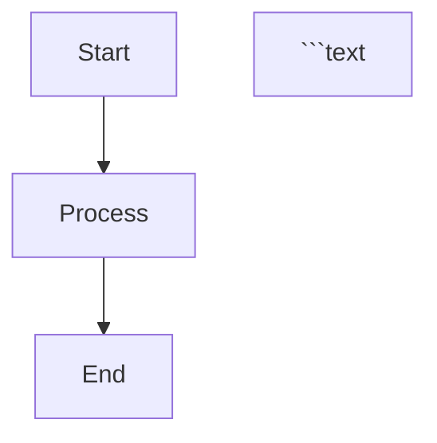

# Diagram Generation 規範

## 概覽

本文件定義專案中生成和管理圖表的標準，特別針對 PlantUML 和 Mermaid 圖表格式。

## PlantUML Diagram 規範

### Format Priority for GitHub Documentation

#### Primary Format: PNG ✅ **RECOMMENDED**

- **Use Case**: 所有 GitHub 文件引用
- **Advantages**:
  - 優越的文字清晰度和可讀性
  - 跨瀏覽器的一致渲染
  - Web 顯示的最佳檔案大小
  - 更好的對比度和銳利度
- **Generation**: `./scripts/generate-diagrams.sh --format=png`
- **File Location**: `docs/diagrams/generated/{category}/{diagram-name}.png`

#### Secondary Format: SVG 📋 **SUPPLEMENTARY**

- **Use Case**: 高解析度列印、可縮放顯示
- **Advantages**:
  - 具有無限縮放的向量格式
  - 簡單圖表的檔案大小較小
  - 可縮放且不損失品質
- **Generation**: `./scripts/generate-diagrams.sh --format=svg`
- **File Location**: `docs/diagrams/generated/{category}/{diagram-name}.svg`

### Generation Workflow

#### Automatic Generation

```bash
# Generate both PNG and SVG (recommended)
./scripts/generate-diagrams.sh

# Generate only PNG for GitHub docs
./scripts/generate-diagrams.sh --format=png

# Generate only SVG for printing
./scripts/generate-diagrams.sh --format=svg
```

#### Manual Generation for Specific Diagrams

```bash
# Generate specific diagram
./scripts/generate-diagrams.sh bounded-contexts-overview.puml

# Validate diagram syntax
./scripts/generate-diagrams.sh --validate
```

### Documentation Reference 規範

#### Markdown Link Format

```markdown
<!-- ✅ CORRECT: Reference PNG for better GitHub display -->
<!-- Diagram: Bounded Contexts Overview (需要重新生成) -->

<!-- ❌ AVOID: SVG may appear too small in GitHub -->
<!-- Diagram: Bounded Contexts Overview SVG (需要重新生成) -->

<!-- 📋 OPTIONAL: Provide both formats -->
<!-- Diagram: Bounded Contexts Overview (需要重新生成) -->
*High-resolution SVG version*
```

#### HTML Format (when needed)

```html
<!-- For better control over image size -->

```

## Mermaid Diagram 規範

### GitHub Native Support ✅ **PREFERRED**

#### Inline Code Blocks (Recommended)

```markdown


#### Standalone Files

- **File Extension**: `.mmd`
- **Location**: `docs/diagrams/mermaid/`
- **GitHub Rendering**: `.mmd` 檔案自動渲染
- **Reference**: 直接連結到 `.mmd` 檔案

### When to Use Each Format

#### Use Mermaid When:

- 簡單的流程圖
- 基本架構圖
- 快速概念圖
- 需要立即 GitHub 渲染
- 需要協作編輯

#### Use PlantUML When:

- 複雜的 UML 圖表
- 詳細的類別圖
- 全面的系統架構
- 需要精確的版面控制
- 專業文件要求

## File Organization 規範

### Directory 結構
```text

docs/diagrams/
├── generated/                    # Auto-generated PNG/SVG files
│   ├── functional/              # Functional viewpoint diagrams
│   ├── information/             # Information viewpoint diagrams
│   ├── deployment/              # Deployment viewpoint diagrams
│   └── perspectives/            # Cross-cutting perspective diagrams
├── viewpoints/                  # PlantUML source files
│   ├── functional/              # *.puml files for functional viewpoint
│   ├── information/             #*.puml files for information viewpoint
│   └── deployment/              # *.puml files for deployment viewpoint
├── mermaid/                     # Mermaid diagram files
│   ├── architecture-overview.md # Mermaid diagrams in markdown
│   └── process-flows.mmd        # Standalone mermaid files
└── legacy/                      # Legacy diagram files
    ├── plantuml/               # Old PlantUML organization
    └── uml/                    # Legacy UML files

```

### Naming Conventions

#### PlantUML Files

- **Source**: `{concept}-{type}.puml`
  - Examples: `bounded-contexts-overview.puml`, `customer-aggregate-details.puml`
- **Generated PNG**: `{concept}-{type}.png`
- **Generated SVG**: `{concept}-{type}.svg`

#### Mermaid Files

- **Standalone**: `{concept}-{type}.mmd`
- **In Markdown**: 使用描述性的章節標題

## Quality 規範

### Image Quality Requirements

#### PNG Generation Settings

- **Resolution**: 高 DPI 以確保文字清晰度
- **Compression**: 在檔案大小與品質之間取得平衡
- **Text Rendering**: 抗鋸齒以獲得平滑外觀

#### Layout Optimization

- **Width**: 針對 GitHub 的內容寬度進行優化（~800-1000px）
- **Height**: 避免過度垂直捲動
- **Text Size**: 確保在預設縮放級別下的可讀性
- **Color Scheme**: 使用高對比度以提高可訪問性

### Validation Requirements

#### Pre-commit Checks
```bash
# Validate all PlantUML syntax
./scripts/generate-diagrams.sh --validate

# Check for missing generated images
./scripts/validate-diagrams.py --check-generated

# Verify documentation references
./scripts/check-links-advanced.js
```

#### Automated Generation

- **Trigger**: 當 PlantUML 檔案變更時
- **Hook**: `.kiro/hooks/diagram-documentation-sync.kiro.hook`
- **Output**: PNG 和 SVG 兩種格式
- **Validation**: 生成前進行語法檢查

## 整合 with Documentation

### Viewpoint Documentation

#### Functional Viewpoint

- **Source**: `docs/diagrams/viewpoints/functional/*.puml`
- **Generated**: `docs/diagrams/generated/functional/*.png`
- **References**: `docs/viewpoints/functional/*.md`

#### Information Viewpoint

- **Source**: `docs/diagrams/viewpoints/information/*.puml`
- **Generated**: `docs/diagrams/generated/information/*.png`
- **References**: `docs/viewpoints/information/*.md`

#### 部署 Viewpoint

- **Source**: `docs/diagrams/viewpoints/deployment/*.puml`
- **Generated**: `docs/diagrams/generated/deployment/*.png`
- **References**: `docs/viewpoints/deployment/*.md`

### Cross-Reference Management

#### Automatic Synchronization

- **Hook Trigger**: 圖表目錄中的檔案變更
- **Action**: 更新文件引用
- **Validation**: 檢查斷裂的連結
- **Cleanup**: 移除已刪除圖表的引用

## 最佳實踐

### Development Workflow

1. **Create PlantUML Source**: 在適當的 viewpoint 目錄中撰寫 `.puml` 檔案
2. **Generate Images**: 執行 `./scripts/generate-diagrams.sh --format=png`
3. **Update Documentation**: 在相關 markdown 中引用 PNG 檔案
4. **Validate**: 提交前檢查語法和連結
5. **Commit**: 包含來源檔案和生成的檔案

### 維護 指南

#### Regular Tasks

- **Weekly**: 重新生成所有圖表以確保一致性
- **Monthly**: 審查和清理未使用的圖表
- **Quarterly**: 優化圖表版面以提高可讀性

#### 效能 Considerations

- **File Size**: 監控 PNG 檔案大小，如果 >500KB 則進行優化
- **Generation Time**: 批次生成以提高效率
- **Storage**: 如需要，對大型圖表檔案使用 Git LFS

## 故障排除

### Common Issues

#### PlantUML Generation Failures

```bash
# Check Java installation
java -version

# Validate PlantUML syntax
./scripts/generate-diagrams.sh --validate

# Clean and regenerate
./scripts/generate-diagrams.sh --clean
./scripts/generate-diagrams.sh --format=png
```

#### GitHub Display Issues

- **Problem**: 圖表顯示過小
- **Solution**: 使用 PNG 而非 SVG
- **Alternative**: 添加帶寬度規格的 HTML img 標籤

#### Link Validation Failures

```bash
# Check all documentation links
./scripts/check-links-advanced.js

# Fix broken diagram references
./scripts/fix-broken-links.py --diagrams-only
```

本標準確保專案文件中一致、高品質的圖表生成和整合。
