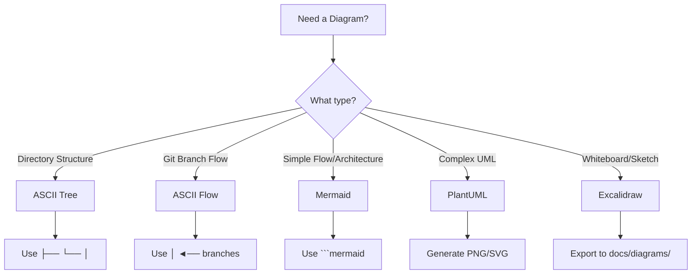
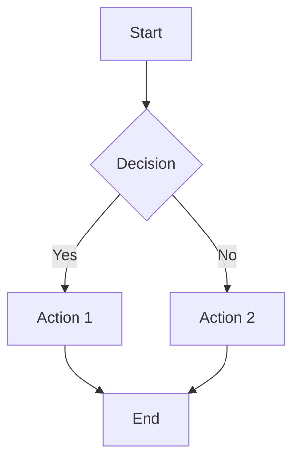
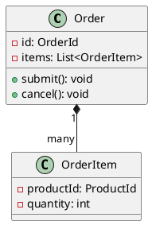
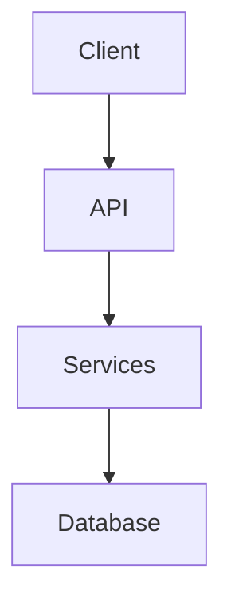
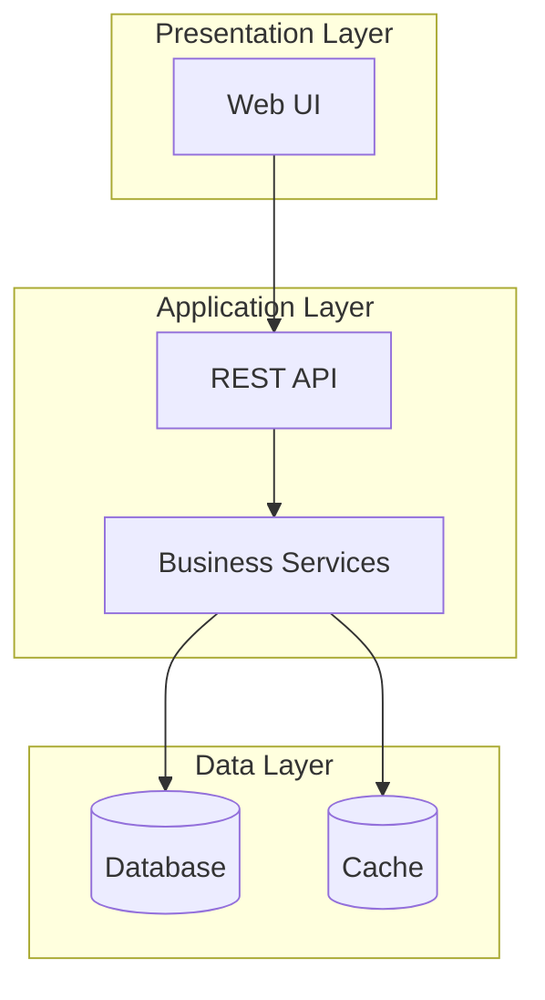
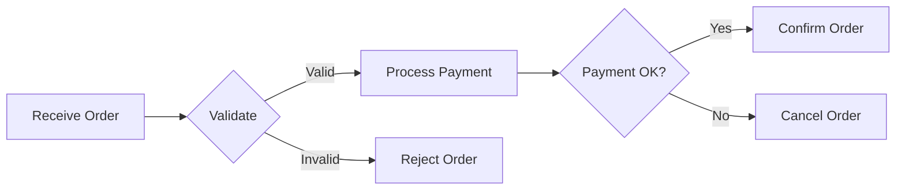
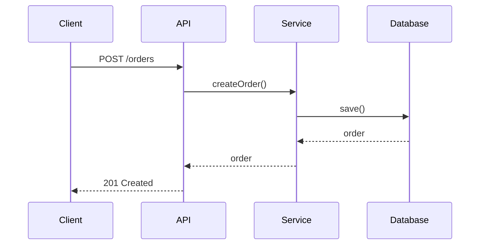

# Diagram 規範 and 最佳實踐

## 概覽

本文件定義在我們的文件中何時及如何使用不同的圖表格式。選擇正確的格式可以提高可讀性、可維護性和 GitHub 渲染效果。

---

## Diagram Format Decision Tree



---

## When to Use Each Format

### ASCII Art

**Use For:**
- ✅ 目錄/檔案結構
- ✅ Git branch workflows
- ✅ 簡單的階層樹狀圖
- ✅ 快速的行內範例

**Advantages:**
- 快速建立和編輯
- 不需要外部工具
- 純文字清晰
- 版本控制友善
- 在所有環境中都能運作

**Disadvantages:**
- 視覺複雜度有限
- 大型圖表難以維護
- 無自動渲染

**Example:**

```text
src/
├── domain/
│   ├── customer/
│   ├── order/
│   └── shared/
├── application/
└── infrastructure/
```

**When NOT to Use:**
- 具有多個路徑的複雜流程圖
- 包含許多元件的架構圖
- 需要頻繁更新的圖表

---

### Mermaid

**Use For:**
- ✅ 流程圖和流程流
- ✅ 架構圖
- ✅ 序列圖
- ✅ 狀態圖
- ✅ 實體關係圖
- ✅ Gantt charts

**Advantages:**
- GitHub 原生渲染
- 易於更新（基於文字）
- 版本控制友善
- 多種圖表類型
- 適合文件使用

**Disadvantages:**
- 版面控制有限
- 無法處理非常複雜的圖表
- 樣式選項有限

**Example:**



**Best Practices:**
- 保持圖表簡單（< 20 個節點）
- 使用描述性的節點標籤
- 使用 subgraphs 將相關節點分組
- 使用適當的圖表類型（graph, sequenceDiagram 等）

**File Location:**
- Markdown 中的行內： `docs/**/*.md`
- 獨立檔案： `docs/diagrams/mermaid/*.mmd`

---

### PlantUML

**Use For:**
- ✅ 詳細的 UML 類別圖
- ✅ 複雜的元件圖
- ✅ 部署圖
- ✅ 專業文件
- ✅ 精確的版面要求

**Advantages:**
- 全面的 UML 支援
- 細粒度的版面控制
- 專業輸出品質
- 支援複雜圖表
- 適合架構文件

**Disadvantages:**
- 需要生成步驟
- GitHub 上無原生渲染
- 需要 Java runtime
- 學習曲線較陡

**Example:**



**Best Practices:**
- 用於詳細的技術圖表
- 生成 PNG 和 SVG 兩種格式
- 將來源存放在 `docs/diagrams/viewpoints/`
- 將生成的圖存放在 `docs/diagrams/generated/`
- 在 markdown 中引用 PNG（GitHub 顯示效果更好）

**Generation:**
```bash
./scripts/generate-diagrams.sh --format=png
```

**File Organization:**
```text
docs/diagrams/
├── viewpoints/
│   ├── functional/*.puml
│   ├── information/*.puml
│   └── deployment/*.puml
└── generated/
    ├── functional/*.png
    ├── information/*.png
    └── deployment/*.png
```

---

### Excalidraw

**Use For:**
- ✅ 白板風格的草圖
- ✅ 腦力激盪圖
- ✅ 手繪風格圖表
- ✅ 協作設計會議
- ✅ 概念插圖

**Advantages:**
- 直觀的繪圖介面
- 手繪美學
- 適合協作
- 快速建立
- 適合簡報

**Disadvantages:**
- 非文字型（版本控制較困難）
- 需要匯出步驟
- 不適合精確圖表
- 檔案大小較大

**Best Practices:**
- 用於早期階段設計
- 匯出為 PNG/SVG 用於文件
- 儲存來源 `.excalidraw` 檔案
- 僅用於高階概念

**File Organization:**
```text
docs/diagrams/excalidraw/
├── sources/
│   └── *.excalidraw
└── exports/
    └── *.png
```

**Workflow:**
1. 在 Excalidraw 中建立圖表
2. 將來源存至 `docs/diagrams/excalidraw/sources/`
3. 將 PNG 匯出至 `docs/diagrams/excalidraw/exports/`
4. 在 markdown 中引用 PNG

---

## Conversion 指南

### ASCII to Mermaid

**Convert When:**
- 圖表有箭頭（→, ↓）表示流程
- 多個路徑或決策點
- 需要更好的 GitHub 渲染
- 圖表需要頻繁更新

**Keep ASCII When:**
- 簡單的目錄結構
- Git branch flows
- 階層樹狀圖
- 快速行內範例

**Conversion Tool:**
```bash
python3 scripts/convert-ascii-to-mermaid.py docs/ .kiro/
```

### Mermaid to PlantUML

**Convert When:**
- 需要精確的版面控制
- 圖表變得過於複雜（> 20 個節點）
- 需要專業文件
- 需要 UML 合規性

### PlantUML to Excalidraw

**Convert When:**
- 需要手繪美學
- 向非技術受眾簡報
- 想要更多視覺彈性
- 建立行銷材料

---

## Diagram 維護

### Update Frequency

| Format | Update Effort | Best For |
|--------|--------------|----------|
| ASCII | 低 | 頻繁變更的結構 |
| Mermaid | 低 | 不斷演變的流程 |
| PlantUML | 中 | 穩定的架構 |
| Excalidraw | 高 | 一次性插圖 |

### Version Control

**Text-Based (ASCII, Mermaid, PlantUML):**
- ✅ 提交來源檔案
- ✅ 容易審查變更
- ✅ 合併衝突可管理
- ✅ 歷史追蹤清晰

**Binary (Excalidraw exports, PNG):**
- ⚠️ 同時提交來源和匯出
- ⚠️ 對大型檔案使用 Git LFS
- ⚠️ 難以審查變更
- ⚠️ 合併衝突有問題

### Documentation 規範

**Every diagram should have:**
1. **Title**: 清楚、描述性的名稱
2. **Context**: 它展示什麼？
3. **Date**: 何時建立/更新？
4. **Owner**: 誰維護它？
5. **Related Docs**: 相關文件的連結

**Example:**

```markdown
## System 架構 概覽

**Purpose**: 展示電商平台的高階架構

**Last Updated**: 2025-11-08

**Owner**: Architecture Team



**Related Documentation:**
- [Deployment Viewpoint](../viewpoints/deployment/overview.md)
- [ADR-002: Adopt Hexagonal Architecture](../architecture/adrs/002-adopt-hexagonal-architecture.md)
```

---

## Quality Checklist

### Before Creating a Diagram

- [ ] 真的需要圖表嗎？（文字能更好地解釋嗎？）
- [ ] 目標受眾是誰？（技術性 vs. 非技術性）
- [ ] 它會多常變更？（據此選擇格式）
- [ ] 它將在哪裡使用？（GitHub, 簡報, 列印）

### After Creating a Diagram

- [ ] 清楚易懂嗎？
- [ ] 標籤具描述性且一致嗎？
- [ ] 複雜度適當嗎？（不太簡單或複雜）
- [ ] 是否有適當的文件說明？（標題、上下文、日期）
- [ ] 是否在正確的位置？
- [ ] 在 GitHub 上渲染正確嗎？

---

## Common 模式

### 架構 Diagrams

**Use:** Mermaid 用於簡單的，PlantUML 用於複雜的



### 流程 Flows

**Use:** Mermaid



### Sequence Diagrams

**Use:** Mermaid



### Directory Structures

**Use:** ASCII

```text
project/
├── src/
│   ├── main/
│   │   ├── java/
│   │   └── resources/
│   └── test/
│       ├── java/
│       └── resources/
├── docs/
└── scripts/
```

---

## Tools and Resources

### Mermaid
- **Live Editor**: https://mermaid.live/
- **Documentation**: https://mermaid.js.org/
- **VS Code Extension**: Mermaid Preview

### PlantUML
- **Live Editor**: http://www.plantuml.com/plantuml/
- **Documentation**: https://plantuml.com/
- **VS Code Extension**: PlantUML

### Excalidraw
- **Web App**: https://excalidraw.com/
- **VS Code Extension**: Excalidraw

### ASCII Art
- **ASCII Flow**: https://asciiflow.com/
- **Tree Generator**: `tree` command (macOS/Linux)

---

## Migration Strategy

### Existing Diagrams

1. **Audit**: 識別文件中的所有圖表
2. **Categorize**: 按類型和複雜度分類
3. **Prioritize**: 專注於頻繁訪問的文件
4. **Convert**: 使用適當的格式
5. **Validate**: 確保渲染和清晰度
6. **Document**: 更新引用和 metadata

### New Diagrams

1. **Plan**: 根據指南選擇格式
2. **Create**: 使用推薦的工具
3. **Review**: 檢查品質檢查清單
4. **Document**: 添加上下文和 metadata
5. **Commit**: 包含來源和生成的檔案

---

## Related Documentation

- [Diagram Generation Standards](diagram-generation-standards.md) - PlantUML 生成詳細資訊
- [Development Standards](development-standards.md) - 一般文件標準
- [Code Review Standards](code-review-standards.md) - 圖表審查流程

---

**Document Version**: 1.0
**Last Updated**: 2025-11-08
**Owner**: Documentation Team
