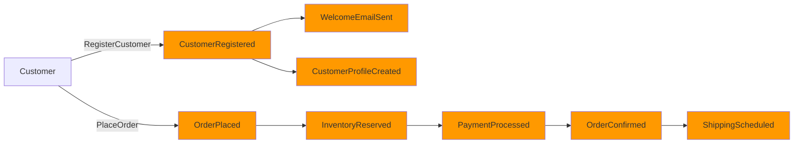
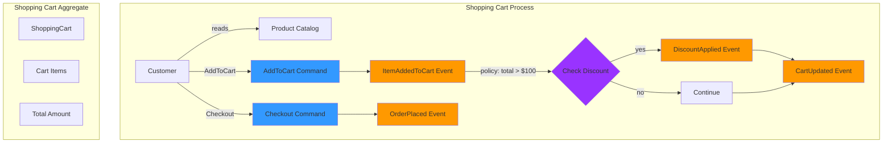
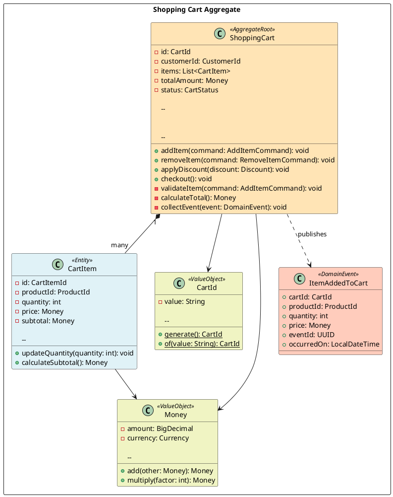

# Event Storming 規範 and 指南

## 概覽

本文件提供在我們的 DDD + Hexagonal Architecture 專案中進行 Event Storming workshops 和記錄結果的全面指南。Event Storming 是一種協作式 workshop 技術，透過 domain events 探索複雜的業務領域。

> **🔗 相關標準**：
>
> - [Domain Events](domain-events.md) - 已發現事件的實作
> - [Development Standards](development-standards.md) - 架構和編碼標準
> - [Diagram Generation Standards](diagram-generation-standards.md) - 視覺化文件

## Event Storming 基礎

### 什麼是 Event Storming

Event Storming 是一種快速、輕量且通常很有趣的 workshop 技術，用於協作探索複雜的業務領域。它由 Alberto Brandolini 發明，專注於將 domain events 作為主要構建塊。

### 核心原則

1. **邀請合適的人**：Domain experts、開發人員、product owners 和 stakeholders
2. **無限的建模空間**：使用大型牆面或數位白板
3. **Domain Events 優先**：從領域中發生的事件開始
4. **時間流程**：按時間順序排列事件
5. **協作發現**：每個人平等參與
6. **視覺語言**：使用顏色編碼的便利貼

## Event Storming 顏色編碼標準

### 標準色彩配置

| 顏色 | 元素 | 描述 | 範例 |
|-------|---------|-------------|---------|
| 🟧 **Orange** | Domain Event | 過去發生的事情 | `CustomerRegistered`, `OrderPlaced` |
| 🟦 **Blue** | Command | 觸發事件的動作 | `RegisterCustomer`, `PlaceOrder` |
| 🟨 **Yellow** | Actor/User | 發起 commands 的人或系統 | `Customer`, `Admin`, `PaymentGateway` |
| 🟪 **Purple** | Policy/Rule | Business rule 或自動化 | `When OrderPlaced, then ReserveInventory` |
| 🟩 **Green** | Read Model/View | 顯示給使用者的資訊 | `OrderSummary`, `CustomerProfile` |
| 🟥 **Red** | Hot Spot | 問題、疑問或關注點 | `What if payment fails?` |
| 📄 **White** | External System | 第三方系統或服務 | `PaymentGateway`, `EmailService` |
| 🟫 **Brown** | Aggregate | 一致性邊界 | `Order`, `Customer`, `Product` |

## Event Storming 的三個階段

### 階段 1：Big Picture Event Storming

**目標**：理解整個業務流程並識別 domain events

**時長**：2-4 小時

**參與者**：所有 stakeholders、domain experts、開發人員

#### 活動

1. **混亂探索**（30-45 分鐘）
   - 每個人在橘色便利貼上寫下 domain events
   - 將事件放在時間軸上，不用排序
   - 專注於「發生了什麼」而非「如何發生」
   - 使用過去式動詞

2. **強制時間軸**（45-60 分鐘）
   - 按時間順序排列事件
   - 識別平行流程
   - 將相關事件分組
   - 用紅色 hot spots 標記不清楚的區域

3. **添加 Actors 和 External Systems**（30-45 分鐘）
   - 識別誰觸發每個事件
   - 標記涉及的外部系統
   - 記錄系統邊界

4. **識別關鍵事件**（15-30 分鐘）
   - 標記顯著改變系統狀態的事件
   - 識別觸發多個後果的事件
   - 這些通常成為 aggregate 邊界

#### 交付成果

- 完整的 domain events 時間軸
- 已識別的 actors 和 external systems
- 記錄的 hot spots 和問題
- 對業務流程的初步理解

#### 範例輸出結構

```json
[Customer] --RegisterCustomer--> [CustomerRegistered]
    --> [WelcomeEmailSent]
    --> [CustomerProfileCreated]

[Customer] --PlaceOrder--> [OrderPlaced]
    --> [InventoryReserved]
    --> [PaymentProcessed]
    --> [OrderConfirmed]
    --> [ShippingScheduled]
```

### 階段 2：流程 Level Event Storming

**目標**：深入特定流程，識別 commands、policies 和 aggregates

**時長**：每個流程 2-3 小時

**參與者**：Domain experts、開發人員、product owners

#### 活動

1. **選擇流程**（15 分鐘）
   - 從階段 1 選擇特定業務流程
   - 定義流程邊界
   - 設定 session 的明確目標

2. **添加 Commands**（45-60 分鐘）
   - 對於每個事件，識別觸發它的 command
   - 在事件前放置藍色 command 便利貼
   - 將 commands 連接到 actors

3. **識別 Policies**（30-45 分鐘）
   - 找到自動化規則：「當 X 發生時，則執行 Y」
   - 放置紫色 policy 便利貼
   - 記錄 business rules 和約束

4. **定義 Read Models**（30-45 分鐘）
   - 識別做決策所需的資訊
   - 放置綠色 read model 便利貼
   - 連接到使用它們的 commands

5. **識別 Aggregates**（45-60 分鐘）
   - 將相關的 commands 和 events 分組
   - 定義一致性邊界
   - 命名 aggregates（棕色便利貼）
   - 與 domain experts 驗證

#### 交付成果

- 包含 commands、events 和 policies 的詳細流程
- 已識別的 aggregates 及其邊界
- Read models 及其關係
- 記錄的 business rules

#### 範例輸出結構

```json
[Customer]
    --reads--> [ProductCatalog]
    --executes--> [AddToCart]
        --> [ItemAddedToCart]
            --policy--> "If cart total > $100, apply discount"
                --> [DiscountApplied]

[ShoppingCart Aggregate]

    - AddToCart
    - RemoveFromCart
    - ApplyDiscount
    - Checkout

```

### 階段 3：設計 Level Event Storming

**目標**：將發現轉化為技術設計和實作細節

**時長**：每個 aggregate 2-3 小時

**參與者**：開發人員、architects、technical leads

#### 活動

1. **完善 Aggregates**（45-60 分鐘）
   - 定義 aggregate root
   - 識別 entities 和 value objects
   - 定義 aggregate invariants
   - 記錄狀態轉換

2. **設計 Commands**（30-45 分鐘）
   - 定義 command 結構和驗證
   - 識別 command handlers
   - 記錄前置條件和後置條件

3. **設計 Events**（30-45 分鐘）
   - 定義 event 結構和 payload
   - 識別 event handlers
   - 記錄 event 版本控制策略

4. **定義 Bounded Contexts**（45-60 分鐘）
   - 將相關 aggregates 分組
   - 定義 context 邊界
   - 識別 context maps 和關係
   - 記錄整合模式

5. **技術決策**（30-45 分鐘）
   - 資料庫 schema 考量
   - API 設計
   - 整合模式
   - 技術選擇

#### 交付成果

- 包含 entities 和 value objects 的 Aggregate 設計
- Command 和 event 規格
- Bounded context map
- 技術架構決策
- 實作路線圖

#### 範例輸出結構

```java
// Aggregate Root
@AggregateRoot
public class ShoppingCart {
    private CartId id;
    private CustomerId customerId;
    private List<CartItem> items;
    private Money totalAmount;

    // Commands
    public void addItem(AddItemCommand command) {
        validateItem(command);
        CartItem item = new CartItem(command);
        items.add(item);
        collectEvent(ItemAddedToCart.create(id, item));
    }

    // Business Rules
    private void validateItem(AddItemCommand command) {
        if (command.quantity() <= 0) {
            throw new InvalidQuantityException();
        }
    }
}

// Domain Event
public record ItemAddedToCart(
    CartId cartId,
    ProductId productId,
    int quantity,
    Money price,
    UUID eventId,
    LocalDateTime occurredOn
) implements DomainEvent { }
```

## Event Storming 的圖表生成

### 推薦方法：使用 Mermaid 進行 Event Storming

**為什麼用 Mermaid？**

- GitHub 原生渲染
- 易於更新和維護
- 協作編輯
- 版本控制友好
- 快速迭代

**何時使用 PlantUML？**

- 需要精確版面配置的最終文件
- 複雜的 aggregate 圖表
- 專業簡報
- 詳細的類別圖

### 階段 1：Big Picture - Mermaid Timeline



**檔案位置**：`docs/diagrams/mermaid/event-storming/phase1-big-picture.md`

### 階段 2：流程 Level - Mermaid Flowchart



**檔案位置**：`docs/diagrams/mermaid/event-storming/phase2-shopping-cart-process.md`

### 階段 3：設計 Level - PlantUML Class Diagram

對於階段 3，使用 PlantUML 進行詳細的 aggregate 設計：



**檔案位置**：`docs/diagrams/viewpoints/functional/shopping-cart-aggregate.puml`

**生成的圖表**：`docs/diagrams/generated/functional/shopping-cart-aggregate.png`

## 文件結構

### Event Storming Session 文件

為每個 Event Storming session 創建專用目錄：

```text
docs/event-storming/
├── sessions/
│   ├── 2025-01-20-big-picture/
│   │   ├── README.md                    # Session 概述
│   │   ├── participants.md              # 參與者和角色
│   │   ├── timeline.md                  # Event timeline
│   │   ├── hot-spots.md                 # 問題和關注點
│   │   └── diagrams/
│   │       └── big-picture-timeline.md  # Mermaid diagram
│   │
│   ├── 2025-01-22-order-process/
│   │   ├── README.md
│   │   ├── commands-and-events.md
│   │   ├── policies.md
│   │   ├── aggregates.md
│   │   └── diagrams/
│   │       └── order-process-flow.md
│   │
│   └── 2025-01-24-shopping-cart-design/
│       ├── README.md
│       ├── aggregate-design.md
│       ├── bounded-context.md
│       ├── technical-decisions.md
│       └── diagrams/
│           └── shopping-cart-aggregate.puml
│
└── templates/
    ├── session-template.md
    ├── big-picture-template.md
    ├── process-level-template.md
    └── design-level-template.md
```

### Session 文件模板

```markdown
---
title: "Event Storming Session: {Process Name}"
date: "YYYY-MM-DD"
phase: "big-picture|process-level|design-level"
facilitator: "Name"
participants: ["Name1", "Name2", "Name3"]
duration: "X hours"
status: "completed|in-progress|planned"
---

# Event Storming: {流程 Name}

## Session 概述

**階段**：{Phase Number and Name}
**日期**：YYYY-MM-DD
**時長**：X hours
**主持人**：Name

## 參與者

- **Domain Experts**：Name1, Name2
- **開發人員**：Name3, Name4
- **Product Owners**：Name5
- **Stakeholders**：Name6

## 目標

1. 目標 1
2. 目標 2
3. 目標 3

## 發現

### Domain Events

| Event Name | Description | Triggered By | Consequences |
|------------|-------------|--------------|--------------|
| CustomerRegistered | Customer completes registration | RegisterCustomer command | Welcome email sent, Profile created |
| OrderPlaced | Customer places an order | PlaceOrder command | Inventory reserved, Payment processed |

### Commands

| Command Name | Description | Actor | Preconditions | Postconditions |
|--------------|-------------|-------|---------------|----------------|
| RegisterCustomer | Register new customer | Customer | Valid email, Unique email | CustomerRegistered event |
| PlaceOrder | Place a new order | Customer | Items in cart, Valid payment | OrderPlaced event |

### Policies

| Policy | Trigger | Action | Business Rule |
|--------|---------|--------|---------------|
| Auto-discount | Cart total > $100 | Apply 10% discount | Premium customers only |
| Inventory check | OrderPlaced | Reserve inventory | Must have sufficient stock |

### Aggregates

| Aggregate Name | Responsibilities | Commands | Events |
|----------------|------------------|----------|--------|
| ShoppingCart | Manage cart items | AddToCart, RemoveFromCart, Checkout | ItemAdded, ItemRemoved, OrderPlaced |
| Customer | Manage customer profile | RegisterCustomer, UpdateProfile | CustomerRegistered, ProfileUpdated |

## Hot Spots

### 未解決的問題

1. **問題**：如果在保留庫存後付款失敗會怎樣？
   - **影響**：高
   - **負責人**：Product Team
   - **狀態**：開放

2. **問題**：我們應該保留庫存多久？
   - **影響**：中等
   - **負責人**：Business Team
   - **狀態**：已解決 - 15 分鐘

### 技術關注點

1. **關注點**：處理並發的購物車更新
   - **解決方案**：使用版本號的樂觀鎖定
   - **狀態**：已解決

## 圖表

### 流程圖

```mermaid
[在此包含 Mermaid diagram]
```

## 後續步驟

1. [ ] 為 {specific process} 安排後續 session
2. [ ] 解決開放的 hot spots
3. [ ] 創建技術設計文件
4. [ ] 開始實作 {aggregate name}

## 相關文件

- [Domain Events Implementation](../../architecture/domain-events.md)
- [Aggregate Design](../../viewpoints/functional/aggregates.md)
- [Bounded Context Map](../../viewpoints/context/bounded-contexts.md)

---

**Session Notes**：[詳細筆記連結（如果有）]
**Recording**：[Session 錄影連結（如果有）]

```

## 最佳實踐

### Workshop 主持

1. **準備**
   - 預訂有牆面空間的大房間或使用數位白板
   - 準備所有需要顏色的便利貼
   - 邀請所有必要的參與者
   - 設定明確的目標和時間限制

2. **Session 期間**
   - 從 domain events 開始，而非解決方案
   - 鼓勵每個人參與
   - 階段 1 不要卡在細節上
   - 使用 hot spots 暫存未解決的問題
   - 定期拍攝白板照片

3. **Session 之後**
   - 立即記錄發現
   - 從照片創建數位圖表
   - 與所有參與者分享結果
   - 安排後續 sessions
   - 追蹤行動項目

### 要避免的常見陷阱

1. **從解決方案開始**：專注於「發生了什麼」而非「如何實作」
2. **跳過階段**：每個階段都建立在前一個階段上
3. **太早過多細節**：保持階段 1 的高層次
4. **忽略 Domain Experts**：他們最了解業務
5. **不記錄 Hot Spots**：捕捉所有問題和關注點
6. **忘記拍照**：定期記錄白板狀態

### 與開發的整合

1. **從 Event Storming 到程式碼**
   - 使用發現的 events 創建 domain event classes
   - 基於一致性邊界實作 aggregates
   - 從已識別的動作創建 commands
   - 將 policies 實作為 event handlers

2. **持續完善**
   - 隨著理解的演進更新 Event Storming 圖表
   - 為新功能進行小型 sessions
   - 定期與 domain experts 審查和驗證

## 工具和資源

### 數位工具

- **Miro**：適合遠端 Event Storming
- **Mural**：良好的協作功能
- **FigJam**：簡單直觀
- **EventStorming.com**：官方資源和模板

### 實體材料

- **便利貼**：橘色、藍色、黃色、紫色、綠色、紅色、白色、棕色
- **麥克筆**：黑色用於書寫，彩色用於突出顯示
- **牆面空間**：至少 4-6 公尺的連續牆面
- **遮蔽膠帶**：用於創建時間軸
- **相機**：用於記錄白板

## 參考資料

- **書籍**："Introducing EventStorming" by Alberto Brandolini
- **網站**：https://www.eventstorming.com/
- **影片**："50,000 Orange Stickies Later" by Alberto Brandolini
- **社群**：EventStorming Slack community

---

**Document Version**：1.0
**Last Updated**：2025-01-17
**Owner**：Architecture Team
