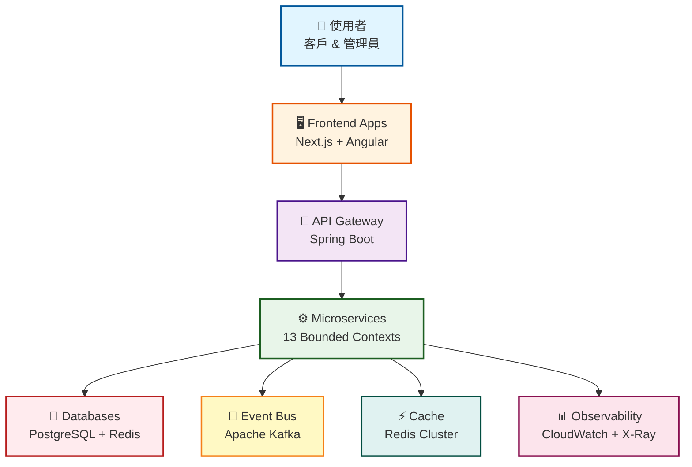

# Enterprise E-Commerce Platform

> **基於 Rozanski & Woods 方法論、Domain-Driven Design 與 Behavior-Driven Development 的現代軟體架構展示**

[](https://openjdk.java.net/)
[](https://spring.io/projects/spring-boot)
[](https://aws.amazon.com/cdk/)
[](LICENSE)

## 📑 目錄

- [🎯 專案概覽](#-project-overview)
- [✨ 主要特色](#-key-features)
- [🚀 快速開始](#-quick-start)
- [🎯 我想要...](#-i-want-to)
- [🏛️ 架構亮點](#️-architecture-highlights)
- [🛠️ 技術堆疊](#️-technology-stack)
- [📚 文件](#-documentation)
- [🤝 貢獻](#-contributing)
- [❓ FAQ](#-faq)

---

## 🎯 Project Overview

本專案透過一個完整的電商平台展示了**企業級軟體架構**。它展示了如何使用業界領先的方法論來設計、開發、測試和部署生產就緒的系統。

### System Overview



### Core Design Principles

- **🏛️ Architecture-Driven**: [Rozanski & Woods](docs/rozanski-woods-methodology-guide.md) 方法論，包含 7 個 Viewpoints + 8 個 Perspectives
- **🎯 Domain-Driven Design**: 13 個 bounded contexts，採用策略性和戰術性 DDD 模式
- **📋 Behavior-Driven Development**: 28+ Gherkin feature files，整合 Cucumber
- **☁️ Cloud-Native**: AWS 基礎設施，包含 EKS、RDS、MSK 和完整的可觀測性

---

## ✨ Key Features

### 🏗️ Architecture Excellence

- **Systematic Design**: 完整實作 Rozanski & Woods 方法論
- **Hexagonal Architecture**: 業務邏輯與基礎設施之間的清晰分離
- **Event-Driven**: 透過 domain events 進行非同步通訊
- **CQRS Pattern**: 最佳化的讀寫模型

### 🎯 Domain Model

**13 個 Bounded Contexts** 遵循 DDD 原則：
- Customer Management、Product Catalog、Inventory Management
- Order Management、Payment Processing、Promotion Engine
- Pricing Strategy、Shopping Cart、Logistics & Delivery
- Notification Service、Reward Points、Analytics & Reporting
- Workflow Orchestration

**📖 詳細資訊**: [Functional Viewpoint](docs/viewpoints/functional/README.md)

### 🧪 Quality Assurance

- **Test Pyramid**: 80% 單元測試、15% 整合測試、5% E2E
- **BDD Testing**: 使用 Cucumber 的可執行規格
- **Architecture Testing**: 使用 ArchUnit 強制執行架構規則
- **Performance Testing**: 自訂框架，具備自動化監控

### ☁️ Cloud Infrastructure

- **AWS Services**: EKS、RDS、MSK、ElastiCache、CloudWatch、X-Ray
- **Infrastructure as Code**: 使用 TypeScript 的 AWS CDK
- **Multi-Region**: 支援災難復原和地理分布
- **GitOps**: 使用 ArgoCD 自動化部署

---

## 🚀 Quick Start

### Prerequisites

- Java 21+、Gradle 8.x、Docker、Node.js 18+

### 1️⃣ Clone & Setup

```bash
git clone https://github.com/yourusername/genai-demo.git
cd genai-demo
make dev-setup  # 一鍵設定
```

### 2️⃣ Start Services

```bash
docker-compose up -d        # 啟動相依服務 (PostgreSQL, Redis)
./gradlew :app:bootRun      # 啟動應用程式
```

### 3️⃣ Verify

- 🌐 **API**: http://localhost:8080
- 📚 **Swagger UI**: http://localhost:8080/swagger-ui.html
- ✅ **Health Check**: http://localhost:8080/actuator/health

**📖 詳細設定**: 參見 [Development Setup Guide](docs/development/setup/README.md)

---

## 🎯 I Want To...

<details>
<summary>🆕 <b>作為新開發者開始</b></summary>

### Learning Path (2-3 小時)

1. **了解系統**
   - 閱讀 [Project Overview](#-project-overview)
   - 檢視 [System Context](docs/viewpoints/context/README.md)

2. **設定環境**
   - 遵循 [Quick Start](#-quick-start)
   - 設定 [IDE](docs/development/setup/ide-configuration.md)

3. **學習程式碼庫**
   - 研讀 [Development Viewpoint](docs/viewpoints/development/README.md)
   - 檢視 [Coding Standards](docs/development/coding-standards/README.md)

4. **進行第一次貢獻**
   - 查看 [Contributing Guide](CONTRIBUTING.md)
   - 挑選一個 [good first issue](https://github.com/yourusername/genai-demo/labels/good%20first%20issue)

</details>

<details>
<summary>🏗️ <b>了解架構</b></summary>

### Architecture Learning Path (4-6 小時)

1. **從 Context 開始**
   - [Context Viewpoint](docs/viewpoints/context/README.md) - 系統邊界
   - [Functional Viewpoint](docs/viewpoints/functional/README.md) - 業務能力

2. **深入結構**
   - [Information Viewpoint](docs/viewpoints/information/README.md) - 資料模型
   - [Development Viewpoint](docs/viewpoints/development/README.md) - 程式碼組織
   - [Deployment Viewpoint](docs/viewpoints/deployment/README.md) - 基礎設施

3. **了解品質屬性**
   - [Security Perspective](docs/perspectives/security/README.md)
   - [Performance Perspective](docs/perspectives/performance/README.md)
   - [Availability Perspective](docs/perspectives/availability/README.md)

4. **檢視決策**
   - [Architecture Decision Records](docs/architecture/adrs/README.md)
   - [Design Patterns](docs/architecture/patterns/README.md)

**📖 完整指南**: [Rozanski & Woods Methodology](docs/rozanski-woods-methodology-guide.md)

</details>

<details>
<summary>🚀 <b>部署到生產環境</b></summary>

### Deployment Path (1-2 天)

1. **了解基礎設施**
   - [Deployment Viewpoint](docs/viewpoints/deployment/README.md)
   - [AWS Architecture](docs/operations/deployment/aws-architecture.md)

2. **準備部署**
   - 檢視 [Deployment Guide](docs/operations/deployment/README.md)
   - 檢查 [Environment Configuration](docs/operations/deployment/environments.md)

3. **部署**
   - 遵循 [Deployment Process](docs/operations/deployment/deployment-process.md)
   - 使用 [Smoke Tests](docs/operations/deployment/smoke-tests.md) 驗證

4. **設定維運**
   - 設定 [Monitoring](docs/operations/monitoring/README.md)
   - 檢視 [Runbooks](docs/operations/runbooks/README.md)
   - 設定 [Alerts](docs/operations/monitoring/alerts.md)

</details>

<details>
<summary>🧪 <b>撰寫測試</b></summary>

### Testing Guide

1. **了解測試策略**
   - [Testing Strategy](docs/development/testing/testing-strategy.md)
   - [Test Pyramid](docs/development/testing/test-pyramid.md)

2. **撰寫單元測試**
   - [Unit Testing Guide](docs/development/testing/unit-testing.md)
   - [Mocking Guidelines](docs/development/testing/mocking.md)

3. **撰寫 BDD 測試**
   - [BDD Testing Guide](docs/development/testing/bdd-testing.md)
   - [Gherkin Best Practices](docs/development/testing/gherkin-guide.md)

4. **執行測試**
   ```bash
   ./gradlew :app:test              # 單元測試
   ./gradlew :app:cucumber          # BDD 測試
   ./gradlew :app:jacocoTestReport  # 覆蓋率報告
   ```

</details>

<details>
<summary>🔧 <b>疑難排解</b></summary>

### Troubleshooting Resources

1. **常見問題**
   - [Troubleshooting Guide](docs/operations/troubleshooting/common-issues.md)
   - [Debugging Guide](docs/operations/troubleshooting/debugging-guide.md)

2. **操作程序**
   - [Runbooks](docs/operations/runbooks/README.md)
   - [Incident Response](docs/operations/runbooks/incident-response.md)

3. **取得協助**
   - 檢查 [FAQ](#-faq)
   - 在 [Discussions](https://github.com/yourusername/genai-demo/discussions) 提問
   - Email: yikaikao@gmail.com

</details>

---

## 🏛️ Architecture Highlights

本專案遵循 **Rozanski & Woods Software Systems Architecture** 方法論，透過 **7 個 Viewpoints**（系統結構）和 **8 個 Perspectives**（品質屬性）提供系統性分析。

### 📐 Architecture Viewpoints

Viewpoints 描述系統是**什麼**以及**如何**組織：

| Viewpoint | 目的 | 文件 |
|-----------|------|------|
| **[Context](docs/viewpoints/context/README.md)** | 系統邊界、外部整合 | [📄 檢視](docs/viewpoints/context/README.md) |
| **[Functional](docs/viewpoints/functional/README.md)** | 業務能力、bounded contexts | [📄 檢視](docs/viewpoints/functional/README.md) |
| **[Information](docs/viewpoints/information/README.md)** | 資料模型、事件流 | [📄 檢視](docs/viewpoints/information/README.md) |
| **[Concurrency](docs/viewpoints/concurrency/README.md)** | 非同步處理模式 | [📄 檢視](docs/viewpoints/concurrency/README.md) |
| **[Development](docs/viewpoints/development/README.md)** | 程式碼組織、建置流程 | [📄 檢視](docs/viewpoints/development/README.md) |
| **[Deployment](docs/viewpoints/deployment/README.md)** | 基礎設施、擴展策略 | [📄 檢視](docs/viewpoints/deployment/README.md) |
| **[Operational](docs/viewpoints/operational/README.md)** | 監控、事件回應 | [📄 檢視](docs/viewpoints/operational/README.md) |

### 🎯 Quality Perspectives

Perspectives 描述影響整個系統的**品質屬性**：

| Perspective | 關鍵關注點 | 文件 |
|-------------|-----------|------|
| **[Security](docs/perspectives/security/README.md)** | 認證、授權、加密 | [📄 檢視](docs/perspectives/security/README.md) |
| **[Performance](docs/perspectives/performance/README.md)** | 回應時間、吞吐量、擴展 | [📄 檢視](docs/perspectives/performance/README.md) |
| **[Availability](docs/perspectives/availability/README.md)** | 高可用性、災難復原 | [📄 檢視](docs/perspectives/availability/README.md) |
| **[Evolution](docs/perspectives/evolution/README.md)** | 可擴展性、可維護性 | [📄 檢視](docs/perspectives/evolution/README.md) |
| **[Accessibility](docs/perspectives/accessibility/README.md)** | UI/API 可用性、文件 | [📄 檢視](docs/perspectives/accessibility/README.md) |
| **[Development Resource](docs/perspectives/development-resource/README.md)** | 團隊結構、技能、工具 | [📄 檢視](docs/perspectives/development-resource/README.md) |
| **[Internationalization](docs/perspectives/internationalization/README.md)** | 多語言支援 | [📄 檢視](docs/perspectives/internationalization/README.md) |
| **[Location](docs/perspectives/location/README.md)** | 地理分布 | [📄 檢視](docs/perspectives/location/README.md) |

**📖 完整方法論**: [Rozanski & Woods Guide](docs/rozanski-woods-methodology-guide.md)

---

## 🛠️ Technology Stack

### Backend

| 類別 | 技術 |
|------|------|
| **Framework** | Spring Boot 3.3.13 + Java 21 |
| **Data Access** | Spring Data JPA + Hibernate |
| **Database** | PostgreSQL (生產環境), H2 (本地/測試) |
| **Caching** | Redis (生產環境), In-memory (本地) |
| **Messaging** | Apache Kafka (MSK) |
| **API Docs** | SpringDoc OpenAPI 3 + Swagger UI |

### Testing

| 類別 | 技術 |
|------|------|
| **Unit Testing** | JUnit 5 + Mockito + AssertJ |
| **BDD Testing** | Cucumber 7 + Gherkin |
| **Architecture Testing** | ArchUnit |
| **Performance Testing** | 自訂框架 |
| **Coverage** | JaCoCo (目標: 80%+) |

### Infrastructure

| 類別 | 技術 |
|------|------|
| **Cloud Provider** | AWS |
| **IaC** | AWS CDK (TypeScript) |
| **Orchestration** | Amazon EKS |
| **CI/CD** | GitHub Actions + ArgoCD |
| **Monitoring** | CloudWatch + X-Ray + Grafana |

### Frontend

| 應用程式 | 技術 |
|---------|------|
| **CMC Management** | Next.js 14 + React 18 + TypeScript |
| **Consumer App** | Angular 18 + TypeScript |

**📖 詳細堆疊**: 參見 [Technology Stack Documentation](docs/architecture/technology-stack.md)

---

## 📚 Documentation

我們的文件遵循 **Rozanski & Woods** 方法論，清楚區分結構和品質：

### 📖 Quick Links

| 類別 | 說明 | 連結 |
|------|------|------|
| **Getting Started** | 新開發者入門 | [🚀 從這裡開始](docs/getting-started/README.md) |
| **Architecture** | 完整方法論指南 | [🏛️ Architecture](docs/rozanski-woods-methodology-guide.md) |
| **Viewpoints** | 所有 7 個 viewpoints 概覽 | [📐 Viewpoints](docs/viewpoints/README.md) |
| **Perspectives** | 所有 8 個 perspectives 概覽 | [🎯 Perspectives](docs/perspectives/README.md) |
| **API Documentation** | REST API & Events | [🔌 API Docs](docs/api/README.md) |
| **Operations** | Runbooks & 程序 | [🔧 Operations](docs/operations/README.md) |
| **Development** | 編碼標準 & 指南 | [💻 Development](docs/development/README.md) |

### 📂 Documentation Structure

```text
docs/
├── viewpoints/              # 系統結構 (7 Viewpoints)
├── perspectives/            # 品質屬性 (8 Perspectives)
├── architecture/            # ADRs & 設計模式
├── api/                     # API 文件
├── development/             # 開發者指南
├── operations/              # 操作程序
└── getting-started/         # 入門資料
```

**📖 完整文件索引**: [docs/README.md](docs/README.md)

---

## 🛠️ Development Commands

| 指令 | 說明 |
|------|------|
| `make help` | 顯示所有可用指令 |
| `make dev-setup` | 完整開發環境設定 |
| `make diagrams` | 驗證並產生所有圖表 |
| `make pre-commit` | 執行所有 pre-commit 檢查 |
| `make status` | 檢查專案狀態 |

**完整指令參考**: 執行 `make help` 或參見 [Makefile](Makefile)

### Common Development Tasks

```bash
# 執行測試
./gradlew :app:test              # 單元測試
./gradlew :app:cucumber          # BDD 測試
./gradlew :app:jacocoTestReport  # 覆蓋率報告

# 執行應用程式
./gradlew :app:bootRun           # 啟動應用程式

# 建置
./gradlew :app:build             # 建置應用程式

# 部署
cd infrastructure
npm run deploy:staging           # 部署到 staging
npm run deploy:production        # 部署到 production
```

---

## 🤝 Contributing

我們歡迎貢獻！以下是開始的方法：

### Quick Contribution Guide

1. **Fork & Clone**: Fork 倉儲並 clone 到本地
2. **Create Branch**: `git checkout -b feature/your-feature`
3. **Make Changes**: 遵循我們的 [Coding Standards](docs/development/coding-standards/README.md)
4. **Write Tests**: 維持 80%+ 覆蓋率
5. **Run Checks**: `make pre-commit`
6. **Submit PR**: 建立具有清楚說明的 pull request

### Detailed Guides

- 📖 [Contributing Guide](CONTRIBUTING.md)
- 🎨 [Code Style Guide](docs/development/coding-standards/README.md)
- 🧪 [Testing Guide](docs/development/testing/README.md)
- 📝 [Documentation Guide](docs/STYLE-GUIDE.md)
- 🔀 [Git Workflow](docs/development/workflows/git-workflow.md)

### Development Standards

- **Code Style**: 遵循 Google Java Style Guide
- **Testing**: 維持 80%+ 程式碼覆蓋率
- **BDD**: 實作前先撰寫 Gherkin scenarios
- **Architecture**: 遵守 ArchUnit 規則
- **Documentation**: 更新相關 viewpoint 文件

### Need Help?

- 💬 [GitHub Discussions](https://github.com/yourusername/genai-demo/discussions)
- 🐛 [回報問題](https://github.com/yourusername/genai-demo/issues)
- 📧 Email: yikaikao@gmail.com

---

## ❓ FAQ

<details>
<summary><b>Q: 為什麼使用 Rozanski & Woods 方法論？</b></summary>

**A**: 它透過 viewpoints（結構）和 perspectives（品質屬性）提供系統性的架構分析，使複雜系統更容易理解和維護。這個方法論在企業架構中被廣泛採用，並為討論系統設計提供了共同語言。

**深入了解**: [Rozanski & Woods Guide](docs/rozanski-woods-methodology-guide.md)
</details>

<details>
<summary><b>Q: 我可以在沒有 AWS 的情況下執行嗎？</b></summary>

**A**: 可以！使用 `local` profile，它使用 H2 資料庫和 in-memory cache。這對於開發和測試非常完美。

```bash
./gradlew :app:bootRun --args='--spring.profiles.active=local'
```

**深入了解**: [Local Development Setup](docs/development/setup/local-environment.md)
</details>

<details>
<summary><b>Q: 如何新增一個新的 bounded context？</b></summary>

**A**: 遵循我們的 DDD 實作指南，它提供了以下步驟的詳細說明：
1. 定義 bounded context 邊界
2. 建立 domain models (aggregates、entities、value objects)
3. 實作 repositories 和 services
4. 新增 domain events
5. 撰寫測試

**深入了解**: [DDD Implementation Guide](docs/development/ddd-implementation-guide.md)
</details>

<details>
<summary><b>Q: viewpoints 和 perspectives 有什麼不同？</b></summary>

**A**:
- **Viewpoints** 描述系統的**結構**（它是什麼以及如何組織）
- **Perspectives** 描述跨越所有 viewpoints 的**品質屬性**（安全性、效能等）

可以把 viewpoints 想像成檢視系統結構的不同角度，而 perspectives 是評估系統的品質透鏡。

**深入了解**: [Architecture Methodology](docs/rozanski-woods-methodology-guide.md)
</details>

<details>
<summary><b>Q: 如何執行整合測試？</b></summary>

**A**: 整合測試針對 staging 環境中的真實 AWS 服務執行：

```bash
# 部署到 staging
cd infrastructure
npm run deploy:staging

# 執行整合測試
cd ../staging-tests
./gradlew test
```

**深入了解**: [Testing Strategy](docs/development/testing/testing-strategy.md)
</details>

<details>
<summary><b>Q: 在哪裡可以找到 API 文件？</b></summary>

**A**: API 文件有多種格式：
- **Interactive**: Swagger UI 於 http://localhost:8080/swagger-ui.html
- **OpenAPI Spec**: http://localhost:8080/api-docs
- **Documentation**: [API Documentation](docs/api/README.md)

**深入了解**: [API Documentation Guide](docs/api/README.md)
</details>

<details>
<summary><b>Q: 如何為文件做出貢獻？</b></summary>

**A**: 我們歡迎文件貢獻！請遵循以下步驟：
1. 閱讀 [Documentation Style Guide](docs/STYLE-GUIDE.md)
2. 使用適當的 [templates](docs/templates/)
3. 執行驗證: `make diagrams`
4. 提交 pull request

**深入了解**: [Documentation Contributing Guide](docs/STYLE-GUIDE.md)
</details>

**更多問題？**
- 查看我們的 [完整 FAQ](docs/FAQ.md)
- 在 [GitHub Discussions](https://github.com/yourusername/genai-demo/discussions) 提問
- Email: yikaikao@gmail.com

---

## 🏗️ Project Structure

```text
.
├── app/                          # 主應用程式
│   ├── src/main/java/           # 原始碼
│   │   └── solid/humank/genaidemo/
│   │       ├── application/     # Application services (use cases)
│   │       ├── domain/          # Domain model (13 bounded contexts)
│   │       └── infrastructure/  # Infrastructure adapters
│   └── src/test/                # 測試
│       ├── java/                # 單元測試
│       └── resources/features/  # BDD feature files (28+)
│
├── infrastructure/              # AWS CDK 基礎設施
│   └── lib/stacks/             # CDK stack 定義
│
├── cmc-frontend/               # 客戶管理主控台 (Next.js)
├── consumer-frontend/          # 消費者應用程式 (Angular)
├── docs/                       # 文件
└── scripts/                    # 工具腳本
```

**📖 詳細結構**: 參見 [Development Viewpoint](docs/viewpoints/development/README.md)

---

## 📄 License

本專案採用 MIT License - 詳見 [LICENSE](LICENSE) 文件。

---

## 🙏 Acknowledgments

- **Rozanski & Woods**: Software Systems Architecture 方法論
- **Eric Evans**: Domain-Driven Design 原則
- **Martin Fowler**: 企業架構模式
- **AWS**: 雲端基礎設施和服務
- **Spring Team**: Spring Boot 框架
- **Open Source Community**: 所有精彩的工具和函式庫

---

## 📞 Contact & Support

- **專案維護者**: yikaikao@gmail.com
- **GitHub Issues**: [回報錯誤](https://github.com/yourusername/genai-demo/issues)
- **Discussions**: [提問](https://github.com/yourusername/genai-demo/discussions)
- **Documentation**: [docs/README.md](docs/README.md)

---

**使用現代軟體工程實踐精心打造**

**最後更新**: 2025-11-09
