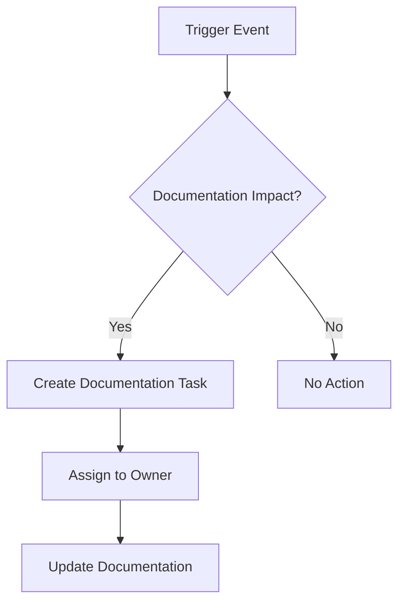

# Documentation 維護指南

> **最後更新**: 2024-11-09
> **負責人**: Documentation Team
> **狀態**: 使用中

## 概述

本指南定義了維護 Enterprise E-Commerce Platform documentation 的流程、職責和工作流程。定期維護確保 documentation 保持準確、相關且對所有 stakeholders 有價值。

## 維護理念

- **活文件**: Documentation 隨系統演進
- **持續改進**: 定期審查和更新
- **共同責任**: 每個人都為 documentation 品質做出貢獻
- **自動化優先**: 盡可能自動化驗證和維護

---

## 審查週期

### 月度審查

**頻率**: 每月第一週
**時長**: 2-4 小時
**參與者**: Documentation team, tech leads

#### 活動

- [ ] 審查 documentation metrics dashboard
- [ ] 檢查損壞的連結和過時的參考
- [ ] 審查最近的程式碼變更對 documentation 的影響
- [ ] 更新新 endpoints 的 API documentation
- [ ] 審查並處理 documentation 問題/回饋
- [ ] 更新 changelog 和版本資訊

#### 交付物

- 月度 documentation 健康報告
- 已識別問題和行動項目清單
- 更新的 documentation 章節

### 季度審查

**頻率**: 每季末
**時長**: 1-2 天
**參與者**: 所有 stakeholders, documentation team

#### 活動

- [ ] 全面 documentation 稽核
- [ ] 審查所有 viewpoints 和 perspectives
- [ ] 驗證 architecture diagrams 與當前狀態一致
- [ ] 審查和更新 ADRs
- [ ] Stakeholder 回饋收集和分析
- [ ] Documentation 覆蓋率分析
- [ ] 更新 technology stack documentation
- [ ] 審查和更新 operational runbooks

#### 交付物

- 季度 documentation 稽核報告
- 更新的 documentation roadmap
- Stakeholder 回饋摘要
- 下一季度的行動計劃

### 年度審查

**頻率**: 財政年度結束
**時長**: 1 週
**參與者**: 所有 stakeholders, leadership team

#### 活動

- [ ] 完整 documentation 重組審查
- [ ] 主要版本更新和遷移
- [ ] 長期 documentation 策略審查
- [ ] Documentation 工具評估
- [ ] 培訓需求評估
- [ ] Documentation ROI 分析
- [ ] 歸檔過時的 documentation
- [ ] 規劃主要 documentation 計劃

#### 交付物

- 年度 documentation 狀態報告
- 明年的 documentation 策略
- 預算和資源規劃
- 培訓計劃

---

## Documentation 所有權模型

### 所有權層級

#### Primary Owner

**職責**:
- 整體品質和準確性
- 定期更新和維護
- Stakeholder 溝通
- 審查協調

#### Technical Reviewer

**職責**:
- 技術準確性驗證
- 程式碼範例驗證
- Architecture 一致性
- Security 審查

#### Domain Expert

**職責**:
- 業務邏輯準確性
- Use case 驗證
- 術語一致性
- Requirements 一致性

### 所有權矩陣

| Documentation 類型 | Primary Owner | Technical Reviewer | Domain Expert |
|-------------------|---------------|-------------------|---------------|
| Viewpoints | Architecture Team | Tech Leads | Product Owners |
| Perspectives | Quality Team | Security Team | Compliance Team |
| ADRs | Architecture Team | Tech Leads | Stakeholders |
| API Documentation | Backend Team | API Team | Product Team |
| Operational Docs | Operations Team | DevOps Team | SRE Team |
| Development Guides | Development Team | Tech Leads | Architects |

### 所有權分配流程

1. **識別 Documentation**: 需要所有權的新文件或現有文件
2. **分配 Primary Owner**: 基於專業知識和責任
3. **分配 Reviewers**: 技術和領域專家
4. **記錄分配**: 更新 CODEOWNERS 檔案
5. **溝通**: 通知所有相關方分配結果
6. **追蹤**: 監控所有權有效性

---

## 更新工作流程

### 觸發事件

Documentation 更新由以下事件觸發：

- **程式碼變更**: 新功能、bug 修復、重構
- **Architecture 變更**: 新模式、技術變更
- **流程變更**: 新工作流程、政策更新
- **回饋**: 使用者回饋、support tickets
- **定期審查**: 月度、季度、年度
- **事故**: Post-mortem documentation 更新

### 更新流程

#### 1. 識別更新需求



#### 2. 建立 Documentation 任務

- **標題**: 清楚描述所需更新
- **背景**: 為何需要更新
- **範圍**: 受影響的 documentation
- **優先級**: Critical, High, Medium, Low
- **截止日期**: 基於優先級和影響

#### 3. 更新 Documentation

**流程**:
1. 建立 feature branch: `docs/update-{topic}`
2. 進行 documentation 變更
3. 如需要則更新 diagrams
4. 執行驗證檢查
5. 自我審查變更
6. 建立 pull request

**檢查清單**:
- [ ] 內容準確且完整
- [ ] 連結有效
- [ ] Diagrams 已更新
- [ ] 程式碼範例已測試
- [ ] 交叉參考已更新
- [ ] Metadata 是最新的
- [ ] 已檢查拼寫和文法

#### 4. 審查流程

**審查步驟**:
1. **自動化檢查**: CI/CD 驗證
2. **技術審查**: 準確性和完整性
3. **領域審查**: 業務邏輯驗證
4. **編輯審查**: 風格和清晰度
5. **批准**: Primary owner 批准

**審查標準**:
- 技術準確性
- 完整性
- 清晰度和可讀性
- 與現有文件的一致性
- 格式正確
- 有效的連結和參考

#### 5. 合併和部署

- 合併到 main branch
- 自動部署到 documentation site
- 通知 stakeholders 更新
- 更新 changelog

### 緊急更新

對於關鍵 documentation 更新（安全問題、重大 bugs）：

1. **立即更新**: 為求速度跳過正常審查
2. **快速審查**: 單一審查者批准
3. **快速部署**: 立即合併和部署
4. **更新後審查**: 24 小時內進行完整審查
5. **通知**: 立即警告所有 stakeholders

---

## Documentation Drift 偵測

### 自動化偵測

**工具**:
- `scripts/check-doc-drift.sh`: 偵測程式碼與 documentation 不匹配
- GitHub Actions: 在 PRs 上自動化 drift 偵測
- Documentation linter: 檢查過時內容

**偵測標準**:
- 程式碼變更但 documentation 未更新
- API 變更但 API 文件未更新
- Architecture 變更但 ADR 未更新
- 過時的版本號
- 損壞的連結和參考

### 手動偵測

**月度稽核**:
- 審查最近的程式碼變更
- 檢查未記錄的功能
- 驗證 architecture diagrams
- 審查 API documentation 完整性

**季度深度審查**:
- 完整 documentation 瀏覽
- Stakeholder 訪談
- 使用者回饋分析
- Metrics 審查

---

## 品質保證

### 自動化品質檢查

每次 commit 前執行：

```bash
# 驗證所有 documentation
./scripts/validate-docs.sh

# 檢查損壞的連結
./scripts/validate-links.sh

# 驗證 diagrams
./scripts/validate-diagrams.sh

# 檢查 documentation 完整性
./scripts/validate-documentation-completeness.py

# 拼寫檢查
./scripts/check-spelling.sh
```

### 手動品質檢查

**每週**:
- 審查新 documentation
- 檢查最近更新的品質
- 監控 documentation metrics

**每月**:
- 抽樣 documentation 審查
- 使用者回饋分析
- Metrics 趨勢分析

**每季**:
- 全面品質稽核
- Stakeholder 滿意度調查
- Documentation 有效性審查

---

## 持續改進

### 回饋收集

**管道**:
- Documentation 回饋表單
- GitHub issues
- Support tickets
- Stakeholder 訪談
- 使用者調查

**流程**:
1. 持續收集回饋
2. 分類和優先排序
3. 建立改進任務
4. 實施改進
5. 衡量影響

### Metrics 驅動的改進

**關鍵 Metrics**:
- Documentation 覆蓋率
- 更新頻率
- 更新時間
- 使用者滿意度
- 搜尋有效性
- 連結健康度

**改進週期**:
1. 分析 metrics
2. 識別改進領域
3. 規劃改進
4. 實施變更
5. 衡量結果
6. 迭代

### 最佳實踐演進

**流程**:
- 記錄經驗教訓
- 分享最佳實踐
- 更新指南
- 培訓團隊成員
- 慶祝成功

---

## 工具和自動化

### Documentation 工具

- **Markdown**: 主要 documentation 格式
- **PlantUML**: 複雜 diagrams
- **Mermaid**: 簡單 diagrams
- **GitHub**: 版本控制和協作
- **CI/CD**: 自動化驗證和部署

### 自動化腳本

| 腳本 | 目的 | 頻率 |
|--------|---------|-----------|
| `validate-docs.sh` | 驗證所有 documentation | 每次 commit |
| `generate-diagrams.sh` | 產生 diagrams | Diagram 變更時 |
| `check-doc-drift.sh` | 偵測 documentation drift | 每日 |
| `validate-links.sh` | 檢查損壞的連結 | 每日 |
| `check-spelling.sh` | 拼寫檢查 | 每次 commit |

### CI/CD 整合

**GitHub Actions Workflows**:
- PRs 上的 documentation 驗證
- 變更時產生 diagram
- 每日連結檢查
- 程式碼變更時的 drift 偵測
- 合併時自動部署

---

## 培訓和入職

### 新團隊成員入職

**第 1 週**:
- Documentation 結構概述
- 工具培訓（Markdown, PlantUML, Git）
- 審查流程介紹
- 所有權模型說明

**第 2-4 週**:
- 觀摩 documentation 更新
- 審查現有 documentation
- 進行首次 documentation 貢獻
- 參與審查流程

### 持續培訓

**每季**:
- Documentation 最佳實踐工作坊
- 工具更新和新功能
- 經驗教訓分享
- 寫作技能提升

**每年**:
- 進階 documentation 技術
- Architecture documentation 培訓
- Stakeholder 溝通技巧
- Documentation 策略會議

---

## 故障排除

### 常見問題

#### 過時的 Documentation

**症狀**:
- 使用者回報不準確
- 程式碼與 documentation 不符
- Diagrams 顯示舊 architecture

**解決方案**:
1. 識別受影響的 documentation
2. 建立高優先級更新任務
3. 快速審查和更新
4. 通知 stakeholders 變更

#### 損壞的連結

**症狀**:
- 連結驗證失敗
- 使用者回報損壞的連結
- Documentation 中的 404 錯誤

**解決方案**:
1. 執行連結驗證腳本
2. 識別損壞的連結
3. 更新或移除連結
4. 驗證修復

#### Documentation Drift

**症狀**:
- 程式碼變更但文件未更新
- Drift 偵測警報增加
- Stakeholder 混淆

**解決方案**:
1. 審查最近的程式碼變更
2. 識別遺漏的 documentation
3. 建立 documentation 任務
4. 更新 documentation
5. 改進 drift 偵測

---

## Metrics 和報告

### 關鍵績效指標

- **覆蓋率**: 已記錄功能的百分比
- **新鮮度**: Documentation 的平均年齡
- **品質**: 驗證通過率
- **使用情況**: 頁面瀏覽量和搜尋查詢
- **滿意度**: 使用者回饋分數
- **速度**: 更新 documentation 的時間

### 報告時程

**每週**: 快速 metrics dashboard 審查
**每月**: 詳細 metrics 報告
**每季**: 全面 documentation 健康報告
**每年**: Documentation 現況報告

---

## 聯絡和支援

### Documentation Team

- **Lead**: [Name] - [Email]
- **Architects**: [Names] - [Email]
- **Writers**: [Names] - [Email]

### 獲取幫助

- **問題**: #documentation Slack channel
- **Issues**: GitHub documentation repository
- **回饋**: Documentation feedback form
- **培訓**: 聯絡 documentation lead

---

## 附錄

### 相關文件

- [Documentation Style Guide](STYLE-GUIDE.md)
- [Documentation Metrics](METRICS.md)
- [Stakeholder Review Plan](STAKEHOLDER-REVIEW-PLAN.md)
- [Review Coordinator Quick Start](REVIEW-COORDINATOR-QUICK-START.md)

### 變更歷史

| 日期 | 版本 | 變更 | 作者 |
|------|---------|---------|--------|
| 2024-11-09 | 1.0 | 初始建立 | Documentation Team |

---

**文件版本**: 1.0
**最後更新**: 2024-11-09
**下次審查**: 2024-12-09
