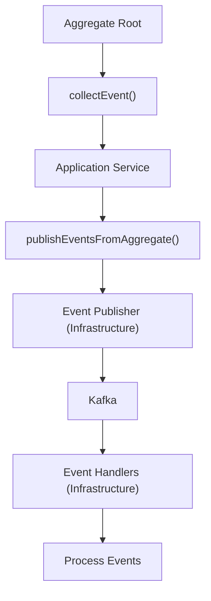

# Domain Events API 文件

## 概述

本文件描述電子商務平台發佈的 domain events。Domain events 是系統中發生的重要業務事件的不可變記錄。它們實現了bounded contexts 之間的鬆散耦合，並支援事件驅動架構模式。

**最後更新**: 2025-10-25

---

## 事件驅動架構方法

### 核心原則

1. **Events 是一等公民**：Domain events 是我們架構的核心，實現 bounded contexts 之間的非同步通訊
2. **不可變性**：一旦發佈，events 無法被修改
3. **準備好進行 Event Sourcing**：Events 包含所有必要資料，讓 event handlers 可以獨立處理
4. **最終一致性**：跨 context 操作透過事件處理實現一致性

### 事件發佈流程



### 事件結構

所有 domain events 遵循一致的結構：

```java
public record DomainEvent(
    UUID eventId,              // 唯一事件識別碼
    LocalDateTime occurredOn,  // 事件發生時間
    String eventType,          // 事件類型 (例如："CustomerCreated")
    String aggregateId,        // 產生事件的 aggregate ID
    // ... 特定事件的 payload 欄位
) implements DomainEvent { }
```

---

## 事件分類

事件依 bounded context 組織：

| Context | 事件數量 | 描述 |
|---------|-------------|-------------|
| [Customer](contexts/customer-events.md) | 5+ | 客戶生命週期事件 |
| [Order](contexts/order-events.md) | 10+ | 訂單處理事件 |
| [Product](contexts/product-events.md) | 6+ | 產品目錄事件 |
| [Payment](contexts/payment-events.md) | 5+ | 付款處理事件 |
| [Inventory](contexts/inventory-events.md) | 4+ | 庫存管理事件 |
| [Shipping](contexts/shipping-events.md) | 6+ | 物流配送事件 |
| [Promotion](contexts/promotion-events.md) | 4+ | 促銷和折扣事件 |
| [Notification](contexts/notification-events.md) | 3+ | 通知事件 |
| [Review](contexts/review-events.md) | 4+ | 產品評價事件 |
| [Shopping Cart](contexts/shopping-cart-events.md) | 5+ | 購物車事件 |
| [Pricing](contexts/pricing-events.md) | 3+ | 價格計算事件 |
| [Seller](contexts/seller-events.md) | 5+ | 賣家管理事件 |
| [Delivery](contexts/delivery-events.md) | 5+ | 配送追蹤事件 |

**事件總數**：跨 13 個 bounded contexts 的 65+ domain events

---

## 事件目錄

完整事件列表請參閱 [Event Catalog](event-catalog.md)。

---

## 事件 Schemas

所有事件的 JSON schemas 可在 [schemas/](schemas/) 目錄中找到。這些 schemas 可用於：

- 事件驗證
- 程式碼生成
- 文件生成
- Contract 測試

---

## 事件消費

### 訂閱事件

Event handlers 必須：

1. 繼承 `AbstractDomainEventHandler<T>`
2. 使用 `@Component` 註解
3. 實施冪等性檢查
4. 使用 `@TransactionalEventListener(phase = AFTER_COMMIT)`

範例：

```java
@Component
public class OrderSubmittedEventHandler
    extends AbstractDomainEventHandler<OrderSubmittedEvent> {

    @Override
    @Transactional
    public void handle(OrderSubmittedEvent event) {
        // 檢查冪等性
        if (isEventAlreadyProcessed(event.getEventId())) {
            return;
        }

        // 處理事件
        inventoryService.reserveItems(event.orderId());
        notificationService.sendOrderConfirmation(event.customerId());

        // 標記為已處理
        markEventAsProcessed(event.getEventId());
    }

    @Override
    public Class<OrderSubmittedEvent> getSupportedEventType() {
        return OrderSubmittedEvent.class;
    }
}
```

### 事件排序

事件按照 aggregate root 收集的順序發佈。然而，由於系統的分散式特性，不同的 handlers 可能會以亂序處理事件。Handlers 必須設計為能夠優雅地處理亂序事件。

### 事件重播

事件儲存在具有可配置保留期的 Kafka topics 中。這實現了：

- 用於除錯的事件重播
- 重建讀取模型
- 稽核軌跡
- 分析

---

## 事件版本控制

### Schema 演進

事件遵循 schema 演進策略以維持向後相容性：

1. **累加性變更**：可以新增新的選填欄位
2. **選填欄位**：對於可能在舊版本中不存在的欄位使用 `Optional<T>`
3. **Factory 方法**：為不同版本提供多個 factory 方法

範例：

```java
public record CustomerCreatedEvent(
    CustomerId customerId,
    CustomerName customerName,
    Email email,
    MembershipLevel membershipLevel,
    // V2 欄位使用 Optional 以向後相容
    Optional<LocalDate> birthDate,
    Optional<Address> address,
    UUID eventId,
    LocalDateTime occurredOn
) implements DomainEvent {

    // V2 factory 方法
    public static CustomerCreatedEvent create(
        CustomerId customerId,
        CustomerName customerName,
        Email email,
        MembershipLevel membershipLevel,
        LocalDate birthDate,
        Address address
    ) {
        // 實作
    }

    // V1 factory 方法（向後相容）
    public static CustomerCreatedEvent createLegacy(
        CustomerId customerId,
        CustomerName customerName,
        Email email,
        MembershipLevel membershipLevel
    ) {
        // 使用空 Optional 欄位的實作
    }
}
```

### 版本相容性

- **Breaking Changes**：需要新的事件類型（例如：`CustomerCreatedV2Event`）
- **Non-Breaking Changes**：使用 Optional 欄位和 factory 方法
- **棄用**：舊事件版本標記為已棄用但繼續運作

---

## 事件監控

### 關鍵指標

- **事件發佈率**：每秒發佈的事件數
- **事件處理延遲**：從發佈到處理的時間
- **事件處理失敗**：失敗的事件處理嘗試次數
- **事件重播次數**：事件重播次數

### 儀表板

事件指標可在以下位置取得：

- Grafana：Event Processing Dashboard
- CloudWatch：Event Metrics
- Kafka Manager：Topic Metrics

### 告警

為以下情況配置關鍵告警：

- 事件處理失敗率 > 1%
- 事件處理延遲 > 5 秒
- 事件發佈失敗
- Kafka topic lag > 1000 訊息

---

## 最佳實踐

### 事件設計

1. **包含所有必要資料**：事件應包含 handlers 所需的所有資料
2. **使用過去式**：事件名稱應使用過去式（例如：`OrderSubmitted`，而非 `SubmitOrder`）
3. **具體明確**：事件名稱應清楚描述發生了什麼
4. **避免敏感資料**：不要包含密碼或其他敏感資訊

### 事件處理

1. **冪等性**：Handlers 必須是冪等的（可安全地多次處理）
2. **錯誤處理**：實施適當的錯誤處理和日誌記錄
3. **交易邊界**：使用適當的交易邊界
4. **補償**：為失敗的操作實施補償邏輯

### 事件測試

1. **單元測試**：測試事件建立和驗證
2. **整合測試**：測試事件發佈和處理
3. **Contract 測試**：驗證事件 schemas 符合預期
4. **端到端測試**：測試完整的事件流程

---

## 相關文件

- **Domain Events 實作**：參見 `.kiro/steering/domain-events.md`
- **Event Storming**：參見 `.kiro/examples/architecture/event-storming-guide.md`
- **DDD Patterns**：參見 `.kiro/steering/ddd-tactical-patterns.md`
- **架構觀點**：參見 `docs/viewpoints/information/data-flow.md`

---

## 快速連結

- [Event Catalog](event-catalog.md) - 所有事件的完整列表
- [Event Schemas](schemas/) - 所有事件的 JSON schemas
- [Customer Events](contexts/customer-events.md)
- [Order Events](contexts/order-events.md)
- [Product Events](contexts/product-events.md)
- [Payment Events](contexts/payment-events.md)

---

## 支援

有關 domain events 的問題或疑問：

- **技術問題**：聯絡架構團隊
- **事件 Schema 變更**：提交包含 schema 更新的 PR
- **新事件**：遵循 ADR 流程提出新事件類型
- **事件處理問題**：檢查 Event Processing Dashboard

---

**文件版本**: 1.0
**最後更新**: 2025-10-25
**負責人**: 架構團隊
