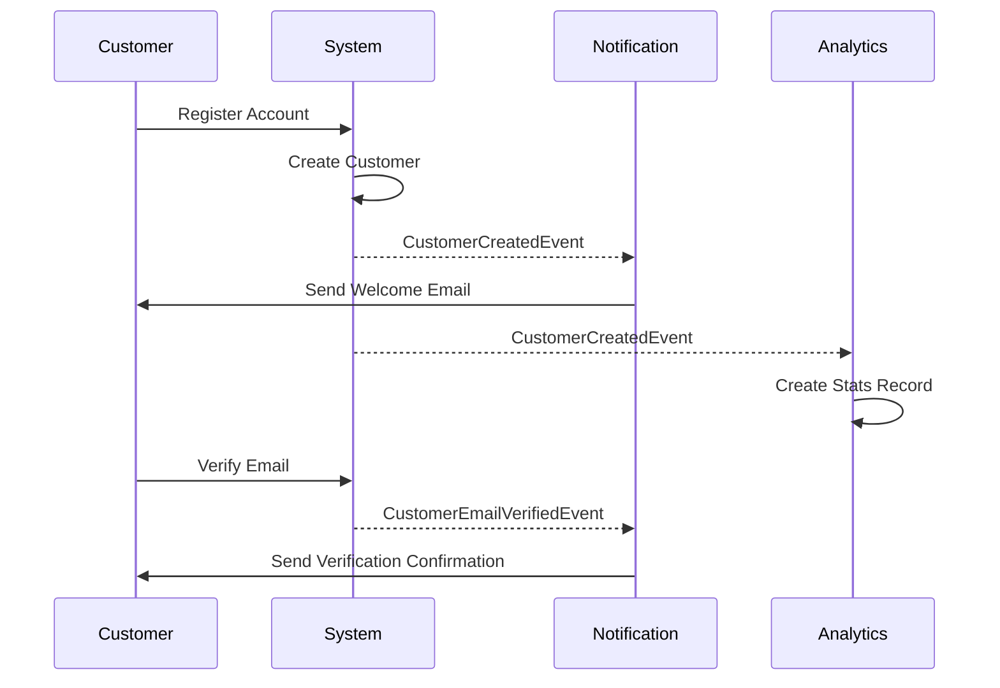
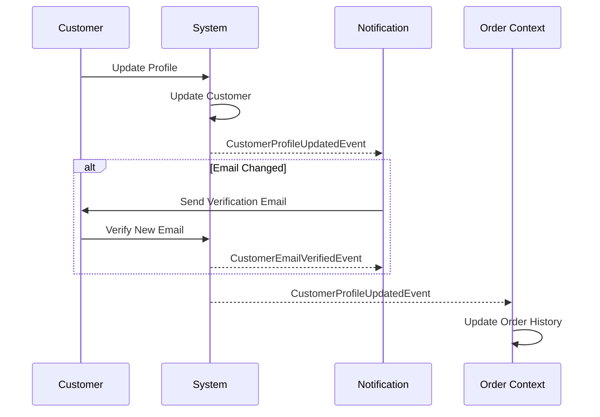

# Customer Context Events

## 概述

本文件描述由 Customer bounded context 發布的所有 domain events。這些 events 捕捉客戶生命週期、個人資料管理和帳戶狀態的重要變更。

**最後更新**: 2025-10-25

---

## Event 清單

| Event Name | Trigger | Frequency | Priority |
|------------|---------|-----------|----------|
| `CustomerCreatedEvent` | 客戶註冊 | High | P0 |
| `CustomerProfileUpdatedEvent` | 個人資料編輯 | High | P1 |
| `CustomerEmailVerifiedEvent` | Email 驗證 | Medium | P1 |
| `CustomerPasswordChangedEvent` | 密碼變更 | Low | P2 |
| `CustomerDeactivatedEvent` | 帳戶關閉 | Low | P1 |
| `CustomerReactivatedEvent` | 帳戶重新啟用 | Low | P1 |
| `CustomerMembershipUpgradedEvent` | 會員升級 | Low | P0 |

---

## CustomerCreatedEvent

### 描述

當新客戶成功在系統中註冊帳戶時發布。

### Event 結構

```java
public record CustomerCreatedEvent(
    CustomerId customerId,
    CustomerName customerName,
    Email email,
    MembershipLevel membershipLevel,
    Optional<LocalDate> birthDate,
    Optional<Address> address,
    UUID eventId,
    LocalDateTime occurredOn
) implements DomainEvent {

    public static CustomerCreatedEvent create(
        CustomerId customerId,
        CustomerName customerName,
        Email email,
        MembershipLevel membershipLevel,
        LocalDate birthDate,
        Address address
    ) {
        var metadata = DomainEvent.createEventMetadata();
        return new CustomerCreatedEvent(
            customerId, customerName, email, membershipLevel,
            Optional.ofNullable(birthDate),
            Optional.ofNullable(address),
            metadata.eventId(), metadata.occurredOn()
        );
    }
}
```

### Payload 欄位

| Field | Type | Required | Description |
|-------|------|----------|-------------|
| `customerId` | CustomerId | Yes | 唯一客戶識別碼 |
| `customerName` | CustomerName | Yes | 客戶全名 |
| `email` | Email | Yes | 客戶 email 地址 |
| `membershipLevel` | MembershipLevel | Yes | 初始會員等級 (STANDARD, PREMIUM, VIP) |
| `birthDate` | Optional<LocalDate> | No | 客戶生日 (V2 欄位) |
| `address` | Optional<Address> | No | 客戶主要地址 (V2 欄位) |
| `eventId` | UUID | Yes | 唯一 event 識別碼 |
| `occurredOn` | LocalDateTime | Yes | Event 時間戳記 |

### 範例 JSON

```json
{
  "eventType": "CustomerCreated",
  "eventId": "550e8400-e29b-41d4-a716-446655440000",
  "occurredOn": "2025-10-25T10:30:00Z",
  "customerId": "CUST-001",
  "customerName": "張小明",
  "email": "ming.chang@example.com",
  "membershipLevel": "STANDARD",
  "birthDate": "1990-05-15",
  "address": {
    "street": "台北市信義區信義路五段7號",
    "city": "台北市",
    "postalCode": "110"
  }
}
```

### Event Handlers

| Handler | Action | Context |
|---------|--------|---------|
| `WelcomeEmailHandler` | 發送歡迎 email | Notification |
| `CustomerStatsHandler` | 建立客戶統計記錄 | Analytics |
| `LoyaltyProgramHandler` | 初始化忠誠點數 | Promotion |

### 相關 Events

- 觸發: `NotificationSentEvent` (歡迎 email)
- 接續: None (初始 event)

---

## CustomerProfileUpdatedEvent

### 描述

當客戶更新其個人資料資訊（姓名、地址、電話等）時發布。

### Event 結構

```java
public record CustomerProfileUpdatedEvent(
    CustomerId customerId,
    CustomerName newName,
    Email newEmail,
    Phone newPhone,
    Optional<Address> newAddress,
    Map<String, String> changedFields,
    UUID eventId,
    LocalDateTime occurredOn
) implements DomainEvent {

    public static CustomerProfileUpdatedEvent create(
        CustomerId customerId,
        CustomerName newName,
        Email newEmail,
        Phone newPhone,
        Address newAddress,
        Map<String, String> changedFields
    ) {
        var metadata = DomainEvent.createEventMetadata();
        return new CustomerProfileUpdatedEvent(
            customerId, newName, newEmail, newPhone,
            Optional.ofNullable(newAddress),
            changedFields,
            metadata.eventId(), metadata.occurredOn()
        );
    }
}
```

### Payload 欄位

| Field | Type | Required | Description |
|-------|------|----------|-------------|
| `customerId` | CustomerId | Yes | 客戶識別碼 |
| `newName` | CustomerName | Yes | 更新後的客戶姓名 |
| `newEmail` | Email | Yes | 更新後的 email 地址 |
| `newPhone` | Phone | Yes | 更新後的電話號碼 |
| `newAddress` | Optional<Address> | No | 更新後的地址 |
| `changedFields` | Map<String, String> | Yes | 變更欄位名稱對應舊值的 Map |
| `eventId` | UUID | Yes | 唯一 event 識別碼 |
| `occurredOn` | LocalDateTime | Yes | Event 時間戳記 |

### 範例 JSON

```json
{
  "eventType": "CustomerProfileUpdated",
  "eventId": "660e8400-e29b-41d4-a716-446655440001",
  "occurredOn": "2025-10-25T14:20:00Z",
  "customerId": "CUST-001",
  "newName": "張小明",
  "newEmail": "ming.chang.new@example.com",
  "newPhone": "+886-912-345-678",
  "newAddress": {
    "street": "台北市大安區敦化南路二段105號",
    "city": "台北市",
    "postalCode": "106"
  },
  "changedFields": {
    "email": "ming.chang@example.com",
    "address": "台北市信義區信義路五段7號"
  }
}
```

### Event Handlers

| Handler | Action | Context |
|---------|--------|---------|
| `CustomerSearchIndexHandler` | 更新搜尋索引 | Search |
| `EmailVerificationHandler` | 如果 email 變更則發送驗證 email | Notification |
| `OrderHistoryHandler` | 在訂單歷史中更新客戶資訊 | Order |

### 相關 Events

- 可能觸發: `CustomerEmailVerifiedEvent` (如果 email 變更)
- 接續: `CustomerCreatedEvent`

---

## CustomerEmailVerifiedEvent

### 描述

當客戶成功驗證其 email 地址時發布。

### Event 結構

```java
public record CustomerEmailVerifiedEvent(
    CustomerId customerId,
    Email verifiedEmail,
    LocalDateTime verifiedAt,
    UUID eventId,
    LocalDateTime occurredOn
) implements DomainEvent {

    public static CustomerEmailVerifiedEvent create(
        CustomerId customerId,
        Email verifiedEmail
    ) {
        var metadata = DomainEvent.createEventMetadata();
        return new CustomerEmailVerifiedEvent(
            customerId, verifiedEmail,
            LocalDateTime.now(),
            metadata.eventId(), metadata.occurredOn()
        );
    }
}
```

### Payload 欄位

| Field | Type | Required | Description |
|-------|------|----------|-------------|
| `customerId` | CustomerId | Yes | 客戶識別碼 |
| `verifiedEmail` | Email | Yes | 已驗證的 email 地址 |
| `verifiedAt` | LocalDateTime | Yes | 驗證時間戳記 |
| `eventId` | UUID | Yes | 唯一 event 識別碼 |
| `occurredOn` | LocalDateTime | Yes | Event 時間戳記 |

### 範例 JSON

```json
{
  "eventType": "CustomerEmailVerified",
  "eventId": "770e8400-e29b-41d4-a716-446655440002",
  "occurredOn": "2025-10-25T10:35:00Z",
  "customerId": "CUST-001",
  "verifiedEmail": "ming.chang@example.com",
  "verifiedAt": "2025-10-25T10:35:00Z"
}
```

### Event Handlers

| Handler | Action | Context |
|---------|--------|---------|
| `CustomerStatusHandler` | 更新客戶驗證狀態 | Customer |
| `PromotionEligibilityHandler` | 啟用僅限已驗證用戶的促銷活動 | Promotion |

### 相關 Events

- 接續: `CustomerCreatedEvent` 或 `CustomerProfileUpdatedEvent`

---

## CustomerPasswordChangedEvent

### 描述

當客戶成功變更其密碼時發布。

### Event 結構

```java
public record CustomerPasswordChangedEvent(
    CustomerId customerId,
    LocalDateTime changedAt,
    String changeReason,
    UUID eventId,
    LocalDateTime occurredOn
) implements DomainEvent {

    public static CustomerPasswordChangedEvent create(
        CustomerId customerId,
        String changeReason
    ) {
        var metadata = DomainEvent.createEventMetadata();
        return new CustomerPasswordChangedEvent(
            customerId,
            LocalDateTime.now(),
            changeReason,
            metadata.eventId(), metadata.occurredOn()
        );
    }
}
```

### Payload 欄位

| Field | Type | Required | Description |
|-------|------|----------|-------------|
| `customerId` | CustomerId | Yes | 客戶識別碼 |
| `changedAt` | LocalDateTime | Yes | 密碼變更時間戳記 |
| `changeReason` | String | Yes | 變更原因 (USER_INITIATED, FORCED_RESET, SECURITY_POLICY) |
| `eventId` | UUID | Yes | 唯一 event 識別碼 |
| `occurredOn` | LocalDateTime | Yes | Event 時間戳記 |

### 範例 JSON

```json
{
  "eventType": "CustomerPasswordChanged",
  "eventId": "880e8400-e29b-41d4-a716-446655440003",
  "occurredOn": "2025-10-25T16:45:00Z",
  "customerId": "CUST-001",
  "changedAt": "2025-10-25T16:45:00Z",
  "changeReason": "USER_INITIATED"
}
```

### Event Handlers

| Handler | Action | Context |
|---------|--------|---------|
| `SecurityAuditHandler` | 記錄安全事件 | Security |
| `NotificationHandler` | 發送密碼變更確認 email | Notification |

### 相關 Events

- 接續: `CustomerCreatedEvent`

---

## CustomerDeactivatedEvent

### 描述

當客戶帳戶被停用時發布（軟刪除）。

### Event 結構

```java
public record CustomerDeactivatedEvent(
    CustomerId customerId,
    String deactivationReason,
    LocalDateTime deactivatedAt,
    UUID eventId,
    LocalDateTime occurredOn
) implements DomainEvent {

    public static CustomerDeactivatedEvent create(
        CustomerId customerId,
        String deactivationReason
    ) {
        var metadata = DomainEvent.createEventMetadata();
        return new CustomerDeactivatedEvent(
            customerId,
            deactivationReason,
            LocalDateTime.now(),
            metadata.eventId(), metadata.occurredOn()
        );
    }
}
```

### Payload 欄位

| Field | Type | Required | Description |
|-------|------|----------|-------------|
| `customerId` | CustomerId | Yes | 客戶識別碼 |
| `deactivationReason` | String | Yes | 停用原因 |
| `deactivatedAt` | LocalDateTime | Yes | 停用時間戳記 |
| `eventId` | UUID | Yes | 唯一 event 識別碼 |
| `occurredOn` | LocalDateTime | Yes | Event 時間戳記 |

### 範例 JSON

```json
{
  "eventType": "CustomerDeactivated",
  "eventId": "990e8400-e29b-41d4-a716-446655440004",
  "occurredOn": "2025-10-25T18:00:00Z",
  "customerId": "CUST-001",
  "deactivationReason": "Customer requested account closure",
  "deactivatedAt": "2025-10-25T18:00:00Z"
}
```

### Event Handlers

| Handler | Action | Context |
|---------|--------|---------|
| `CustomerAccessHandler` | 撤銷存取 tokens | Security |
| `SubscriptionHandler` | 取消活躍的訂閱 | Subscription |
| `DataRetentionHandler` | 依 GDPR 排程資料刪除 | Compliance |

### 相關 Events

- 可能觸發: `SubscriptionCancelledEvent`
- 接續: `CustomerCreatedEvent`

---

## CustomerReactivatedEvent

### 描述

當先前停用的客戶帳戶被重新啟用時發布。

### Event 結構

```java
public record CustomerReactivatedEvent(
    CustomerId customerId,
    LocalDateTime reactivatedAt,
    UUID eventId,
    LocalDateTime occurredOn
) implements DomainEvent {

    public static CustomerReactivatedEvent create(
        CustomerId customerId
    ) {
        var metadata = DomainEvent.createEventMetadata();
        return new CustomerReactivatedEvent(
            customerId,
            LocalDateTime.now(),
            metadata.eventId(), metadata.occurredOn()
        );
    }
}
```

### Payload 欄位

| Field | Type | Required | Description |
|-------|------|----------|-------------|
| `customerId` | CustomerId | Yes | 客戶識別碼 |
| `reactivatedAt` | LocalDateTime | Yes | 重新啟用時間戳記 |
| `eventId` | UUID | Yes | 唯一 event 識別碼 |
| `occurredOn` | LocalDateTime | Yes | Event 時間戳記 |

### 範例 JSON

```json
{
  "eventType": "CustomerReactivated",
  "eventId": "aa0e8400-e29b-41d4-a716-446655440005",
  "occurredOn": "2025-10-26T09:00:00Z",
  "customerId": "CUST-001",
  "reactivatedAt": "2025-10-26T09:00:00Z"
}
```

### Event Handlers

| Handler | Action | Context |
|---------|--------|---------|
| `CustomerAccessHandler` | 恢復存取 | Security |
| `WelcomeBackHandler` | 發送歡迎回來 email | Notification |

### 相關 Events

- 接續: `CustomerDeactivatedEvent`

---

## CustomerMembershipUpgradedEvent

### 描述

當客戶的會員等級升級時發布（例如 STANDARD → PREMIUM → VIP）。

### Event 結構

```java
public record CustomerMembershipUpgradedEvent(
    CustomerId customerId,
    MembershipLevel previousLevel,
    MembershipLevel newLevel,
    String upgradeReason,
    LocalDateTime upgradedAt,
    UUID eventId,
    LocalDateTime occurredOn
) implements DomainEvent {

    public static CustomerMembershipUpgradedEvent create(
        CustomerId customerId,
        MembershipLevel previousLevel,
        MembershipLevel newLevel,
        String upgradeReason
    ) {
        var metadata = DomainEvent.createEventMetadata();
        return new CustomerMembershipUpgradedEvent(
            customerId, previousLevel, newLevel, upgradeReason,
            LocalDateTime.now(),
            metadata.eventId(), metadata.occurredOn()
        );
    }
}
```

### Payload 欄位

| Field | Type | Required | Description |
|-------|------|----------|-------------|
| `customerId` | CustomerId | Yes | 客戶識別碼 |
| `previousLevel` | MembershipLevel | Yes | 先前的會員等級 |
| `newLevel` | MembershipLevel | Yes | 新的會員等級 |
| `upgradeReason` | String | Yes | 升級原因 (PURCHASE, LOYALTY_POINTS, PROMOTION) |
| `upgradedAt` | LocalDateTime | Yes | 升級時間戳記 |
| `eventId` | UUID | Yes | 唯一 event 識別碼 |
| `occurredOn` | LocalDateTime | Yes | Event 時間戳記 |

### 範例 JSON

```json
{
  "eventType": "CustomerMembershipUpgraded",
  "eventId": "bb0e8400-e29b-41d4-a716-446655440006",
  "occurredOn": "2025-10-25T12:00:00Z",
  "customerId": "CUST-001",
  "previousLevel": "STANDARD",
  "newLevel": "PREMIUM",
  "upgradeReason": "PURCHASE",
  "upgradedAt": "2025-10-25T12:00:00Z"
}
```

### Event Handlers

| Handler | Action | Context |
|---------|--------|---------|
| `BenefitsHandler` | 啟用高級會員福利 | Promotion |
| `PricingHandler` | 更新定價層級 | Pricing |
| `NotificationHandler` | 發送升級恭喜 | Notification |

### 相關 Events

- 可能觸發: `PromotionActivatedEvent`
- 接續: `CustomerCreatedEvent`

---

## Event Flow 圖表

### 客戶註冊流程



### 個人資料更新流程



---

## 測試指南

### 單元測試

```java
@Test
void should_create_customer_created_event_with_all_fields() {
    // Given
    CustomerId customerId = CustomerId.of("CUST-001");
    CustomerName name = new CustomerName("張小明");
    Email email = new Email("ming.chang@example.com");
    MembershipLevel level = MembershipLevel.STANDARD;

    // When
    CustomerCreatedEvent event = CustomerCreatedEvent.create(
        customerId, name, email, level, null, null
    );

    // Then
    assertThat(event.customerId()).isEqualTo(customerId);
    assertThat(event.customerName()).isEqualTo(name);
    assertThat(event.email()).isEqualTo(email);
    assertThat(event.membershipLevel()).isEqualTo(level);
    assertThat(event.eventId()).isNotNull();
    assertThat(event.occurredOn()).isNotNull();
}
```

### 整合測試

```java
@SpringBootTest
@ActiveProfiles("test")
class CustomerEventIntegrationTest {

    @Autowired
    private CustomerService customerService;

    @Autowired
    private DomainEventPublisher eventPublisher;

    @Test
    void should_publish_customer_created_event_when_customer_registered() {
        // Given
        CreateCustomerCommand command = new CreateCustomerCommand(
            "張小明", "ming.chang@example.com", "password123"
        );

        // When
        Customer customer = customerService.registerCustomer(command);

        // Then
        verify(eventPublisher).publish(any(CustomerCreatedEvent.class));
    }
}
```

---

## 相關文件

- **Event Catalog**: [event-catalog.md](../event-catalog.md)
- **Customer API**: `docs/api/rest/endpoints/customers.md`
- **Domain Events Guide**: `.kiro/steering/domain-events.md`
- **Customer Aggregate**: `docs/viewpoints/functional/bounded-contexts.md#customer-context`

---

**文件版本**: 1.0
**最後更新**: 2025-10-25
**負責人**: Customer Domain Team
