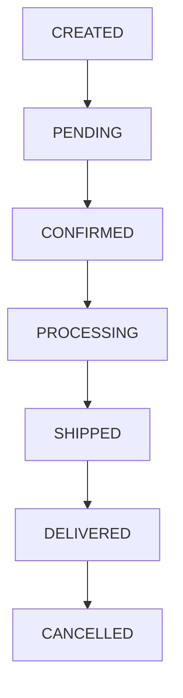
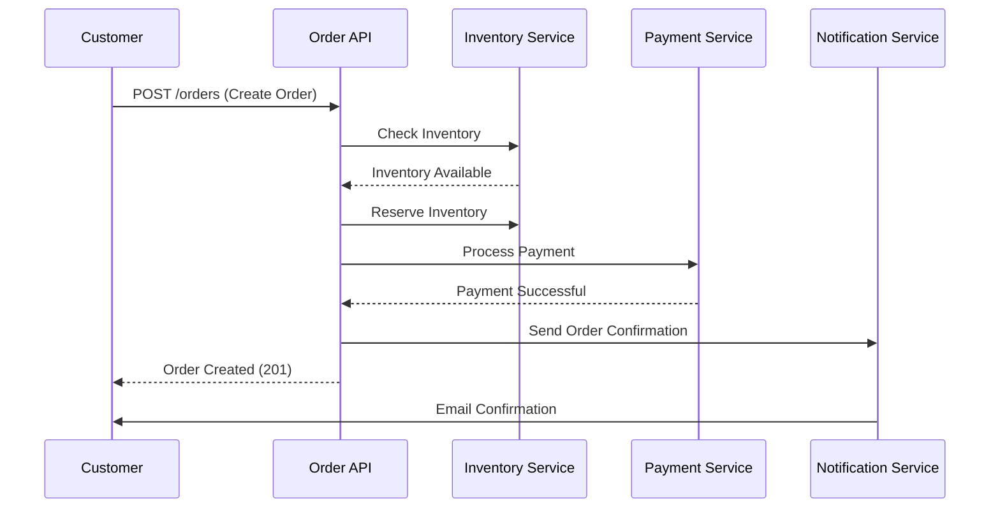

# Order API

## 概述

Order API 提供了管理顧客訂單的端點，包括訂單建立、檢索、更新和取消。訂單代表從購物車到交付的完整購買交易。

**Base Path**: `/api/v1/orders`

**Authentication**: 所有端點皆需要驗證

## Order Lifecycle



## Endpoints

### Create Order (Submit Order)

從購物車建立新訂單。

**Endpoint**: `POST /api/v1/orders`

**Authentication**: 需要

**Request Body**:

```json
{
  "customerId": "cust-123",
  "items": [
    {
      "productId": "prod-456",
      "quantity": 2,
      "price": 500.00
    },
    {
      "productId": "prod-789",
      "quantity": 1,
      "price": 1000.00
    }
  ],
  "shippingAddress": {
    "street": "123 Main St",
    "city": "Taipei",
    "state": "Taiwan",
    "postalCode": "10001",
    "country": "TW"
  },
  "billingAddress": {
    "street": "123 Main St",
    "city": "Taipei",
    "state": "Taiwan",
    "postalCode": "10001",
    "country": "TW"
  },
  "paymentMethod": "CREDIT_CARD",
  "promotionCode": "SUMMER2025"
}
```

**Validation Rules**:

- `customerId`: 必填，必須存在
- `items`: 必填，至少 1 個項目
- `items[].productId`: 必填，必須存在且有庫存
- `items[].quantity`: 必填，必須 > 0
- `shippingAddress`: 必填
- `paymentMethod`: 必填（CREDIT_CARD, DEBIT_CARD, BANK_TRANSFER, CASH_ON_DELIVERY）

**Success Response** (201 Created):

```json
{
  "data": {
    "id": "order-789",
    "orderNumber": "ORD-2025-001",
    "customerId": "cust-123",
    "status": "PENDING",
    "items": [
      {
        "id": "item-1",
        "productId": "prod-456",
        "productName": "Wireless Mouse",
        "quantity": 2,
        "unitPrice": 500.00,
        "subtotal": 1000.00
      },
      {
        "id": "item-2",
        "productId": "prod-789",
        "productName": "Mechanical Keyboard",
        "quantity": 1,
        "unitPrice": 1000.00,
        "subtotal": 1000.00
      }
    ],
    "subtotal": 2000.00,
    "discount": 200.00,
    "shippingFee": 100.00,
    "tax": 95.00,
    "totalAmount": 1995.00,
    "currency": "TWD",
    "shippingAddress": {
      "street": "123 Main St",
      "city": "Taipei",
      "state": "Taiwan",
      "postalCode": "10001",
      "country": "TW"
    },
    "paymentMethod": "CREDIT_CARD",
    "paymentStatus": "PENDING",
    "createdAt": "2025-10-25T10:30:00Z",
    "updatedAt": "2025-10-25T10:30:00Z"
  },
  "metadata": {
    "requestId": "req-abc-123",
    "timestamp": "2025-10-25T10:30:00Z",
    "version": "v1"
  }
}
```

**Error Responses**:

- `400 Bad Request`: 驗證錯誤
- `401 Unauthorized`: token 遺失或無效
- `409 Conflict`: 庫存不足

**curl Example**:

```bash
curl -X POST https://api.ecommerce.com/api/v1/orders \
  -H "Authorization: Bearer YOUR_JWT_TOKEN" \
  -H "Content-Type: application/json" \
  -d '{
    "customerId": "cust-123",
    "items": [
      {
        "productId": "prod-456",
        "quantity": 2,
        "price": 500.00
      }
    ],
    "shippingAddress": {
      "street": "123 Main St",
      "city": "Taipei",
      "state": "Taiwan",
      "postalCode": "10001",
      "country": "TW"
    },
    "paymentMethod": "CREDIT_CARD"
  }'
```

---

### Get Order by ID

根據 ID 取得特定訂單。

**Endpoint**: `GET /api/v1/orders/{id}`

**Authentication**: 需要

**Authorization**: 使用者可存取自己的訂單，或需要 ADMIN 角色

**Path Parameters**:

- `id`: Order ID（例如：`order-789`）

**Success Response** (200 OK):

```json
{
  "data": {
    "id": "order-789",
    "orderNumber": "ORD-2025-001",
    "customerId": "cust-123",
    "customerName": "John Doe",
    "status": "SHIPPED",
    "items": [
      {
        "id": "item-1",
        "productId": "prod-456",
        "productName": "Wireless Mouse",
        "productImage": "https://cdn.ecommerce.com/products/prod-456.jpg",
        "quantity": 2,
        "unitPrice": 500.00,
        "subtotal": 1000.00
      }
    ],
    "subtotal": 2000.00,
    "discount": 200.00,
    "shippingFee": 100.00,
    "tax": 95.00,
    "totalAmount": 1995.00,
    "currency": "TWD",
    "shippingAddress": {
      "street": "123 Main St",
      "city": "Taipei",
      "state": "Taiwan",
      "postalCode": "10001",
      "country": "TW"
    },
    "billingAddress": {
      "street": "123 Main St",
      "city": "Taipei",
      "state": "Taiwan",
      "postalCode": "10001",
      "country": "TW"
    },
    "paymentMethod": "CREDIT_CARD",
    "paymentStatus": "PAID",
    "trackingNumber": "TW123456789",
    "estimatedDelivery": "2025-10-28T00:00:00Z",
    "createdAt": "2025-10-25T10:30:00Z",
    "updatedAt": "2025-10-26T14:00:00Z",
    "shippedAt": "2025-10-26T14:00:00Z"
  }
}
```

**Error Responses**:

- `401 Unauthorized`: token 遺失或無效
- `403 Forbidden`: 權限不足
- `404 Not Found`: 找不到訂單

**curl Example**:

```bash
curl -X GET https://api.ecommerce.com/api/v1/orders/order-789 \
  -H "Authorization: Bearer YOUR_JWT_TOKEN"
```

---

### List Orders

取得分頁的訂單清單。

**Endpoint**: `GET /api/v1/orders`

**Authentication**: 需要

**Authorization**:

- 一般使用者僅能查看自己的訂單
- ADMIN 角色可查看所有訂單

**Query Parameters**:

- `page`: 頁碼（從 0 開始，預設：0）
- `size`: 每頁大小（預設：20，最大：100）
- `sort`: 排序欄位和方向（預設：`createdAt,desc`）
- `status`: 依狀態篩選（PENDING, CONFIRMED, PROCESSING, SHIPPED, DELIVERED, CANCELLED）
- `customerId`: 依顧客 ID 篩選（僅限 ADMIN）
- `startDate`: 篩選此日期之後建立的訂單（ISO 8601）
- `endDate`: 篩選此日期之前建立的訂單（ISO 8601）

**Success Response** (200 OK):

```json
{
  "data": {
    "content": [
      {
        "id": "order-789",
        "orderNumber": "ORD-2025-001",
        "customerId": "cust-123",
        "customerName": "John Doe",
        "status": "SHIPPED",
        "totalAmount": 1995.00,
        "currency": "TWD",
        "itemCount": 2,
        "paymentStatus": "PAID",
        "createdAt": "2025-10-25T10:30:00Z",
        "shippedAt": "2025-10-26T14:00:00Z"
      }
    ],
    "page": {
      "number": 0,
      "size": 20,
      "totalElements": 50,
      "totalPages": 3,
      "first": true,
      "last": false
    }
  }
}
```

**curl Example**:

```bash
# List own orders
curl -X GET "https://api.ecommerce.com/api/v1/orders?page=0&size=20&status=SHIPPED" \
  -H "Authorization: Bearer YOUR_JWT_TOKEN"

# Admin: List all orders with date filter
curl -X GET "https://api.ecommerce.com/api/v1/orders?startDate=2025-10-01T00:00:00Z&endDate=2025-10-31T23:59:59Z" \
  -H "Authorization: Bearer ADMIN_JWT_TOKEN"
```

---

### Update Order Status

更新訂單的狀態。

**Endpoint**: `PATCH /api/v1/orders/{id}/status`

**Authentication**: 需要

**Authorization**: 需要 ADMIN 或 SELLER 角色

**Path Parameters**:

- `id`: Order ID

**Request Body**:

```json
{
  "status": "CONFIRMED",
  "notes": "Order confirmed and ready for processing"
}
```

**Valid Status Transitions**:

- `PENDING` → `CONFIRMED` 或 `CANCELLED`
- `CONFIRMED` → `PROCESSING` 或 `CANCELLED`
- `PROCESSING` → `SHIPPED` 或 `CANCELLED`
- `SHIPPED` → `DELIVERED`

**Success Response** (200 OK):

```json
{
  "data": {
    "id": "order-789",
    "status": "CONFIRMED",
    "statusHistory": [
      {
        "status": "PENDING",
        "timestamp": "2025-10-25T10:30:00Z",
        "updatedBy": "system"
      },
      {
        "status": "CONFIRMED",
        "timestamp": "2025-10-25T11:00:00Z",
        "updatedBy": "admin-user",
        "notes": "Order confirmed and ready for processing"
      }
    ],
    "updatedAt": "2025-10-25T11:00:00Z"
  }
}
```

**Error Responses**:

- `400 Bad Request`: 無效的狀態轉換
- `401 Unauthorized`: token 遺失或無效
- `403 Forbidden`: 權限不足
- `404 Not Found`: 找不到訂單
- `409 Conflict`: 無效的狀態轉換

**curl Example**:

```bash
curl -X PATCH https://api.ecommerce.com/api/v1/orders/order-789/status \
  -H "Authorization: Bearer ADMIN_JWT_TOKEN" \
  -H "Content-Type: application/json" \
  -d '{
    "status": "CONFIRMED",
    "notes": "Order confirmed and ready for processing"
  }'
```

---

### Cancel Order

取消訂單。

**Endpoint**: `POST /api/v1/orders/{id}/cancel`

**Authentication**: 需要

**Authorization**: 使用者可取消自己的訂單（如符合條件），或需要 ADMIN 角色

**Path Parameters**:

- `id`: Order ID

**Request Body**:

```json
{
  "reason": "Changed my mind",
  "refundMethod": "ORIGINAL_PAYMENT_METHOD"
}
```

**Cancellation Rules**:

- 若狀態為 PENDING 或 CONFIRMED 可取消
- 若狀態為 PROCESSING、SHIPPED 或 DELIVERED 無法取消
- 已付款的訂單會自動處理退款

**Success Response** (200 OK):

```json
{
  "data": {
    "id": "order-789",
    "status": "CANCELLED",
    "cancellationReason": "Changed my mind",
    "refundStatus": "PROCESSING",
    "refundAmount": 1995.00,
    "cancelledAt": "2025-10-25T12:00:00Z"
  }
}
```

**Error Responses**:

- `401 Unauthorized`: token 遺失或無效
- `403 Forbidden`: 權限不足
- `404 Not Found`: 找不到訂單
- `409 Conflict`: 訂單無法取消（已出貨）

**curl Example**:

```bash
curl -X POST https://api.ecommerce.com/api/v1/orders/order-789/cancel \
  -H "Authorization: Bearer YOUR_JWT_TOKEN" \
  -H "Content-Type: application/json" \
  -d '{
    "reason": "Changed my mind",
    "refundMethod": "ORIGINAL_PAYMENT_METHOD"
  }'
```

---

### Add Tracking Information

新增訂單的物流追蹤資訊。

**Endpoint**: `POST /api/v1/orders/{id}/tracking`

**Authentication**: 需要

**Authorization**: 需要 ADMIN 或 SELLER 角色

**Path Parameters**:

- `id`: Order ID

**Request Body**:

```json
{
  "trackingNumber": "TW123456789",
  "carrier": "Taiwan Post",
  "estimatedDelivery": "2025-10-28T00:00:00Z",
  "trackingUrl": "https://tracking.taiwanpost.com/TW123456789"
}
```

**Success Response** (200 OK):

```json
{
  "data": {
    "id": "order-789",
    "trackingNumber": "TW123456789",
    "carrier": "Taiwan Post",
    "estimatedDelivery": "2025-10-28T00:00:00Z",
    "trackingUrl": "https://tracking.taiwanpost.com/TW123456789",
    "status": "SHIPPED",
    "shippedAt": "2025-10-26T14:00:00Z"
  }
}
```

**curl Example**:

```bash
curl -X POST https://api.ecommerce.com/api/v1/orders/order-789/tracking \
  -H "Authorization: Bearer ADMIN_JWT_TOKEN" \
  -H "Content-Type: application/json" \
  -d '{
    "trackingNumber": "TW123456789",
    "carrier": "Taiwan Post",
    "estimatedDelivery": "2025-10-28T00:00:00Z"
  }'
```

---

### Get Order Invoice

取得訂單的發票。

**Endpoint**: `GET /api/v1/orders/{id}/invoice`

**Authentication**: 需要

**Authorization**: 使用者可存取自己的訂單發票，或需要 ADMIN 角色

**Path Parameters**:

- `id`: Order ID

**Query Parameters**:

- `format`: 發票格式（PDF, HTML，預設：PDF）

**Success Response** (200 OK):

```json
{
  "data": {
    "invoiceNumber": "INV-2025-001",
    "orderId": "order-789",
    "orderNumber": "ORD-2025-001",
    "issueDate": "2025-10-25T10:30:00Z",
    "dueDate": "2025-11-25T10:30:00Z",
    "customer": {
      "name": "John Doe",
      "email": "john@example.com",
      "address": {
        "street": "123 Main St",
        "city": "Taipei",
        "postalCode": "10001"
      }
    },
    "items": [
      {
        "description": "Wireless Mouse",
        "quantity": 2,
        "unitPrice": 500.00,
        "total": 1000.00
      }
    ],
    "subtotal": 2000.00,
    "discount": 200.00,
    "tax": 95.00,
    "total": 1995.00,
    "currency": "TWD",
    "downloadUrl": "https://api.ecommerce.com/api/v1/orders/order-789/invoice/download"
  }
}
```

**curl Example**:

```bash
# Get invoice metadata
curl -X GET https://api.ecommerce.com/api/v1/orders/order-789/invoice \
  -H "Authorization: Bearer YOUR_JWT_TOKEN"

# Download PDF invoice
curl -X GET "https://api.ecommerce.com/api/v1/orders/order-789/invoice?format=PDF" \
  -H "Authorization: Bearer YOUR_JWT_TOKEN" \
  -o invoice.pdf
```

---

### Get Order History

取得訂單狀態變更的完整歷史。

**Endpoint**: `GET /api/v1/orders/{id}/history`

**Authentication**: 需要

**Authorization**: 使用者可存取自己的訂單歷史，或需要 ADMIN 角色

**Path Parameters**:

- `id`: Order ID

**Success Response** (200 OK):

```json
{
  "data": {
    "orderId": "order-789",
    "history": [
      {
        "status": "CREATED",
        "timestamp": "2025-10-25T10:30:00Z",
        "updatedBy": "system",
        "notes": "Order created"
      },
      {
        "status": "PENDING",
        "timestamp": "2025-10-25T10:30:05Z",
        "updatedBy": "system",
        "notes": "Awaiting payment confirmation"
      },
      {
        "status": "CONFIRMED",
        "timestamp": "2025-10-25T11:00:00Z",
        "updatedBy": "admin-user",
        "notes": "Payment confirmed"
      },
      {
        "status": "PROCESSING",
        "timestamp": "2025-10-26T09:00:00Z",
        "updatedBy": "warehouse-system",
        "notes": "Order being prepared"
      },
      {
        "status": "SHIPPED",
        "timestamp": "2025-10-26T14:00:00Z",
        "updatedBy": "logistics-system",
        "notes": "Order shipped with tracking number TW123456789"
      }
    ]
  }
}
```

**curl Example**:

```bash
curl -X GET https://api.ecommerce.com/api/v1/orders/order-789/history \
  -H "Authorization: Bearer YOUR_JWT_TOKEN"
```

---

## Order Submission Flow

### Complete Order Flow



### Step-by-Step Process

1. **Create Order**: 顧客提交包含商品和配送資訊的訂單
2. **Validate Items**: 系統驗證所有產品存在且有庫存
3. **Reserve Inventory**: 系統為訂單項目保留庫存
4. **Calculate Totals**: 系統計算小計、折扣、稅金、運費
5. **Process Payment**: 系統透過付款閘道處理付款
6. **Confirm Order**: 系統確認訂單並更新狀態
7. **Send Notifications**: 系統傳送確認郵件給顧客
8. **Prepare Shipment**: 倉庫準備訂單以進行配送

## Data Models

### Order Object

```json
{
  "id": "string",
  "orderNumber": "string",
  "customerId": "string",
  "customerName": "string",
  "status": "PENDING | CONFIRMED | PROCESSING | SHIPPED | DELIVERED | CANCELLED",
  "items": [
    {
      "id": "string",
      "productId": "string",
      "productName": "string",
      "quantity": "number",
      "unitPrice": "number",
      "subtotal": "number"
    }
  ],
  "subtotal": "number",
  "discount": "number",
  "shippingFee": "number",
  "tax": "number",
  "totalAmount": "number",
  "currency": "string",
  "shippingAddress": "Address",
  "billingAddress": "Address",
  "paymentMethod": "string",
  "paymentStatus": "PENDING | PAID | FAILED | REFUNDED",
  "trackingNumber": "string",
  "estimatedDelivery": "string (ISO 8601)",
  "createdAt": "string (ISO 8601)",
  "updatedAt": "string (ISO 8601)",
  "shippedAt": "string (ISO 8601)",
  "deliveredAt": "string (ISO 8601)",
  "cancelledAt": "string (ISO 8601)"
}
```

### Order Status

| Status | Description | Next Possible Status |
|--------|-------------|---------------------|
| CREATED | 訂單剛建立 | PENDING |
| PENDING | 等待付款 | CONFIRMED, CANCELLED |
| CONFIRMED | 付款已確認 | PROCESSING, CANCELLED |
| PROCESSING | 準備中 | SHIPPED, CANCELLED |
| SHIPPED | 運送中 | DELIVERED |
| DELIVERED | 已送達顧客 | - |
| CANCELLED | 訂單已取消 | - |

### Payment Methods

| Method | Code | Description |
|--------|------|-------------|
| Credit Card | CREDIT_CARD | Visa, Mastercard, JCB |
| Debit Card | DEBIT_CARD | 銀行金融卡 |
| Bank Transfer | BANK_TRANSFER | 直接銀行轉帳 |
| Cash on Delivery | CASH_ON_DELIVERY | 貨到付款 |

## Business Rules

1. **Inventory Reservation**: 建立訂單時保留庫存
2. **Payment Timeout**: 未付款的訂單在 24 小時後取消
3. **Cancellation Window**: 訂單可在出貨前取消
4. **Refund Processing**: 退款在 7-14 個工作天內處理
5. **Minimum Order**: 最低訂單金額為 100 TWD
6. **Maximum Items**: 每筆訂單最多 50 個項目

## Error Codes

| Code | Description | Solution |
|------|-------------|----------|
| `ORDER_INSUFFICIENT_INVENTORY` | 庫存不足 | 減少數量或移除項目 |
| `ORDER_PAYMENT_FAILED` | 付款處理失敗 | 檢查付款詳細資料 |
| `ORDER_CANNOT_BE_CANCELLED` | 訂單已出貨 | 聯絡客服 |
| `ORDER_INVALID_STATUS_TRANSITION` | 無效的狀態變更 | 檢查目前狀態 |
| `ORDER_MINIMUM_AMOUNT_NOT_MET` | 訂單低於最低金額 | 新增更多項目 |
| `ORDER_NOT_FOUND` | 找不到訂單 ID | 檢查訂單 ID |

## Related Documentation

- [Customer API](customers.md) - 顧客管理
- [Product API](products.md) - 產品目錄
- [Payment API](payments.md) - 付款處理
- [Authentication](../authentication.md) - 驗證和授權
- [Error Handling](../error-handling.md) - 錯誤碼和故障排除

---

**Last Updated**: 2025-10-25
**API Version**: v1
