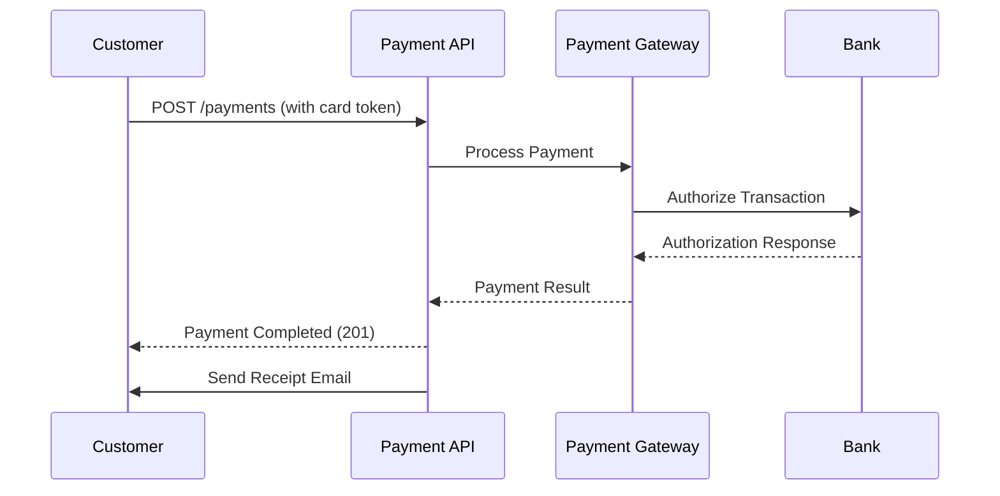
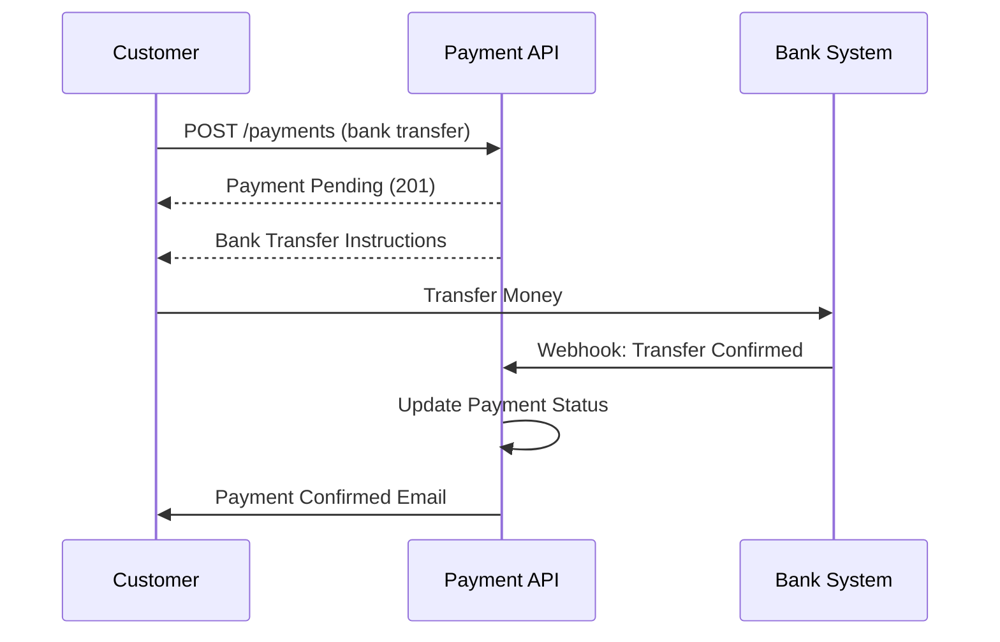

# Payment API

## 概述

Payment API 提供安全的端點來處理付款、管理付款方式和處理退款。所有付款操作皆符合 PCI-DSS 規範。

**Base Path**: `/api/v1/payments`

**Authentication**: 所有端點皆需要驗證

**Security**: 所有付款資料皆經過加密和 token 化

## Endpoints

### Process Payment

處理訂單的付款。

**Endpoint**: `POST /api/v1/payments`

**Authentication**: 需要

**Request Body**:

```json
{
  "orderId": "order-789",
  "amount": 1995.00,
  "currency": "TWD",
  "paymentMethod": "CREDIT_CARD",
  "paymentDetails": {
    "cardToken": "tok_1234567890abcdef",
    "cardholderName": "John Doe",
    "billingAddress": {
      "street": "123 Main St",
      "city": "Taipei",
      "postalCode": "10001",
      "country": "TW"
    }
  },
  "savePaymentMethod": true
}
```

**Validation Rules**:

- `orderId`: 必填，必須存在
- `amount`: 必填，必須符合訂單總金額
- `currency`: 必填，必須符合訂單幣別
- `paymentMethod`: 必填（CREDIT_CARD, DEBIT_CARD, BANK_TRANSFER, CASH_ON_DELIVERY）
- `paymentDetails.cardToken`: 卡片付款必填（絕不傳送原始卡號）

**Success Response** (201 Created):

```json
{
  "data": {
    "id": "pay-123",
    "orderId": "order-789",
    "amount": 1995.00,
    "currency": "TWD",
    "status": "COMPLETED",
    "paymentMethod": "CREDIT_CARD",
    "transactionId": "txn-abc123",
    "cardLast4": "4242",
    "cardBrand": "Visa",
    "receiptUrl": "https://api.ecommerce.com/api/v1/payments/pay-123/receipt",
    "createdAt": "2025-10-25T10:30:00Z",
    "completedAt": "2025-10-25T10:30:05Z"
  },
  "metadata": {
    "requestId": "req-abc-123",
    "timestamp": "2025-10-25T10:30:05Z",
    "version": "v1"
  }
}
```

**Error Responses**:

- `400 Bad Request`: 驗證錯誤
- `401 Unauthorized`: token 遺失或無效
- `402 Payment Required`: 餘額不足
- `409 Conflict`: 付款已處理
- `422 Unprocessable Entity`: 付款遭拒

**curl Example**:

```bash
curl -X POST https://api.ecommerce.com/api/v1/payments \
  -H "Authorization: Bearer YOUR_JWT_TOKEN" \
  -H "Content-Type: application/json" \
  -d '{
    "orderId": "order-789",
    "amount": 1995.00,
    "currency": "TWD",
    "paymentMethod": "CREDIT_CARD",
    "paymentDetails": {
      "cardToken": "tok_1234567890abcdef",
      "cardholderName": "John Doe"
    }
  }'
```

---

### Get Payment by ID

取得付款詳細資料。

**Endpoint**: `GET /api/v1/payments/{id}`

**Authentication**: 需要

**Authorization**: 使用者可存取自己的付款，或需要 ADMIN 角色

**Path Parameters**:

- `id`: Payment ID

**Success Response** (200 OK):

```json
{
  "data": {
    "id": "pay-123",
    "orderId": "order-789",
    "customerId": "cust-123",
    "amount": 1995.00,
    "currency": "TWD",
    "status": "COMPLETED",
    "paymentMethod": "CREDIT_CARD",
    "transactionId": "txn-abc123",
    "cardLast4": "4242",
    "cardBrand": "Visa",
    "cardExpiry": "12/2026",
    "billingAddress": {
      "street": "123 Main St",
      "city": "Taipei",
      "postalCode": "10001",
      "country": "TW"
    },
    "receiptUrl": "https://api.ecommerce.com/api/v1/payments/pay-123/receipt",
    "refundable": true,
    "refundedAmount": 0.00,
    "createdAt": "2025-10-25T10:30:00Z",
    "completedAt": "2025-10-25T10:30:05Z"
  }
}
```

**Error Responses**:

- `401 Unauthorized`: token 遺失或無效
- `403 Forbidden`: 權限不足
- `404 Not Found`: 找不到付款

**curl Example**:

```bash
curl -X GET https://api.ecommerce.com/api/v1/payments/pay-123 \
  -H "Authorization: Bearer YOUR_JWT_TOKEN"
```

---

### List Payments

取得分頁的付款清單。

**Endpoint**: `GET /api/v1/payments`

**Authentication**: 需要

**Authorization**:

- 一般使用者僅能查看自己的付款
- ADMIN 角色可查看所有付款

**Query Parameters**:

- `page`: 頁碼（預設：0）
- `size`: 每頁大小（預設：20）
- `sort`: 排序欄位（預設：`createdAt,desc`）
- `status`: 依狀態篩選（PENDING, PROCESSING, COMPLETED, FAILED, REFUNDED）
- `orderId`: 依訂單 ID 篩選
- `customerId`: 依顧客 ID 篩選（僅限 ADMIN）
- `startDate`: 篩選此日期之後的付款
- `endDate`: 篩選此日期之前的付款

**Success Response** (200 OK):

```json
{
  "data": {
    "content": [
      {
        "id": "pay-123",
        "orderId": "order-789",
        "amount": 1995.00,
        "currency": "TWD",
        "status": "COMPLETED",
        "paymentMethod": "CREDIT_CARD",
        "cardLast4": "4242",
        "createdAt": "2025-10-25T10:30:00Z"
      }
    ],
    "page": {
      "number": 0,
      "size": 20,
      "totalElements": 50,
      "totalPages": 3
    }
  }
}
```

**curl Example**:

```bash
curl -X GET "https://api.ecommerce.com/api/v1/payments?status=COMPLETED&page=0&size=20" \
  -H "Authorization: Bearer YOUR_JWT_TOKEN"
```

---

### Refund Payment

處理全額或部分退款。

**Endpoint**: `POST /api/v1/payments/{id}/refund`

**Authentication**: 需要

**Authorization**: 需要 ADMIN 或 SUPPORT 角色

**Path Parameters**:

- `id`: Payment ID

**Request Body**:

```json
{
  "amount": 1995.00,
  "reason": "Customer requested refund",
  "refundType": "FULL"
}
```

**Refund Types**:

- `FULL`: 退還全部付款金額
- `PARTIAL`: 退還指定金額

**Validation Rules**:

- `amount`: 部分退款必填，必須 <= 原始金額
- `reason`: 必填，10-500 個字元
- 付款必須為 COMPLETED 狀態
- 退款金額不能超過原始金額

**Success Response** (200 OK):

```json
{
  "data": {
    "id": "refund-456",
    "paymentId": "pay-123",
    "orderId": "order-789",
    "amount": 1995.00,
    "currency": "TWD",
    "status": "PROCESSING",
    "reason": "Customer requested refund",
    "refundMethod": "ORIGINAL_PAYMENT_METHOD",
    "estimatedCompletionDate": "2025-11-01T00:00:00Z",
    "createdAt": "2025-10-25T14:00:00Z"
  }
}
```

**Error Responses**:

- `400 Bad Request`: 退款金額無效
- `401 Unauthorized`: token 遺失或無效
- `403 Forbidden`: 權限不足
- `404 Not Found`: 找不到付款
- `409 Conflict`: 付款無法退款

**curl Example**:

```bash
curl -X POST https://api.ecommerce.com/api/v1/payments/pay-123/refund \
  -H "Authorization: Bearer ADMIN_JWT_TOKEN" \
  -H "Content-Type: application/json" \
  -d '{
    "amount": 1995.00,
    "reason": "Customer requested refund",
    "refundType": "FULL"
  }'
```

---

### Get Refund Status

檢查退款狀態。

**Endpoint**: `GET /api/v1/payments/refunds/{refundId}`

**Authentication**: 需要

**Authorization**: 使用者可存取自己的退款，或需要 ADMIN 角色

**Path Parameters**:

- `refundId`: Refund ID

**Success Response** (200 OK):

```json
{
  "data": {
    "id": "refund-456",
    "paymentId": "pay-123",
    "orderId": "order-789",
    "amount": 1995.00,
    "currency": "TWD",
    "status": "COMPLETED",
    "reason": "Customer requested refund",
    "refundMethod": "ORIGINAL_PAYMENT_METHOD",
    "transactionId": "refund-txn-xyz789",
    "createdAt": "2025-10-25T14:00:00Z",
    "completedAt": "2025-10-27T10:00:00Z"
  }
}
```

**Refund Status**:

- `PENDING`: 退款已啟動
- `PROCESSING`: 付款閘道處理中
- `COMPLETED`: 退款完成
- `FAILED`: 退款失敗

**curl Example**:

```bash
curl -X GET https://api.ecommerce.com/api/v1/payments/refunds/refund-456 \
  -H "Authorization: Bearer YOUR_JWT_TOKEN"
```

---

### Save Payment Method

儲存付款方式以供未來使用。

**Endpoint**: `POST /api/v1/payments/methods`

**Authentication**: 需要

**Request Body**:

```json
{
  "type": "CREDIT_CARD",
  "cardToken": "tok_1234567890abcdef",
  "cardholderName": "John Doe",
  "billingAddress": {
    "street": "123 Main St",
    "city": "Taipei",
    "postalCode": "10001",
    "country": "TW"
  },
  "setAsDefault": true
}
```

**Success Response** (201 Created):

```json
{
  "data": {
    "id": "pm-789",
    "customerId": "cust-123",
    "type": "CREDIT_CARD",
    "cardLast4": "4242",
    "cardBrand": "Visa",
    "cardExpiry": "12/2026",
    "isDefault": true,
    "createdAt": "2025-10-25T15:00:00Z"
  }
}
```

**Security Note**: 卡片詳細資料經過 token 化，絕不以明文儲存。

**curl Example**:

```bash
curl -X POST https://api.ecommerce.com/api/v1/payments/methods \
  -H "Authorization: Bearer YOUR_JWT_TOKEN" \
  -H "Content-Type: application/json" \
  -d '{
    "type": "CREDIT_CARD",
    "cardToken": "tok_1234567890abcdef",
    "cardholderName": "John Doe",
    "setAsDefault": true
  }'
```

---

### List Payment Methods

取得已儲存的付款方式。

**Endpoint**: `GET /api/v1/payments/methods`

**Authentication**: 需要

**Success Response** (200 OK):

```json
{
  "data": {
    "methods": [
      {
        "id": "pm-789",
        "type": "CREDIT_CARD",
        "cardLast4": "4242",
        "cardBrand": "Visa",
        "cardExpiry": "12/2026",
        "isDefault": true,
        "createdAt": "2025-10-25T15:00:00Z"
      },
      {
        "id": "pm-790",
        "type": "DEBIT_CARD",
        "cardLast4": "5555",
        "cardBrand": "Mastercard",
        "cardExpiry": "06/2027",
        "isDefault": false,
        "createdAt": "2025-10-20T10:00:00Z"
      }
    ]
  }
}
```

**curl Example**:

```bash
curl -X GET https://api.ecommerce.com/api/v1/payments/methods \
  -H "Authorization: Bearer YOUR_JWT_TOKEN"
```

---

### Delete Payment Method

移除已儲存的付款方式。

**Endpoint**: `DELETE /api/v1/payments/methods/{id}`

**Authentication**: 需要

**Path Parameters**:

- `id`: Payment method ID

**Success Response** (204 No Content)

**Error Responses**:

- `401 Unauthorized`: token 遺失或無效
- `404 Not Found`: 找不到付款方式
- `409 Conflict`: 無法刪除預設付款方式（請先設定其他付款方式為預設）

**curl Example**:

```bash
curl -X DELETE https://api.ecommerce.com/api/v1/payments/methods/pm-789 \
  -H "Authorization: Bearer YOUR_JWT_TOKEN"
```

---

### Get Payment Receipt

下載付款收據。

**Endpoint**: `GET /api/v1/payments/{id}/receipt`

**Authentication**: 需要

**Authorization**: 使用者可存取自己的收據，或需要 ADMIN 角色

**Path Parameters**:

- `id`: Payment ID

**Query Parameters**:

- `format`: 收據格式（PDF, HTML，預設：PDF）

**Success Response** (200 OK):

- Content-Type: application/pdf 或 text/html
- 回傳收據文件

**curl Example**:

```bash
# Download PDF receipt
curl -X GET "https://api.ecommerce.com/api/v1/payments/pay-123/receipt?format=PDF" \
  -H "Authorization: Bearer YOUR_JWT_TOKEN" \
  -o receipt.pdf

# View HTML receipt
curl -X GET "https://api.ecommerce.com/api/v1/payments/pay-123/receipt?format=HTML" \
  -H "Authorization: Bearer YOUR_JWT_TOKEN"
```

---

### Verify Payment

驗證付款狀態（用於非同步付款方式）。

**Endpoint**: `POST /api/v1/payments/{id}/verify`

**Authentication**: 需要

**Path Parameters**:

- `id`: Payment ID

**Use Case**: 用於需要非同步驗證的付款方式（銀行轉帳等）

**Success Response** (200 OK):

```json
{
  "data": {
    "id": "pay-123",
    "status": "COMPLETED",
    "verifiedAt": "2025-10-25T16:00:00Z",
    "transactionId": "txn-abc123"
  }
}
```

**curl Example**:

```bash
curl -X POST https://api.ecommerce.com/api/v1/payments/pay-123/verify \
  -H "Authorization: Bearer YOUR_JWT_TOKEN"
```

---

## Payment Flow

### Credit Card Payment Flow



### Bank Transfer Flow



## Data Models

### Payment Object

```json
{
  "id": "string",
  "orderId": "string",
  "customerId": "string",
  "amount": "number",
  "currency": "string",
  "status": "PENDING | PROCESSING | COMPLETED | FAILED | REFUNDED",
  "paymentMethod": "CREDIT_CARD | DEBIT_CARD | BANK_TRANSFER | CASH_ON_DELIVERY",
  "transactionId": "string",
  "cardLast4": "string",
  "cardBrand": "string",
  "cardExpiry": "string",
  "billingAddress": "Address",
  "receiptUrl": "string",
  "refundable": "boolean",
  "refundedAmount": "number",
  "createdAt": "string (ISO 8601)",
  "completedAt": "string (ISO 8601)",
  "failedAt": "string (ISO 8601)"
}
```

### Payment Status

| Status | Description | Next Possible Status |
|--------|-------------|---------------------|
| PENDING | 付款已啟動 | PROCESSING, FAILED |
| PROCESSING | 處理中 | COMPLETED, FAILED |
| COMPLETED | 付款成功 | REFUNDED |
| FAILED | 付款失敗 | - |
| REFUNDED | 付款已退款 | - |

### Payment Methods

| Method | Code | Processing Time | Refund Time |
|--------|------|----------------|-------------|
| Credit Card | CREDIT_CARD | 即時 | 5-7 天 |
| Debit Card | DEBIT_CARD | 即時 | 5-7 天 |
| Bank Transfer | BANK_TRANSFER | 1-3 天 | 3-5 天 |
| Cash on Delivery | CASH_ON_DELIVERY | 送達時 | N/A |

## Security Considerations

### PCI-DSS Compliance

1. **Never Send Raw Card Data**: 一律使用 token 化的卡片資料
2. **Use HTTPS**: 所有付款請求必須使用 HTTPS
3. **Secure Token Storage**: Token 在靜態儲存時經過加密
4. **Access Control**: 嚴格的基於角色的付款資料存取控制
5. **Audit Logging**: 所有付款操作皆記錄在案

### Card Tokenization

**Process**:

1. 顧客在安全表單上輸入卡片詳細資料
2. 前端直接將卡片資料傳送至付款閘道
3. 閘道回傳 token
4. 前端將 token 傳送至 API（絕不傳送原始卡片資料）
5. API 使用 token 處理付款

**Example (Frontend)**:

```javascript
// Use payment gateway SDK to tokenize card
const token = await paymentGateway.createToken({
  cardNumber: '4242424242424242',
  expMonth: '12',
  expYear: '2026',
  cvc: '123'
});

// Send token to API (not raw card data)
const response = await fetch('/api/v1/payments', {
  method: 'POST',
  headers: {
    'Authorization': `Bearer ${accessToken}`,
    'Content-Type': 'application/json'
  },
  body: JSON.stringify({
    orderId: 'order-789',
    amount: 1995.00,
    paymentMethod: 'CREDIT_CARD',
    paymentDetails: {
      cardToken: token.id,  // Use token, not raw card
      cardholderName: 'John Doe'
    }
  })
});
```

### 3D Secure Authentication

為了增強安全性，支援 3D Secure (3DS) 驗證：

1. 顧客啟動付款
2. 系統檢查是否需要 3DS
3. 顧客被重新導向至銀行的 3DS 頁面
4. 顧客完成驗證
5. 顧客被重新導向回來以完成付款

## Business Rules

1. **Payment Timeout**: 待處理的付款在 24 小時後過期
2. **Refund Window**: 30 天內可退款
3. **Partial Refunds**: 允許多次部分退款，總額不超過原始金額
4. **Failed Payment Retry**: 最多 3 次重試
5. **Currency Matching**: 付款幣別必須符合訂單幣別

## Error Codes

| Code | Description | Solution |
|------|-------------|----------|
| `PAYMENT_DECLINED` | 銀行拒絕卡片 | 嘗試不同的卡片或聯絡銀行 |
| `PAYMENT_INSUFFICIENT_FUNDS` | 餘額不足 | 增加餘額或使用不同的卡片 |
| `PAYMENT_INVALID_CARD` | 卡片詳細資料無效 | 檢查卡號和到期日 |
| `PAYMENT_EXPIRED` | 付款 session 過期 | 重新開始付款流程 |
| `PAYMENT_ALREADY_PROCESSED` | 付款已完成 | 檢查付款狀態 |
| `REFUND_AMOUNT_EXCEEDS_ORIGINAL` | 退款金額過高 | 檢查原始付款金額 |
| `REFUND_NOT_ALLOWED` | 付款無法退款 | 檢查退款資格 |

## Testing

### Test Card Numbers

在沙箱環境中測試：

| Card Number | Brand | Result |
|-------------|-------|--------|
| 4242424242424242 | Visa | Success |
| 5555555555554444 | Mastercard | Success |
| 4000000000000002 | Visa | Declined |
| 4000000000009995 | Visa | Insufficient funds |

**Test Mode**: 在沙箱中使用 `test_` 前綴的 token

## Related Documentation

- [Order API](orders.md) - 訂單管理
- [Customer API](customers.md) - 顧客管理
- [Authentication](../authentication.md) - 驗證和授權
- [Error Handling](../error-handling.md) - 錯誤碼和故障排除
- [Security Perspective](../../../perspectives/security/) - 安全架構

---

**Last Updated**: 2025-10-25
**API Version**: v1
**PCI-DSS Compliance**: Level 1
