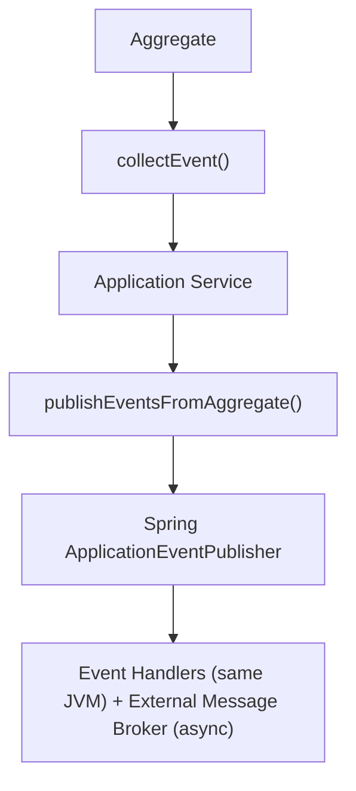

# ADR-003: Use Domain Events for Cross-Context Communication

## 狀態

**Accepted** - 2025-10-24

## 上下文

### 問題陳述

企業電子商務平台由 13 個 bounded contexts 組成，需要通訊和保持同步。我們需要一個機制能夠：

- 維持 bounded contexts 之間的鬆散耦合
- 確保跨 contexts 的最終一致性
- 支援非同步處理以實現可擴展性
- 啟用稽核軌跡和 event sourcing 功能
- 允許新 contexts 訂閱事件而無需修改現有程式碼
- 在事件串流中保留領域知識

### 業務上下文

**業務驅動因素**：

- 需要 bounded contexts 的獨立開發和部署
- 稽核軌跡和合規性要求（GDPR、PCI-DSS）
- 預期高交易量（尖峰時 1000+ 訂單/秒）
- 需要即時通知和分析
- 分散式系統中支援最終一致性

**限制條件**：

- 必須整合現有的 AWS 基礎設施
- 團隊在 event-driven architecture 方面經驗有限
- 需要維持跨 contexts 的資料一致性
- 必須支援同步和非同步操作

### 技術上下文

**目前狀態**：

- 採用 Hexagonal Architecture（ADR-002）
- PostgreSQL 作為主要資料庫（ADR-001）
- 已識別 13 個 bounded contexts
- Spring Boot 3.4.5 + Java 21

**需求**：

- Bounded contexts 之間鬆散耦合
- 最終一致性支援
- 事件重播功能
- 可擴展的事件處理
- 事件版本控制支援
- 失敗事件的 dead letter queue

## 決策驅動因素

1. **鬆散耦合**：Bounded contexts 不應直接依賴彼此
2. **可擴展性**：系統必須處理高事件量
3. **可稽核性**：所有業務事件的完整稽核軌跡
4. **靈活性**：容易新增事件消費者
5. **一致性**：跨 contexts 的最終一致性
6. **可靠性**：保證事件傳遞
7. **演進性**：支援事件 schema 演進
8. **DDD 對齊**：事件代表領域概念

## 考慮的選項

### 選項 1：Domain Events with Event Bus

**描述**：使用透過 in-process event bus（Spring ApplicationEventPublisher）發布的 domain events，並可選擇外部 messaging

**架構**：



**優點**：

- ✅ 與 DDD tactical patterns 完美對齊
- ✅ 事件是一等領域概念
- ✅ Bounded contexts 之間鬆散耦合
- ✅ 容易新增事件處理器
- ✅ 支援同步和非同步處理
- ✅ 內建 Spring Boot 支援
- ✅ 可獨立測試
- ✅ 準備好進行 event sourcing

**缺點**：

- ⚠️ 跨服務事件需要外部 message broker
- ⚠️ 需要處理事件版本控制
- ⚠️ 最終一致性的複雜性

**成本**：低 - 利用 Spring Boot 功能

**風險**：**低** - DDD 中已建立的模式

### 選項 2：Direct REST API Calls

**描述**：Bounded contexts 透過同步 REST API 呼叫通訊

**優點**：

- ✅ 實作簡單
- ✅ 立即一致性
- ✅ 容易除錯

**缺點**：

- ❌ Contexts 之間緊密耦合
- ❌ 級聯失敗
- ❌ 可擴展性差
- ❌ 無稽核軌跡
- ❌ 難以新增消費者
- ❌ 違反 bounded context 獨立性

**成本**：低初始成本，高維護成本

**風險**：**高** - 建立分散式單體

### 選項 3：Shared Database

**描述**：多個 contexts 共享相同的資料庫表

**優點**：

- ✅ 立即一致性
- ✅ 跨 contexts 的簡單查詢

**缺點**：

- ❌ 違反 bounded context 邊界
- ❌ 資料層級的緊密耦合
- ❌ 無法獨立部署 contexts
- ❌ Schema 變更影響多個 contexts
- ❌ 沒有明確的所有權
- ❌ 違反 DDD 原則

**成本**：低初始成本，非常高的維護成本

**風險**：**關鍵** - 破壞 bounded context 隔離

### 選項 4：Message Queue Only（無 Domain Events）

**描述**：直接發布到 message queue 而不使用 domain events

**優點**：

- ✅ 鬆散耦合
- ✅ 非同步處理
- ✅ 可擴展

**缺點**：

- ❌ 事件不是領域模型的一部分
- ❌ 違反 DDD 原則
- ❌ 更難測試
- ❌ 無 in-process 事件處理
- ❌ 基礎設施關注點洩漏到領域

**成本**：中等

**風險**：**中等** - 錯過 DDD 效益

## 決策結果

**選擇的選項**：**Domain Events with Event Bus**

### 理由

選擇 Domain Events 的原因如下：

1. **DDD 對齊**：事件是一等領域概念，而非基礎設施關注點
2. **鬆散耦合**：Bounded contexts 透過事件通訊，而非直接呼叫
3. **靈活性**：可以新增事件處理器而無需修改現有程式碼
4. **可稽核性**：完整的事件串流提供稽核軌跡
5. **可擴展性**：非同步事件處理支援高容量
6. **可測試性**：事件可以在沒有基礎設施的情況下獨立測試
7. **演進性**：事件版本控制支援 schema 演進
8. **Hexagonal Architecture 契合**：事件自然地透過 ports 和 adapters 流動

**實作策略**：

- Aggregates 在業務操作期間收集事件
- Application services 在成功交易後發布事件
- Spring ApplicationEventPublisher 用於 in-process 事件
- 外部 message broker（Kafka）用於跨服務事件
- 事件處理器在基礎設施層

**為何不選 REST**：直接 REST 呼叫造成緊密耦合和級聯失敗。事件提供鬆散耦合和更好的可擴展性。

**為何不選 Shared Database**：違反 bounded context 邊界並阻止獨立部署。

## 影響分析

### 利害關係人影響

| Stakeholder | Impact Level | Description | Mitigation |
|-------------|--------------|-------------|------------|
| Development Team | High | 需要學習 event-driven patterns | 培訓、範例、結對程式設計 |
| Architects | Positive | 清晰的通訊模式 | 事件目錄、文檔 |
| QA Team | Medium | 需要測試最終一致性 | 測試指南、事件重播工具 |
| Operations | Medium | 監控事件處理 | 儀表板、事件延遲告警 |
| Business | Positive | 更好的稽核軌跡 | 基於事件的報告 |

### 影響半徑

**選擇的影響半徑**：**System**

影響：

- 所有 bounded contexts（事件發布和處理）
- Application services（事件發布）
- Infrastructure 層（事件處理器）
- 測試策略（基於事件的測試）
- 監控（事件指標）

### 風險評估

| Risk | Probability | Impact | Mitigation Strategy |
|------|-------------|--------|---------------------|
| 最終一致性錯誤 | Medium | High | 全面測試、事件重播、監控 |
| 事件版本控制問題 | Medium | Medium | Schema 演進策略、事件升級轉換 |
| 事件排序問題 | Low | Medium | 使用事件時間戳、冪等處理器 |
| 事件遺失 | Low | Critical | 可靠的 message broker、dead letter queue |
| 效能下降 | Low | Medium | 非同步處理、事件批次處理 |

**整體風險等級**：**低**

## 實作計畫

### 第 1 階段：基礎（第 1-2 週）

- [x] 定義 DomainEvent 介面
- [x] 建立具有事件收集的 AggregateRoot 基底類別
- [x] 實作 DomainEventApplicationService 用於發布
- [x] 設定 Spring ApplicationEventPublisher 整合
- [x] 建立範例事件（CustomerCreated、OrderSubmitted）

### 第 2 階段：事件處理器（第 3-4 週）

- [x] 建立 AbstractDomainEventHandler 基底類別
- [x] 實作 Customer context 的事件處理器
- [x] 實作 Order context 的事件處理器
- [x] 新增冪等性檢查
- [x] 實作重試機制

### 第 3 階段：外部 Messaging（第 5-6 週）

- [ ] 整合 Kafka（ADR-005）
- [ ] 實作事件發布器 adapter
- [ ] 實作事件消費者 adapter
- [ ] 新增 dead letter queue
- [ ] 設定監控

### 第 4 階段：Event Sourcing（未來）

- [ ] 實作事件儲存
- [ ] 新增事件重播功能
- [ ] 建立基於事件的投影
- [ ] 實作 CQRS patterns

### 回滾策略

**觸發條件**：

- 最終一致性造成關鍵業務問題
- 事件處理延遲持續 > 5 分鐘
- 事件遺失 > 0.1%
- 團隊無法管理複雜性

**回滾步驟**：

1. 對關鍵路徑切換到同步 REST 呼叫
2. 僅保留事件作為稽核軌跡
3. 簡化事件處理器
4. 在解決問題後重新評估

**回滾時間**：1 週

## 監控和成功標準

### 成功指標

- ✅ 事件發布成功率 > 99.9%
- ✅ 事件處理延遲 < 1 秒（第 95 百分位）
- ✅ 零事件遺失
- ✅ 事件處理器冪等性 100%
- ✅ 新增事件處理器而無需修改現有程式碼
- ✅ 所有業務事件的完整稽核軌跡

### 監控計畫

**事件指標**：

```java
@Component
public class EventMetrics {
    private final Counter eventsPublished;
    private final Counter eventsProcessed;
    private final Counter eventsFailed;
    private final Timer eventProcessingTime;

    // 追蹤事件發布和處理
}
```

**告警**：

- 事件處理延遲 > 5 秒
- 事件失敗率 > 1%
- Dead letter queue 大小 > 100
- 事件處理器執行時間 > 1 秒

**審查時程**：

- 每日：檢查事件處理指標
- 每週：審查失敗事件
- 每月：事件 schema 演進審查
- 每季：Event-driven architecture 審查

## 後果

### 正面後果

- ✅ **鬆散耦合**：Bounded contexts 獨立
- ✅ **可擴展性**：非同步處理處理高容量
- ✅ **可稽核性**：完整的事件串流用於合規
- ✅ **靈活性**：容易新增事件消費者
- ✅ **可測試性**：事件可以獨立測試
- ✅ **演進性**：事件版本控制支援 schema 變更
- ✅ **DDD 對齊**：事件是領域概念
- ✅ **彈性**：失敗不會跨 contexts 級聯

### 負面後果

- ⚠️ **最終一致性**：並非所有操作都立即一致
- ⚠️ **複雜性**：更多需要管理的部分
- ⚠️ **除錯**：更難追蹤事件流
- ⚠️ **測試**：需要測試最終一致性情境
- ⚠️ **事件版本控制**：需要管理 schema 演進

### 技術債務

**已識別債務**：

1. 尚無事件儲存（對 MVP 可接受）
2. 手動事件版本控制（可透過 schema registry 改進）
3. 有限的事件重播功能（未來增強）

**債務償還計畫**：

- **2026 年 Q2**：實作 event sourcing 的事件儲存
- **2026 年 Q3**：新增 schema registry 用於事件版本控制
- **2026 年 Q4**：實作事件重播和 CQRS patterns

## 相關決策

- [ADR-002: Adopt Hexagonal Architecture](002-adopt-hexagonal-architecture.md) - 事件透過 ports 和 adapters 流動
- [ADR-005: Use Apache Kafka for Event Streaming](005-use-kafka-for-event-streaming.md) - 外部 message broker
- [ADR-001: Use PostgreSQL for Primary Database](001-use-postgresql-for-primary-database.md) - 事件持久化

## 備註

### 事件結構

```java
public record CustomerCreatedEvent(
    CustomerId customerId,
    CustomerName customerName,
    Email email,
    MembershipLevel membershipLevel,
    UUID eventId,
    LocalDateTime occurredOn
) implements DomainEvent {
    
    public static CustomerCreatedEvent create(
        CustomerId customerId,
        CustomerName customerName,
        Email email,
        MembershipLevel membershipLevel
    ) {
        var metadata = DomainEvent.createEventMetadata();
        return new CustomerCreatedEvent(
            customerId, customerName, email, membershipLevel,
            metadata.eventId(), metadata.occurredOn()
        );
    }
}
```

### 事件發布流程

```java
// 1. Aggregate 收集事件
public class Customer extends AggregateRoot {
    public void register() {
        // 業務邏輯
        collectEvent(CustomerCreatedEvent.create(id, name, email, level));
    }
}

// 2. Application service 發布事件
@Service
@Transactional
public class CustomerApplicationService {
    public void registerCustomer(RegisterCustomerCommand command) {
        Customer customer = new Customer(command);
        customerRepository.save(customer);
        eventService.publishEventsFromAggregate(customer);
    }
}

// 3. Event handler 處理事件
@Component
public class CustomerCreatedEventHandler extends AbstractDomainEventHandler<CustomerCreatedEvent> {
    @Override
    @TransactionalEventListener(phase = TransactionPhase.AFTER_COMMIT)
    public void handle(CustomerCreatedEvent event) {
        // 發送歡迎電子郵件
        // 建立獎勵帳戶
        // 更新分析
    }
}
```

### 事件版本控制策略

**Schema 演進模式**：

```java
// V1: 原始事件
public record CustomerCreatedEvent(
    CustomerId customerId,
    CustomerName customerName,
    Email email,
    MembershipLevel membershipLevel,
    UUID eventId,
    LocalDateTime occurredOn
) implements DomainEvent { }

// V2: 新增可選欄位
public record CustomerCreatedEvent(
    CustomerId customerId,
    CustomerName customerName,
    Email email,
    MembershipLevel membershipLevel,
    Optional<LocalDate> birthDate,  // 新欄位
    Optional<Address> address,      // 新欄位
    UUID eventId,
    LocalDateTime occurredOn
) implements DomainEvent { }
```

### 事件目錄

| Event | Publisher | Consumers | Description |
|-------|-----------|-----------|-------------|
| CustomerCreated | Customer Context | Email, Reward, Analytics | 新客戶註冊 |
| OrderSubmitted | Order Context | Inventory, Payment, Notification | 訂單已下 |
| PaymentProcessed | Payment Context | Order, Accounting | 付款完成 |
| InventoryReserved | Inventory Context | Order, Logistics | 商品已保留 |
| OrderShipped | Logistics Context | Customer, Notification | 訂單已出貨 |

---

**文檔狀態**：✅ Accepted
**上次審查**：2025-10-24
**下次審查**：2026-01-24（每季）
