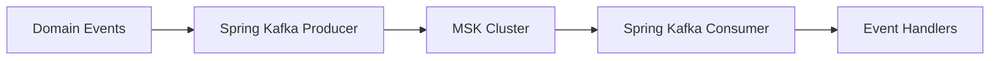

# ADR-005: Use Apache Kafka (MSK) 用於 Event Streaming

## 狀態

**Accepted** - 2025-10-24

## 上下文

### 問題陳述

The Enterprise E-Commerce Platform 需要robust event streaming platform that:

- 處理s high-throughput event streaming (10,000+ events/second)
- 提供s reliable message delivery 與 durability guarantees
- 支援s event replay 用於 debugging 和 recovery
- 啟用s real-time event processing 和 analytics
- Scales horizontally to 處理 growing event volumes
- 提供s event ordering guarantees within partitions
- 支援s multiple consumers 與 different processing speeds
- Integrates 與 domain events architecture (ADR-003)
- 啟用s event-driven microservices communication
- 提供s monitoring 和 operational visibility

### 業務上下文

**業務驅動因素**：

- 需要 real-time business event processing
- Requirement 用於 event-driven architecture 跨 bounded contexts
- 支援 用於 real-time analytics 和 reporting
- 啟用 event sourcing capabilities 用於 audit trails
- Scale to 處理 Black Friday traffic (100K+ events/second peak)
- 支援 用於 future event-driven features (recommendations, fraud detection)

**限制條件**：

- AWS 雲端基礎設施 (ADR-007)
- 預算: $3,000/month 用於 messaging infrastructure
- Team has limited Kafka experience
- 必須 integrate 與 Spring Boot applications
- 需要 託管服務 to 降低 營運開銷
- Compliance requirements 用於 event audit trails

### 技術上下文

**目前狀態**：

- Domain events implemented (ADR-003)
- Spring Boot 3.4.5 + Java 21
- Hexagonal Architecture (ADR-002)
- 13 bounded contexts requiring event communication
- Redis 用於 caching (ADR-004)
- PostgreSQL 用於 主要資料庫 (ADR-001)

**需求**：

- Event throughput: 10,000+ events/second (normal), 100,000+ events/second (peak)
- Event retention: 7 天 minimum, 30 天 用於 audit
- Message durability: No data loss
- Latency: < 100ms end-to-end (95th percentile)
- Ordering: 維持 order within partition
- Scalability: Horizontal scaling 用於 producers 和 consumers
- Monitoring: Real-time metrics 和 alerting
- Integration: Spring Boot Kafka integration

## 決策驅動因素

1. **Throughput**: 處理 high event volumes
2. **Durability**: Guarantee no message loss
3. **Scalability**: Horizontal scaling capability
4. **Ordering**: 維持 event order where needed
5. **Replay**: 支援 event replay 用於 recovery
6. **Managed Service**: 降低 營運開銷
7. **AWS Integration**: Native AWS service integration
8. **成本**： Stay within budget constraints

## 考慮的選項

### 選項 1： Amazon MSK (Managed Streaming for Apache Kafka)

**描述**： AWS managed Kafka service with full Kafka API compatibility

**架構**：



**優點**：

- ✅ Fully managed Kafka service (AWS 處理s operations)
- ✅ Full Kafka API compatibility
- ✅ High throughput (millions of messages/second)
- ✅ Durable message storage 與 replication
- ✅ Event replay capability
- ✅ Horizontal scaling (add brokers)
- ✅ AWS integration (CloudWatch, IAM, VPC)
- ✅ Multi-AZ deployment 用於 高可用性
- ✅ Automatic patching 和 upgrades
- ✅ Strong ordering guarantees within partitions
- ✅ 大型的 ecosystem 和 community

**缺點**：

- ⚠️ More 複雜的 than SQS/SNS
- ⚠️ Requires Kafka knowledge
- ⚠️ Higher cost than SQS
- ⚠️ Need to manage topics 和 partitions

**成本**：

- Development: $500/month (kafka.m5.大型的, 2 brokers)
- Production: $2,500/month (kafka.m5.x大型的, 3 brokers, Multi-AZ)
- Storage: $100/month (1TB retention)
- Total: ~$2,600/month

**風險**： **Low** - Mature technology, AWS managed

### 選項 2： Amazon SQS + SNS

**描述**： AWS managed message queue and pub/sub service

**優點**：

- ✅ Fully managed (no operations)
- ✅ 簡單use
- ✅ Cost-effective
- ✅ Automatic scaling
- ✅ AWS native integration

**缺點**：

- ❌ No event replay capability
- ❌ Limited ordering guarantees (FIFO queues have throughput limits)
- ❌ No event streaming semantics
- ❌ Not suitable 用於 event sourcing
- ❌ Limited retention (14 天 max)
- ❌ No partition-based scaling
- ❌ Higher latency than Kafka

**成本**： $800/month (estimated)

**風險**： **Medium** - Limited capabilities for event streaming

### 選項 3： Amazon Kinesis Data Streams

**描述**： AWS managed real-time data streaming service

**優點**：

- ✅ Fully managed
- ✅ Real-time streaming
- ✅ AWS native integration
- ✅ Automatic scaling (on-demand mode)
- ✅ Event replay capability

**缺點**：

- ❌ Proprietary API (not Kafka compatible)
- ❌ More expensive than MSK at scale
- ❌ Limited retention (365 天 max)
- ❌ Smaller ecosystem than Kafka
- ❌ Shard management 複雜的ity
- ❌ Less flexible than Kafka

**成本**： $3,500/month (estimated for similar throughput)

**風險**： **Medium** - Vendor lock-in, higher cost

### 選項 4： Self-Managed Kafka on EC2

**描述**： Run Kafka cluster on EC2 instances

**優點**：

- ✅ Full control over configuration
- ✅ Potentially lower cost
- ✅ Full Kafka features

**缺點**：

- ❌ High 營運開銷
- ❌ Need Kafka expertise
- ❌ Manual scaling 和 patching
- ❌ 複雜的 monitoring setup
- ❌ High maintenance burden
- ❌ Team lacks Kafka operations experience

**成本**： $1,500/month (infrastructure) + operational costs

**風險**： **High** - Operational complexity, team expertise

### 選項 5： RabbitMQ

**描述**： Open-source message broker

**優點**：

- ✅ Mature message broker
- ✅ 良好的Spring整合
- ✅ Flexible routing

**缺點**：

- ❌ Not designed 用於 event streaming
- ❌ Limited event replay
- ❌ Lower throughput than Kafka
- ❌ Not suitable 用於 event sourcing
- ❌ Need to self-manage 或 use Amazon MQ

**成本**： $1,000/month (Amazon MQ)

**風險**： **Medium** - Not optimal for event streaming

## 決策結果

**選擇的選項**： **Amazon MSK (Managed Streaming for Apache Kafka)**

### 理由

Amazon MSK被選擇的原因如下：

1. **Event Streaming Semantics**: Kafka is purpose-built 用於 event streaming 與 replay, ordering, 和 durability
2. **High Throughput**: 處理s millions of events/second, well beyond our requirements
3. **Event Replay**: Critical 用於 debugging, recovery, 和 event sourcing
4. **Managed Service**: AWS 處理s operations, patching, 和 scaling
5. **Kafka Ecosystem**: 大型的 ecosystem of tools, libraries, 和 community 支援
6. **Spring Boot Integration**: 優秀的Spring Kafka整合
7. **Cost-Effective**: Within 預算 while providing enterprise features
8. **Ordering Guarantees**: Partition-based ordering 用於 event sequences
9. **Durability**: Replication 和 persistence guarantee no data loss
10. **Scalability**: Horizontal scaling 透過 adding brokers 和 partitions

**實作策略**：

**MSK Cluster Configuration**:

```text
Production Cluster:

- Broker Type: kafka.m5.xlarge (3 brokers)
- Multi-AZ: 3 availability zones
- Storage: 1TB per broker (EBS gp3)
- Replication Factor: 3
- Min In-Sync Replicas: 2
- Retention: 7 days (configurable per topic)

```

**Topic Design**:

```text
Topics by Bounded Context:

- customer-events (partitions: 10)
- order-events (partitions: 20)
- product-events (partitions: 10)
- payment-events (partitions: 15)
- inventory-events (partitions: 10)
- notification-events (partitions: 5)

```

**Producer Configuration**:

```java
@Configuration
public class KafkaProducerConfiguration {
    
    @Bean
    public ProducerFactory<String, DomainEvent> producerFactory() {
        Map<String, Object> config = new HashMap<>();
        config.put(ProducerConfig.BOOTSTRAP_SERVERS_CONFIG, mskBootstrapServers);
        config.put(ProducerConfig.KEY_SERIALIZER_CLASS_CONFIG, StringSerializer.class);
        config.put(ProducerConfig.VALUE_SERIALIZER_CLASS_CONFIG, JsonSerializer.class);
        
        // Durability settings
        config.put(ProducerConfig.ACKS_CONFIG, "all");
        config.put(ProducerConfig.RETRIES_CONFIG, 3);
        config.put(ProducerConfig.MAX_IN_FLIGHT_REQUESTS_PER_CONNECTION, 1);
        
        // Performance settings
        config.put(ProducerConfig.COMPRESSION_TYPE_CONFIG, "snappy");
        config.put(ProducerConfig.BATCH_SIZE_CONFIG, 16384);
        config.put(ProducerConfig.LINGER_MS_CONFIG, 10);
        
        return new DefaultKafkaProducerFactory<>(config);
    }
    
    @Bean
    public KafkaTemplate<String, DomainEvent> kafkaTemplate() {
        return new KafkaTemplate<>(producerFactory());
    }
}
```

**Consumer Configuration**:

```java
@Configuration
public class KafkaConsumerConfiguration {
    
    @Bean
    public ConsumerFactory<String, DomainEvent> consumerFactory() {
        Map<String, Object> config = new HashMap<>();
        config.put(ConsumerConfig.BOOTSTRAP_SERVERS_CONFIG, mskBootstrapServers);
        config.put(ConsumerConfig.KEY_DESERIALIZER_CLASS_CONFIG, StringDeserializer.class);
        config.put(ConsumerConfig.VALUE_DESERIALIZER_CLASS_CONFIG, JsonDeserializer.class);
        
        // Consumer group settings
        config.put(ConsumerConfig.GROUP_ID_CONFIG, "order-service-group");
        config.put(ConsumerConfig.AUTO_OFFSET_RESET_CONFIG, "earliest");
        config.put(ConsumerConfig.ENABLE_AUTO_COMMIT_CONFIG, false);
        
        // Performance settings
        config.put(ConsumerConfig.MAX_POLL_RECORDS_CONFIG, 100);
        config.put(ConsumerConfig.FETCH_MIN_BYTES_CONFIG, 1024);
        
        return new DefaultKafkaConsumerFactory<>(config);
    }
    
    @Bean
    public ConcurrentKafkaListenerContainerFactory<String, DomainEvent> kafkaListenerContainerFactory() {
        ConcurrentKafkaListenerContainerFactory<String, DomainEvent> factory = 
            new ConcurrentKafkaListenerContainerFactory<>();
        factory.setConsumerFactory(consumerFactory());
        factory.setConcurrency(3);
        factory.getContainerProperties().setAckMode(AckMode.MANUAL);
        return factory;
    }
}
```

**為何不選 SQS/SNS**： Lacks event replay, streaming semantics, 和 event sourcing capabilities needed 用於 our architecture.

**為何不選 Kinesis**： More expensive at scale, proprietary API creates vendor lock-in, smaller ecosystem.

**為何不選 Self-Managed**： Team lacks Kafka operations expertise, high 營運開銷 not justified.

## 影響分析

### 利害關係人影響

| Stakeholder | Impact Level | Description | Mitigation |
|-------------|--------------|-------------|------------|
| Development Team | High | Need to learn Kafka concepts | Training, documentation, examples |
| Operations Team | Medium | Monitor Kafka metrics | CloudWatch dashboards, runbooks |
| Architects | Positive | Event-driven architecture 啟用d | Architecture guidelines |
| Business | Positive | Real-time event processing | Business metrics dashboards |
| DevOps Team | Medium | Deploy 和 manage MSK | AWS CDK automation, monitoring |

### 影響半徑

**選擇的影響半徑**： **System**

影響：

- All bounded contexts (event publishing 和 consuming)
- Event-driven architecture implementation
- Infrastructure deployment (ADR-007)
- Monitoring 和 observability (ADR-008)
- Application services (event publishing)
- Event 處理rs (event consuming)

### 風險評估

| Risk | Probability | Impact | Mitigation Strategy |
|------|-------------|--------|---------------------|
| Kafka learning curve | High | Medium | Training, examples, pair programming |
| Message ordering issues | Medium | High | Proper partition key design, testing |
| Consumer lag | Medium | High | Monitoring, auto-scaling consumers |
| Topic design mistakes | Medium | Medium | Architecture reviews, best practices |
| Cost overruns | Low | Medium | Monitor usage, optimize retention |
| Data loss | Low | Critical | Proper configuration (acks=all, replication) |

**整體風險等級**： **Low**

## 實作計畫

### 第 1 階段： MSK Cluster Setup （第 1-2 週）

- [ ] Provision MSK cluster using AWS CDK

  ```typescript
  import * as msk from 'aws-cdk-lib/aws-msk';
  
  export class MessagingStack extends Stack {
    public readonly cluster: msk.CfnCluster;
    
    constructor(scope: Construct, id: string, props: MessagingStackProps) {
      super(scope, id, props);
      
      this.cluster = new msk.CfnCluster(this, 'MSKCluster', {
        clusterName: 'ecommerce-events',
        kafkaVersion: '3.5.1',
        numberOfBrokerNodes: 3,
        brokerNodeGroupInfo: {
          instanceType: 'kafka.m5.xlarge',
          clientSubnets: props.vpc.privateSubnets.map(s => s.subnetId),
          securityGroups: [props.securityGroup.securityGroupId],
          storageInfo: {
            ebsStorageInfo: {
              volumeSize: 1000,
              provisionedThroughput: {
                enabled: true,
                volumeThroughput: 250,
              },
            },
          },
        },
        encryptionInfo: {
          encryptionInTransit: {
            clientBroker: 'TLS',
            inCluster: true,
          },
          encryptionAtRest: {
            dataVolumeKmsKeyId: props.kmsKey.keyId,
          },
        },
        enhancedMonitoring: 'PER_TOPIC_PER_PARTITION',
        loggingInfo: {
          brokerLogs: {
            cloudWatchLogs: {
              enabled: true,
              logGroup: '/aws/msk/ecommerce-events',
            },
          },
        },
      });
    }
  }
  ```

- [ ] Configure security groups
- [ ] Set up VPC endpoints
- [ ] 啟用 CloudWatch monitoring
- [ ] Create initial topics

### 第 2 階段： Spring Kafka Integration （第 2-3 週）

- [ ] Add Spring Kafka dependencies

  ```xml
  <dependency>
    <groupId>org.springframework.kafka</groupId>
    <artifactId>spring-kafka</artifactId>
  </dependency>
  <dependency>
    <groupId>org.springframework.kafka</groupId>
    <artifactId>spring-kafka-test</artifactId>
    <scope>test</scope>
  </dependency>
  ```

- [ ] Configure application properties

  ```yaml
  spring:
    kafka:
      bootstrap-servers: ${MSK_BOOTSTRAP_SERVERS}
      producer:
        key-serializer: org.apache.kafka.common.serialization.StringSerializer
        value-serializer: org.springframework.kafka.support.serializer.JsonSerializer
        acks: all
        retries: 3
        properties:
          max.in.flight.requests.per.connection: 1
          compression.type: snappy
      consumer:
        key-deserializer: org.apache.kafka.common.serialization.StringDeserializer
        value-deserializer: org.springframework.kafka.support.serializer.JsonDeserializer
        group-id: ${spring.application.name}
        auto-offset-reset: earliest
        enable-auto-commit: false
        properties:
          spring.json.trusted.packages: solid.humank.genaidemo.domain
  ```

- [ ] Create Kafka event publisher

  ```java
  @Component
  public class KafkaEventPublisher {
      
      private final KafkaTemplate<String, DomainEvent> kafkaTemplate;
      private final Logger logger = LoggerFactory.getLogger(KafkaEventPublisher.class);
      
      public KafkaEventPublisher(KafkaTemplate<String, DomainEvent> kafkaTemplate) {
          this.kafkaTemplate = kafkaTemplate;
      }
      
      public void publish(DomainEvent event) {
          String topic = determineTopicForEvent(event);
          String key = event.getAggregateId();
          
          ListenableFuture<SendResult<String, DomainEvent>> future = 
              kafkaTemplate.send(topic, key, event);
          
          future.addCallback(
              result -> logger.info("Published event {} to topic {}", 
                  event.getEventType(), topic),
              ex -> logger.error("Failed to publish event {} to topic {}", 
                  event.getEventType(), topic, ex)
          );
      }
      
      private String determineTopicForEvent(DomainEvent event) {
          String eventType = event.getEventType();
          
          // Route events to appropriate topics based on bounded context
          if (eventType.startsWith("Customer")) {
              return "customer-events";
          } else if (eventType.startsWith("Order")) {
              return "order-events";
          } else if (eventType.startsWith("Product")) {
              return "product-events";
          } else if (eventType.startsWith("Payment")) {
              return "payment-events";
          } else {
              return "general-events";
          }
      }
  }
  ```

### 第 3 階段： Event Consumers （第 3-4 週）

- [ ] Create Kafka event listeners

  ```java
  @Component
  public class OrderEventConsumer {
      
      private final Logger logger = LoggerFactory.getLogger(OrderEventConsumer.class);
      private final InventoryService inventoryService;
      private final NotificationService notificationService;
      
      @KafkaListener(
          topics = "order-events",
          groupId = "inventory-service-group",
          containerFactory = "kafkaListenerContainerFactory"
      )
      public void handleOrderEvent(
          @Payload DomainEvent event,
          @Header(KafkaHeaders.RECEIVED_PARTITION) int partition,
          @Header(KafkaHeaders.OFFSET) long offset,
          Acknowledgment acknowledgment
      ) {
          try {
              logger.info("Received event {} from partition {} at offset {}", 
                  event.getEventType(), partition, offset);
              
              processEvent(event);
              
              // Manual commit after successful processing
              acknowledgment.acknowledge();
              
          } catch (Exception e) {
              logger.error("Failed to process event {}", event.getEventType(), e);
              // Don't acknowledge - will retry
              throw e;
          }
      }
      
      private void processEvent(DomainEvent event) {
          switch (event) {
              case OrderSubmittedEvent e -> handleOrderSubmitted(e);
              case OrderCancelledEvent e -> handleOrderCancelled(e);
              default -> logger.warn("Unknown event type: {}", event.getEventType());
          }
      }
      
      private void handleOrderSubmitted(OrderSubmittedEvent event) {
          // Reserve inventory
          inventoryService.reserveItems(event.orderId(), event.items());
          
          // Send notification
          notificationService.sendOrderConfirmation(event.customerId(), event.orderId());
      }
      
      private void handleOrderCancelled(OrderCancelledEvent event) {
          // Release inventory
          inventoryService.releaseReservation(event.orderId());
      }
  }
  ```

- [ ] Implement error handling 和 retry

  ```java
  @Configuration
  public class KafkaErrorHandlingConfiguration {
      
      @Bean
      public DefaultErrorHandler errorHandler() {
          // Exponential backoff: 1s, 2s, 4s
          BackOff backOff = new ExponentialBackOff(1000, 2.0);
          
          DefaultErrorHandler errorHandler = new DefaultErrorHandler(
              (record, exception) -> {
                  // Send to dead letter topic
                  logger.error("Failed to process record after retries: {}", record, exception);
              },
              backOff
          );
          
          // Don't retry for certain exceptions
          errorHandler.addNotRetryableExceptions(
              DeserializationException.class,
              MessageConversionException.class
          );
          
          return errorHandler;
      }
  }
  ```

- [ ] Set up dead letter topics

  ```java
  @Component
  public class DeadLetterPublisher {
      
      private final KafkaTemplate<String, FailedEvent> kafkaTemplate;
      
      public void sendToDeadLetter(ConsumerRecord<String, DomainEvent> record, Exception exception) {
          FailedEvent failedEvent = new FailedEvent(
              record.topic(),
              record.partition(),
              record.offset(),
              record.key(),
              record.value(),
              exception.getMessage(),
              Instant.now()
          );
          
          kafkaTemplate.send("dead-letter-topic", failedEvent);
      }
  }
  ```

### 第 4 階段： Monitoring and Alerting （第 4-5 週）

- [ ] Configure CloudWatch metrics

  ```typescript
  // MSK metrics to monitor
  const metrics = [
    'BytesInPerSec',
    'BytesOutPerSec',
    'MessagesInPerSec',
    'FetchConsumerTotalTimeMs',
    'ProduceLocalTimeMs',
    'UnderReplicatedPartitions',
    'OfflinePartitionsCount',
  ];
  
  metrics.forEach(metricName => {
    new cloudwatch.Alarm(this, `MSK-${metricName}`, {
      metric: new cloudwatch.Metric({
        namespace: 'AWS/Kafka',
        metricName: metricName,
        dimensionsMap: {
          'Cluster Name': cluster.clusterName,
        },
      }),
      threshold: getThresholdForMetric(metricName),
      evaluationPeriods: 2,
    });
  });
  ```

- [ ] Create Grafana dashboards
  - Kafka cluster health
  - Topic throughput 和 lag
  - Consumer group lag
  - Producer performance
  - Error rates

- [ ] Set up alerts
  - Consumer lag > 10,000 messages
  - Under-replicated partitions > 0
  - Offline partitions > 0
  - High producer latency > 100ms
  - High consumer latency > 500ms

### Phase 5: Testing （第 5-6 週）

- [ ] Set up embedded Kafka 用於 tests

  ```java
  @SpringBootTest
  @EmbeddedKafka(
      partitions = 1,
      topics = {"customer-events", "order-events"},
      brokerProperties = {
          "listeners=PLAINTEXT://localhost:9092",
          "port=9092"
      }
  )
  class KafkaIntegrationTest {
      
      @Autowired
      private KafkaTemplate<String, DomainEvent> kafkaTemplate;
      
      @Autowired
      private EmbeddedKafkaBroker embeddedKafka;
      
      @Test
      void should_publish_and_consume_customer_created_event() throws Exception {
          // Given
          CustomerCreatedEvent event = CustomerCreatedEvent.create(
              CustomerId.of("CUST-001"),
              new CustomerName("John Doe"),
              new Email("john@example.com"),
              MembershipLevel.STANDARD
          );
          
          CountDownLatch latch = new CountDownLatch(1);
          AtomicReference<DomainEvent> receivedEvent = new AtomicReference<>();
          
          // Set up consumer
          Map<String, Object> consumerProps = KafkaTestUtils.consumerProps(
              "test-group", "true", embeddedKafka);
          ConsumerFactory<String, DomainEvent> cf = 
              new DefaultKafkaConsumerFactory<>(consumerProps);
          Consumer<String, DomainEvent> consumer = cf.createConsumer();
          consumer.subscribe(Collections.singletonList("customer-events"));
          
          // When
          kafkaTemplate.send("customer-events", event.getAggregateId(), event);
          
          // Then
          ConsumerRecords<String, DomainEvent> records = 
              consumer.poll(Duration.ofSeconds(10));
          
          assertThat(records.count()).isEqualTo(1);
          ConsumerRecord<String, DomainEvent> record = records.iterator().next();
          assertThat(record.value()).isInstanceOf(CustomerCreatedEvent.class);
          assertThat(record.key()).isEqualTo("CUST-001");
      }
  }
  ```

- [ ] Test event ordering

  ```java
  @Test
  void should_maintain_event_order_within_partition() {
      // Given
      String aggregateId = "ORDER-001";
      List<DomainEvent> events = List.of(
          OrderCreatedEvent.create(OrderId.of(aggregateId)),
          OrderItemAddedEvent.create(OrderId.of(aggregateId)),
          OrderSubmittedEvent.create(OrderId.of(aggregateId))
      );
      
      // When - publish all events with same key (same partition)
      events.forEach(event -> 
          kafkaTemplate.send("order-events", aggregateId, event)
      );
      
      // Then - verify order is maintained
      List<DomainEvent> receivedEvents = consumeEvents("order-events", 3);
      assertThat(receivedEvents).containsExactlyElementsOf(events);
  }
  ```

- [ ] Test error handling 和 retry
- [ ] Test dead letter queue
- [ ] Load testing 與 high event volumes

### Phase 6: Production Deployment （第 6-7 週）

- [ ] Deploy MSK cluster to production
- [ ] Create production topics 與 proper configuration

  ```bash
  # Create topics with replication and retention
  kafka-topics.sh --create \
    --bootstrap-server $MSK_BOOTSTRAP \
    --topic customer-events \
    --partitions 10 \
    --replication-factor 3 \
    --config retention.ms=604800000 \
    --config min.insync.replicas=2
  ```

- [ ] Configure monitoring 和 alerting
- [ ] Deploy event publishers
- [ ] Deploy event consumers
- [ ] Verify end-to-end event flow
- [ ] Monitor 用於 48 hours

### Phase 7: Documentation and Training （第 7-8 週）

- [ ] Create Kafka operations runbook
  - Topic management procedures
  - Consumer group management
  - Troubleshooting guide
  - Performance tuning guide

- [ ] Conduct team training
  - Kafka concepts 和 architecture
  - Producer best practices
  - Consumer best practices
  - Monitoring 和 troubleshooting

- [ ] Document event schemas
  - Create schema registry (future)
  - Document event formats
  - Version management strategy

### 回滾策略

**觸發條件**：

- Message loss > 0.01%
- Consumer lag consistently > 1 hour
- Cost exceeds $4,000/month
- Team unable to manage Kafka
- Performance issues affecting SLA

**回滾步驟**：

1. Switch to SQS/SNS 用於 critical events
2. Keep Kafka 用於 non-critical events
3. Simplify event architecture
4. 提供 additional training
5. Re-evaluate after addressing issues

**回滾時間**： 1 week for critical paths, 4 weeks for complete rollback
