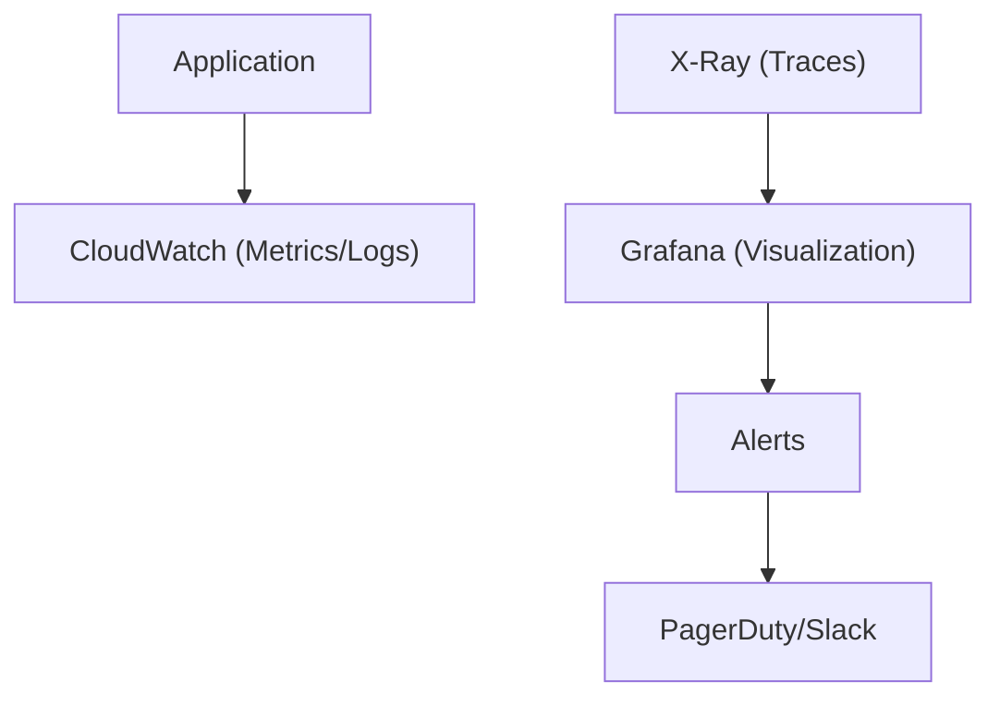

# ADR-008: Use CloudWatch + X-Ray + Grafana 用於 Observability

## 狀態

**Accepted** - 2025-10-24

## 上下文

### 問題陳述

The Enterprise E-Commerce Platform 需要comprehensive observability to:

- Monitor system health 和 performance in real-time
- Trace requests 跨 distributed services
- Detect 和 diagnose issues quickly
- 提供 business 和 technical metrics
- 支援 SLA compliance (99.9% uptime)
- 啟用 proactive alerting 和 incident response
- Visualize metrics in intuitive dashboards
- 支援 debugging 和 troubleshooting

### 業務上下文

**業務驅動因素**：

- 99.9% uptime SLA requirement
- 需要 rapid incident detection 和 response
- Regulatory compliance requiring audit trails
- Business metrics 用於 decision-making
- Cost optimization through performance monitoring
- Customer experience monitoring

**限制條件**：

- AWS 雲端基礎設施 (ADR-007)
- 預算: $2,000/month 用於 observability tools
- Team has limited observability experience
- 需要 24/7 monitoring 和 alerting
- 必須 integrate 與 existing AWS services

### 技術上下文

**目前狀態**：

- AWS 雲端基礎設施
- Spring Boot microservices
- EKS 用於 container orchestration
- PostgreSQL, Kafka, Redis
- Multiple bounded contexts
- Event-driven architecture

**需求**：

- Metrics collection (business 和 technical)
- Distributed tracing 跨 services
- Log aggregation 和 analysis
- Real-time alerting
- Custom dashboards
- Performance monitoring
- Error tracking
- Cost monitoring

## 決策驅動因素

1. **AWS Integration**: Native integration 與 AWS services
2. **Distributed Tracing**: Trace requests 跨 microservices
3. **成本**： Stay within budget constraints
4. **Ease of Use**: Intuitive dashboards 和 alerting
5. **Scalability**: 處理 high metric volumes
6. **Customization**: Create custom dashboards 和 metrics
7. **Team Skills**: Minimize learning curve
8. **Reliability**: High availability monitoring platform

## 考慮的選項

### 選項 1： CloudWatch + X-Ray + Grafana (Hybrid Approach)

**描述**： Use AWS native services for collection with Grafana for visualization

**架構**：



**優點**：

- ✅ Native AWS integration (no agents needed)
- ✅ X-Ray 提供s distributed tracing
- ✅ CloudWatch 處理s metrics 和 logs
- ✅ Grafana 提供s superior visualization
- ✅ Cost-effective (CloudWatch included, Grafana OSS free)
- ✅ Scalable 和 reliable
- ✅ Easy AWS service monitoring
- ✅ 支援s custom metrics
- ✅ Unified dashboard in Grafana

**缺點**：

- ⚠️ Need to manage Grafana instance
- ⚠️ Multiple tools to learn
- ⚠️ CloudWatch query language learning curve

**成本**：

- CloudWatch: ~$500/month (included in AWS usage)
- X-Ray: ~$300/month (traces)
- Grafana: $0 (self-hosted OSS) 或 $200/month (Grafana Cloud)
- Total: ~$800-1,000/month

**風險**： **Low** - AWS-native with proven visualization

### 選項 2： Datadog (All-in-One)

**描述**： Comprehensive observability platform

**優點**：

- ✅ All-in-one solution
- ✅ 優秀的 UI 和 dashboards
- ✅ Strong APM capabilities
- ✅ 良好的AWS整合
- ✅ Machine learning anomaly detection

**缺點**：

- ❌ Expensive ($15-31/host/month + $5/million spans)
- ❌ Vendor lock-in
- ❌ Cost scales 與 usage
- ❌ Estimated $3,000-5,000/month

**成本**： $3,000-5,000/month (exceeds budget)

**風險**： **Medium** - Cost overruns likely

### 選項 3： Prometheus + Grafana + Jaeger

**描述**： Open-source observability stack

**優點**：

- ✅ Open source 和 free
- ✅ Powerful query language (PromQL)
- ✅ 優秀的Grafana整合
- ✅ Jaeger 用於 distributed tracing
- ✅ 大型的 community

**缺點**：

- ❌ Need to manage infrastructure
- ❌ Prometheus storage limitations
- ❌ 複雜的 setup 和 maintenance
- ❌ No native AWS service metrics
- ❌ Requires exporters 用於 AWS services
- ❌ High 營運開銷

**成本**： Infrastructure costs ~$500-800/month

**風險**： **Medium** - High operational complexity

### 選項 4： New Relic

**描述**： Commercial APM and observability platform

**優點**：

- ✅ Comprehensive APM
- ✅ 良好的AWS整合
- ✅ User-friendly interface
- ✅ Strong 支援

**缺點**：

- ❌ Expensive ($99-349/host/month)
- ❌ Vendor lock-in
- ❌ Cost scales 與 data ingestion
- ❌ Estimated $2,500-4,000/month

**成本**： $2,500-4,000/month (exceeds budget)

**風險**： **Medium** - Cost concerns

### 選項 5： CloudWatch Only

**描述**： Use only AWS CloudWatch for all observability

**優點**：

- ✅ Native AWS integration
- ✅ No additional infrastructure
- ✅ Cost-effective
- ✅ Easy setup

**缺點**：

- ❌ Limited visualization capabilities
- ❌ Poor dashboard customization
- ❌ Expensive 用於 high-cardinality metrics
- ❌ Limited query capabilities
- ❌ No distributed tracing (need X-Ray separately)

**成本**： ~$800/month

**風險**： **Low** - But limited capabilities

## 決策結果

**選擇的選項**： **CloudWatch + X-Ray + Grafana (Hybrid Approach)**

### 理由

The hybrid approach被選擇的原因如下：

1. **Cost-Effective**: Stays well within $2,000/month 預算
2. **AWS Native**: CloudWatch 和 X-Ray integrate seamlessly 與 AWS services
3. **Superior Visualization**: Grafana 提供s 更好的 dashboards than CloudWatch
4. **Distributed Tracing**: X-Ray 提供s request tracing 跨 services
5. **Scalability**: All components scale 與 application growth
6. **Flexibility**: 可以 add custom metrics 和 dashboards easily
7. **Team Skills**: Leverages AWS knowledge, Grafana is intuitive
8. **Reliability**: AWS-託管服務s 用於 collection, proven Grafana 用於 visualization

**實作策略**：

**Metrics Collection**: CloudWatch

- Application metrics via Micrometer
- AWS service metrics (RDS, EKS, MSK)
- Custom business metrics
- Log aggregation

**Distributed Tracing**: X-Ray

- Request tracing 跨 services
- Service map visualization
- Performance bottleneck identification
- Error tracking

**Visualization**: Grafana

- Unified dashboards 用於 all metrics
- Custom business dashboards
- Alert management
- Team collaboration

**為何不選 Datadog/New Relic**： Cost exceeds 預算 signifi可以tly. CloudWatch + Grafana 提供s 80% of functionality at 30% of cost.

**為何不選 Prometheus Stack**： High 營運開銷 to manage Prometheus, Jaeger, 和 exporters. CloudWatch is 託管服務.

**為何不選 CloudWatch Only**： Limited visualization 和 dashboard capabilities. Grafana 提供s much 更好的 用戶體驗.

## 影響分析

### 利害關係人影響

| Stakeholder | Impact Level | Description | Mitigation |
|-------------|--------------|-------------|------------|
| Development Team | Medium | Need to instrument code 與 metrics | Training, examples, libraries |
| Operations Team | High | Primary users of monitoring tools | Training, runbooks, dashboards |
| Business Team | Positive | Access to business metrics | Custom dashboards, training |
| On-Call Engineers | High | Use 用於 incident response | Runbooks, alert configuration |
| Architects | Positive | System health visibility | Architecture dashboards |

### 影響半徑

**選擇的影響半徑**： **System**

影響：

- All microservices (instrumentation)
- Infrastructure monitoring
- Incident response procedures
- SLA tracking 和 reporting
- Performance optimization
- Cost monitoring

### 風險評估

| Risk | Probability | Impact | Mitigation Strategy |
|------|-------------|--------|---------------------|
| Grafana availability | Low | High | Run Grafana in HA mode, regular backups |
| CloudWatch costs | Medium | Medium | Set up billing alerts, optimize metric collection |
| Alert fatigue | High | Medium | Careful alert threshold tuning, escalation policies |
| Missing metrics | Medium | High | Comprehensive instrumentation checklist |
| X-Ray sampling overhead | Low | Low | Configure appropriate sampling rates |

**整體風險等級**： **Low**

## 實作計畫

### 第 1 階段： CloudWatch Setup （第 1-2 週）

- [x] Configure CloudWatch agent on EKS

  ```yaml
  # CloudWatch agent ConfigMap
  apiVersion: v1
  kind: ConfigMap
  metadata:
    name: cloudwatch-config
  data:
    cwagentconfig.json: |
      {
        "metrics": {
          "namespace": "ECommerce/Application",
          "metrics_collected": {
            "cpu": {"measurement": [{"name": "cpu_usage_idle"}]},
            "mem": {"measurement": [{"name": "mem_used_percent"}]}
          }
        }
      }
  ```

- [x] Set up log groups 用於 each service
- [x] Configure metric filters
- [x] Create initial CloudWatch dashboards

### 第 2 階段： Application Instrumentation （第 2-3 週）

- [ ] Add Micrometer dependencies

  ```xml
  <dependency>
    <groupId>io.micrometer</groupId>
    <artifactId>micrometer-registry-cloudwatch2</artifactId>
  </dependency>
  ```

- [ ] Configure CloudWatch metrics

  ```java
  @Configuration
  public class MetricsConfiguration {
      @Bean
      public CloudWatchMeterRegistry cloudWatchMeterRegistry(
          CloudWatchConfig config,
          CloudWatchAsyncClient client) {
          return new CloudWatchMeterRegistry(config, Clock.SYSTEM, client);
      }
  }
  ```

- [ ] Add custom business metrics

  ```java
  @Component
  public class OrderMetrics {
      private final Counter ordersCreated;
      private final Timer orderProcessingTime;
      
      public OrderMetrics(MeterRegistry registry) {
          this.ordersCreated = Counter.builder("orders.created")
              .tag("type", "business")
              .register(registry);
          this.orderProcessingTime = Timer.builder("orders.processing.time")
              .register(registry);
      }
  }
  ```

### 第 3 階段： X-Ray Integration （第 3-4 週）

- [ ] Add X-Ray SDK dependencies

  ```xml
  <dependency>
    <groupId>com.amazonaws</groupId>
    <artifactId>aws-xray-recorder-sdk-spring</artifactId>
  </dependency>
  ```

- [ ] Configure X-Ray daemon on EKS

  ```yaml
  apiVersion: apps/v1
  kind: DaemonSet
  metadata:
    name: xray-daemon
  spec:
    template:
      spec:
        containers:

        - name: xray-daemon

          image: amazon/aws-xray-daemon
          ports:

          - containerPort: 2000

            protocol: UDP
  ```

- [ ] Instrument application 與 X-Ray

  ```java
  @Configuration
  public class XRayConfiguration {
      @Bean
      public Filter tracingFilter() {
          return new AWSXRayServletFilter("ECommerceService");
      }
  }
  ```

- [ ] Configure sampling rules

  ```json
  {
    "version": 2,
    "rules": [
      {
        "description": "Customer API",
        "service_name": "customer-service",
        "http_method": "*",
        "url_path": "/api/v1/customers/*",
        "fixed_target": 1,
        "rate": 0.1
      }
    ],
    "default": {
      "fixed_target": 1,
      "rate": 0.05
    }
  }
  ```

### 第 4 階段： Grafana Setup （第 4-5 週）

- [ ] Deploy Grafana on EKS

  ```yaml
  apiVersion: apps/v1
  kind: Deployment
  metadata:
    name: grafana
  spec:
    replicas: 2
    template:
      spec:
        containers:

        - name: grafana

          image: grafana/grafana:latest
          ports:

          - containerPort: 3000

  ```

- [ ] Configure CloudWatch data source

  ```yaml
  apiVersion: 1
  datasources:

  - name: CloudWatch

    type: cloudwatch
    jsonData:
      authType: default
      defaultRegion: us-east-1
  ```

- [ ] Configure X-Ray data source
- [ ] Set up persistent storage 用於 dashboards

### Phase 5: Dashboard Creation （第 5-6 週）

- [ ] Create technical dashboards
  - System health dashboard
  - Application performance dashboard
  - Infrastructure dashboard
  - Database performance dashboard

- [ ] Create business dashboards
  - Order metrics dashboard
  - Customer metrics dashboard
  - Revenue dashboard
  - Conversion funnel dashboard

- [ ] Create SLA dashboard
  - Uptime tracking
  - Response time percentiles
  - Error rates
  - Availability metrics

### Phase 6: Alerting Configuration （第 6-7 週）

- [ ] Configure CloudWatch alarms

  ```typescript
  new cloudwatch.Alarm(this, 'HighErrorRate', {
    metric: new cloudwatch.Metric({
      namespace: 'ECommerce/Application',
      metricName: 'ErrorRate',
      statistic: 'Average',
    }),
    threshold: 1,
    evaluationPeriods: 2,
    comparisonOperator: cloudwatch.ComparisonOperator.GREATER_THAN_THRESHOLD,
  });
  ```

- [ ] Set up Grafana alerts
- [ ] Configure notification channels (Slack, PagerDuty)
- [ ] Create escalation policies
- [ ] Document alert runbooks

### Phase 7: Training and Documentation （第 7-8 週）

- [ ] Create monitoring runbooks
- [ ] Conduct team training
- [ ] Document dashboard usage
- [ ] Create troubleshooting guides
- [ ] Set up on-call rotation

### 回滾策略

**觸發條件**：

- Monitoring costs exceed $2,500/month
- System performance degradation > 10%
- Team unable to use tools effectively
- Critical monitoring gaps

**回滾步驟**：

1. Simplify to CloudWatch only
2. Remove Grafana infrastructure
3. Use CloudWatch native dashboards
4. 降低 X-Ray sampling rate
5. Re-evaluate after addressing issues

**回滾時間**： 1 week

## 監控和成功標準

### 成功指標

- ✅ Mean Time to Detect (MTTD) < 5 minutes
- ✅ Mean Time to Resolve (MTTR) < 30 minutes
- ✅ Alert accuracy > 95% (low false positives)
- ✅ Dashboard load time < 3 seconds
- ✅ 100% of critical services monitored
- ✅ Observability costs < $1,500/month
- ✅ Team satisfaction > 4/5

### 監控計畫

**Observability Metrics**:

- Metric collection rate
- Trace sampling rate
- Dashboard query performance
- Alert 回應時間
- Cost tracking

**審查時程**：

- Daily: Check alert status 和 incidents
- Weekly: Review dashboard usage 和 metrics
- Monthly: Cost optimization review
- Quarterly: Observability strategy review

## 後果

### 正面後果

- ✅ **Comprehensive Visibility**: Metrics, logs, 和 traces in one place
- ✅ **Cost-Effective**: Stays within 預算
- ✅ **AWS Native**: Seamless integration 與 AWS services
- ✅ **Superior Visualization**: Grafana 提供s 優秀的 dashboards
- ✅ **Distributed Tracing**: X-Ray 啟用s request flow analysis
- ✅ **Scalable**: 處理s growth 沒有 infrastructure changes
- ✅ **Flexible**: 容易add custom metrics 和 dashboards
- ✅ **Reliable**: AWS-managed collection services

### 負面後果

- ⚠️ **Multiple Tools**: Need to learn CloudWatch, X-Ray, 和 Grafana
- ⚠️ **Grafana Management**: Need to 維持 Grafana infrastructure
- ⚠️ **Query 複雜的ity**: CloudWatch query language has learning curve
- ⚠️ **Alert Tuning**: Requires ongoing effort to 降低 false positives

### 技術債務

**已識別債務**：

1. Grafana not yet in HA mode (acceptable 用於 MVP)
2. Limited custom dashboards initially (將 grow)
3. Alert thresholds need tuning (ongoing process)
4. Some services not fully instrumented (gradual rollout)

**債務償還計畫**：

- **Q1 2026**: Deploy Grafana in HA mode
- **Q2 2026**: Complete instrumentation of all services
- **Q3 2026**: Implement advanced alerting 與 ML
- **Q4 2026**: Add business intelligence dashboards

## 相關決策

- [ADR-007: Use AWS CDK 用於 Infrastructure](007-use-aws-cdk-for-infrastructure.md) - Monitoring infrastructure provisioning

## 備註

### Key Metrics to Monitor

**Technical Metrics**:

- Response time (p50, p95, p99)
- Error rate (4xx, 5xx)
- Throughput (requests/second)
- CPU 和 memory usage
- Database query performance
- Cache hit rates
- Queue depths

**Business Metrics**:

- Orders per minute
- Revenue per hour
- Customer registrations
- Conversion rates
- Cart abandonment rate
- Average order value
- Customer lifetime value

### Sample Grafana Dashboard

```json
{
  "dashboard": {
    "title": "E-Commerce Platform Overview",
    "panels": [
      {
        "title": "Request Rate",
        "targets": [
          {
            "expr": "sum(rate(http_requests_total[5m]))",
            "datasource": "CloudWatch"
          }
        ]
      },
      {
        "title": "Error Rate",
        "targets": [
          {
            "expr": "sum(rate(http_requests_total{status=~\"5..\"}[5m]))",
            "datasource": "CloudWatch"
          }
        ]
      },
      {
        "title": "Response Time (p95)",
        "targets": [
          {
            "expr": "histogram_quantile(0.95, rate(http_request_duration_seconds_bucket[5m]))",
            "datasource": "CloudWatch"
          }
        ]
      }
    ]
  }
}
```

### Alert Configuration Example

```yaml
# Grafana alert rules
apiVersion: 1
groups:

  - name: ecommerce-alerts

    interval: 1m
    rules:

      - alert: HighErrorRate

        expr: rate(http_requests_total{status=~"5.."}[5m]) > 0.01
        for: 5m
        labels:
          severity: critical
        annotations:
          summary: "High error rate detected"
          description: "Error rate is {{ $value }} errors/sec"
          
      - alert: HighResponseTime

        expr: histogram_quantile(0.95, rate(http_request_duration_seconds_bucket[5m])) > 2
        for: 5m
        labels:
          severity: warning
        annotations:
          summary: "High response time detected"
          description: "95th percentile is {{ $value }} seconds"
```

### X-Ray Service Map

X-Ray automatically generates service maps showing:

- Service dependencies
- Request flow
- Latency at each hop
- Error rates per service
- Bottleneck identification

### Cost Optimization Tips

1. **Optimize Metric Collection**:
   - Use metric filters instead of custom metrics where possible
   - Aggregate metrics before sending to CloudWatch
   - Use appropriate metric resolution (1-minute vs 5-minute)

2. **X-Ray Sampling**:
   - Use intelligent sampling (1 request/second + 5% of additional)
   - Increase sampling 用於 error traces
   - 降低 sampling 用於 health checks

3. **Log Management**:
   - Set appropriate log retention periods
   - Use log filtering to 降低 volume
   - Archive old logs to S3

4. **Grafana Optimization**:
   - Use query caching
   - Optimize dashboard refresh rates
   - Use variables 用於 efficient queries

---

**文檔狀態**： ✅ Accepted  
**上次審查**： 2025-10-24  
**下次審查**： 2026-01-24 （每季）
