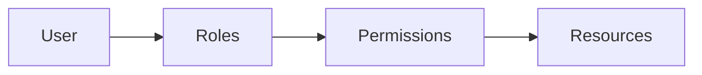

# ADR-015: Role-Based Access Control (RBAC) Implementation

## 狀態

**Accepted** - 2025-10-25

## 上下文

### 問題陳述

The Enterprise E-Commerce Platform 需要flexible, scalable authorization system that 可以:

- Control access to resources based on user roles
- 支援 fine-grained permissions 用於 different operations
- 啟用 hierarchical role structures
- Allow dynamic permission assignment 沒有 code changes
- 支援 multi-tenant scenarios (customers, sellers, admins)
- Integrate seamlessly 與 JWT authentication
- 提供 audit trails 用於 authorization decisions

### 業務上下文

**業務驅動因素**：

- Multiple user types 與 different access levels (customers, sellers, admins, 支援)
- 需要 granular control over sensitive operations (refunds, price changes)
- Regulatory compliance (data access controls, audit trails)
- Business flexibility (add new roles 沒有 code deployment)
- 預期的 growth from 10K to 1M+ users

**限制條件**：

- 必須 integrate 與 existing JWT authentication (ADR-014)
- Performance: Authorization check < 5ms
- 必須 支援 role hierarchy (admin inherits all permissions)
- 預算: No additional licensing costs

### 技術上下文

**目前狀態**：

- Spring Boot 3.4.5 與 Spring Security
- JWT-based authentication implemented (ADR-014)
- Microservices architecture
- PostgreSQL database

**需求**：

- Role-based access control 與 permissions
- 支援 用於 role hierarchy
- Dynamic role 和 permission management
- Method-level security annotations
- URL-based access control
- Audit logging 用於 authorization decisions

## 決策驅動因素

1. **Flexibility**: 容易add new roles 和 permissions
2. **Performance**: Fast authorization checks (< 5ms)
3. **Granularity**: 支援 both coarse 和 fine-grained permissions
4. **維持ability**: Centralized permission management
5. **Security**: Principle of least privilege
6. **Scalability**: 支援 millions of users
7. **Standards**: Use industry-standard patterns
8. **成本**： No licensing fees

## 考慮的選項

### 選項 1： RBAC with Permission-Based Model

**描述**： Roles contain permissions, permissions grant access to resources

**優點**：

- ✅ Flexible 和 granular control
- ✅ 容易understand 和 維持
- ✅ 支援s role hierarchy
- ✅ Dynamic permission assignment
- ✅ 優秀的Spring Security整合
- ✅ Scales well (permissions in JWT)
- ✅ Industry standard pattern
- ✅ No additional costs

**缺點**：

- ⚠️ Requires careful permission design
- ⚠️ JWT token size increases 與 permissions
- ⚠️ Permission changes 需要token refresh

**成本**： $0 (built into Spring Security)

**風險**： **Low** - Proven pattern

### 選項 2： Attribute-Based Access Control (ABAC)

**描述**： Access based on attributes (user, resource, environment)

**優點**：

- ✅ Very flexible 和 dynamic
- ✅ Context-aware decisions
- ✅ Fine-grained control

**缺點**：

- ❌ 複雜的 to implement 和 維持
- ❌ Performance overhead (policy evaluation)
- ❌ 更難understand 和 debug
- ❌ Requires policy engine
- ❌ Overkill 用於 our requirements

**成本**： $2,000/month (policy engine like OPA)

**風險**： **High** - Complexity, performance

### 選項 3： Simple Role-Only Model

**描述**： Access control based only on roles, no separate permissions

**優點**：

- ✅ Very 簡單的 to implement
- ✅ Fast performance
- ✅ 容易understand

**缺點**：

- ❌ Not flexible enough
- ❌ Role explosion (need many roles)
- ❌ Hard to 維持
- ❌ 可以not 處理 fine-grained permissions

**成本**： $0

**風險**： **Medium** - Inflexibility

### 選項 4： External Authorization Service (Authz)

**描述**： Delegate authorization to external service

**優點**：

- ✅ Centralized authorization
- ✅ Advanced features

**缺點**：

- ❌ Network latency on every request
- ❌ Additional infrastructure
- ❌ Single point of failure
- ❌ Licensing costs

**成本**： $1,000/month

**風險**： **Medium** - Dependency, latency

## 決策結果

**選擇的選項**： **RBAC with Permission-Based Model**

### 理由

RBAC 與 permissions被選擇的原因如下：

1. **Flexibility**: Roles 可以 be composed of permissions, easy to add new permissions
2. **Performance**: Permissions included in JWT, no database lookup needed
3. **Granularity**: 支援s both coarse (roles) 和 fine-grained (permissions) control
4. **Standards-Based**: Industry-standard pattern, well-understood
5. **Spring Security**: 優秀的 integration 與 @PreAuthorize, @Secured
6. **Scalability**: Permissions cached in JWT, scales horizontally
7. **Cost-Effective**: No additional licensing 或 infrastructure
8. **維持ability**: Clear separation of roles 和 permissions

**Authorization Model**:



**Role Hierarchy**:

```text
SUPER_ADMIN (all permissions)
  ├── ADMIN (manage users, orders, products)
  ├── SELLER (manage own products, orders)
  └── CUSTOMER (create orders, manage profile)
      └── GUEST (browse products only)
```

## 影響分析

### 利害關係人影響

| Stakeholder | Impact Level | Description | Mitigation |
|-------------|--------------|-------------|------------|
| Development Team | Medium | Need to implement RBAC annotations | Training, code examples, documentation |
| Security Team | Positive | Fine-grained access control | Regular permission audits |
| Operations Team | Low | Monitor authorization failures | Dashboards, alerts |
| End Users | None | Transparent to users | N/A |
| Business | Positive | Flexible role management | Admin UI 用於 role management |

### 影響半徑

**選擇的影響半徑**： **System**

影響：

- All API endpoints (authorization required)
- All microservices (permission checks)
- Database schema (roles 和 permissions tables)
- JWT tokens (include permissions)
- Admin UI (role management)

### 風險評估

| Risk | Probability | Impact | Mitigation Strategy |
|------|-------------|--------|---------------------|
| Permission explosion | Medium | Medium | Regular permission review, consolidation |
| JWT token size | Medium | Low | Limit permissions per role, use permission groups |
| Permission changes delay | Medium | Low | Short token expiration (15 min), force refresh 用於 critical changes |
| Misconfigured permissions | Low | High | Automated tests, permission audits, principle of least privilege |
| Performance degradation | Low | Medium | Cache permission checks, optimize queries |

**整體風險等級**： **Low**

## 實作計畫

### 第 1 階段： Database Schema and Core Model （第 1 週）

- [x] Create `roles` table (id, name, description, hierarchy_level)
- [x] Create `permissions` table (id, name, resource, action, description)
- [x] Create `role_permissions` junction table
- [x] Create `user_roles` junction table
- [x] Implement Role 和 Permission entities
- [x] Implement RoleRepository 和 PermissionRepository
- [x] Seed initial roles 和 permissions

### 第 2 階段： Spring Security Integration （第 2 週）

- [x] Implement custom UserDetailsService 與 roles/permissions
- [x] Include permissions in JWT claims
- [x] Implement permission-based authorization
- [x] Add @PreAuthorize annotations to endpoints
- [x] Implement custom PermissionEvaluator
- [x] Add method-level security

### 第 3 階段： Role Management API （第 3 週）

- [x] Implement Role CRUD endpoints (admin only)
- [x] Implement Permission CRUD endpoints (admin only)
- [x] Implement assign/revoke role to user
- [x] Implement assign/revoke permission to role
- [x] Add role hierarchy management
- [x] Add audit logging 用於 role changes

### 第 4 階段： Testing and Documentation （第 4 週）

- [x] Unit tests 用於 authorization logic
- [x] Integration tests 用於 RBAC
- [x] Security tests (unauthorized access attempts)
- [x] Performance tests (authorization overhead)
- [x] Documentation 和 examples
- [x] Admin UI 用於 role management

### 回滾策略

**觸發條件**：

- Authorization failures > 5%
- Performance degradation > 10ms per request
- Security vulnerabilities discovered
- Data corruption in roles/permissions

**回滾步驟**：

1. Revert to 簡單的 role-only authorization
2. Investigate 和 fix RBAC implementation
3. Re-deploy 與 fixes
4. Gradually re-啟用 permission-based authorization

**回滾時間**： < 1 hour

## 監控和成功標準

### 成功指標

- ✅ Authorization check latency < 5ms (95th percentile)
- ✅ Zero unauthorized access incidents
- ✅ Authorization failure rate < 0.1% (excluding legitimate denials)
- ✅ Role management operations < 100ms
- ✅ Permission audit trail 100% complete

### 監控計畫

**CloudWatch Metrics**:

- `authz.check.time` (histogram)
- `authz.denied` (count, 透過 permission)
- `authz.granted` (count, 透過 permission)
- `authz.error` (count)
- `role.assigned` (count)
- `role.revoked` (count)

**告警**：

- Authorization check latency > 10ms 用於 5 minutes
- Authorization error rate > 1% 用於 5 minutes
- Suspicious authorization patterns (privilege escalation attempts)
- Role changes outside business hours

**Security Monitoring**:

- Failed authorization attempts per user
- Permission usage patterns
- Role assignment changes
- Privilege escalation attempts

**審查時程**：

- Daily: Check authorization metrics
- Weekly: Review denied access logs
- Monthly: Permission audit 和 cleanup
- Quarterly: Role hierarchy review

## 後果

### 正面後果

- ✅ **Flexible Access Control**: 容易add new roles 和 permissions
- ✅ **Fine-Grained Security**: Control access at resource 和 action level
- ✅ **Performance**: Fast authorization (< 5ms)
- ✅ **Scalability**: Permissions in JWT, no database lookup
- ✅ **維持ability**: Clear separation of roles 和 permissions
- ✅ **Audit Trail**: Complete history of authorization decisions
- ✅ **Standards-Based**: Industry-standard RBAC pattern
- ✅ **Cost-Effective**: No additional licensing

### 負面後果

- ⚠️ **JWT Token Size**: Permissions increase token size (mitigated 透過 permission groups)
- ⚠️ **Permission Management**: Requires careful design 和 maintenance
- ⚠️ **Permission Changes**: Require token refresh (15-min delay)
- ⚠️ **複雜的ity**: More 複雜的 than 簡單的 role-only model

### 技術債務

**已識別債務**：

1. No permission groups implemented (acceptable initially)
2. Manual permission audit process (acceptable 用於 now)
3. No dynamic permission loading (acceptable 與 short token expiration)

**債務償還計畫**：

- **Q2 2026**: Implement permission groups to 降低 JWT size
- **Q3 2026**: Automate permission audit 和 cleanup
- **Q4 2026**: Implement dynamic permission loading 用於 long-lived sessions

## 相關決策

- [ADR-014: JWT-Based Authentication Strategy](014-jwt-based-authentication-strategy.md) - Authentication integration
- [ADR-054: Data Loss Prevention (DLP) Strategy](054-data-loss-prevention-strategy.md) - Access control integration
- [ADR-009: RESTful API Design 與 OpenAPI 3.0](009-restful-api-design-with-openapi.md) - API authorization

## 備註

### Permission Naming Convention

Format: `{resource}:{action}:{scope}`

Examples:

- `order:create:any` - Create any order
- `order:read:own` - Read own orders only
- `order:update:any` - Update any order
- `order:delete:own` - Delete own orders only
- `product:create:own` - Create own products (sellers)
- `user:manage:any` - Manage any user (admins)

### Role Definitions

```yaml
roles:
  SUPER_ADMIN:
    description: "System administrator with all permissions"
    permissions: ["*:*:*"]
    hierarchy_level: 100
    
  ADMIN:
    description: "Platform administrator"
    permissions:

      - "user:*:any"
      - "order:*:any"
      - "product:*:any"
      - "report:read:any"

    hierarchy_level: 90
    
  SELLER:
    description: "Product seller"
    permissions:

      - "product:create:own"
      - "product:update:own"
      - "product:read:any"
      - "order:read:own"
      - "order:update:own"

    hierarchy_level: 50
    
  CUSTOMER:
    description: "Regular customer"
    permissions:

      - "order:create:own"
      - "order:read:own"
      - "order:cancel:own"
      - "profile:update:own"
      - "product:read:any"

    hierarchy_level: 10
    
  GUEST:
    description: "Unauthenticated user"
    permissions:

      - "product:read:any"

    hierarchy_level: 0
```

### Spring Security Configuration

```java
@Configuration
@EnableMethodSecurity(prePostEnabled = true)
public class SecurityConfiguration {
    
    @Bean
    public PermissionEvaluator permissionEvaluator() {
        return new CustomPermissionEvaluator();
    }
}

// Usage in controllers
@RestController
@RequestMapping("/api/v1/orders")
public class OrderController {
    
    @PostMapping
    @PreAuthorize("hasPermission(null, 'order:create:own')")
    public ResponseEntity<Order> createOrder(@RequestBody CreateOrderRequest request) {
        // Implementation
    }
    
    @GetMapping("/{id}")
    @PreAuthorize("hasPermission(#id, 'Order', 'read')")
    public ResponseEntity<Order> getOrder(@PathVariable String id) {
        // Implementation
    }
    
    @PutMapping("/{id}")
    @PreAuthorize("hasPermission(#id, 'Order', 'update')")
    public ResponseEntity<Order> updateOrder(@PathVariable String id, @RequestBody UpdateOrderRequest request) {
        // Implementation
    }
}
```

### Database Schema

```sql
CREATE TABLE roles (
    id VARCHAR(50) PRIMARY KEY,
    name VARCHAR(100) NOT NULL UNIQUE,
    description TEXT,
    hierarchy_level INT NOT NULL DEFAULT 0,
    created_at TIMESTAMP NOT NULL DEFAULT CURRENT_TIMESTAMP,
    updated_at TIMESTAMP NOT NULL DEFAULT CURRENT_TIMESTAMP
);

CREATE TABLE permissions (
    id VARCHAR(50) PRIMARY KEY,
    name VARCHAR(200) NOT NULL UNIQUE,
    resource VARCHAR(100) NOT NULL,
    action VARCHAR(50) NOT NULL,
    scope VARCHAR(50) NOT NULL,
    description TEXT,
    created_at TIMESTAMP NOT NULL DEFAULT CURRENT_TIMESTAMP
);

CREATE TABLE role_permissions (
    role_id VARCHAR(50) NOT NULL,
    permission_id VARCHAR(50) NOT NULL,
    PRIMARY KEY (role_id, permission_id),
    FOREIGN KEY (role_id) REFERENCES roles(id) ON DELETE CASCADE,
    FOREIGN KEY (permission_id) REFERENCES permissions(id) ON DELETE CASCADE
);

CREATE TABLE user_roles (
    user_id VARCHAR(50) NOT NULL,
    role_id VARCHAR(50) NOT NULL,
    assigned_at TIMESTAMP NOT NULL DEFAULT CURRENT_TIMESTAMP,
    assigned_by VARCHAR(50),
    PRIMARY KEY (user_id, role_id),
    FOREIGN KEY (role_id) REFERENCES roles(id) ON DELETE CASCADE
);

CREATE INDEX idx_user_roles_user_id ON user_roles(user_id);
CREATE INDEX idx_role_permissions_role_id ON role_permissions(role_id);
```

---

**文檔狀態**： ✅ Accepted  
**上次審查**： 2025-10-25  
**下次審查**： 2026-01-25 （每季）
