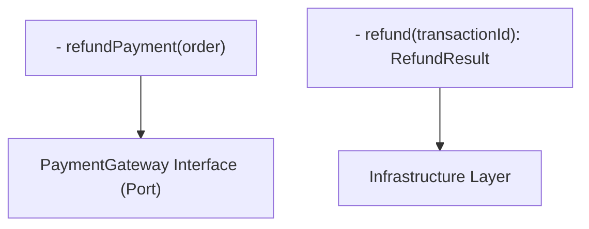

# ADR-036: Third-Party Integration Pattern

## 狀態

**Status**: Accepted

**Date**: 2025-10-25

**Decision Makers**: Architecture Team, Backend Team, Security Team

## 上下文

### 問題陳述

The Enterprise E-Commerce Platform needs to integrate 與 multiple third-party services 用於 critical business functions:

- **Payment Gateways**: Stripe, PayPal 用於 payment processing
- **Logistics 提供rs**: FedEx, UPS, DHL 用於 shipping 和 tracking
- **Email Services**: SendGrid, AWS SES 用於 transactional emails
- **SMS Services**: Twilio 用於 SMS notifications
- **Analytics**: Google Analytics, Mixpanel 用於 user behavior tracking

We 需要to decide on an integration pattern：

- Isolates third-party dependencies from core business logic
- 處理s third-party service failures gracefully
- 支援s switching between 提供rs 沒有 major code changes
- Ensures security 和 data protection
- 提供s monitoring 和 observability

This decision impacts:

- System reliability 和 fault tolerance
- Code 維持ability 和 testability
- Vendor lock-in 和 flexibility
- Security 和 compliance
- Development 複雜的ity

### 業務上下文

**業務驅動因素**：

- Critical business functions depend on third-party services
- Need flexibility to switch 提供rs (cost, features, reliability)
- Minimize impact of third-party service outages
- 支援 multiple payment gateways 用於 different markets
- Comply 與 PCI-DSS 用於 payment processing
- 維持 高可用性 despite third-party failures

**Business Constraints**:

- Payment processing is critical (可以not fail)
- Email delivery is important 但 not critical
- Shipping integration required 用於 order fulfillment
- Third-party service costs 必須 be optimized
- Compliance requirements (PCI-DSS, GDPR)
- SLA requirements: 99.9% availability

**Business Requirements**:

- 支援 multiple payment gateways (Stripe, PayPal)
- 支援 multiple logistics 提供rs (FedEx, UPS, DHL)
- Graceful degradation when third-party services fail
- Ability to switch 提供rs 沒有 downtime
- Comprehensive logging 和 monitoring
- Secure handling of sensitive data (credit cards, personal info)

### 技術上下文

**Current Architecture**:

- Backend: Spring Boot microservices 與 Hexagonal Architecture (ADR-002)
- Event System: Domain Events via Kafka (ADR-003, ADR-005)
- Communication: REST 用於 sync, Kafka 用於 async (ADR-031)
- Deployment: AWS EKS (ADR-018)
- Observability: CloudWatch + X-Ray + Grafana (ADR-008)

**Technical Constraints**:

- 必須 integrate 與 Hexagonal Architecture (ports 和 adapters)
- 必須 處理 third-party API rate limits
- 必須 處理 third-party service timeouts 和 failures
- 必須 支援 API versioning (third-party APIs evolve)
- 必須 secure sensitive data (PCI-DSS compliance)
- 必須 提供 comprehensive error handling

**Dependencies**:

- ADR-002: Hexagonal Architecture (adapter pattern 用於 integrations)
- ADR-003: Domain Events (event-driven integration)
- ADR-005: Apache Kafka (async communication)
- ADR-031: Inter-Service Communication (communication patterns)

## 決策驅動因素

- **Isolation**: Isolate third-party dependencies from core business logic
- **Flexibility**: 容易switch between 提供rs
- **Reliability**: Graceful handling of third-party failures
- **Security**: Secure handling of sensitive data
- **Testability**: 容易test 沒有 calling real third-party APIs
- **Observability**: Comprehensive monitoring 和 logging
- **維持ability**: Clean, 維持able integration code

## 考慮的選項

### 選項 1： Adapter Pattern with Anti-Corruption Layer

**描述**：
Implement third-party integrations as adapters in the infrastructure layer, 與 an anti-corruption layer to translate between domain models 和 third-party APIs.

**Pros** ✅:

- **Clean Architecture**: Aligns 與 Hexagonal Architecture (ADR-002)
- **Isolation**: Core business logic isolated from third-party APIs
- **Flexibility**: 容易switch 提供rs 透過 implementing new adapter
- **Testability**: 容易mock adapters 用於 testing
- **Domain Protection**: Anti-corruption layer protects domain model
- **Multiple 提供rs**: 支援 multiple 提供rs simultaneously
- **Gradual Migration**: 可以 migrate from one 提供r to another gradually

**Cons** ❌:

- **Boilerplate Code**: More code to write (interfaces, adapters, translators)
- **複雜的ity**: Additional abstraction layer
- **Performance**: Translation overhead (minimal)
- **Learning Curve**: Team needs to understand adapter pattern

**成本**：

- **Implementation Cost**: 4 person-weeks (implement adapters 用於 all integrations)
- **Maintenance Cost**: 1 person-day/month
- **Total Cost of Ownership (3 年)**: ~$30,000

**風險**： Low

**Risk Description**: Proven pattern 與 extensive production usage

**Effort**: Medium

**Effort Description**: Moderate implementation effort, clear pattern to follow

### 選項 2： Direct Integration with Wrapper Classes

**描述**：
Directly integrate 與 third-party SDKs using thin wrapper classes 用於 error handling 和 logging.

**Pros** ✅:

- **簡單的**: Minimal abstraction, straightforward implementation
- **Fast Development**: Quick to implement
- **Less Code**: Fewer classes 和 interfaces
- **Direct Access**: Full access to third-party SDK features
- **Performance**: No translation overhead

**Cons** ❌:

- **Tight Coupling**: Business logic coupled to third-party APIs
- **Hard to Switch**: 難以switch 提供rs
- **Hard to Test**: 難以test 沒有 calling real APIs
- **Domain Pollution**: Third-party models leak into domain layer
- **Vendor Lock-in**: Tightly coupled to specific 提供rs
- **Maintenance**: Changes in third-party APIs affect business logic

**成本**：

- **Implementation Cost**: 2 person-weeks
- **Maintenance Cost**: 2 person-days/month (higher due to coupling)
- **Total Cost of Ownership (3 年)**: ~$40,000 (higher maintenance)

**風險**： High

**Risk Description**: Tight coupling leads to maintenance issues

**Effort**: Low

**Effort Description**: Quick to implement initially

### 選項 3： Integration Service Layer (Separate Microservice)

**描述**：
Create separate integration microservices 用於 each third-party service (Payment Service, Email Service, Shipping Service).

**Pros** ✅:

- **Complete Isolation**: Third-party integrations completely isolated
- **Independent Deployment**: 可以 deploy integration services independently
- **Technology Flexibility**: 可以 use different languages/frameworks
- **Team Ownership**: Dedicated teams 用於 integration services
- **Scalability**: Scale integration services independently

**Cons** ❌:

- **Operational Overhead**: More services to deploy 和 monitor
- **Network Latency**: Additional network hops
- **複雜的ity**: Distributed system 複雜的ity
- **Debugging**: 更難debug 跨 services
- **成本**： Higher infrastructure costs
- **Overkill**: Too 複雜的 用於 current scale

**成本**：

- **Implementation Cost**: 8 person-weeks (create separate services)
- **Infrastructure Cost**: $1,000/month (additional EKS nodes, databases)
- **Maintenance Cost**: 2 person-days/month
- **Total Cost of Ownership (3 年)**: ~$80,000

**風險**： Medium

**Risk Description**: Increased operational 複雜的ity

**Effort**: High

**Effort Description**: Signifi可以t implementation 和 operational effort

## 決策結果

**選擇的選項**： Option 1 - Adapter Pattern with Anti-Corruption Layer

**Rationale**:
We chose the Adapter Pattern 與 Anti-Corruption Layer as our third-party integration strategy. This decision prioritizes clean architecture, flexibility, 和 維持ability:

1. **Hexagonal Architecture Alignment**: Adapter pattern is core to Hexagonal Architecture (ADR-002). Third-party integrations implemented as adapters in infrastructure layer, keeping domain layer pure.

2. **Domain Protection**: Anti-corruption layer translates between domain models 和 third-party APIs. Domain model remains clean 和 independent of third-party data structures.

3. **提供r Flexibility**: 容易switch 提供rs 透過 implementing new adapter. 支援 multiple 提供rs simultaneously (e.g., Stripe 和 PayPal 用於 payments).

4. **Testability**: 容易test business logic 與 mock adapters. No need to call real third-party APIs in tests. 可以 test error scenarios easily.

5. **Fault Isolation**: Third-party failures isolated to adapter layer. Business logic continues working 與 fallback strategies 或 graceful degradation.

6. **Gradual Migration**: 可以 migrate from one 提供r to another gradually. Run both 提供rs in parallel 期間 migration, route traffic based on feature flags.

7. **Proven Pattern**: Adapter pattern is well-established 和 widely used. Clear separation of concerns, easy to understand 和 維持.

8. **Cost-Effective**: Moderate implementation cost 與 low maintenance cost. Long-term benefits outweigh initial investment.

**Integration Architecture**:

## 影響分析

### 利害關係人影響

| Stakeholder | Impact Level | Description | Mitigation Strategy |
|-------------|--------------|-------------|-------------------|
| Backend Team | High | Need to implement adapters 用於 all integrations | Adapter templates, code examples, training |
| Security Team | Medium | Need to review adapter security | Security review checklist, PCI-DSS compliance |
| DevOps Team | Medium | Need to monitor third-party integrations | Monitoring dashboards, alerting |
| QA Team | Medium | Need to test 與 mock adapters | Mock adapter implementations, testing guidelines |
| Business Team | Low | Transparent change, 改善d reliability | Communication about benefits |

### Impact Radius Assessment

**選擇的影響半徑**： System

**Impact Description**:

- **System**: Integration pattern affects all third-party integrations
  - All third-party integrations implemented as adapters
  - All adapters follow consistent pattern
  - All adapters include error handling 和 retry logic
  - All adapters monitored 和 logged

### Affected Components

- **Payment Service**: Stripe 和 PayPal adapters
- **Email Service**: SendGrid 和 AWS SES adapters
- **Shipping Service**: FedEx, UPS, DHL adapters
- **SMS Service**: Twilio adapter
- **Analytics Service**: Google Analytics, Mixpanel adapters
- **Domain Services**: Use adapter interfaces (ports)
- **Testing Framework**: Mock adapters 用於 testing

### 風險評估

| Risk | Probability | Impact | Mitigation Strategy | Owner |
|------|-------------|--------|-------------------|-------|
| Adapter implementation errors | Medium | Medium | Code reviews, testing | Backend Team |
| Third-party API changes | Medium | Medium | API versioning, monitoring | Backend Team |
| Performance overhead | Low | Low | Performance testing, optimization | Backend Team |
| Security vulnerabilities | Low | High | Security reviews, PCI-DSS compliance | Security Team |
| 提供r switching 複雜的ity | Low | Medium | Comprehensive testing, gradual migration | Backend Team |

**整體風險等級**： Low

**Risk Mitigation Plan**:

- Comprehensive code reviews 用於 all adapters
- Extensive testing 與 mock 和 real adapters
- Security reviews 用於 sensitive data handling
- Performance testing to validate overhead is minimal
- Monitoring 和 alerting 用於 third-party failures
- Documentation 和 training 用於 team

## 實作計畫

### 第 1 階段： Adapter Framework (Timeline: Week 1)

**Objectives**:

- Define adapter interfaces (ports)
- Create adapter base classes
- Implement error handling framework

**Tasks**:

- [ ] Define PaymentGateway interface (port)
- [ ] Define EmailService interface (port)
- [ ] Define Shipping提供r interface (port)
- [ ] Create AbstractPaymentAdapter base class
- [ ] Create AbstractEmailAdapter base class
- [ ] Create AbstractShippingAdapter base class
- [ ] Implement retry logic 與 exponential backoff
- [ ] Implement circuit breaker 用於 third-party calls
- [ ] Create adapter exception hierarchy
- [ ] Document adapter pattern guidelines

**Deliverables**:

- Adapter interfaces 和 base classes
- Error handling framework
- Adapter pattern guidelines

**Success Criteria**:

- Clear adapter interfaces defined
- Reusable base classes 與 error handling
- Documentation complete

### 第 2 階段： Payment Gateway Adapters (Timeline: Week 1-2)

**Objectives**:

- Implement Stripe adapter
- Implement PayPal adapter
- Ensure PCI-DSS compliance

**Tasks**:

- [ ] Implement StripePaymentAdapter
  - charge() method 與 Stripe API integration
  - refund() method 與 Stripe API integration
  - Anti-corruption layer: Domain ↔ Stripe models
  - Error handling 和 retry logic
  - Idempotency key handling
- [ ] Implement PayPalPaymentAdapter
  - charge() method 與 PayPal API integration
  - refund() method 與 PayPal API integration
  - Anti-corruption layer: Domain ↔ PayPal models
  - Error handling 和 retry logic
- [ ] Implement payment adapter factory (select adapter based on config)
- [ ] Security review 用於 PCI-DSS compliance
- [ ] Create mock payment adapter 用於 testing
- [ ] Integration tests 與 Stripe/PayPal sandbox

**Deliverables**:

- Stripe 和 PayPal adapters
- Payment adapter factory
- Mock adapter 用於 testing
- Security review report

**Success Criteria**:

- Payment processing working 與 both Stripe 和 PayPal
- PCI-DSS compliance validated
- Integration tests passing

### 第 3 階段： Email and Shipping Adapters (Timeline: Week 2-3)

**Objectives**:

- Implement email service adapters
- Implement shipping 提供r adapters
- Test all integrations

**Tasks**:

- [ ] Implement SendGridEmailAdapter
- [ ] Implement AwsSesEmailAdapter
- [ ] Implement email adapter factory
- [ ] Implement FedExShippingAdapter
- [ ] Implement UpsShippingAdapter
- [ ] Implement DhlShippingAdapter
- [ ] Implement shipping adapter factory
- [ ] Create mock adapters 用於 testing
- [ ] Integration tests 與 real APIs (sandbox)
- [ ] Document adapter usage

**Deliverables**:

- Email 和 shipping adapters
- Adapter factories
- Mock adapters
- Integration tests

**Success Criteria**:

- Email sending working 與 SendGrid 和 AWS SES
- Shipping integration working 與 FedEx, UPS, DHL
- All integration tests passing

### 第 4 階段： Monitoring and Operations (Timeline: Week 3-4)

**Objectives**:

- Set up monitoring 用於 third-party integrations
- Create operational runbooks
- Train team on adapter pattern

**Tasks**:

- [ ] Configure metrics 用於 adapter calls (success rate, latency, errors)
- [ ] Create Grafana dashboards 用於 third-party integrations
- [ ] Set up CloudWatch alarms 用於 adapter failures
- [ ] Configure X-Ray tracing 用於 adapter calls
- [ ] Create operational runbooks 用於 adapter issues
- [ ] Document troubleshooting procedures
- [ ] Conduct training sessions on adapter pattern
- [ ] Create adapter implementation guide
- [ ] Perform load testing 與 real third-party APIs

**Deliverables**:

- Monitoring dashboards 和 alerts
- Operational runbooks
- Training materials
- Load testing results

**Success Criteria**:

- All adapter metrics visible in Grafana
- Alerts triggering correctly 用於 failures
- Team trained on adapter pattern
- Load testing validates performance

### 回滾策略

**觸發條件**：

- Critical adapter failures affecting business operations
- Security vulnerabilities discovered
- Performance degradation > 50%
- Third-party integration completely broken

**回滾步驟**：

1. **Immediate Action**: Switch to fallback 提供r 或 disable feature
2. **Service Rollback**: Deploy previous version 沒有 new adapters
3. **Configuration Rollback**: Restore previous integration configuration
4. **Validation**: Verify third-party integrations working
5. **Root Cause Analysis**: Investigate issues 和 plan remediation

**回滾時間**： 10-15 minutes

**Rollback Testing**: Test rollback procedure in staging environment

## 監控和成功標準

### 成功指標

| Metric | Target | Measurement Method | Review Frequency |
|--------|--------|-------------------|------------------|
| Adapter Success Rate | > 99.5% | Adapter metrics | Real-time |
| Adapter Latency (p95) | < 2 seconds | Adapter metrics | Real-time |
| Third-Party API Errors | < 0.5% | Error logs | Daily |
| Circuit Breaker Trips | < 10/day | Circuit breaker metrics | Daily |
| 提供r Switch Time | < 5 minutes | Manual testing | Monthly |

### 監控計畫

**Dashboards**:

- **Third-Party Integration Dashboard**: Success rate, latency, errors per 提供r
- **Payment Gateway Dashboard**: Payment success rate, refund rate, transaction volume
- **Email Service Dashboard**: Email delivery rate, bounce rate, send volume
- **Shipping 提供r Dashboard**: Shipment creation rate, tracking updates, errors

**告警**：

- **Critical**: Payment gateway failure (PagerDuty)
- **Critical**: Circuit breaker open 用於 > 5 minutes (PagerDuty)
- **Warning**: Third-party API error rate > 1% (Slack)
- **Warning**: Adapter latency > 5 seconds (Slack)
- **Info**: 提供r switched (Slack)

**審查時程**：

- **Real-time**: Automated monitoring 和 alerting
- **Daily**: Review third-party integration metrics 和 errors
- **Weekly**: Analyze 提供r performance 和 costs
- **Monthly**: Comprehensive integration review 和 optimization

### Key Performance Indicators (KPIs)

- **Reliability KPI**: Adapter success rate > 99.5%
- **Performance KPI**: Adapter latency < 2 seconds (p95)
- **Flexibility KPI**: 提供r switch time < 5 minutes
- **Security KPI**: Zero PCI-DSS compliance violations

## 後果

### Positive Consequences ✅

- **Clean Architecture**: Domain layer isolated from third-party dependencies
- **Flexibility**: 容易switch 提供rs 或 支援 multiple 提供rs
- **Testability**: 容易test 與 mock adapters
- **維持ability**: Clear separation of concerns
- **Fault Isolation**: Third-party failures don't affect domain logic
- **Gradual Migration**: 可以 migrate 提供rs 沒有 downtime
- **Domain Protection**: Anti-corruption layer protects domain model
- **Observability**: Centralized monitoring 用於 all integrations

### Negative Consequences ❌

- **Boilerplate Code**: More code to write (interfaces, adapters, translators) (Mitigation: Adapter templates 和 base classes)
- **複雜的ity**: Additional abstraction layer (Mitigation: Clear documentation 和 training)
- **Performance Overhead**: Translation overhead (Mitigation: Minimal overhead, validated 透過 testing)

### 技術債務

**Debt Introduced**:

- **Adapter Maintenance**: Need to 維持 adapters 用於 each 提供r
- **API Version Management**: Need to 處理 third-party API version changes
- **Testing Overhead**: Need to test both mock 和 real adapters

**債務償還計畫**：

- **Automation**: Automate adapter testing 與 sandbox APIs
- **Documentation**: 維持 comprehensive adapter documentation
- **Monitoring**: Continuous monitoring 用於 API changes
- **Refactoring**: Regular refactoring to keep adapters clean

### Long-term Implications

This decision establishes the Adapter Pattern as our standard 用於 third-party integrations 用於 the next 3-5 年. As the platform evolves:

- Add new adapters 用於 new third-party services
- Migrate to new 提供rs 透過 implementing new adapters
- Deprecate old adapters when 提供rs are no longer used
- Keep adapters updated 與 third-party API changes
- Monitor adapter performance 和 optimize as needed

The Adapter Pattern 提供s foundation 用於 flexible, 維持able third-party integrations while protecting our domain model 和 business logic.

## 相關決策

### Related ADRs

- [ADR-002: Hexagonal Architecture](002-adopt-hexagonal-architecture.md) - Adapter pattern foundation
- [ADR-003: Domain Events](003-use-domain-events-for-cross-context-communication.md) - Event-driven integration
- [ADR-005: Apache Kafka](005-use-apache-kafka-for-event-streaming.md) - Async communication
- [ADR-031: Inter-Service Communication](031-inter-service-communication-protocol.md) - Communication patterns

### Affected Viewpoints

- [Functional Viewpoint](../../viewpoints/functional/README.md) - Third-party integrations
- [Deployment Viewpoint](../../viewpoints/deployment/README.md) - Adapter deployment
- [Operational Viewpoint](../../viewpoints/operational/README.md) - Integration monitoring

### Affected Perspectives

- [Security Perspective](../../perspectives/security/README.md) - Secure data handling
- [Availability Perspective](../../perspectives/availability/README.md) - Fault tolerance
- [Evolution Perspective](../../perspectives/evolution/README.md) - 提供r flexibility

## 備註

### Assumptions

- Team understands Hexagonal Architecture 和 Adapter Pattern
- Third-party services 提供 sandbox environments 用於 testing
- Third-party APIs are relatively stable (no frequent breaking changes)
- PCI-DSS compliance requirements understood
- Monitoring infrastructure available

### Constraints

- 必須 comply 與 PCI-DSS 用於 payment processing
- 必須 處理 third-party API rate limits
- 必須 支援 multiple 提供rs simultaneously
- 必須 提供 comprehensive error handling
- 必須 integrate 與 existing observability stack

### Open Questions

- 應該 we implement adapter versioning 用於 API version management?
- How to 處理 third-party API deprecations?
- 應該 we cache third-party API responses?
- How to 處理 third-party webhook integrations?

### Follow-up Actions

- [ ] Create adapter interface templates - Architecture Team
- [ ] Implement payment gateway adapters - Backend Team
- [ ] Implement email service adapters - Backend Team
- [ ] Implement shipping 提供r adapters - Backend Team
- [ ] Conduct PCI-DSS security review - Security Team
- [ ] Set up monitoring dashboards - DevOps Team
- [ ] Create operational runbooks - DevOps Team
- [ ] Conduct adapter pattern training - Tech Lead

### References

- [Hexagonal Architecture](https://alistair.cockburn.us/hexagonal-architecture/)
- [Adapter Pattern](https://refactoring.guru/design-patterns/adapter)
- [Anti-Corruption Layer](https://docs.microsoft.com/en-us/azure/architecture/patterns/anti-corruption-layer)
- [Stripe API Documentation](https://stripe.com/docs/api)
- [PayPal API Documentation](https://developer.paypal.com/docs/api/overview/)
- [PCI-DSS Compliance](https://www.pcisecuritystandards.org/)
- [Circuit Breaker Pattern](https://martinfowler.com/bliki/CircuitBreaker.html)

---

**ADR Template Version**: 1.0  
**Last Template Update**: 2025-01-17
