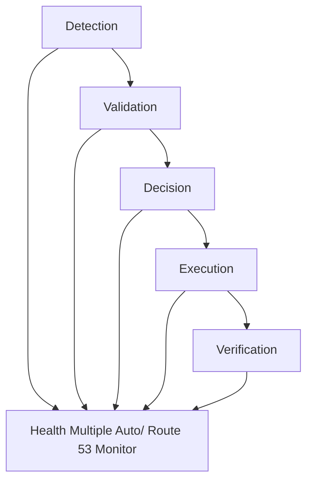
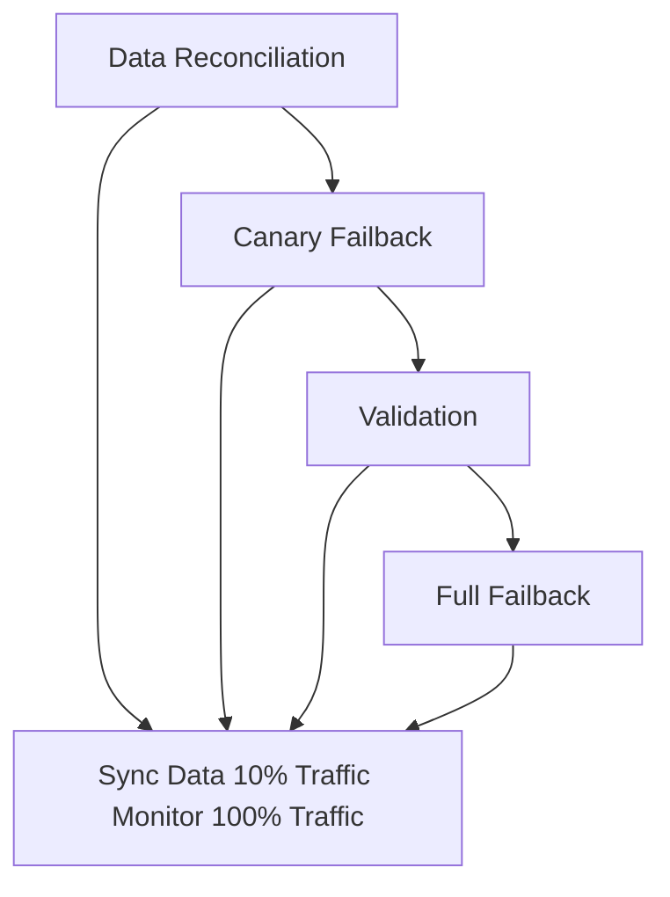

# ADR-039: Regional Failover 和 Failback Strategy

## 狀態

**Accepted** - 2025-10-25

## 上下文

### 問題陳述

Active-active multi-region architecture (ADR-037) 需要robust failover 和 failback mechanisms to 處理 regional failures:

**Failure Scenarios**:

- **Complete Regional Failure**: War, natural disaster, power outage
- **Partial Service Degradation**: Database failure, network issues
- **Planned Maintenance**: Software updates, infrastructure changes
- **Network Partition**: Cross-region connectivity loss
- **Cascading Failures**: Multiple component failures

**Challenges**:

- **Detection Speed**: Quickly identify regional failures
- **Failover Time**: Minimize RTO (Recovery Time Objective)
- **Data Loss**: Minimize RPO (Recovery Point Objective)
- **False Positives**: Avoid unnecessary failovers
- **Failback 複雜的ity**: Safe return to normal operations
- **Data Reconciliation**: 處理 data divergence 期間 outage

**Business Impact**:

- Revenue loss 期間 downtime
- Customer trust erosion
- Data inconsistency
- Operational chaos
- Regulatory compliance issues

### 業務上下文

**業務驅動因素**：

- Minimize downtime (RTO < 5 minutes)
- Minimize data loss (RPO < 1 minute)
- Automatic failover 用於 critical scenarios
- Manual control 用於 複雜的 scenarios
- Safe failback procedures
- Business continuity 期間 geopolitical crises

**限制條件**：

- 預算: $100,000/year 用於 failover infrastructure
- 必須 支援 both automatic 和 manual failover
- Zero data loss 用於 Tier 1 data (orders, payments)
- Acceptable data loss 用於 Tier 2 data (< 5 seconds)
- 24/7 on-call team required

### 技術上下文

**目前狀態**：

- Active-active architecture deployed
- Basic health checks in place
- Manual failover procedures
- No automated failover
- No failback procedures

**需求**：

- Automatic failover 用於 critical failures
- Manual failover capability
- Health check system
- Traffic routing automation
- Data reconciliation procedures
- Failback automation
- Comprehensive monitoring 和 alerting

## 決策驅動因素

1. **RTO**: Achieve < 5 minutes recovery time
2. **RPO**: Achieve < 1 minute data loss
3. **Automation**: Automatic failover 用於 clear failures
4. **Control**: Manual override 用於 複雜的 scenarios
5. **Safety**: Prevent split-brain 和 data corruption
6. **Visibility**: Clear status 和 alerting
7. **Testing**: Regular failover drills
8. **成本**： Optimize failover infrastructure costs

## 考慮的選項

### 選項 1： Hybrid Automatic/Manual Failover (Recommended)

**描述**： Automatic failover for clear failures, manual for complex scenarios

**Automatic Failover Triggers**:

- Complete regional failure (all health checks fail)
- Database master failure (可以not connect)
- Critical service failures (> 50% pods down)
- Network partition (cross-region connectivity lost)
- Error rate spike (> 10% 用於 5 minutes)

**Manual Failover Scenarios**:

- Partial degradation (unclear root cause)
- Planned maintenance
- Geopolitical events (war warning)
- Data consistency concerns
- 複雜的 multi-component failures

**Failover Process**:



**優點**：

- ✅ Fast 自動容錯移轉 用於 clear failures (< 5 min)
- ✅ Human judgment 用於 複雜的 scenarios
- ✅ Prevents false positive failovers
- ✅ Flexible 和 safe
- ✅ Meets RTO/RPO targets
- ✅ 支援s both emergency 和 planned scenarios

**缺點**：

- ⚠️ Requires 24/7 on-call team
- ⚠️ 複雜的 decision logic
- ⚠️ Manual failover slower (10-15 min)

**成本**： $100,000/year (infrastructure + on-call)

**風險**： **Low** - Balanced approach

### 選項 2： Fully Automatic Failover

**描述**： All failovers automated based on health checks

**優點**：

- ✅ Fastest failover (< 3 minutes)
- ✅ No human intervention needed
- ✅ Consistent behavior

**缺點**：

- ❌ Risk of false positive failovers
- ❌ No human judgment 用於 複雜的 scenarios
- ❌ Potential 用於 cascading failures
- ❌ 難以處理 edge cases

**成本**： $80,000/year

**風險**： **High** - False positives

### 選項 3： Fully Manual Failover

**描述**： All failovers require manual approval

**優點**：

- ✅ Full human control
- ✅ No false positives
- ✅ Careful decision making

**缺點**：

- ❌ Slow failover (15-30 minutes)
- ❌ Requires immediate human response
- ❌ Fails RTO target
- ❌ Not suitable 用於 sudden failures

**成本**： $60,000/year

**風險**： **High** - Too slow

## 決策結果

**選擇的選項**： **Hybrid Automatic/Manual Failover (Option 1)**

### 理由

Hybrid approach 提供s optimal balance:

1. **Speed**: Automatic failover 用於 clear failures meets RTO < 5 min
2. **Safety**: Manual control prevents false positives
3. **Flexibility**: 處理s both emergency 和 planned scenarios
4. **Judgment**: Human oversight 用於 複雜的 situations
5. **Testing**: Regular drills validate both paths
6. **Cost-Effective**: Reasonable infrastructure 和 staffing costs

### Failover Architecture

**Health Check System**:

```typescript
// Multi-layer health check system
interface HealthCheck {
  name: string;
  type: 'critical' | 'important' | 'informational';
  checkInterval: number;
  failureThreshold: number;
  timeout: number;
}

const healthChecks: HealthCheck[] = [
  // Layer 1: Infrastructure
  {
    name: 'region-connectivity',
    type: 'critical',
    checkInterval: 10, // seconds
    failureThreshold: 3,
    timeout: 5,
  },
  {
    name: 'database-master',
    type: 'critical',
    checkInterval: 10,
    failureThreshold: 3,
    timeout: 5,
  },
  {
    name: 'redis-cluster',
    type: 'critical',
    checkInterval: 10,
    failureThreshold: 3,
    timeout: 5,
  },
  
  // Layer 2: Application Services
  {
    name: 'order-service',
    type: 'critical',
    checkInterval: 30,
    failureThreshold: 2,
    timeout: 10,
  },
  {
    name: 'payment-service',
    type: 'critical',
    checkInterval: 30,
    failureThreshold: 2,
    timeout: 10,
  },
  {
    name: 'inventory-service',
    type: 'important',
    checkInterval: 30,
    failureThreshold: 3,
    timeout: 10,
  },
  
  // Layer 3: Business Metrics
  {
    name: 'error-rate',
    type: 'important',
    checkInterval: 60,
    failureThreshold: 5,
    timeout: 30,
  },
  {
    name: 'response-time',
    type: 'informational',
    checkInterval: 60,
    failureThreshold: 5,
    timeout: 30,
  },
];
```

**Automatic Failover Decision Logic**:

```typescript
class FailoverDecisionEngine {
  
  async evaluateFailover(region: string): Promise<FailoverDecision> {
    const healthStatus = await this.getHealthStatus(region);
    
    // Critical: All critical checks failed
    if (this.allCriticalChecksFailed(healthStatus)) {
      return {
        decision: 'AUTOMATIC_FAILOVER',
        reason: 'Complete regional failure detected',
        confidence: 'HIGH',
        estimatedRTO: 300, // 5 minutes
      };
    }
    
    // Critical: Database master unreachable
    if (this.isDatabaseUnreachable(healthStatus)) {
      return {
        decision: 'AUTOMATIC_FAILOVER',
        reason: 'Database master failure',
        confidence: 'HIGH',
        estimatedRTO: 180, // 3 minutes
      };
    }
    
    // Critical: Error rate spike
    if (this.isErrorRateHigh(healthStatus)) {
      const errorRate = healthStatus.metrics.errorRate;
      if (errorRate > 0.10) { // > 10% error rate
        return {
          decision: 'AUTOMATIC_FAILOVER',
          reason: `High error rate: ${errorRate * 100}%`,
          confidence: 'MEDIUM',
          estimatedRTO: 300,
        };
      }
    }
    
    // Important: Multiple service failures
    if (this.multipleServiceFailures(healthStatus)) {
      return {
        decision: 'MANUAL_REVIEW_REQUIRED',
        reason: 'Multiple service failures detected',
        confidence: 'MEDIUM',
        recommendedAction: 'Investigate and decide',
      };
    }
    
    // Informational: Performance degradation
    if (this.isPerformanceDegraded(healthStatus)) {
      return {
        decision: 'MONITOR',
        reason: 'Performance degradation detected',
        confidence: 'LOW',
        recommendedAction: 'Continue monitoring',
      };
    }
    
    return {
      decision: 'NO_ACTION',
      reason: 'All systems healthy',
      confidence: 'HIGH',
    };
  }
  
  private allCriticalChecksFailed(status: HealthStatus): boolean {
    const criticalChecks = status.checks.filter(c => c.type === 'critical');
    return criticalChecks.every(c => c.status === 'FAILED');
  }
  
  private isDatabaseUnreachable(status: HealthStatus): boolean {
    const dbCheck = status.checks.find(c => c.name === 'database-master');
    return dbCheck?.status === 'FAILED' && 
           dbCheck?.consecutiveFailures >= 3;
  }
  
  private isErrorRateHigh(status: HealthStatus): boolean {
    return status.metrics.errorRate > 0.10 && 
           status.metrics.errorRateDuration > 300; // 5 minutes
  }
  
  private multipleServiceFailures(status: HealthStatus): boolean {
    const failedServices = status.checks.filter(
      c => c.type === 'critical' && c.status === 'FAILED'
    );
    return failedServices.length >= 2 && failedServices.length < 5;
  }
}
```

**Route 53 Failover Configuration**:

```typescript
// Primary Taiwan record with health check
const taiwanRecord = new route53.ARecord(this, 'TaiwanPrimary', {
  zone: hostedZone,
  recordName: 'api',
  target: route53.RecordTarget.fromAlias(
    new targets.LoadBalancerTarget(taiwanALB)
  ),
  geoLocation: route53.GeoLocation.country('TW'),
  setIdentifier: 'taiwan-primary',
  
  // Health check for automatic failover
  evaluateTargetHealth: true,
});

// Health check for Taiwan region
const taiwanHealthCheck = new route53.CfnHealthCheck(this, 'TaiwanHealth', {
  healthCheckConfig: {
    type: 'HTTPS',
    resourcePath: '/health/deep',
    fullyQualifiedDomainName: 'taiwan-internal.ecommerce.com',
    port: 443,
    requestInterval: 30,
    failureThreshold: 3,
    measureLatency: true,
    enableSNI: true,
  },
  healthCheckTags: [
    { key: 'Region', value: 'Taiwan' },
    { key: 'Criticality', value: 'High' },
  ],
});

// Failover record to Tokyo
const tokyoFailoverRecord = new route53.ARecord(this, 'TokyoFailover', {
  zone: hostedZone,
  recordName: 'api',
  target: route53.RecordTarget.fromAlias(
    new targets.LoadBalancerTarget(tokyoALB)
  ),
  geoLocation: route53.GeoLocation.country('TW'),
  setIdentifier: 'tokyo-failover',
  
  // Lower priority than Taiwan
  weight: 0,
  
  evaluateTargetHealth: true,
});
```

### Automatic Failover Execution

**Failover Orchestration Lambda**:

```python
import boto3
import json
from datetime import datetime
from typing import Dict, List

class FailoverOrchestrator:
    
    def __init__(self):
        self.route53 = boto3.client('route53')
        self.sns = boto3.client('sns')
        self.cloudwatch = boto3.client('cloudwatch')
        
    def execute_failover(self, source_region: str, target_region: str, reason: str):
        """
        Execute automatic failover from source to target region
        """
        failover_id = f"failover-{datetime.utcnow().isoformat()}"
        
        try:
            # Step 1: Validate target region health
            if not self.validate_target_region(target_region):
                raise Exception(f"Target region {target_region} is not healthy")
            
            # Step 2: Update Route 53 DNS
            self.update_dns_routing(source_region, target_region)
            
            # Step 3: Update load balancer weights
            self.update_load_balancer_weights(source_region, target_region)
            
            # Step 4: Verify traffic shift
            self.verify_traffic_shift(target_region)
            
            # Step 5: Update monitoring dashboards
            self.update_dashboards(failover_id, source_region, target_region)
            
            # Step 6: Send notifications
            self.send_failover_notification(
                failover_id=failover_id,
                source_region=source_region,
                target_region=target_region,
                reason=reason,
                status='SUCCESS'
            )
            
            # Step 7: Log failover event
            self.log_failover_event(failover_id, source_region, target_region, reason)
            
            return {
                'status': 'SUCCESS',
                'failover_id': failover_id,
                'duration_seconds': self.calculate_duration(),
                'target_region': target_region,
            }
            
        except Exception as e:
            # Rollback on failure
            self.rollback_failover(source_region, target_region)
            
            self.send_failover_notification(
                failover_id=failover_id,
                source_region=source_region,
                target_region=target_region,
                reason=reason,
                status='FAILED',
                error=str(e)
            )
            
            raise
    
    def validate_target_region(self, region: str) -> bool:
        """
        Validate target region is healthy before failover
        """
        health_checks = [
            self.check_database_health(region),
            self.check_application_health(region),
            self.check_cache_health(region),
            self.check_message_queue_health(region),
        ]
        
        return all(health_checks)
    
    def update_dns_routing(self, source: str, target: str):
        """
        Update Route 53 to route traffic to target region
        """
        # Get hosted zone
        hosted_zone_id = self.get_hosted_zone_id()
        
        # Update DNS records
        changes = [
            {
                'Action': 'UPSERT',
                'ResourceRecordSet': {
                    'Name': 'api.ecommerce.com',
                    'Type': 'A',
                    'SetIdentifier': f'{target}-primary',
                    'Weight': 100,
                    'AliasTarget': {
                        'HostedZoneId': self.get_alb_hosted_zone(target),
                        'DNSName': self.get_alb_dns_name(target),
                        'EvaluateTargetHealth': True,
                    }
                }
            },
            {
                'Action': 'UPSERT',
                'ResourceRecordSet': {
                    'Name': 'api.ecommerce.com',
                    'Type': 'A',
                    'SetIdentifier': f'{source}-backup',
                    'Weight': 0,
                    'AliasTarget': {
                        'HostedZoneId': self.get_alb_hosted_zone(source),
                        'DNSName': self.get_alb_dns_name(source),
                        'EvaluateTargetHealth': True,
                    }
                }
            }
        ]
        
        response = self.route53.change_resource_record_sets(
            HostedZoneId=hosted_zone_id,
            ChangeBatch={
                'Comment': f'Failover from {source} to {target}',
                'Changes': changes
            }
        )
        
        # Wait for DNS propagation
        self.wait_for_dns_propagation(response['ChangeInfo']['Id'])
    
    def verify_traffic_shift(self, target_region: str):
        """
        Verify traffic is flowing to target region
        """
        import time
        
        max_attempts = 10
        for attempt in range(max_attempts):
            metrics = self.get_traffic_metrics(target_region)
            
            if metrics['requests_per_second'] > 100:  # Threshold
                return True
            
            time.sleep(30)  # Wait 30 seconds between checks
        
        raise Exception(f"Traffic not flowing to {target_region} after {max_attempts} attempts")
    
    def send_failover_notification(self, **kwargs):
        """
        Send SNS notification about failover event
        """
        message = {
            'event': 'REGIONAL_FAILOVER',
            'timestamp': datetime.utcnow().isoformat(),
            **kwargs
        }
        
        self.sns.publish(
            TopicArn='arn:aws:sns:region:account:failover-alerts',
            Subject=f"🚨 Regional Failover: {kwargs['source_region']} → {kwargs['target_region']}",
            Message=json.dumps(message, indent=2)
        )
        
        # Also send to PagerDuty for on-call team
        self.send_pagerduty_alert(message)
```

### Manual Failover Procedures

**Manual Failover Runbook**:

```markdown
# Manual Regional Failover Procedure

## Pre-Failover Checklist

- [ ] Verify target region health (all services green)
- [ ] Check data replication lag (< 5 seconds)
- [ ] Confirm on-call team availability
- [ ] Review recent changes (any risky deployments?)
- [ ] Notify stakeholders (business, support, engineering)
- [ ] Prepare rollback plan

## Failover Execution Steps

### Step 1: Reduce DNS TTL (15 minutes before failover)
```bash
# 降低 TTL to 60 seconds 用於 faster propagation
aws route53 change-resource-record-sets \
  --hosted-zone-id Z1234567890ABC \
  --change-batch file://降低-ttl.json
```text

### Step 2: Verify Target Region

```bash
# Run health check script
./scripts/verify-region-health.sh tokyo

# 預期的 output:
# ✅ Database: Healthy
# ✅ Redis: Healthy
# ✅ Kafka: Healthy
# ✅ Application Services: Healthy
# ✅ Replication Lag: 2.3 seconds
```text

### Step 3: Execute Failover

```bash
# Run failover script
./scripts/execute-failover.sh \
  --source taiwan \
  --target tokyo \
  --reason "Planned maintenance" \
  --mode manual

# Script 將:
# 1. Update Route 53 DNS records
# 2. Adjust load balancer weights
# 3. Verify traffic shift
# 4. Send notifications
```text

### Step 4: Monitor Traffic Shift (5-10 minutes)

```bash
# Monitor traffic metrics
watch -n 10 './scripts/check-traffic-distribution.sh'

# 預期的 progression:
# Taiwan: 100% → 75% → 50% → 25% → 0%
# Tokyo:  0%   → 25% → 50% → 75% → 100%
```text

### Step 5: Verify Application Health

```bash
# Check error rates
./scripts/check-error-rates.sh tokyo

# Check 回應時間
./scripts/check-response-times.sh tokyo

# Check business metrics
./scripts/check-business-metrics.sh tokyo
```text

### Step 6: Post-Failover Validation

- [ ] Verify 100% traffic to Tokyo
- [ ] Error rate < 1%
- [ ] Response time < 200ms (p95)
- [ ] No data inconsistencies
- [ ] All critical services operational

## Rollback Procedure

If issues detected within 30 minutes:

```bash
# Immediate rollback
./scripts/execute-failback.sh \
  --source tokyo \
  --target taiwan \
  --reason "Failover issues detected" \
  --mode emergency
```text

```


### Failback Strategy

**Failback Principles**:

1. **Non-Urgent**: Failback is not time-critical (可以 wait hours/days)
2. **Data Reconciliation**: Ensure 資料一致性 before failback
3. **Gradual**: 可以ary failback 與 traffic percentage
4. **Validated**: Extensive testing before full failback
5. **Reversible**: 可以 abort 和 stay in failover region

**Failback Process**:


**Failback Orchestration**:
```python
class FailbackOrchestrator:
    
    def execute_failback(self, current_region: str, original_region: str):
        """
        Execute gradual failback to original region
        """
        failback_id = f"failback-{datetime.utcnow().isoformat()}"
        
        try:
            # Phase 1: Data Reconciliation
            self.reconcile_data(current_region, original_region)
            
            # Phase 2: Canary Failback (10% traffic)
            self.canary_failback(current_region, original_region, percentage=10)
            self.monitor_canary(duration_minutes=30)
            
            # Phase 3: Gradual Increase (50% traffic)
            self.increase_traffic(current_region, original_region, percentage=50)
            self.monitor_traffic(duration_minutes=30)
            
            # Phase 4: Full Failback (100% traffic)
            self.complete_failback(current_region, original_region)
            self.verify_failback(original_region)
            
            # Phase 5: Cleanup
            self.cleanup_failover_state()
            
            self.send_failback_notification(
                failback_id=failback_id,
                status='SUCCESS',
                duration_hours=self.calculate_duration_hours()
            )
            
        except Exception as e:
            # Abort failback, stay in current region
            self.abort_failback(current_region, original_region)
            raise
    
    def reconcile_data(self, current: str, original: str):
        """
        Reconcile data between regions before failback
        """
        # Check replication lag
        lag = self.get_replication_lag(current, original)
        if lag > 5:  # seconds
            raise Exception(f"Replication lag too high: {lag}s")
        
        # Resolve any conflicts
        conflicts = self.detect_conflicts(current, original)
        if conflicts:
            self.resolve_conflicts(conflicts)
        
        # Verify data consistency
        if not self.verify_data_consistency(current, original):
            raise Exception("Data consistency check failed")
    
    def canary_failback(self, current: str, original: str, percentage: int):
        """
        Route small percentage of traffic to original region
        """
        self.update_traffic_weights(
            regions={
                current: 100 - percentage,
                original: percentage
            }
        )
        
        # Wait for DNS propagation
        time.sleep(120)
    
    def monitor_canary(self, duration_minutes: int):
        """
        Monitor canary traffic for issues
        """
        start_time = time.time()
        end_time = start_time + (duration_minutes * 60)
        
        while time.time() < end_time:
            metrics = self.get_canary_metrics()
            
            # Check for issues
            if metrics['error_rate'] > 0.02:  # > 2%
                raise Exception(f"High error rate in canary: {metrics['error_rate']}")
            
            if metrics['response_time_p95'] > 500:  # > 500ms
                raise Exception(f"High latency in canary: {metrics['response_time_p95']}ms")
            
            time.sleep(60)  # Check every minute
    
    def abort_failback(self, current: str, original: str):
        """
        Abort failback and return to current region
        """
        self.update_traffic_weights(
            regions={
                current: 100,
                original: 0
            }
        )
        
        self.send_failback_notification(
            status='ABORTED',
            reason='Issues detected during failback'
        )
```

**Data Reconciliation Procedures**:

```java
public class DataReconciliationService {
    
    public ReconciliationReport reconcileRegions(String region1, String region2) {
        ReconciliationReport report = new ReconciliationReport();
        
        // Reconcile critical data (orders, payments)
        report.addSection(reconcileOrders(region1, region2));
        report.addSection(reconcilePayments(region1, region2));
        report.addSection(reconcileInventory(region1, region2));
        
        // Reconcile eventual consistency data
        report.addSection(reconcileCustomers(region1, region2));
        report.addSection(reconcileProducts(region1, region2));
        
        return report;
    }
    
    private ReconciliationSection reconcileOrders(String region1, String region2) {
        // Get orders from both regions
        List<Order> orders1 = orderRepository.findRecentOrders(region1);
        List<Order> orders2 = orderRepository.findRecentOrders(region2);
        
        // Find discrepancies
        List<OrderDiscrepancy> discrepancies = new ArrayList<>();
        
        for (Order order1 : orders1) {
            Order order2 = findOrderById(orders2, order1.getId());
            
            if (order2 == null) {
                // Order exists in region1 but not region2
                discrepancies.add(new OrderDiscrepancy(
                    order1.getId(),
                    "MISSING_IN_REGION2",
                    order1,
                    null
                ));
            } else if (!order1.equals(order2)) {
                // Order exists in both but different
                discrepancies.add(new OrderDiscrepancy(
                    order1.getId(),
                    "MISMATCH",
                    order1,
                    order2
                ));
            }
        }
        
        // Resolve discrepancies
        for (OrderDiscrepancy discrepancy : discrepancies) {
            resolveOrderDiscrepancy(discrepancy);
        }
        
        return new ReconciliationSection(
            "Orders",
            orders1.size() + orders2.size(),
            discrepancies.size(),
            discrepancies
        );
    }
    
    private void resolveOrderDiscrepancy(OrderDiscrepancy discrepancy) {
        switch (discrepancy.getType()) {
            case "MISSING_IN_REGION2":
                // Replicate order to region2
                orderRepository.replicateOrder(discrepancy.getOrder1(), "region2");
                break;
                
            case "MISMATCH":
                // Use last-write-wins based on timestamp
                Order newer = discrepancy.getOrder1().getLastModified()
                    .isAfter(discrepancy.getOrder2().getLastModified())
                    ? discrepancy.getOrder1()
                    : discrepancy.getOrder2();
                
                // Update both regions with newer version
                orderRepository.updateOrder(newer, "region1");
                orderRepository.updateOrder(newer, "region2");
                break;
        }
    }
}
```

### Failover Testing 和 Drills

**Quarterly Failover Drill Schedule**:

**Q1 Drill - Planned Failover**:

- Scenario: Planned maintenance in Taiwan
- Type: Manual failover
- Duration: 4 hours
- Objectives: Validate manual procedures, team coordination

**Q2 Drill - Database Failure**:

- Scenario: Taiwan database master failure
- Type: Automatic failover
- Duration: 2 hours
- Objectives: Validate 自動容錯移轉, RTO/RPO

**Q3 Drill - Complete Regional Failure**:

- Scenario: Taiwan region complete outage (war simulation)
- Type: Automatic failover
- Duration: 8 hours
- Objectives: Validate business continuity, data reconciliation

**Q4 Drill - Failback Procedures**:

- Scenario: Return to Taiwan after Tokyo failover
- Type: Manual failback
- Duration: 6 hours
- Objectives: Validate failback procedures, data reconciliation

**Drill Execution Checklist**:

```markdown
# Failover Drill Checklist

## Pre-Drill (1 week before)

- [ ] Schedule drill with all stakeholders
- [ ] Notify customers (if production drill)
- [ ] Prepare monitoring dashboards
- [ ] Review runbooks
- [ ] Assign roles and responsibilities
- [ ] Set up communication channels

## During Drill

- [ ] Start time: ___________
- [ ] Trigger failover: ___________
- [ ] DNS propagation complete: ___________
- [ ] Traffic shifted: ___________
- [ ] Services validated: ___________
- [ ] End time: ___________
- [ ] Actual RTO: ___________ (target: < 5 min)
- [ ] Actual RPO: ___________ (target: < 1 min)

## Post-Drill (within 24 hours)

- [ ] Conduct retrospective meeting
- [ ] Document lessons learned
- [ ] Update runbooks
- [ ] Create action items for improvements
- [ ] Share report with stakeholders

```

## 影響分析

### 利害關係人影響

| Stakeholder | Impact Level | Description | Mitigation |
|-------------|--------------|-------------|------------|
| Development Team | Medium | Failover-aware code | Patterns, testing |
| Operations Team | High | 24/7 on-call, drill execution | Training, automation, runbooks |
| End Users | Low | Transparent failover | Proper testing, monitoring |
| Business | Medium | Downtime minimized | Clear RTO/RPO, regular drills |
| 支援 Team | Medium | Customer communication | Templates, training |

### 影響半徑

**選擇的影響半徑**： **Enterprise**

影響：

- All application services
- All 資料儲存s
- DNS routing
- Monitoring 和 alerting
- On-call procedures
- Customer communications

### 風險評估

| Risk | Probability | Impact | Mitigation Strategy |
|------|-------------|--------|---------------------|
| False positive failover | Low | High | Multi-layer validation, manual override |
| Failover failure | Low | Critical | Regular drills, automated testing |
| Data loss 期間 failover | Low | Critical | Replication monitoring, RPO < 1 min |
| Slow failover | Medium | High | Automation, monitoring, optimization |
| Failback issues | Medium | Medium | Gradual failback, data reconciliation |

**整體風險等級**： **Medium**

## 實作計畫

### 第 1 階段： Health Check System (Month 1)

**Objectives**:

- Deploy comprehensive health check system
- Configure Route 53 health checks
- Set up monitoring 和 alerting

**Tasks**:

- [ ] Implement multi-layer health checks
- [ ] Configure Route 53 health checks
- [ ] Deploy health check endpoints
- [ ] Set up CloudWatch alarms
- [ ] Create monitoring dashboards
- [ ] Test health check system

**Success Criteria**:

- Health checks operational
- Alerts triggering correctly
- Dashboards showing real-time status

### 第 2 階段： Automatic Failover (Month 2)

**Objectives**:

- Implement 自動容錯移轉 logic
- Deploy failover orchestration
- Test 自動容錯移轉

**Tasks**:

- [ ] Implement failover decision engine
- [ ] Deploy failover orchestration Lambda
- [ ] Configure automatic DNS updates
- [ ] Implement notification system
- [ ] Test 自動容錯移轉 scenarios
- [ ] Validate RTO < 5 minutes

**Success Criteria**:

- Automatic failover working
- RTO < 5 minutes achieved
- Notifications sent correctly

### 第 3 階段： Manual Failover (Month 3)

**Objectives**:

- Create manual failover procedures
- Develop failover scripts
- Train operations team

**Tasks**:

- [ ] Write manual failover runbooks
- [ ] Develop failover scripts
- [ ] Create training materials
- [ ] Conduct team training
- [ ] Perform manual failover drill
- [ ] Update documentation

**Success Criteria**:

- Runbooks complete 和 tested
- Team trained 和 confident
- Manual failover successful

### 第 4 階段： Failback Procedures (Month 4)

**Objectives**:

- Implement failback automation
- Create data reconciliation procedures
- Test failback scenarios

**Tasks**:

- [ ] Implement failback orchestration
- [ ] Develop data reconciliation tools
- [ ] Create failback runbooks
- [ ] Test 可以ary failback
- [ ] Perform full failback drill
- [ ] Document lessons learned

**Success Criteria**:

- Failback automation working
- Data reconciliation successful
- Failback drill completed

### Phase 5: Production Readiness (Month 5-6)

**Objectives**:

- Validate all procedures
- Conduct comprehensive drills
- Achieve production readiness

**Tasks**:

- [ ] Conduct Q1 failover drill
- [ ] Validate RTO/RPO targets
- [ ] Fine-tune automation
- [ ] Update all documentation
- [ ] Train all team members
- [ ] Obtain stakeholder approval

**Success Criteria**:

- All drills successful
- RTO < 5 min, RPO < 1 min validated
- Team fully trained
- Production ready

### 回滾策略

**Not Applicable** - Failover/failback is the rollback mechanism itself

**Continuous 改善ment**:

- Quarterly drills
- Regular runbook updates
- Automation 改善ments
- Team training refreshers

## 監控和成功標準

### 成功指標

| Metric | Target | Measurement |
|--------|--------|-------------|
| RTO (Automatic) | < 5 minutes | Failover drills |
| RTO (Manual) | < 15 minutes | Failover drills |
| RPO | < 1 minute | Replication monitoring |
| Failover Success Rate | 100% | Drill results |
| False Positive Rate | < 1% | Health check logs |
| Drill Frequency | Quarterly | Schedule compliance |
| Team Response Time | < 5 minutes | On-call metrics |

### Key Metrics

```typescript
const failoverMetrics = {
  // Failover events
  'failover.events.total': 'Count',
  'failover.events.automatic': 'Count',
  'failover.events.manual': 'Count',
  'failover.duration.seconds': 'Seconds',
  
  // Health checks
  'health.checks.total': 'Count',
  'health.checks.failed': 'Count',
  'health.checks.critical_failed': 'Count',
  
  // RTO/RPO
  'failover.rto.actual': 'Seconds',
  'failover.rpo.actual': 'Seconds',
  
  // Failback
  'failback.events.total': 'Count',
  'failback.duration.hours': 'Hours',
  'failback.data_reconciliation.conflicts': 'Count',
};
```

### Monitoring Dashboards

**Failover Status Dashboard**:

- Current active region
- Health check status (all regions)
- Recent failover events
- RTO/RPO metrics
- On-call team status

**Regional Health Dashboard**:

- Infrastructure health (per region)
- Application health (per region)
- Replication lag
- Error rates
- Response times

**Drill Results Dashboard**:

- Drill history
- RTO/RPO trends
- Success rate
- Lessons learned
- Action items

### Review Schedule

- **Daily**: Health check review
- **Weekly**: Failover metrics review
- **Monthly**: Drill planning
- **Quarterly**: Failover drill execution
- **Annually**: Comprehensive review 和 optimization

## 後果

### 正面後果

- ✅ **Fast Recovery**: RTO < 5 minutes 用於 自動容錯移轉
- ✅ **Minimal Data Loss**: RPO < 1 minute
- ✅ **Business Continuity**: Operations continue 期間 regional failures
- ✅ **Confidence**: Regular drills build team confidence
- ✅ **Automation**: 降低s human error
- ✅ **Flexibility**: 支援s both automatic 和 manual scenarios
- ✅ **Validated**: Quarterly drills ensure procedures work

### 負面後果

- ⚠️ **成本**： $100,000/year for infrastructure and on-call
- ⚠️ **複雜的ity**: 複雜的 failover logic 和 procedures
- ⚠️ **On-Call Burden**: 24/7 on-call team required
- ⚠️ **Drill Disruption**: Quarterly drills 需要coordination
- ⚠️ **False Positives**: Risk of unnecessary failovers
- ⚠️ **Training**: Ongoing training required

### 技術債務

**已識別債務**：

1. Manual data reconciliation 用於 some scenarios
2. Basic health check logic (no ML prediction)
3. Limited automated testing of failover
4. Manual drill coordination

**債務償還計畫**：

- **Q2 2026**: Automated data reconciliation 用於 all scenarios
- **Q3 2026**: ML-powered failure prediction
- **Q4 2026**: Fully automated failover testing (chaos engineering)
- **2027**: Automated drill scheduling 和 execution

## 相關決策

- [ADR-035: Disaster Recovery Strategy](035-disaster-recovery-strategy.md) - DR integrated 與 failover
- [ADR-037: Active-Active Multi-Region Architecture](037-active-active-multi-region-architecture.md) - Multi-region foundation
- [ADR-038: Cross-Region Data Replication Strategy](038-cross-region-data-replication-strategy.md) - Data replication 用於 failover
- [ADR-040: Network Partition Handling Strategy](040-network-partition-handling-strategy.md) - Split-brain prevention
- [ADR-043: Observability 用於 Multi-Region Operations](043-observability-multi-region.md) - Monitoring integration

## 備註

### RTO/RPO Targets 透過 Scenario

| Scenario | RTO Target | RPO Target | Failover Type |
|----------|------------|------------|---------------|
| Complete regional failure | < 5 min | < 1 min | Automatic |
| Database failure | < 3 min | < 30 sec | Automatic |
| Planned maintenance | < 15 min | 0 | Manual |
| Partial degradation | < 30 min | 0 | Manual |
| Network partition | < 5 min | < 1 min | Automatic |

### Failover Decision Matrix

| Health Status | Error Rate | Response Time | Decision |
|---------------|------------|---------------|----------|
| All critical failed | Any | Any | Automatic failover |
| DB unreachable | Any | Any | Automatic failover |
| Any | > 10% | Any | Automatic failover |
| Multiple services down | 5-10% | > 1s | Manual review |
| Single service down | < 5% | < 500ms | Monitor |
| All healthy | < 1% | < 200ms | No action |

### Communication Templates

**Failover Notification (Internal)**:

```text
🚨 REGIONAL FAILOVER INITIATED

Source Region: Taiwan (ap-northeast-3)
Target Region: Tokyo (ap-northeast-1)
Reason: [Automatic/Manual] - [Reason]
Started: 2025-10-25 14:30:00 UTC
Status: IN_PROGRESS

Current Status:
✅ Target region validated
✅ DNS updated
⏳ Traffic shifting (50% complete)
⏳ Verification pending

Estimated Completion: 14:35:00 UTC (5 minutes)

On-Call Team: [Names]
Incident Channel: #incident-failover-20251025
```

**Customer Communication (if needed)**:

```text
We are currently performing a planned regional failover to ensure 
optimal service availability. You may experience brief interruptions 
(< 1 minute) during this process. All data is safe and secure.

Expected completion: 5 minutes
Status updates: status.ecommerce.com
```

---

**文檔狀態**： ✅ Accepted  
**上次審查**： 2025-10-25  
**下次審查**： 2026-01-25 （每季）
