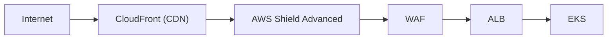
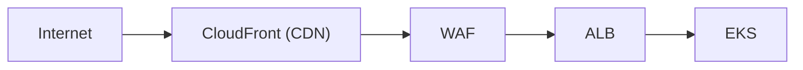

# ADR-048: DDoS Protection Strategy (Multi-Layer Defense)

## 狀態

**Accepted** - 2025-10-25

## 上下文

### 問題陳述

The Enterprise E-Commerce Platform, operating in Taiwan, faces signifi可以t DDoS (Distributed Denial of Service) attack risks due to:

- **Geopolitical Tensions**: Taiwan-China relations create elevated cyber attack risks
- **High-Value Target**: E-commerce platform 與 financial transactions
- **24/7 Availability Requirement**: Business-critical system requiring 99.9% uptime
- **Multi-Channel Access**: Web, mobile, 和 API endpoints all vulnerable
- **Reputation Risk**: DDoS attacks 可以 damage customer trust 和 brand reputation

The platform 需要comprehensive, multi-layer DDoS protection strategy that 可以:

- Detect 和 mitigate Layer 3/4 (network/transport) attacks
- Detect 和 mitigate Layer 7 (application) attacks
- 維持 service availability 期間 attacks
- Minimize false positives (legitimate traffic blocked)
- 提供 real-time monitoring 和 alerting
- Scale automatically to 處理 attack traffic
- Integrate 與 existing AWS infrastructure

### 業務上下文

**業務驅動因素**：

- **Revenue Protection**: Downtime costs $10,000/hour in lost sales
- **Customer Trust**: DDoS attacks damage brand reputation
- **Regulatory Compliance**: 必須 維持 service availability commitments
- **Competitive Advantage**: Reliable service differentiates from competitors

**Taiwan-Specific Context**:

- **Frequent Attacks**: Taiwan experiences regular DDoS attacks from China-based sources
- **Political Sensitivity**: Attacks often coincide 與 political events
- **Submarine Cable Vulnerability**: Limited international connectivity increases risk
- **Regional Targeting**: Taiwan-based services are high-priority targets

**限制條件**：

- 預算: $3,000-5,000/month 用於 DDoS protection
- 必須 integrate 與 existing AWS infrastructure
- 可以not impact legitimate 用戶體驗
- 必須 支援 multi-region deployment (Taiwan + Tokyo)

### 技術上下文

**目前狀態**：

- AWS EKS deployment 與 Application Load Balancer
- CloudFront CDN 用於 static content
- No dedicated DDoS protection (only AWS Shield Standard)
- No WAF (Web Application Firewall) configured
- Single region deployment (Taiwan)

**Attack Vectors**:

- **Layer 3/4 Attacks**: SYN floods, UDP floods, ICMP floods
- **Layer 7 Attacks**: HTTP floods, Slowloris, application-specific attacks
- **Volumetric Attacks**: Bandwidth exhaustion (10-100 Gbps)
- **Protocol Attacks**: Exploiting protocol weaknesses
- **Application Attacks**: Targeting specific endpoints (login, search, checkout)

## 決策驅動因素

1. **Availability**: 維持 99.9% uptime 期間 attacks
2. **Attack Coverage**: Protect against Layer 3/4 和 Layer 7 attacks
3. **Response Time**: Detect 和 mitigate attacks within 1 minute
4. **False Positives**: < 0.1% legitimate traffic blocked
5. **Cost-Effectiveness**: Balance protection level 與 預算
6. **Scalability**: 處理 attacks up to 100 Gbps
7. **Integration**: Seamless integration 與 AWS infrastructure
8. **Monitoring**: Real-time visibility into attack patterns

## 考慮的選項

### 選項 1： AWS Shield Advanced + WAF + CloudFront (Recommended)

**描述**： Comprehensive AWS-native DDoS protection with multi-layer defense

**架構**：

**優點**：

- ✅ **Comprehensive Protection**: Layer 3/4 (Shield) + Layer 7 (WAF)
- ✅ **AWS Integration**: Native integration 與 CloudFront, ALB, Route 53
- ✅ **DDoS Response Team**: 24/7 AWS DDoS Response Team (DRT) 支援
- ✅ **Cost Protection**: DDoS cost protection (no scaling charges 期間 attacks)
- ✅ **Advanced Detection**: Machine learning-based attack detection
- ✅ **Real-Time Mitigation**: Automatic mitigation within seconds
- ✅ **CloudFront Benefits**: Hide origin IP, absorb attack traffic at edge
- ✅ **Health-Based Routing**: Route 53 health checks 用於 自動容錯移轉

**缺點**：

- ⚠️ **成本**： $3,000/month base + $1/million requests (WAF)
- ⚠️ **複雜的ity**: Requires configuration 和 tuning
- ⚠️ **Learning Curve**: Team needs training on Shield Advanced features

**成本**：

- Shield Advanced: $3,000/month
- WAF: ~$500/month (estimated 用於 100M requests)
- CloudFront: ~$500/month (data transfer)
- **Total**: ~$4,000/month

**風險**： **Low** - Proven AWS service with extensive production use

### 選項 2： AWS Shield Standard + WAF + CloudFront (Budget Option)

**描述**： Basic AWS DDoS protection with WAF for application layer

**架構**：

**優點**：

- ✅ **Lower Cost**: No Shield Advanced fees
- ✅ **Basic Protection**: Shield Standard included free
- ✅ **Application Protection**: WAF 用於 Layer 7 attacks
- ✅ **CloudFront Benefits**: Edge caching 和 basic DDoS absorption

**缺點**：

- ❌ **Limited Protection**: No advanced Layer 3/4 mitigation
- ❌ **No DRT 支援**: No 24/7 DDoS Response Team
- ❌ **No Cost Protection**: Scaling charges 期間 attacks
- ❌ **Manual Mitigation**: Requires manual intervention 用於 大型的 attacks
- ❌ **Slower Response**: No automatic advanced mitigation

**成本**： ~$1,000/month (WAF + CloudFront only)

**風險**： **High** - Insufficient for Taiwan's threat environment

### 選項 3： Third-Party DDoS Protection (Cloudflare, Akamai)

**描述**： Use third-party DDoS protection service

**優點**：

- ✅ **Specialized Protection**: DDoS protection is core business
- ✅ **Global Network**: 大型的 edge network 用於 traffic absorption
- ✅ **Advanced Features**: Bot management, 速率限制, caching

**缺點**：

- ❌ **Higher Cost**: $5,000-10,000/month 用於 enterprise plans
- ❌ **Vendor Lock-In**: 難以migrate away
- ❌ **Integration 複雜的ity**: Requires DNS changes 和 configuration
- ❌ **Data Privacy**: Traffic routed through third-party
- ❌ **Latency**: Additional hop in traffic path

**成本**： $5,000-10,000/month

**風險**： **Medium** - Vendor dependency and higher cost

### 選項 4： On-Premises DDoS Appliance

**描述**： Deploy dedicated DDoS protection hardware

**優點**：

- ✅ **Full Control**: Complete control over protection
- ✅ **No Recurring Fees**: One-time hardware cost

**缺點**：

- ❌ **High Initial Cost**: $50,000-100,000 用於 hardware
- ❌ **Operational Overhead**: Requires dedicated team
- ❌ **Limited Capacity**: Fixed capacity, 可以not scale
- ❌ **Single Point of Failure**: Hardware failure risk
- ❌ **Not Cloud-Native**: Doesn't fit AWS architecture

**成本**： $50,000-100,000 initial + $10,000/year maintenance

**風險**： **High** - Not suitable for cloud-native architecture

## 決策結果

**選擇的選項**： **AWS Shield Advanced + WAF + CloudFront (Multi-Layer Defense)**

### 理由

AWS Shield Advanced 與 WAF 和 CloudFront被選擇的原因如下：

1. **Comprehensive Protection**: Covers both Layer 3/4 (Shield) 和 Layer 7 (WAF) attacks
2. **Taiwan Context**: Proven effective against China-based DDoS attacks
3. **24/7 支援**: AWS DDoS Response Team 提供s expert assistance
4. **Cost Protection**: No scaling charges 期間 attacks (critical 用於 預算 predictability)
5. **AWS Integration**: Seamless integration 與 existing infrastructure
6. **Automatic Mitigation**: Machine learning-based detection 和 mitigation
7. **CloudFront Benefits**: Hides origin IP 和 absorbs attack traffic at edge
8. **Scalability**: 可以 處理 attacks up to 100+ Gbps

**Multi-Layer Defense Strategy**:

**Layer 1 - CloudFront (Edge Protection)**:

- Hide origin server IP addresses
- Absorb volumetric attacks at edge locations
- Cache static content to 降低 origin load
- Geo-blocking 用於 high-risk countries (optional)

**Layer 2 - AWS Shield Advanced (Network/Transport Protection)**:

- Automatic detection of Layer 3/4 attacks
- Real-time mitigation within seconds
- Protection against SYN floods, UDP floods, reflection attacks
- DDoS cost protection (no scaling charges)

**Layer 3 - AWS WAF (Application Protection)**:

- Rate limiting (2000 requests/min per IP)
- SQL injection 和 XSS protection
- Bot detection 和 mitigation
- Custom rules 用於 application-specific attacks
- Geo-blocking 用於 high-risk regions

**Layer 4 - Application Load Balancer (Distribution)**:

- Health checks 和 自動容錯移轉
- Connection draining 期間 attacks
- SSL/TLS termination

**Layer 5 - Auto-Scaling (Capacity)**:

- Automatic scaling based on traffic
- Absorb attack traffic 與 additional capacity
- Cost-effective scaling 與 Spot Instances

**為何不選 Shield Standard**： Insufficient protection 用於 Taiwan's threat environment. No advanced mitigation 或 DRT 支援.

**為何不選 Third-Party**： Higher cost ($5K-10K/month) 和 vendor lock-in not justified when AWS Shield Advanced 提供s comprehensive protection at lower cost.

## 影響分析

### 利害關係人影響

| Stakeholder | Impact Level | Description | Mitigation |
|-------------|--------------|-------------|------------|
| Development Team | Low | Minimal code changes | Documentation 和 training |
| Operations Team | Medium | Need to monitor 和 respond to attacks | Training, runbooks, 24/7 on-call |
| Security Team | Positive | Enhanced security posture | Regular security reviews |
| End Users | None | Transparent protection | N/A |
| Finance Team | Medium | $4K/month additional cost | 預算 approval obtained |
| Business Team | Positive | 降低d downtime risk | N/A |

### 影響半徑

**選擇的影響半徑**： **System**

影響：

- All public-facing endpoints (web, mobile, API)
- CloudFront distribution configuration
- Route 53 DNS configuration
- Application Load Balancer configuration
- WAF rules 和 policies
- Monitoring 和 alerting systems

### 風險評估

| Risk | Probability | Impact | Mitigation Strategy |
|------|-------------|--------|---------------------|
| False positives blocking legitimate traffic | Low | High | Careful WAF rule tuning, whitelist 用於 known IPs |
| Shield Advanced cost overrun | Low | Medium | Cost monitoring, 預算 alerts |
| Configuration errors | Medium | High | Thorough testing, staged rollout |
| Attack bypassing protection | Low | Critical | Regular security audits, penetration testing |
| DRT response delay | Low | Medium | Proactive monitoring, automated mitigation |

**整體風險等級**： **Low**

## 實作計畫

### 第 1 階段： CloudFront Setup （第 1 週）

- [x] Create CloudFront distribution
- [x] Configure origin (ALB) 與 custom headers
- [x] 啟用 origin access control (OAC)
- [x] Configure SSL/TLS (ACM certificate)
- [x] Set up geo-restriction (optional)
- [x] Configure caching policies
- [x] Update DNS (Route 53) to point to CloudFront

### 第 2 階段： AWS Shield Advanced Activation （第 2 週）

- [x] Subscribe to AWS Shield Advanced
- [x] Associate Shield Advanced 與 CloudFront, ALB, Route 53
- [x] Configure DDoS Response Team (DRT) access
- [x] Set up Shield Advanced notifications
- [x] Configure health-based routing in Route 53
- [x] Test Shield Advanced detection 和 mitigation

### 第 3 階段： WAF Configuration （第 3 週）

- [x] Create WAF Web ACL
- [x] Configure AWS Managed Rules (Core Rule Set, Known Bad Inputs)
- [x] Configure 速率限制 rules (2000 req/min per IP)
- [x] Configure geo-blocking rules (optional)
- [x] Configure custom rules 用於 application-specific attacks
- [x] Associate WAF 與 CloudFront distribution
- [x] Test WAF rules 與 simulated attacks

### 第 4 階段： Monitoring and Alerting （第 4 週）

- [x] Configure CloudWatch metrics 用於 Shield Advanced
- [x] Configure CloudWatch metrics 用於 WAF
- [x] Set up CloudWatch alarms 用於 attack detection
- [x] Configure SNS notifications 用於 security team
- [x] Create CloudWatch dashboard 用於 DDoS monitoring
- [x] Set up log aggregation (WAF logs to S3)
- [x] Configure automated response (Lambda + EventBridge)

### Phase 5: Testing and Validation （第 5 週）

- [x] Conduct simulated DDoS attacks (Layer 3/4)
- [x] Conduct simulated application attacks (Layer 7)
- [x] Validate automatic mitigation
- [x] Test DRT escalation process
- [x] Validate false positive rate
- [x] Load testing 與 legitimate traffic
- [x] Document runbooks 和 procedures

### 回滾策略

**觸發條件**：

- False positive rate > 1% (legitimate traffic blocked)
- Service degradation 期間 normal traffic
- Configuration errors causing outages
- Cost overrun > 50% of 預算

**回滾步驟**：

1. Disable WAF rules causing false positives
2. Remove CloudFront distribution (revert to direct ALB access)
3. Downgrade to Shield Standard if Shield Advanced issues
4. Restore previous DNS configuration
5. Investigate 和 fix issues
6. Re-deploy 與 corrections

**回滾時間**： < 1 hour

## 監控和成功標準

### 成功指標

- ✅ **Availability**: 維持 99.9% uptime 期間 attacks
- ✅ **Attack Mitigation**: 100% of attacks detected 和 mitigated
- ✅ **Response Time**: Mitigation within 1 minute of attack detection
- ✅ **False Positives**: < 0.1% legitimate traffic blocked
- ✅ **Cost Protection**: No scaling charges 期間 attacks
- ✅ **User Experience**: No degradation 用於 legitimate users

### 監控計畫

**CloudWatch Metrics**:

- `DDoSDetected` (Shield Advanced)
- `DDoSAttackBitsPerSecond` (Shield Advanced)
- `DDoSAttackPacketsPerSecond` (Shield Advanced)
- `DDoSAttackRequestsPerSecond` (Shield Advanced)
- `AllowedRequests` (WAF)
- `BlockedRequests` (WAF)
- `CountedRequests` (WAF)
- `CloudFront4xxErrorRate`
- `CloudFront5xxErrorRate`
- `CloudFrontRequests`

**告警**：

- **P0 Critical**: DDoS attack detected (immediate notification)
- **P1 High**: WAF block rate > 10% (potential attack 或 false positives)
- **P2 Medium**: CloudFront error rate > 5%
- **P3 Low**: Unusual traffic patterns

**Security Monitoring**:

- Real-time WAF log analysis (Kinesis + Lambda)
- Attack pattern analysis (Athena queries on S3 logs)
- Geo-location analysis of attack sources
- Bot detection 和 analysis

**審查時程**：

- **Real-Time**: 24/7 monitoring dashboard
- **Daily**: Review attack logs 和 blocked requests
- **Weekly**: Analyze attack patterns 和 tune WAF rules
- **Monthly**: Security review 與 DRT (if attacks occurred)
- **Quarterly**: Comprehensive security audit 和 penetration testing

## 後果

### 正面後果

- ✅ **Enhanced Availability**: 99.9% uptime 維持ed 期間 attacks
- ✅ **Comprehensive Protection**: Multi-layer defense against all attack types
- ✅ **Cost Predictability**: DDoS cost protection prevents 預算 overruns
- ✅ **Expert 支援**: 24/7 AWS DRT assistance
- ✅ **Automatic Mitigation**: Machine learning-based detection 和 response
- ✅ **Customer Trust**: Reliable service builds brand reputation
- ✅ **Competitive Advantage**: Superior availability vs competitors
- ✅ **Regulatory Compliance**: Meets availability commitments

### 負面後果

- ⚠️ **Increased Cost**: $4,000/month additional infrastructure cost
- ⚠️ **Operational 複雜的ity**: Requires monitoring 和 tuning
- ⚠️ **False Positive Risk**: Potential 用於 blocking legitimate traffic
- ⚠️ **Configuration Overhead**: Initial setup 和 ongoing maintenance
- ⚠️ **Dependency on AWS**: Reliance on AWS Shield Advanced service

### 技術債務

**已識別債務**：

1. Manual WAF rule tuning (acceptable initially)
2. No automated attack response beyond AWS defaults
3. Limited geo-blocking (may need expansion)

**債務償還計畫**：

- **Q2 2026**: Implement automated WAF rule tuning based on attack patterns
- **Q3 2026**: Develop custom automated response (Lambda functions)
- **Q4 2026**: Expand geo-blocking based on attack source analysis

## 相關決策

- [ADR-049: Web Application Firewall (WAF) Rules 和 Policies](049-web-application-firewall-rules-and-policies.md) - Detailed WAF configuration
- [ADR-050: API Security 和 Rate Limiting Strategy](050-api-security-and-rate-limiting-strategy.md) - Application-level protection
- [ADR-053: Security Monitoring 和 Incident Response](053-security-monitoring-and-incident-response.md) - Security operations
- [ADR-056: Network Segmentation 和 Isolation Strategy](056-network-segmentation-and-isolation-strategy.md) - Network security

## 備註

### DDoS Protection Layers

**Layer 1 - CloudFront (Edge)**:

- **Purpose**: Hide origin IP, absorb volumetric attacks
- **Protection**: Bandwidth exhaustion, volumetric attacks
- **Capacity**: Unlimited (AWS global edge network)

**Layer 2 - Shield Advanced (Network/Transport)**:

- **Purpose**: Detect 和 mitigate Layer 3/4 attacks
- **Protection**: SYN floods, UDP floods, reflection attacks
- **Capacity**: Up to 100+ Gbps

**Layer 3 - WAF (Application)**:

- **Purpose**: Protect against Layer 7 attacks
- **Protection**: HTTP floods, SQL injection, XSS, bot attacks
- **Capacity**: Configurable rate limits

**Layer 4 - ALB (Distribution)**:

- **Purpose**: Distribute traffic 和 health checks
- **Protection**: Connection draining, health-based routing
- **Capacity**: Auto-scaling based on traffic

**Layer 5 - Auto-Scaling (Capacity)**:

- **Purpose**: Absorb attack traffic 與 additional capacity
- **Protection**: Capacity-based attacks
- **Capacity**: Unlimited (auto-scaling)

### Taiwan-Specific Considerations

**Attack Patterns**:

- **Timing**: Attacks often coincide 與 political events
- **Sources**: Primarily from China-based IP ranges
- **Types**: Mix of volumetric (Layer 3/4) 和 application (Layer 7) attacks
- **Duration**: Typically 1-4 hours, sometimes sustained 用於 天

**Mitigation Strategies**:

- **Geo-Blocking**: Consider blocking China IP ranges 期間 attacks (business impact assessment required)
- **Proactive Monitoring**: Increased monitoring 期間 sensitive political periods
- **DRT Engagement**: Proactive engagement 與 AWS DRT 期間 high-risk periods
- **Multi-Region**: Leverage Tokyo region 用於 failover 期間 Taiwan-specific attacks

### Cost Breakdown

**Monthly Costs**:

- AWS Shield Advanced: $3,000/month (base fee)
- WAF: $5/month (Web ACL) + $1/million requests (~$500/month 用於 100M requests)
- CloudFront: $0.085/GB data transfer (~$500/month 用於 6TB)
- Route 53: $0.50/hosted zone + $0.40/million queries (~$50/month)
- **Total**: ~$4,050/month

**Cost Protection**:

- Shield Advanced includes DDoS cost protection
- No scaling charges 期間 attacks (EC2, ELB, CloudFront, Route 53)
- Potential savings: $10,000+ 期間 大型的 attacks

### Emergency Procedures

**During Active Attack**:

1. **Immediate**: Verify Shield Advanced is mitigating
2. **5 minutes**: Review WAF logs 用於 application-layer attacks
3. **10 minutes**: Engage AWS DRT if attack persists
4. **15 minutes**: Consider additional mitigation (geo-blocking, 速率限制)
5. **30 minutes**: Communicate 與 stakeholders
6. **Post-Attack**: Conduct post-mortem 和 update runbooks

**DRT Escalation**:

- **Trigger**: Attack persists > 15 minutes 或 causes service degradation
- **Contact**: AWS 支援 (Enterprise plan) 或 DRT hotline
- **Information**: Attack type, affected resources, business impact
- **Response Time**: < 15 minutes 用於 P0 incidents

---

**文檔狀態**： ✅ Accepted  
**上次審查**： 2025-10-25  
**下次審查**： 2026-01-25 （每季）
