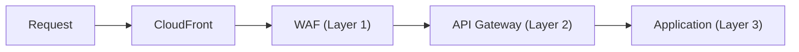

# ADR-050: API Security 和 Rate Limiting Strategy

## 狀態

**Accepted** - 2025-10-25

## 上下文

### 問題陳述

The Enterprise E-Commerce Platform's APIs 需要comprehensive security measures to protect against:

- **Credential Stuffing**: Automated login attempts using leaked credentials
- **Brute Force Attacks**: Repeated password guessing attempts
- **API Abuse**: Excessive requests consuming resources
- **Bot Attacks**: Automated scraping 和 data harvesting
- **Account Takeover**: Unauthorized access to user accounts
- **Inventory Hoarding**: Bots reserving inventory 沒有 purchasing
- **Price Scraping**: Competitors harvesting pricing data

The platform needs multi-layer API security that includes:

- Strong authentication mechanisms
- Multi-level 速率限制
- Bot detection 和 mitigation
- API key management 用於 third-party integrations
- Request validation 和 sanitization
- Comprehensive audit logging

### 業務上下文

**業務驅動因素**：

- **Revenue Protection**: Prevent bot-driven inventory hoarding ($50K/month loss)
- **Data Protection**: Protect customer PII 和 business data
- **Competitive Advantage**: Prevent price scraping 透過 competitors
- **User Experience**: Ensure legitimate users have fast, reliable access
- **Regulatory Compliance**: PCI-DSS, GDPR requirements

**Taiwan-Specific Context**:

- **High Bot Activity**: 30-40% of traffic is bot-driven
- **Credential Stuffing**: Frequent attempts using leaked databases
- **Price Competition**: Aggressive price scraping 透過 competitors
- **Fraud Attempts**: High rate of fraudulent account creation

**限制條件**：

- 必須 not impact legitimate 用戶體驗
- 必須 支援 high traffic volumes (10K req/s peak)
- 必須 integrate 與 existing JWT authentication
- 預算: Included in overall security 預算

### 技術上下文

**目前狀態**：

- JWT-based authentication (ADR-014)
- No 速率限制 implemented
- No bot detection
- No API key management 用於 third-parties
- Basic input validation

**Attack Vectors**:

- **Login Endpoint**: Credential stuffing, brute force
- **Search Endpoint**: Price scraping, inventory checking
- **Checkout Endpoint**: Inventory hoarding, fraud attempts
- **API Endpoints**: Excessive requests, data harvesting
- **Account Creation**: Fake account creation 用於 fraud

## 決策驅動因素

1. **Security**: Protect against credential stuffing 和 bot attacks
2. **Performance**: Minimal latency overhead (< 5ms)
3. **User Experience**: No impact on legitimate users
4. **Flexibility**: 支援 different rate limits per endpoint
5. **Scalability**: 處理 10K req/s peak traffic
6. **Visibility**: Comprehensive logging 和 monitoring
7. **Cost-Effectiveness**: Use existing infrastructure where possible
8. **Integration**: Seamless integration 與 JWT authentication

## 考慮的選項

### 選項 1： Multi-Layer Rate Limiting + JWT + CAPTCHA (Recommended)

**描述**： Comprehensive API security with multiple protection layers

**架構**：



**Protection Layers**:

- **Layer 1 - WAF**: Global 和 per-IP 速率限制
- **Layer 2 - API Gateway**: Per-user 和 per-API-key 速率限制
- **Layer 3 - Application**: Endpoint-specific 速率限制 和 CAPTCHA

**優點**：

- ✅ **Comprehensive Protection**: Multiple layers of defense
- ✅ **Flexible Rate Limits**: Different limits per endpoint 和 user type
- ✅ **Bot Detection**: CAPTCHA 用於 suspicious requests
- ✅ **JWT Integration**: Seamless integration 與 existing auth
- ✅ **API Key 支援**: Managed API keys 用於 third-parties
- ✅ **Performance**: < 5ms overhead
- ✅ **Scalability**: 處理s high traffic volumes

**缺點**：

- ⚠️ **複雜的ity**: Multiple 速率限制 layers to manage
- ⚠️ **CAPTCHA UX**: May impact 用戶體驗 用於 suspicious requests

**成本**： $0 (using existing infrastructure)

**風險**： **Low** - Proven approach with multiple production deployments

### 選項 2： WAF Rate Limiting Only (Basic)

**描述**： Use only WAF for rate limiting

**優點**：

- ✅ **簡單的**: Single layer of 速率限制
- ✅ **Low Cost**: No additional infrastructure

**缺點**：

- ❌ **Limited Flexibility**: 可以not differentiate 透過 user type
- ❌ **No Bot Detection**: No CAPTCHA 或 advanced bot detection
- ❌ **No API Key 支援**: 可以not manage third-party API keys

**成本**： $0

**風險**： **Medium** - Insufficient for comprehensive protection

### 選項 3： Third-Party API Security (Cloudflare Bot Management)

**描述**： Use third-party bot management service

**優點**：

- ✅ **Advanced Bot Detection**: Machine learning-based detection
- ✅ **Managed Service**: Less 營運開銷

**缺點**：

- ❌ **High Cost**: $1,000-5,000/month
- ❌ **Vendor Lock-In**: 難以migrate
- ❌ **Integration 複雜的ity**: Requires signifi可以t changes

**成本**： $1,000-5,000/month

**風險**： **Medium** - Vendor dependency and high cost

## 決策結果

**選擇的選項**： **Multi-Layer Rate Limiting + JWT + CAPTCHA**

### 理由

Multi-layer 速率限制被選擇的原因如下：

1. **Comprehensive Protection**: Multiple layers 提供 defense in depth
2. **Flexibility**: Different rate limits 用於 different endpoints 和 user types
3. **Cost-Effective**: Uses existing infrastructure (WAF, API Gateway, Application)
4. **Performance**: < 5ms overhead per request
5. **User Experience**: Minimal impact on legitimate users
6. **Bot Detection**: CAPTCHA 用於 suspicious requests
7. **API Key Management**: 支援 用於 third-party integrations

**Rate Limiting Strategy**:

**Layer 1 - WAF (Global Limits)**:

- Global: 10,000 req/min (all traffic)
- Per-IP: 2,000 req/min (per source IP)
- Purpose: Prevent volumetric attacks

**Layer 2 - API Gateway (User-Based Limits)**:

- Per-User (Authenticated): 100 req/min
- Per-API-Key (Third-Party): 1,000 req/min
- Purpose: Prevent abuse 透過 authenticated users

**Layer 3 - Application (Endpoint-Specific Limits)**:

- Login: 10 req/min per IP (prevent credential stuffing)
- Search: 100 req/min per IP (prevent scraping)
- Checkout: 20 req/min per user (prevent inventory hoarding)
- Account Creation: 5 req/min per IP (prevent fake accounts)
- Purpose: Protect sensitive endpoints

**Authentication Security**:

- JWT 與 15-minute expiration (ADR-014)
- Refresh token rotation
- Multi-factor authentication (MFA) 用於 admin accounts
- Password policy: min 12 chars, 複雜的ity requirements
- Account lockout: 5 failed attempts = 15-min lockout

**Bot Detection**:

- CAPTCHA 用於 suspicious login attempts (> 3 failures)
- Device fingerprinting
- Behavioral analysis (request patterns, timing)
- User-Agent validation

**為何不選 WAF Only**： Insufficient flexibility 用於 user-based 和 endpoint-specific 速率限制.

**為何不選 Third-Party**： High cost ($1K-5K/month) not justified when we 可以 implement comprehensive protection using existing infrastructure.

## 實作計畫

### 第 1 階段： WAF Rate Limiting （第 1 週）

- [x] Configure global 速率限制 (10,000 req/min)
- [x] Configure per-IP 速率限制 (2,000 req/min)
- [x] Test 與 load testing tools
- [x] Monitor 用於 false positives

### 第 2 階段： Application-Level Rate Limiting （第 2 週）

- [x] Implement 速率限制 middleware (Spring Boot)
- [x] Configure endpoint-specific limits
- [x] Implement Redis-based 速率限制 (distributed)
- [x] Add rate limit headers (X-RateLimit-Limit, X-RateLimit-Remaining)
- [x] Test 與 load testing

### 第 3 階段： CAPTCHA Integration （第 3 週）

- [x] Integrate Google reCAPTCHA v3
- [x] Implement CAPTCHA 用於 suspicious login attempts
- [x] Configure CAPTCHA thresholds
- [x] Test CAPTCHA flow
- [x] Monitor CAPTCHA solve rates

### 第 4 階段： API Key Management （第 4 週）

- [x] Implement API key generation 和 management
- [x] Configure API key 速率限制
- [x] Implement API key rotation
- [x] Add API key documentation
- [x] Onboard third-party partners

### Phase 5: Monitoring and Alerting （第 5 週）

- [x] Configure CloudWatch metrics
- [x] Set up 速率限制 alerts
- [x] Create monitoring dashboard
- [x] Configure automated response (Lambda)
- [x] Document runbooks

### 回滾策略

**觸發條件**：

- False positive rate > 1% (legitimate users blocked)
- Performance degradation > 10ms
- Service outage caused 透過 速率限制

**回滾步驟**：

1. Increase rate limits temporarily
2. Disable specific 速率限制 rules
3. Investigate 和 fix issues
4. Re-deploy 與 corrections

**回滾時間**： < 15 minutes

## 監控和成功標準

### 成功指標

- ✅ **Attack Prevention**: 100% of credential stuffing attempts blocked
- ✅ **False Positive Rate**: < 0.1% legitimate users affected
- ✅ **Performance**: < 5ms latency overhead
- ✅ **Bot Detection**: 95% of bot traffic identified
- ✅ **User Experience**: No complaints from legitimate users
- ✅ **成本**： No additional infrastructure cost

### 監控計畫

**CloudWatch Metrics**:

- `api.rate_limit.exceeded` (count 透過 endpoint)
- `api.authentication.failed` (count)
- `api.captcha.triggered` (count)
- `api.captcha.solved` (count)
- `api.bot.detected` (count)

**告警**：

- **P0 Critical**: Rate limit exceeded > 1000/min (potential attack)
- **P1 High**: Failed authentication > 100/min (credential stuffing)
- **P2 Medium**: CAPTCHA solve rate < 80% (potential false positives)
- **P3 Low**: Unusual traffic patterns

**審查時程**：

- **Real-Time**: 24/7 monitoring dashboard
- **Daily**: Review 速率限制 metrics
- **Weekly**: Analyze attack patterns
- **Monthly**: Optimize rate limits based on traffic patterns

## 後果

### 正面後果

- ✅ **Enhanced Security**: Protection against credential stuffing 和 bot attacks
- ✅ **Revenue Protection**: Prevent inventory hoarding 和 fraud
- ✅ **Data Protection**: Prevent price scraping 和 data harvesting
- ✅ **User Experience**: Minimal impact on legitimate users
- ✅ **Cost-Effective**: No additional infrastructure cost
- ✅ **Scalability**: 處理s high traffic volumes
- ✅ **Flexibility**: Different rate limits per endpoint 和 user type

### 負面後果

- ⚠️ **Operational 複雜的ity**: Multiple 速率限制 layers to manage
- ⚠️ **CAPTCHA UX**: May impact 用戶體驗 用於 suspicious requests
- ⚠️ **False Positive Risk**: Potential 用於 blocking legitimate users

### 技術債務

**已識別債務**：

1. Manual rate limit tuning (acceptable initially)
2. Basic bot detection (User-Agent only)
3. No machine learning-based anomaly detection

**債務償還計畫**：

- **Q2 2026**: Implement automated rate limit tuning
- **Q3 2026**: Implement advanced bot detection (device fingerprinting, behavioral analysis)
- **Q4 2026**: Implement machine learning-based anomaly detection

## 相關決策

- [ADR-014: JWT-Based Authentication Strategy](014-jwt-based-authentication-strategy.md) - Authentication mechanism
- [ADR-023: API Rate Limiting Strategy (Token Bucket vs Leaky Bucket)](023-api-rate-limiting-strategy.md) - Rate limiting algorithm
- [ADR-048: DDoS Protection Strategy (Multi-Layer Defense)](048-ddos-protection-strategy.md) - Overall DDoS protection
- [ADR-049: Web Application Firewall (WAF) Rules 和 Policies](049-web-application-firewall-rules-and-policies.md) - WAF configuration
- [ADR-051: Input Validation 和 Sanitization Strategy](051-input-validation-and-sanitization-strategy.md) - Input validation

## 備註

### Rate Limiting Configuration

**Spring Boot Rate Limiting (Bucket4j)**:

```java
@Configuration
public class RateLimitingConfiguration {
    
    @Bean
    public RateLimiter loginRateLimiter() {
        return RateLimiter.builder()
            .limit(Limit.of(10).per(Duration.ofMinutes(1)))
            .build();
    }
    
    @Bean
    public RateLimiter searchRateLimiter() {
        return RateLimiter.builder()
            .limit(Limit.of(100).per(Duration.ofMinutes(1)))
            .build();
    }
}
```

**Redis-Based Distributed Rate Limiting**:

```java
@Component
public class RedisRateLimiter {
    
    private final RedisTemplate<String, String> redisTemplate;
    
    public boolean isAllowed(String key, int limit, Duration window) {
        String redisKey = "rate_limit:" + key;
        Long count = redisTemplate.opsForValue().increment(redisKey);
        
        if (count == 1) {
            redisTemplate.expire(redisKey, window);
        }
        
        return count <= limit;
    }
}
```

### CAPTCHA Configuration

**Google reCAPTCHA v3**:

```yaml
# application.yml
recaptcha:
  site-key: ${RECAPTCHA_SITE_KEY}
  secret-key: ${RECAPTCHA_SECRET_KEY}
  threshold: 0.5  # Score threshold (0.0-1.0)
```

**CAPTCHA Trigger Logic**:

```java
@Service
public class CaptchaService {
    
    public boolean requiresCaptcha(String ipAddress) {
        int failedAttempts = getFailedAttempts(ipAddress);
        return failedAttempts >= 3;
    }
    
    public boolean verifyCaptcha(String token) {
        // Verify with Google reCAPTCHA API
        float score = verifyWithGoogle(token);
        return score >= 0.5;
    }
}
```

### API Key Management

**API Key Generation**:

```java
@Service
public class ApiKeyService {
    
    public ApiKey generateApiKey(String partnerId) {
        String key = UUID.randomUUID().toString();
        String hashedKey = BCrypt.hashpw(key, BCrypt.gensalt());
        
        ApiKey apiKey = new ApiKey(
            partnerId,
            hashedKey,
            LocalDateTime.now().plusYears(1)  // 1-year expiration
        );
        
        return apiKeyRepository.save(apiKey);
    }
}
```

### Cost Breakdown

**Monthly Costs**:

- WAF Rate Limiting: $0 (included in WAF cost)
- Application Rate Limiting: $0 (using existing Redis)
- CAPTCHA: $0 (free tier: 1M assessments/month)
- API Key Management: $0 (application logic)
- **Total**: $0 (no additional cost)

---

**文檔狀態**： ✅ Accepted  
**上次審查**： 2025-10-25  
**下次審查**： 2026-01-25 （每季）
