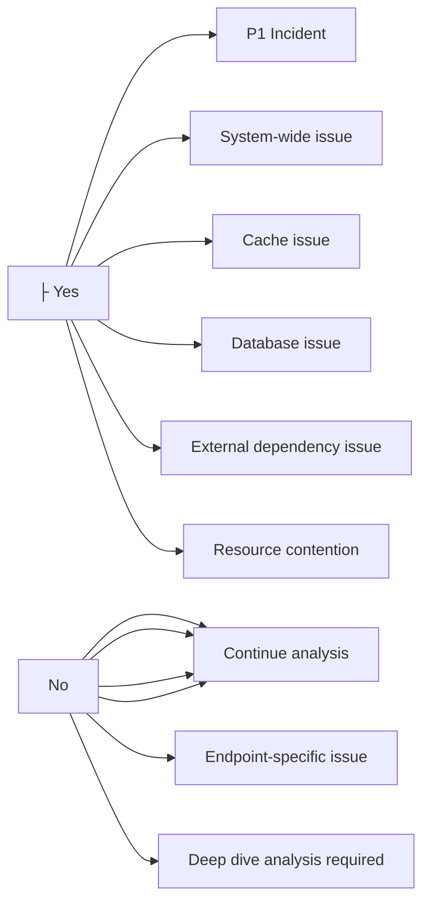

# Performance Degradation Troubleshooting Guide

## 概述

本指南提供系統化方法來診斷和解決 Enterprise E-Commerce Platform 中的效能降級問題。涵蓋 APM tool 使用、cache 分析、database 優化、API 效能、資源競爭和外部依賴問題。

## Performance Degradation 指標

### 關鍵症狀

- 回應時間持續增加
- 錯誤率逐漸上升
- 資源使用率呈上升趨勢
- Cache 命中率下降
- Database 查詢時間增加
- 外部 API timeouts 增加
- 使用者抱怨緩慢

### 嚴重性分類

| Severity | Response Time | Impact | Action Required |
|----------|---------------|--------|-----------------|
| **P1 - Critical** | > 5s (95th percentile) | 所有使用者受影響 | 立即行動 |
| **P2 - High** | > 3s (95th percentile) | 重大使用者影響 | Within 1 hour |
| **P3 - Medium** | > 2s (95th percentile) | 體驗降級 | Within 4 hours |
| **P4 - Low** | > 1.5s (95th percentile) | 輕微影響 | Within 24 hours |

## 系統化 Performance 分析工作流程

### Phase 1：初步評估 (5-10 分鐘)

#### Step 1：識別影響範圍

```bash
# 檢查整體系統 health
curl http://localhost:8080/actuator/health | jq

# 檢查回應時間 metrics
curl http://localhost:8080/actuator/metrics/http.server.requests | jq '.measurements'

# 識別受影響的 endpoints
kubectl logs deployment/ecommerce-backend -n production --tail=1000 | \
  grep "duration" | awk '{print $NF, $0}' | sort -rn | head -20
```

#### Step 2：檢查資源使用率

```bash
# Pod 資源使用
kubectl top pods -n production -l app=ecommerce-backend

# Node 資源使用
kubectl top nodes

# Database 資源使用
aws rds describe-db-instances \
  --db-instance-identifier ecommerce-prod \
  --query 'DBInstances[0].[CPUUtilization,FreeableMemory,DatabaseConnections]'

# Redis 資源使用
kubectl exec -it redis-0 -n production -- redis-cli INFO stats
```

#### Step 3：檢視最近變更

```bash
# 檢查最近的 deployments
kubectl rollout history deployment/ecommerce-backend -n production

# 檢查最近的設定變更
kubectl get configmap ecommerce-config -n production -o yaml | \
  kubectl diff -f - 2>&1 | head -50

# 檢視最近的程式碼變更
git log --oneline --since="24 hours ago" --all
```

### Phase 2：APM Tool 分析 (10-20 分鐘)

#### CloudWatch Insights 分析

##### Query 1：識別緩慢請求

```sql
-- CloudWatch Insights query for slow requests
fields @timestamp, @message, duration, endpoint, traceId
| filter @message like /duration/
| parse @message /duration=(?<duration>\d+)/
| filter duration > 2000
| sort duration desc
| limit 100
```

##### Query 2：錯誤率分析

```sql
-- Error rate by endpoint
fields @timestamp, endpoint, statusCode
| filter statusCode >= 400
| stats count() as errorCount by endpoint, statusCode
| sort errorCount desc
```

##### Query 3：請求量模式

```sql
-- Request volume over time
fields @timestamp
| filter @message like /HTTP/
| stats count() as requestCount by bin(5m)
| sort @timestamp desc
```

##### Query 4：Database 查詢效能

```sql
-- Slow database queries
fields @timestamp, @message, queryTime, query
| filter @message like /query/
| parse @message /queryTime=(?<queryTime>\d+)/
| filter queryTime > 100
| stats avg(queryTime) as avgTime, max(queryTime) as maxTime, count() as queryCount by query
| sort avgTime desc
```

#### AWS X-Ray Distributed Tracing

##### 分析 Service Map

```bash
# 取得時間範圍的 service map
aws xray get-service-graph \
  --start-time $(date -u -d '1 hour ago' +%s) \
  --end-time $(date -u +%s) \
  --output json | jq '.Services[] | {Name: .Name, ResponseTime: .SummaryStatistics.TotalResponseTime}'

# 識別瓶頸 services
aws xray get-service-graph \
  --start-time $(date -u -d '1 hour ago' +%s) \
  --end-time $(date -u +%s) \
  --output json | jq '.Services[] | select(.SummaryStatistics.TotalResponseTime.Average > 1)'
```

##### 緩慢請求的 Trace 分析

```bash
# 取得緩慢請求的 trace summaries
aws xray get-trace-summaries \
  --start-time $(date -u -d '1 hour ago' +%s) \
  --end-time $(date -u +%s) \
  --filter-expression 'duration > 2' \
  --output json | jq '.TraceSummaries[] | {Id: .Id, Duration: .Duration, Http: .Http}'

# 取得詳細 trace
TRACE_ID="1-5f8a1234-abcd1234efgh5678ijkl9012"
aws xray batch-get-traces --trace-ids ${TRACE_ID} --output json | \
  jq '.Traces[0].Segments[] | {Name: .Document.name, Duration: .Document.end_time - .Document.start_time}'
```

##### 識別 Subsegment 瓶頸

```bash
# 分析 trace 內的 subsegments
aws xray batch-get-traces --trace-ids ${TRACE_ID} --output json | \
  jq '.Traces[0].Segments[0].Document.subsegments[] |
      {Name: .name, Duration: (.end_time - .start_time),
       Error: .error, Fault: .fault}' | \
  jq -s 'sort_by(.Duration) | reverse'
```

#### Prometheus Metrics 分析

```bash
# 查詢回應時間 percentiles
curl -g 'http://prometheus:9090/api/v1/query?query=histogram_quantile(0.95,rate(http_request_duration_seconds_bucket[5m]))' | \
  jq '.data.result[] | {endpoint: .metric.uri, p95: .value[1]}'

# 查詢錯誤率
curl -g 'http://prometheus:9090/api/v1/query?query=rate(http_requests_total{status=~"5.."}[5m])' | \
  jq '.data.result[] | {endpoint: .metric.uri, errorRate: .value[1]}'

# 查詢 throughput
curl -g 'http://prometheus:9090/api/v1/query?query=rate(http_requests_total[5m])' | \
  jq '.data.result[] | {endpoint: .metric.uri, rps: .value[1]}'
```

### Phase 3：Cache Performance 分析 (10-15 分鐘)

#### Application Cache 分析

```bash
# 檢查 cache hit rate
HIT=$(curl -s http://localhost:8080/actuator/metrics/cache.gets?tag=result:hit | jq '.measurements[0].value')
MISS=$(curl -s http://localhost:8080/actuator/metrics/cache.gets?tag=result:miss | jq '.measurements[0].value')
TOTAL=$((HIT + MISS))
HIT_RATE=$(echo "scale=2; $HIT / $TOTAL * 100" | bc)
echo "Cache hit rate: ${HIT_RATE}%"

# 檢查 cache 大小
curl http://localhost:8080/actuator/metrics/cache.size | jq

# 檢查 cache evictions
curl http://localhost:8080/actuator/metrics/cache.evictions | jq
```

#### Redis Cache 分析

```bash
# 連線至 Redis
kubectl exec -it redis-0 -n production -- redis-cli

# 檢查 Redis stats
INFO stats

# 要檢視的關鍵 metrics：
# - keyspace_hits: 成功查找數量
# - keyspace_misses: 失敗查找數量
# - instantaneous_ops_per_sec: 目前每秒操作數
# - used_memory: 目前 memory 使用量
# - evicted_keys: 被驅逐的 keys 數量

# 計算 hit rate
redis-cli INFO stats | grep -E "keyspace_hits|keyspace_misses" | \
  awk -F: '{sum+=$2} END {print "Hit rate:", (NR>0 ? $2/sum*100 : 0) "%"}'

# 檢查 slow log
redis-cli SLOWLOG GET 20

# 依 key 模式檢查 memory 使用
redis-cli --bigkeys

# 檢查 key expiration
redis-cli TTL <key>

# 監控即時指令
redis-cli MONITOR | head -100
```

#### Cache 優化策略

**低 Hit Rate (< 70%)**：

```bash
# 識別未被 cache 的常存取 keys
kubectl logs deployment/ecommerce-backend -n production --tail=5000 | \
  grep "cache miss" | awk '{print $NF}' | sort | uniq -c | sort -rn | head -20

# 用常存取資料預熱 cache
curl -X POST http://localhost:8080/admin/cache/warm \
  -H "Content-Type: application/json" \
  -d '{"keys": ["popular-products", "categories"]}'
```

**高 Eviction Rate**：

```bash
# 增加 cache 大小
kubectl set env deployment/ecommerce-backend \
  SPRING_CACHE_REDIS_TIME_TO_LIVE=3600000 \
  -n production

# 或增加 Redis memory
kubectl edit statefulset redis -n production
# 更新 resources.limits.memory
```

### Phase 4：Database Query 優化工作流程 (15-30 分鐘)

#### Step 1：識別緩慢查詢

```bash
# 連線至 database
kubectl exec -it ${POD_NAME} -n production -- \
  psql -h ${DB_HOST} -U ${DB_USER} -d ${DB_NAME}
```

```sql
-- 從 pg_stat_statements 取得最慢查詢
SELECT
    query,
    calls,
    total_time,
    mean_time,
    max_time,
    stddev_time,
    rows,
    100.0 * shared_blks_hit / NULLIF(shared_blks_hit + shared_blks_read, 0) AS cache_hit_ratio
FROM pg_stat_statements
WHERE query NOT LIKE '%pg_stat_statements%'
ORDER BY mean_time DESC
LIMIT 20;

-- 取得目前執行中的緩慢查詢
SELECT
    pid,
    now() - query_start AS duration,
    state,
    wait_event_type,
    wait_event,
    query
FROM pg_stat_activity
WHERE state != 'idle'
  AND now() - query_start > interval '5 seconds'
ORDER BY duration DESC;

-- 檢查阻擋查詢
SELECT
    blocked_locks.pid AS blocked_pid,
    blocked_activity.usename AS blocked_user,
    blocking_locks.pid AS blocking_pid,
    blocking_activity.usename AS blocking_user,
    blocked_activity.query AS blocked_statement,
    blocking_activity.query AS blocking_statement
FROM pg_catalog.pg_locks blocked_locks
JOIN pg_catalog.pg_stat_activity blocked_activity ON blocked_activity.pid = blocked_locks.pid
JOIN pg_catalog.pg_locks blocking_locks
    ON blocking_locks.locktype = blocked_locks.locktype
    AND blocking_locks.database IS NOT DISTINCT FROM blocked_locks.database
    AND blocking_locks.relation IS NOT DISTINCT FROM blocked_locks.relation
    AND blocking_locks.page IS NOT DISTINCT FROM blocked_locks.page
    AND blocking_locks.tuple IS NOT DISTINCT FROM blocked_locks.tuple
    AND blocking_locks.virtualxid IS NOT DISTINCT FROM blocked_locks.virtualxid
    AND blocking_locks.transactionid IS NOT DISTINCT FROM blocked_locks.transactionid
    AND blocking_locks.classid IS NOT DISTINCT FROM blocked_locks.classid
    AND blocking_locks.objid IS NOT DISTINCT FROM blocked_locks.objid
    AND blocking_locks.objsubid IS NOT DISTINCT FROM blocked_locks.objsubid
    AND blocking_locks.pid != blocked_locks.pid
JOIN pg_catalog.pg_stat_activity blocking_activity ON blocking_activity.pid = blocking_locks.pid
WHERE NOT blocked_locks.granted;
```

#### Step 2：分析查詢執行計畫

```sql
-- 分析特定緩慢查詢
EXPLAIN (ANALYZE, BUFFERS, VERBOSE, FORMAT JSON)
SELECT o.*, c.name, c.email
FROM orders o
JOIN customers c ON o.customer_id = c.id
WHERE o.created_at > NOW() - INTERVAL '7 days'
ORDER BY o.created_at DESC
LIMIT 100;

-- 尋找：
-- - 大型 tables 的 sequential scans (Seq Scan)
-- - 高執行時間
-- - 高 buffer reads
-- - 缺少 indexes
```

#### Step 3：Index 分析與優化

```sql
-- 找出缺少的 indexes
SELECT
    schemaname,
    tablename,
    attname,
    n_distinct,
    correlation
FROM pg_stats
WHERE schemaname = 'public'
  AND n_distinct > 100
  AND correlation < 0.1
ORDER BY n_distinct DESC;

-- 檢查 index 使用情況
SELECT
    schemaname,
    tablename,
    indexname,
    idx_scan,
    idx_tup_read,
    idx_tup_fetch,
    pg_size_pretty(pg_relation_size(indexrelid)) AS index_size
FROM pg_stat_user_indexes
ORDER BY idx_scan ASC, pg_relation_size(indexrelid) DESC;

-- 找出未使用的 indexes (移除候選)
SELECT
    schemaname,
    tablename,
    indexname,
    idx_scan,
    pg_size_pretty(pg_relation_size(indexrelid)) AS index_size
FROM pg_stat_user_indexes
WHERE idx_scan = 0
  AND indexrelname NOT LIKE '%pkey'
ORDER BY pg_relation_size(indexrelid) DESC;

-- 建立缺少的 indexes
CREATE INDEX CONCURRENTLY idx_orders_created_at_customer_id
ON orders(created_at, customer_id)
WHERE status = 'ACTIVE';

-- 驗證 index 正被使用
EXPLAIN ANALYZE
SELECT * FROM orders
WHERE created_at > NOW() - INTERVAL '7 days'
  AND status = 'ACTIVE';
```

#### Step 4：Connection Pool 分析

```bash
# 檢查 connection pool metrics
curl http://localhost:8080/actuator/metrics/hikaricp.connections.active | jq
curl http://localhost:8080/actuator/metrics/hikaricp.connections.idle | jq
curl http://localhost:8080/actuator/metrics/hikaricp.connections.pending | jq
curl http://localhost:8080/actuator/metrics/hikaricp.connections.timeout | jq

# 檢查 database connections
kubectl exec -it ${POD_NAME} -n production -- \
  psql -h ${DB_HOST} -U ${DB_USER} -d ${DB_NAME} -c \
  "SELECT count(*), state FROM pg_stat_activity GROUP BY state;"
```

```sql
-- 識別 connection leaks
SELECT
    pid,
    usename,
    application_name,
    client_addr,
    state,
    state_change,
    now() - state_change AS idle_duration,
    query
FROM pg_stat_activity
WHERE state = 'idle in transaction'
  AND now() - state_change > interval '5 minutes'
ORDER BY idle_duration DESC;

-- Kill idle connections
SELECT pg_terminate_backend(pid)
FROM pg_stat_activity
WHERE state = 'idle in transaction'
  AND now() - state_change > interval '10 minutes';
```

#### Step 5：Database 維護

```sql
-- 檢查 table bloat
SELECT
    schemaname,
    tablename,
    pg_size_pretty(pg_total_relation_size(schemaname||'.'||tablename)) AS total_size,
    pg_size_pretty(pg_relation_size(schemaname||'.'||tablename)) AS table_size,
    pg_size_pretty(pg_total_relation_size(schemaname||'.'||tablename) - pg_relation_size(schemaname||'.'||tablename)) AS index_size
FROM pg_tables
WHERE schemaname = 'public'
ORDER BY pg_total_relation_size(schemaname||'.'||tablename) DESC
LIMIT 20;

-- 執行 VACUUM ANALYZE
VACUUM ANALYZE orders;
VACUUM ANALYZE customers;

-- 必要時 reindex
REINDEX TABLE CONCURRENTLY orders;
```

### Phase 5：API Response Time 分析 (10-15 分鐘)

#### Endpoint Performance Profiling

```bash
# 依 endpoint 取得回應時間
curl http://localhost:8080/actuator/metrics/http.server.requests | \
  jq '.availableTags[] | select(.tag == "uri") | .values[]' | \
  while read endpoint; do
    echo "Endpoint: $endpoint"
    curl -s "http://localhost:8080/actuator/metrics/http.server.requests?tag=uri:$endpoint" | \
      jq '.measurements[] | select(.statistic == "TOTAL_TIME") | .value'
  done

# 分析請求模式
kubectl logs deployment/ecommerce-backend -n production --tail=5000 | \
  grep "HTTP" | \
  awk '{print $7}' | \
  sort | uniq -c | sort -rn | head -20

# 識別緩慢 endpoints
kubectl logs deployment/ecommerce-backend -n production --tail=5000 | \
  grep "duration" | \
  awk '{if ($NF > 2000) print $0}' | \
  awk '{print $(NF-1)}' | \
  sort | uniq -c | sort -rn
```

#### Request Payload 分析

```bash
# 檢查大型 request/response payloads
kubectl logs deployment/ecommerce-backend -n production --tail=1000 | \
  grep -E "request|response" | \
  grep -oP 'size=\K\d+' | \
  awk '{sum+=$1; count++} END {print "Average size:", sum/count, "bytes"}'

# 識別具有大型 payloads 的 endpoints
kubectl logs deployment/ecommerce-backend -n production --tail=5000 | \
  grep "response" | \
  awk '{print $(NF-1), $NF}' | \
  awk '{if ($2 > 100000) print $0}' | \
  sort -k2 -rn | head -20
```

#### API Gateway 分析

```bash
# 檢查 API Gateway metrics (如使用 AWS API Gateway)
aws apigateway get-rest-apis --query 'items[].{name:name,id:id}'

# 取得 API Gateway metrics
aws cloudwatch get-metric-statistics \
  --namespace AWS/ApiGateway \
  --metric-name Latency \
  --dimensions Name=ApiName,Value=ecommerce-api \
  --start-time $(date -u -d '1 hour ago' --iso-8601=seconds) \
  --end-time $(date -u --iso-8601=seconds) \
  --period 300 \
  --statistics Average,Maximum
```

### Phase 6：資源競爭識別 (10-15 分鐘)

#### CPU Contention 分析

```bash
# 依 pod 檢查 CPU 使用
kubectl top pods -n production -l app=ecommerce-backend --sort-by=cpu

# 取得詳細 CPU metrics
kubectl exec -it ${POD_NAME} -n production -- top -b -n 1

# 檢查 CPU throttling
kubectl describe pod ${POD_NAME} -n production | grep -A 5 "cpu"

# 分析 CPU 使用模式
aws cloudwatch get-metric-statistics \
  --namespace AWS/ECS \
  --metric-name CPUUtilization \
  --dimensions Name=ServiceName,Value=ecommerce-backend \
  --start-time $(date -u -d '1 hour ago' --iso-8601=seconds) \
  --end-time $(date -u --iso-8601=seconds) \
  --period 60 \
  --statistics Average,Maximum
```

#### Memory Contention 分析

```bash
# 檢查 memory 使用
kubectl top pods -n production -l app=ecommerce-backend --sort-by=memory

# 檢查 OOM kills
kubectl get events -n production | grep OOMKilled

# 分析 heap 使用
curl http://localhost:8080/actuator/metrics/jvm.memory.used | jq
curl http://localhost:8080/actuator/metrics/jvm.memory.max | jq

# 檢查 garbage collection
curl http://localhost:8080/actuator/metrics/jvm.gc.pause | jq
curl http://localhost:8080/actuator/metrics/jvm.gc.memory.allocated | jq

# 取得 heap dump 進行分析
kubectl exec -it ${POD_NAME} -n production -- \
  jmap -dump:format=b,file=/tmp/heap.hprof 1

# 複製 heap dump 至本地
kubectl cp production/${POD_NAME}:/tmp/heap.hprof ./heap.hprof
```

#### I/O Contention 分析

```bash
# 檢查 disk I/O
kubectl exec -it ${POD_NAME} -n production -- iostat -x 1 5

# 檢查 network I/O
kubectl exec -it ${POD_NAME} -n production -- \
  cat /proc/net/dev | awk '{print $1, $2, $10}'

# 檢查 I/O wait
kubectl exec -it ${POD_NAME} -n production -- \
  top -b -n 1 | grep "Cpu(s)" | awk '{print "I/O wait:", $10}'
```

#### Thread Contention 分析

```bash
# 取得 thread dump
kubectl exec -it ${POD_NAME} -n production -- \
  jstack 1 > /tmp/thread-dump.txt

# 分析 thread states
kubectl exec -it ${POD_NAME} -n production -- \
  jstack 1 | grep "java.lang.Thread.State" | sort | uniq -c

# 檢查 deadlocks
kubectl exec -it ${POD_NAME} -n production -- \
  jstack 1 | grep -A 10 "Found.*deadlock"

# 監控 thread pool metrics
curl http://localhost:8080/actuator/metrics/executor.active | jq
curl http://localhost:8080/actuator/metrics/executor.queued | jq
curl http://localhost:8080/actuator/metrics/executor.pool.size | jq
```

#### Database Lock Contention

```sql
-- 檢查 lock waits
SELECT
    locktype,
    relation::regclass,
    mode,
    transactionid AS tid,
    virtualtransaction AS vtid,
    pid,
    granted
FROM pg_locks
WHERE NOT granted
ORDER BY relation;

-- 檢查 table-level locks
SELECT
    l.locktype,
    l.database,
    l.relation::regclass,
    l.page,
    l.tuple,
    l.transactionid,
    l.mode,
    l.granted,
    a.usename,
    a.query,
    a.query_start
FROM pg_locks l
LEFT JOIN pg_stat_activity a ON l.pid = a.pid
WHERE l.relation IS NOT NULL
ORDER BY l.granted, a.query_start;
```

### Phase 7：外部依賴 Performance 問題 (10-15 分鐘)

#### 識別外部依賴

```bash
# 從 logs 列出外部 service 呼叫
kubectl logs deployment/ecommerce-backend -n production --tail=5000 | \
  grep -i "external\|http\|api" | \
  grep -oP 'host=\K[^,]+' | \
  sort | uniq -c | sort -rn

# 檢查 circuit breaker 狀態
curl http://localhost:8080/actuator/circuitbreakers | jq

# 檢查 retry metrics
curl http://localhost:8080/actuator/metrics/resilience4j.retry.calls | jq
```

#### Payment Gateway 分析

```bash
# 測試 payment gateway 連線
curl -w "@curl-format.txt" -o /dev/null -s https://payment-gateway.example.com/health

# 檢查 payment gateway 回應時間
kubectl logs deployment/ecommerce-backend -n production --tail=5000 | \
  grep "payment" | \
  grep "duration" | \
  awk '{print $NF}' | \
  awk '{sum+=$1; count++} END {print "Average:", sum/count, "ms"}'

# 檢查 payment gateway 錯誤率
kubectl logs deployment/ecommerce-backend -n production --tail=5000 | \
  grep "payment" | \
  grep -c "error"
```

#### Email Service 分析

```bash
# 檢查 email service 效能
kubectl logs deployment/ecommerce-backend -n production --tail=5000 | \
  grep "email" | \
  grep "duration" | \
  awk '{print $NF}' | \
  sort -rn | head -20

# 檢查 email queue 深度
curl http://localhost:8080/actuator/metrics/email.queue.size | jq
```

#### Shipping Provider 分析

```bash
# 測試 shipping provider API
curl -w "@curl-format.txt" -o /dev/null -s https://shipping-api.example.com/health

# 檢查 shipping API 回應時間
kubectl logs deployment/ecommerce-backend -n production --tail=5000 | \
  grep "shipping" | \
  grep "duration" | \
  awk '{sum+=$1; count++} END {print "Average:", sum/count, "ms"}'
```

#### Kafka/MSK Performance 分析

```bash
# 檢查 consumer lag
kubectl exec -it kafka-0 -n production -- \
  kafka-consumer-groups --bootstrap-server localhost:9092 \
  --describe --group ecommerce-consumer

# 檢查 broker metrics
kubectl exec -it kafka-0 -n production -- \
  kafka-broker-api-versions --bootstrap-server localhost:9092

# 監控 message throughput
aws cloudwatch get-metric-statistics \
  --namespace AWS/Kafka \
  --metric-name BytesInPerSec \
  --dimensions Name=Cluster Name,Value=ecommerce-cluster \
  --start-time $(date -u -d '1 hour ago' --iso-8601=seconds) \
  --end-time $(date -u --iso-8601=seconds) \
  --period 300 \
  --statistics Average,Maximum
```

#### DNS Resolution 問題

```bash
# 測試 DNS resolution
kubectl exec -it ${POD_NAME} -n production -- \
  nslookup payment-gateway.example.com

# 檢查 DNS query 時間
kubectl exec -it ${POD_NAME} -n production -- \
  time nslookup payment-gateway.example.com

# 檢查 CoreDNS logs
kubectl logs -n kube-system -l k8s-app=kube-dns --tail=100

# 使用不同 DNS server 測試
kubectl exec -it ${POD_NAME} -n production -- \
  nslookup payment-gateway.example.com 8.8.8.8
```

#### Network Latency 分析

```bash
# 測試至外部 services 的 network latency
kubectl exec -it ${POD_NAME} -n production -- \
  ping -c 10 payment-gateway.example.com

# Traceroute 至外部 service
kubectl exec -it ${POD_NAME} -n production -- \
  traceroute payment-gateway.example.com

# 檢查 network policies
kubectl get networkpolicies -n production

# 使用 curl timing 測試連線
kubectl exec -it ${POD_NAME} -n production -- \
  curl -w "@curl-format.txt" -o /dev/null -s https://payment-gateway.example.com/health
```

## 解決策略

### 立即行動 (0-15 分鐘)

#### 1. Scale 資源

```bash
# Horizontal scaling
kubectl scale deployment/ecommerce-backend --replicas=10 -n production

# Vertical scaling (需要重啟)
kubectl set resources deployment/ecommerce-backend \
  --limits=cpu=2000m,memory=4Gi \
  --requests=cpu=1000m,memory=2Gi \
  -n production
```

#### 2. 清除有問題的 Cache

```bash
# 清除特定 cache
curl -X POST http://localhost:8080/actuator/caches/products \
  -H "Content-Type: application/json" \
  -d '{"action":"clear"}'

# 清除所有 caches
curl -X DELETE http://localhost:8080/actuator/caches

# 清除 Redis cache
kubectl exec -it redis-0 -n production -- redis-cli FLUSHDB
```

#### 3. Kill 阻擋查詢

```sql
-- Kill 特定查詢
SELECT pg_terminate_backend(12345);

-- Kill 所有長時間執行的查詢
SELECT pg_terminate_backend(pid)
FROM pg_stat_activity
WHERE state = 'active'
  AND now() - query_start > interval '30 seconds'
  AND query NOT LIKE '%pg_stat_activity%';
```

#### 4. 重啟有問題的 Services

```bash
# 重啟 application
kubectl rollout restart deployment/ecommerce-backend -n production

# 重啟 Redis
kubectl rollout restart statefulset/redis -n production

# 重啟特定 pod
kubectl delete pod ${POD_NAME} -n production
```

### 短期修復 (15 分鐘 - 4 小時)

#### 1. Database Query 優化

```sql
-- 新增缺少的 indexes
CREATE INDEX CONCURRENTLY idx_orders_customer_created
ON orders(customer_id, created_at DESC);

-- 更新統計資料
ANALYZE orders;
ANALYZE customers;

-- 優化查詢
-- Before: N+1 problem
-- After: 在 JPA 中使用 JOIN FETCH
```

```java
// 優化 repository query
@Query("SELECT o FROM Order o " +
       "JOIN FETCH o.customer " +
       "JOIN FETCH o.items " +
       "WHERE o.createdAt > :date")
List<Order> findRecentOrdersWithDetails(@Param("date") LocalDateTime date);
```

#### 2. 實作 Caching

```java
@Service
public class ProductService {

    @Cacheable(value = "products", key = "#id", unless = "#result == null")
    public Product findById(String id) {
        return productRepository.findById(id)
            .orElseThrow(() -> new ProductNotFoundException(id));
    }

    @CacheEvict(value = "products", key = "#product.id")
    public Product updateProduct(Product product) {
        return productRepository.save(product);
    }
}
```

#### 3. 優化外部 API 呼叫

```java
@Service
public class PaymentService {

    @CircuitBreaker(name = "payment", fallbackMethod = "paymentFallback")
    @Retry(name = "payment")
    @TimeLimiter(name = "payment")
    public CompletableFuture<PaymentResult> processPayment(PaymentRequest request) {
        return CompletableFuture.supplyAsync(() ->
            paymentClient.process(request)
        );
    }

    public CompletableFuture<PaymentResult> paymentFallback(
        PaymentRequest request, Exception ex) {
        return CompletableFuture.completedFuture(
            PaymentResult.queued("Payment queued for processing")
        );
    }
}
```

#### 4. Connection Pool 調校

```yaml
# 更新 application 設定
spring:
  datasource:
    hikari:
      maximum-pool-size: 30
      minimum-idle: 10
      connection-timeout: 20000
      idle-timeout: 300000
      max-lifetime: 1200000
      leak-detection-threshold: 60000
```

```bash
# 套用設定
kubectl set env deployment/ecommerce-backend \
  SPRING_DATASOURCE_HIKARI_MAXIMUM_POOL_SIZE=30 \
  SPRING_DATASOURCE_HIKARI_MINIMUM_IDLE=10 \
  -n production
```

### 長期解決方案 (> 4 小時)

#### 1. 程式碼優化

```java
// 實作 pagination
@GetMapping("/orders")
public Page<OrderDTO> getOrders(
    @RequestParam(defaultValue = "0") int page,
    @RequestParam(defaultValue = "20") int size) {

    Pageable pageable = PageRequest.of(page, size,
        Sort.by("createdAt").descending());
    return orderService.findOrders(pageable);
}

// 使用 database projections
@Query("SELECT new com.example.OrderSummaryDTO(o.id, o.total, c.name) " +
       "FROM Order o JOIN o.customer c WHERE o.status = :status")
List<OrderSummaryDTO> findOrderSummaries(@Param("status") OrderStatus status);

// 實作 async processing
@Async
public CompletableFuture<Void> sendOrderConfirmation(Order order) {
    emailService.sendConfirmation(order);
    return CompletableFuture.completedFuture(null);
}
```

#### 2. 架構改進

- 為讀取密集操作實作 read replicas
- 為靜態內容新增 CDN
- 實作 API rate limiting
- 為突發流量新增 request queuing
- 為大型 tables 實作 database sharding

#### 3. 基礎設施優化

```bash
# 啟用 RDS Performance Insights
aws rds modify-db-instance \
  --db-instance-identifier ecommerce-prod \
  --enable-performance-insights \
  --performance-insights-retention-period 7

# 設定 ElastiCache cluster mode
aws elasticache modify-replication-group \
  --replication-group-id ecommerce-redis \
  --cache-node-type cache.r6g.xlarge \
  --apply-immediately

# 啟用 EKS cluster autoscaling
kubectl apply -f - <<EOF
apiVersion: autoscaling/v2
kind: HorizontalPodAutoscaler
metadata:
  name: ecommerce-backend-hpa
  namespace: production
spec:
  scaleTargetRef:
    apiVersion: apps/v1
    kind: Deployment
    name: ecommerce-backend
  minReplicas: 3
  maxReplicas: 20
  metrics:
  - type: Resource
    resource:
      name: cpu
      target:
        type: Utilization
        averageUtilization: 70
  - type: Resource
    resource:
      name: memory
      target:
        type: Utilization
        averageUtilization: 80
EOF
```

## 驗證 Checklist

實施修復後，驗證以下項目：

- [ ] 回應時間 < 2s (95th percentile)
- [ ] 錯誤率 < 1%
- [ ] Cache hit rate > 80%
- [ ] Database query 時間 < 100ms (95th percentile)
- [ ] Connection pool 使用率 < 80%
- [ ] CPU 使用率 < 70%
- [ ] Memory 使用率 < 80%
- [ ] 無 slow query alerts
- [ ] 外部 API 呼叫在 SLA 內
- [ ] 無資源競爭
- [ ] 使用者體驗改善

### 驗證指令

```bash
# 監控回應時間
watch -n 5 'curl -s http://localhost:8080/actuator/metrics/http.server.requests | \
  jq ".measurements[] | select(.statistic == \"MAX\") | .value"'

# 監控錯誤率
watch -n 5 'kubectl logs deployment/ecommerce-backend -n production --tail=100 | \
  grep -c "ERROR"'

# 監控資源使用
watch -n 5 'kubectl top pods -n production -l app=ecommerce-backend'
```

## 預防策略

### 1. 持續監控

```yaml
# 設定全面 alerts
groups:
  - name: performance-degradation
    rules:
      - alert: ResponseTimeDegrading
        expr: |
          rate(http_request_duration_seconds_sum[5m]) /
          rate(http_request_duration_seconds_count[5m]) > 1.5
        for: 10m
        labels:
          severity: warning
        annotations:
          summary: "API response time degrading"

      - alert: CacheHitRateLow
        expr: |
          rate(cache_gets_total{result="hit"}[5m]) /
          rate(cache_gets_total[5m]) < 0.7
        for: 15m
        labels:
          severity: warning

      - alert: DatabaseQuerySlow
        expr: pg_stat_statements_mean_exec_time_seconds > 0.1
        for: 10m
        labels:
          severity: warning
```

### 2. 定期 Performance 測試

```bash
# 每週 load testing
./scripts/load-test.sh \
  --duration=30m \
  --users=1000 \
  --ramp-up=5m

# Performance regression testing
./scripts/performance-test.sh \
  --baseline=v1.0.0 \
  --current=HEAD \
  --threshold=10%
```

### 3. Database 維護排程

```bash
# 每日維護 script
#!/bin/bash
# 執行 VACUUM ANALYZE
psql -c "VACUUM ANALYZE;"

# 更新統計資料
psql -c "ANALYZE;"

# 檢查 bloat
psql -f check-bloat.sql

# 必要時 reindex
psql -c "REINDEX DATABASE ecommerce_production CONCURRENTLY;"
```

### 4. Capacity Planning

- 監控成長趨勢
- 規劃目前容量的 2 倍
- 使用預測流量定期 load testing
- 季度基礎設施檢視

## Troubleshooting Decision Tree



## 常見模式與解決方案

### Pattern 1：數天內逐漸降級

**症狀**：效能在數天內緩慢降級

**常見原因**：

- Memory leak
- Database bloat
- Cache pollution
- Log file 成長

**解決方案**：

1. 分析 memory 趨勢
2. 執行 database 維護
3. 清除並重建 cache
4. 實作 log rotation

### Pattern 2：突然效能下降

**症狀**：Deployment 或變更後立即效能降級

**常見原因**：

- 新程式碼有效能問題
- 設定變更
- Database migration
- 基礎設施變更

**解決方案**：

1. Rollback 最近變更
2. 比較前後 metrics
3. 檢視 deployment logs
4. 分析新程式碼路徑

### Pattern 3：週期性 Performance 問題

**症狀**：特定時間的效能問題 (例如每日凌晨 2 點)

**常見原因**：

- 排程工作
- Batch processing
- Backup 操作
- 維護時段

**解決方案**：

1. 識別排程任務
2. 優化 batch jobs
3. 重新排程非關鍵任務
4. 實作 job throttling

### Pattern 4：流量峰值降級

**症狀**：高流量期間效能降級

**常見原因**：

- 容量不足
- Connection pool 耗盡
- Cache 不堪負荷
- Database 過載

**解決方案**：

1. 實作 auto-scaling
2. 增加 connection pools
3. 優化 cache 策略
4. 新增 read replicas

## 升級路徑

### Level 1：DevOps Team (0-30 分鐘)

- 初步評估
- 資源 scaling
- Cache 清除
- Service 重啟

### Level 2：Backend Engineering (30 分鐘 - 2 小時)

- 程式碼分析
- Query 優化
- Cache 策略檢視
- 外部 API 調查

### Level 3：Architecture Team (2-4 小時)

- 架構檢視
- 基礎設施優化
- 長期解決方案
- Capacity planning

### Level 4：Vendor Support (> 4 小時)

- AWS Support
- Database vendor
- 外部 service providers

## Tools 與資源

### APM Tools

- **AWS CloudWatch Insights**：Log 分析和 metrics
- **AWS X-Ray**：Distributed tracing
- **Prometheus**：Metrics 收集
- **Grafana**：視覺化和 dashboards
- **New Relic/DataDog**：(如已設定) Full-stack observability

### Database Tools

- **pg_stat_statements**：Query performance 分析
- **EXPLAIN ANALYZE**：Query 執行計畫
- **pg_stat_activity**：Active connections 和 queries
- **pgBadger**：PostgreSQL log analyzer

### Profiling Tools

- **async-profiler**：CPU 和 memory profiling
- **jmap**：Heap dump 產生
- **jstack**：Thread dump 產生
- **VisualVM**：JVM 監控和 profiling

### Load Testing Tools

- **Apache JMeter**：Load 和 performance testing
- **Gatling**：Scala-based load testing
- **k6**：現代 load testing tool
- **Artillery**：Node.js load testing

## 相關文件

- [Slow API Responses Runbook](../runbooks/slow-api-responses.md) - Slow APIs 快速修復
- [High CPU Usage Runbook](../runbooks/high-cpu-usage.md) - CPU-specific troubleshooting
- [High Memory Usage Runbook](../runbooks/high-memory-usage.md) - Memory-specific troubleshooting
- [Database Issues Guide](database-issues.md) - 完整 database troubleshooting
- [Application Debugging Guide](application-debugging.md) - 詳細 debugging workflows
- [Monitoring Strategy](../monitoring/monitoring-strategy.md) - Monitoring 設定和最佳實務
- [Performance Standards](../../perspectives/performance/overview.md) - Performance 需求和目標

## Appendix：實用 Scripts

### curl-format.txt

建立此檔案用於詳細 curl timing：

```yaml
     time_namelookup:  %{time_namelookup}s\n
        time_connect:  %{time_connect}s\n
     time_appconnect:  %{time_appconnect}s\n
    time_pretransfer:  %{time_pretransfer}s\n
       time_redirect:  %{time_redirect}s\n
  time_starttransfer:  %{time_starttransfer}s\n
                     ----------\n
          time_total:  %{time_total}s\n
```

### Performance Analysis Script

```bash
#!/bin/bash
# performance-analysis.sh

echo "=== Performance Analysis Report ==="
echo "Generated: $(date)"
echo ""

echo "=== Response Times ==="
curl -s http://localhost:8080/actuator/metrics/http.server.requests | \
  jq '.measurements[] | select(.statistic == "MAX") | .value'

echo ""
echo "=== Resource Usage ==="
kubectl top pods -n production -l app=ecommerce-backend

echo ""
echo "=== Database Connections ==="
kubectl exec -it ${POD_NAME} -n production -- \
  psql -h ${DB_HOST} -U ${DB_USER} -d ${DB_NAME} -c \
  "SELECT count(*), state FROM pg_stat_activity GROUP BY state;"

echo ""
echo "=== Cache Hit Rate ==="
HIT=$(curl -s http://localhost:8080/actuator/metrics/cache.gets?tag=result:hit | jq '.measurements[0].value')
MISS=$(curl -s http://localhost:8080/actuator/metrics/cache.gets?tag=result:miss | jq '.measurements[0].value')
echo "Hit rate: $(echo "scale=2; $HIT / ($HIT + $MISS) * 100" | bc)%"
```

---

**Last Updated**：2025-10-26
**Owner**：DevOps Team
**Review Cycle**：Quarterly
**Related Runbooks**：slow-api-responses, high-cpu-usage, high-memory-usage, database-connection-issues
