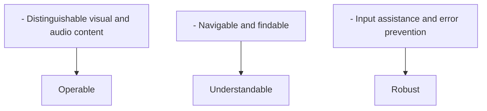
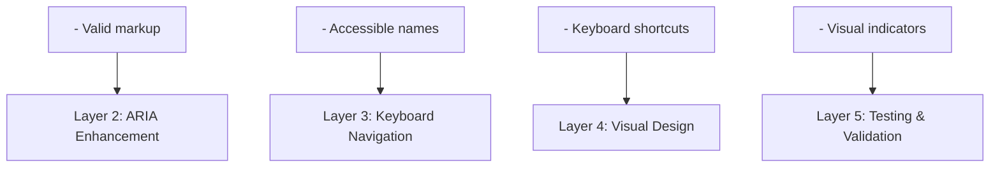

# Accessibility Perspective

> **Last Updated**: 2025-10-24
> **Status**: Active
> **Owner**: UX & Development Team

## 目的

Accessibility Perspective 確保 Enterprise E-Commerce Platform 可供所有人使用，包括身心障礙者。Accessibility 不僅是法律要求，更是包容性設計的基本面向，能擴大我們的市場範圍並改善每個人的使用者體驗。

## 範圍

本觀點從三個維度處理 accessibility：

1. **User Interface Accessibility**: 所有使用者的網頁和行動介面
2. **API Usability**: 面向整合夥伴的開發者友善 API
3. **Documentation Clarity**: 面向所有利害關係人的清晰易懂文檔

## 利害關係人

### 主要利害關係人

| 利害關係人 | 關注點 | 成功標準 |
|-------------|----------|------------------|
| **身心障礙終端使用者** | 能獨立使用所有功能 | WCAG 2.1 AA 合規性 |
| **開發人員** | 易於整合 API | 清晰的 API 文檔、良好的錯誤訊息 |
| **內容創作者** | 可存取的內容管理 | 可存取的 CMC 介面 |
| **法律/合規** | 法規遵循 | ADA、Section 508 合規性 |
| **業務** | 市場範圍、品牌聲譽 | 增加使用者基數、正面評價 |

## Accessibility 原則

### POUR 原則 (WCAG 2.1)



## Accessibility 標準

### 合規目標

| 標準 | 級別 | 目標日期 | 狀態 |
|----------|-------|-------------|--------|
| **WCAG 2.1** | AA | 2025-12-31 | 進行中 |
| **ADA** | Title III | 2025-12-31 | 進行中 |
| **Section 508** | - | 2026-06-30 | 計劃中 |
| **EN 301 549** | - | 2026-12-31 | 計劃中 |

### WCAG 2.1 Level AA 需求

#### Level A (必須具備)

- ✅ 圖片的文字替代
- ✅ 音訊/視訊字幕
- ✅ 可使用鍵盤存取
- ✅ 無鍵盤陷阱
- ✅ 可調整的時間限制
- ✅ 移動內容的暫停、停止、隱藏
- ✅ 無閃爍內容
- ✅ 跳過導航連結
- ✅ 頁面標題
- ✅ 焦點順序
- ✅ 連結目的
- ✅ 頁面語言
- ✅ 取得焦點行為
- ✅ 輸入行為
- ✅ 錯誤識別
- ✅ 標籤或說明
- ✅ 解析 (有效的 HTML)
- ✅ 名稱、角色、值

#### Level AA (應該具備)

- ✅ 即時音訊字幕
- ✅ 視訊音訊描述
- ✅ 對比度 4.5:1 (文字)
- ✅ 對比度 3:1 (大文字)
- ✅ 文字調整至 200%
- ✅ 文字圖片 (避免)
- ✅ 多種方式尋找頁面
- ✅ 標題和標籤
- ✅ 可見焦點
- ✅ 部分語言
- ✅ 一致的導航
- ✅ 一致的識別
- ✅ 錯誤建議
- ✅ 錯誤預防 (法律、財務)
- ✅ 狀態訊息

## Accessibility 方法

### 多層策略



## Accessibility 功能

### 使用者介面功能

| 功能 | 實作 | 好處 |
|---------|----------------|---------|
| **Keyboard Navigation** | 完整的鍵盤支援 | 沒有滑鼠的使用者可以導航 |
| **Screen Reader Support** | ARIA 標籤、語義化 HTML | 盲人使用者可以使用網站 |
| **High Contrast Mode** | CSS 自訂屬性 | 弱視使用者可以看到內容 |
| **Text Resizing** | 相對單位 (rem, em) | 使用者可以調整文字大小 |
| **Focus Indicators** | 可見的焦點樣式 | 使用者知道自己在哪裡 |
| **Skip Links** | 跳至主要內容 | 更快的導航 |
| **Alt Text** | 描述性的圖片替代 | 螢幕閱讀器使用者理解圖片 |
| **Captions** | 視訊字幕 | 聾人使用者可以存取視訊內容 |

### API Accessibility 功能

| 功能 | 實作 | 好處 |
|---------|----------------|---------|
| **Clear Error Messages** | 描述性、可操作的錯誤 | 開發人員快速理解問題 |
| **Consistent Naming** | RESTful 慣例 | 可預測的 API 結構 |
| **Comprehensive Docs** | OpenAPI、範例 | 易於整合 |
| **Versioning** | 基於 URL 的版本控制 | 向後相容性 |
| **Rate Limiting Info** | 帶限制的 headers | 開發人員可以管理使用量 |

## 輔助技術支援

### 支援的技術

| 技術 | 類型 | 支援級別 | 測試頻率 |
|------------|------|---------------|-------------------|
| **JAWS** | Screen Reader | 完整 | 每月 |
| **NVDA** | Screen Reader | 完整 | 每月 |
| **VoiceOver** | Screen Reader | 完整 | 每月 |
| **TalkBack** | Screen Reader (Mobile) | 完整 | 每月 |
| **Dragon NaturallySpeaking** | Voice Control | 完整 | 每季 |
| **ZoomText** | Screen Magnifier | 完整 | 每季 |
| **Windows High Contrast** | Visual Enhancement | 完整 | 每月 |

## Accessibility 測試

### 測試策略

```text
┌─────────────────────────────────────────────────────────┐
│           Accessibility Testing Pyramid                 │
├─────────────────────────────────────────────────────────┤
│                                                         │
│                    ┌─────────────┐                      │
│                    │   Manual    │                      │
│                    │   Testing   │                      │
│                    │   (10%)     │                      │
│                    └─────────────┘                      │
│                  ┌─────────────────┐                    │
│                  │  Screen Reader  │                    │
│                  │    Testing      │                    │
│                  │     (20%)       │                    │
│                  └─────────────────┘                    │
│              ┌───────────────────────┐                  │
│              │   Keyboard Testing    │                  │
│              │       (30%)           │                  │
│              └───────────────────────┘                  │
│          ┌───────────────────────────────┐              │
│          │    Automated Testing          │              │
│          │         (40%)                 │              │
│          └───────────────────────────────┘              │
│                                                         │
└─────────────────────────────────────────────────────────┘
```

### 測試工具

| 工具 | 目的 | 頻率 |
|------|---------|-----------|
| **axe DevTools** | 自動化 accessibility 測試 | 每次建置 |
| **WAVE** | 視覺化 accessibility 評估 | 每週 |
| **Lighthouse** | Performance 和 accessibility 稽核 | 每次建置 |
| **Pa11y** | CI/CD accessibility 測試 | 每次提交 |
| **Screen Readers** | 手動測試 | 每月 |
| **Keyboard Only** | 導航測試 | 每週 |

## 指標和監控

### Accessibility 指標

| 指標 | 目標 | 目前 | 趨勢 |
|--------|--------|---------|-------|
| **WCAG 2.1 AA Compliance** | 100% | 85% | ↗️ |
| **Automated Test Pass Rate** | 100% | 95% | ↗️ |
| **Keyboard Accessibility** | 100% | 90% | ↗️ |
| **Color Contrast Ratio** | 4.5:1 | 4.8:1 | → |
| **Alt Text Coverage** | 100% | 98% | ↗️ |
| **Focus Indicator Visibility** | 100% | 100% | → |

### 使用者回饋

- **Accessibility Feedback Form**: 專門的 accessibility 問題表單
- **User Testing**: 每月與身心障礙使用者進行測試
- **Support Tickets**: 追蹤與 accessibility 相關的支援請求
- **Satisfaction Score**: 目標為身心障礙使用者滿意度 4.5/5.0

## 相關文檔

### 視角

- [Functional Viewpoint](../../viewpoints/functional/overview.md) - 使用者介面功能
- [Development Viewpoint](../../viewpoints/development/overview.md) - 開發實務

### 其他 Perspectives

- [Evolution Perspective](../evolution/overview.md) - 在變更期間維護 accessibility
- [Performance Perspective](../performance/overview.md) - 輔助技術的 performance

### 實作指南

- [UI Accessibility](ui-accessibility.md) - WCAG 合規性和實作
- [API Usability](api-usability.md) - 開發者友善的 API 設計
- [Documentation Clarity](documentation.md) - 清晰的文檔標準

## 文檔結構

本觀點組織成以下文檔：

1. **[Overview](overview.md)** (本文檔) - 目的、範圍和方法
2. **[UI Accessibility](ui-accessibility.md)** - WCAG 2.1 合規性、鍵盤導航、螢幕閱讀器
3. **[API Usability](api-usability.md)** - RESTful 設計、錯誤訊息、文檔
4. **[Documentation Clarity](documentation.md)** - 撰寫標準、範例、清晰度

## 持續改進

### 定期活動

- **每日**: CI/CD 中的自動化 accessibility 測試
- **每週**: 手動鍵盤導航測試
- **每月**: 與真實使用者進行螢幕閱讀器測試
- **每季**: 全面的 accessibility 稽核
- **每年**: 第三方 accessibility 認證

### Accessibility Champions

- **Accessibility Team**: 負責 accessibility 計畫的專門團隊
- **Champions Network**: 每個團隊一位 accessibility champion
- **Training**: 每季為所有開發人員提供 accessibility 培訓
- **Code Reviews**: 每次程式碼審查中進行 accessibility 檢查

## 法律與合規

### 法規要求

- **ADA (Americans with Disabilities Act)**: 公共場所的 Title III 合規性
- **Section 508**: 聯邦 accessibility 標準 (針對政府合約)
- **EN 301 549**: 歐洲 accessibility 標準
- **AODA**: Accessibility for Ontarians with Disabilities Act (加拿大)

### 風險緩解

- **Legal Review**: 每年法律審查 accessibility 合規性
- **Documentation**: 維護 accessibility 合規文檔
- **Remediation Plan**: 處理 accessibility 問題的明確計畫
- **Insurance**: 涵蓋 accessibility 索賠的網路責任保險

---

**下一步**: 查看 [UI Accessibility](ui-accessibility.md) 以獲取詳細的 WCAG 2.1 實作指南。
