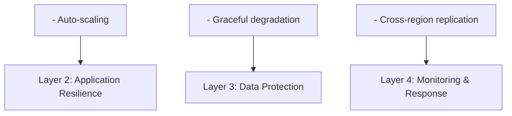

# Availability & Resilience Perspective

> **Last Updated**: 2025-10-24
> **Status**: Active
> **Owner**: Operations & Architecture Team

## 目的

Availability & Resilience Perspective 處理系統保持運作和從故障中恢復的能力。對於電子商務平台而言，高可用性至關重要，因為停機時間直接影響收入、客戶信任和品牌聲譽。本觀點確保系統能夠：

- 在元件故障期間維持服務可用性
- 從意外事件中快速恢復
- 在故障期間最小化資料損失
- 在各種故障場景下提供一致的使用者體驗

## 範圍

本觀點適用於所有系統元件並處理：

- **Availability**: 系統運作和可存取的時間比例
- **Resilience**: 系統承受和從故障中恢復的能力
- **Fault Tolerance**: 系統在元件故障時繼續運作的能力
- **Disaster Recovery**: 系統從災難性事件中恢復的能力

## 利害關係人

### 主要利害關係人

| 利害關係人 | 關注點 | 成功標準 |
|-------------|----------|------------------|
| **業務領導層** | 收入保護、品牌聲譽 | 99.9% 正常運行時間、最小客戶影響 |
| **營運團隊** | 系統可靠性、事件回應 | 快速恢復、清晰的程序 |
| **開發團隊** | 彈性架構、故障處理 | 強健的錯誤處理、自動化恢復 |
| **客戶** | 服務可用性、資料完整性 | 無縫體驗、無資料損失 |
| **支援團隊** | 問題解決、客戶溝通 | 清晰的狀態資訊、快速解決 |

## Availability 目標

### Service Level Objectives (SLO)

- **Overall System Availability**: 99.9% 正常運行時間
  - 最大停機時間：每年 8.76 小時
  - 最大停機時間每月：43.8 分鐘
  - 最大停機時間每週：10.1 分鐘

- **Critical Services Availability**: 99.95% 正常運行時間
  - 訂單處理
  - 付款處理
  - 客戶 authentication

- **Non-Critical Services Availability**: 99.5% 正常運行時間
  - 產品推薦
  - 評論系統
  - Analytics

### 恢復目標

- **RTO (Recovery Time Objective)**: 5 分鐘
  - 故障後恢復服務的時間

- **RPO (Recovery Point Objective)**: 1 分鐘
  - 最大可接受的資料損失

## 方法

### 多層 Resilience 策略

我們的 availability 和 resilience 方法遵循深度防禦策略：



### 關鍵原則

1. **Design for Failure**: 假設元件會故障並相應設計
2. **Fail Fast**: 快速偵測故障並立即回應
3. **Isolate Failures**: 防止故障在系統邊界間級聯
4. **Automate Recovery**: 通過自動化最小化手動介入
5. **Test Regularly**: 定期進行 DR 演練和混沌工程練習

## 架構概述

### High Availability 元件

```text
┌──────────────────────────────────────────────────────────┐
│                    Route 53 (DNS)                        │
│              Global Load Balancing                       │
└────────────────────┬─────────────────────────────────────┘
                     │
        ┌────────────┴────────────┐
        │                         │
┌───────▼────────┐       ┌───────▼────────┐
│   Region 1     │       │   Region 2     │
│   (Primary)    │       │   (DR)         │
│                │       │                │
│  ┌──────────┐  │       │  ┌──────────┐  │
│  │   ALB    │  │       │  │   ALB    │  │
│  └────┬─────┘  │       │  └────┬─────┘  │
│       │        │       │       │        │
│  ┌────▼─────┐  │       │  ┌────▼─────┐  │
│  │   EKS    │  │       │  │   EKS    │  │
│  │ Multi-AZ │  │       │  │ Multi-AZ │  │
│  └────┬─────┘  │       │  └────┬─────┘  │
│       │        │       │       │        │
│  ┌────▼─────┐  │       │  ┌────▼─────┐  │
│  │   RDS    │  │       │  │   RDS    │  │
│  │ Multi-AZ │◄─┼───────┼──┤  Replica │  │
│  └──────────┘  │       │  └──────────┘  │
└────────────────┘       └────────────────┘
```

## 相關文檔

### 視角

- [Deployment Viewpoint](../../viewpoints/deployment/overview.md) - 基礎設施架構
- [Operational Viewpoint](../../viewpoints/operational/overview.md) - 監控和事件回應
- [Concurrency Viewpoint](../../viewpoints/concurrency/overview.md) - 狀態管理和同步

### 其他 Perspectives

- [Performance & Scalability Perspective](../performance/overview.md) - 故障場景下的 performance
- [Security Perspective](../security/overview.md) - 事件期間的 security

### 實作指南

- [Fault Tolerance Patterns](fault-tolerance.md) - Circuit breakers、retries、fallbacks
- [High Availability Design](high-availability.md) - Multi-AZ、load balancing、health checks
- [Disaster Recovery](disaster-recovery.md) - Backup、restore 和 failover 程序

## 文檔結構

本觀點組織成以下文檔：

1. **[Overview](overview.md)** (本文檔) - 目的、範圍和方法
2. **[Requirements](requirements.md)** - SLOs、quality attribute scenarios、可衡量的目標
3. **[Fault Tolerance](fault-tolerance.md)** - 處理故障的模式
4. **[High Availability](high-availability.md)** - 基礎設施和應用程式 HA 設計
5. **[Disaster Recovery](disaster-recovery.md)** - DR 策略、backup 和 restore 程序

## 指標和監控

### 關鍵 Availability 指標

- **Uptime Percentage**: 實際正常運行時間 vs. 目標 SLO
- **MTBF (Mean Time Between Failures)**: 系統故障之間的平均時間
- **MTTR (Mean Time To Recovery)**: 從故障中恢復的平均時間
- **Error Rate**: 失敗請求的百分比
- **Incident Count**: 每月 availability 事件數量

### 監控方法

詳細的監控實作請參閱 [Operational Viewpoint - Monitoring](../../viewpoints/operational/monitoring-alerting.md)。

## 持續改進

### 定期活動

- **每月**: 檢視 availability 指標和事件報告
- **每季**: 進行災難恢復演練
- **每半年**: 更新和測試故障轉移程序
- **每年**: 檢視和更新 availability 目標

### Chaos Engineering

我們實踐 chaos engineering 以主動識別弱點：

- Kubernetes 中的隨機 pod 終止
- 網路延遲注入
- 資料庫故障轉移模擬
- Cache 故障場景

---

**下一步**: 查看 [Requirements](requirements.md) 以了解詳細的 availability 目標和 quality attribute scenarios。
