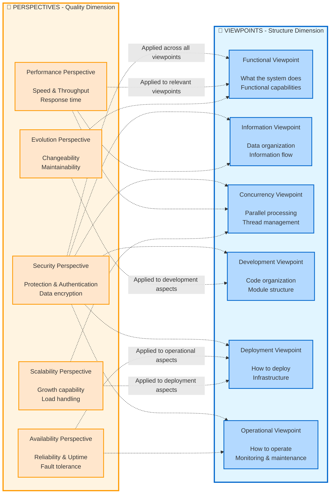
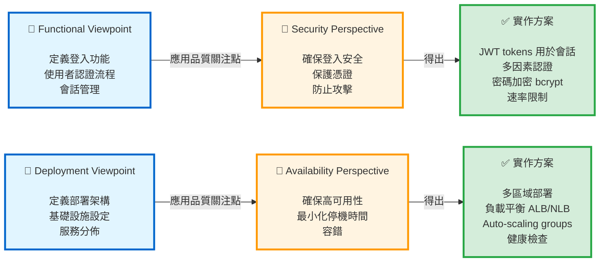
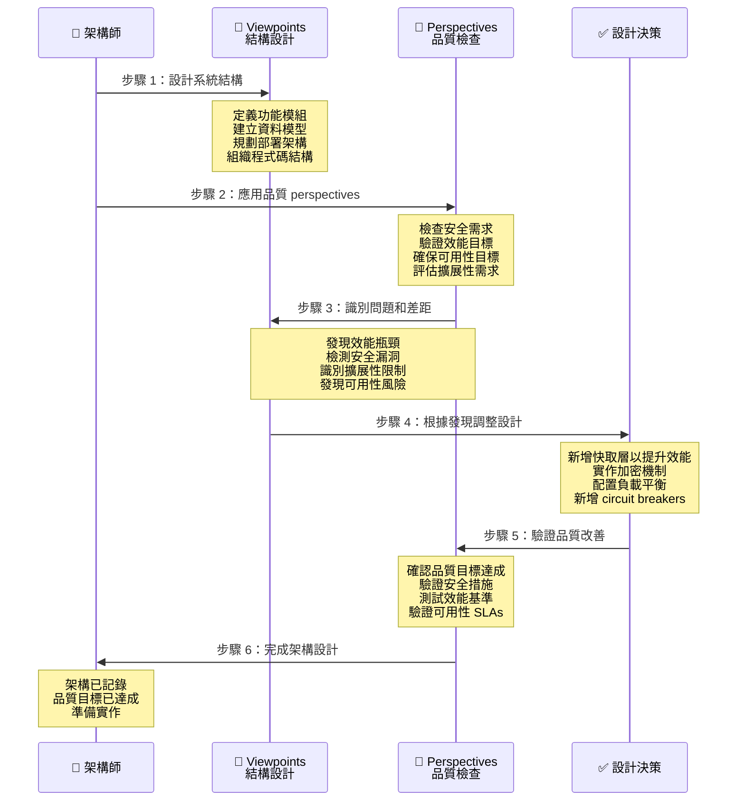

# Rozanski & Woods Architecture 方法論指南

> **軟體 Architecture 文件的 Viewpoints 和 Perspectives 完整指南**

## 📚 目錄

- [簡介](#簡介)
- [方法論總覽](#方法論總覽)
- [Viewpoints (系統結構)](#viewpoints-系統結構)
- [Perspectives (品質屬性)](#perspectives-品質屬性)
- [如何使用本指南](#如何使用本指南)
- [實務範例](#實務範例)
- [參考資料](#參考資料)

---

## 簡介

### 什麼是 Rozanski & Woods 方法論

Rozanski & Woods 方法論是一種全面的軟體架構文件方法，將關注點分為：

1. **Viewpoints** - 描述系統**是什麼**以及**如何**結構化
2. **Perspectives** - 描述跨越多個 viewpoints 的**品質屬性**

### 為什麼使用這個方法論

**優點：**

- ✅ **系統化涵蓋**：確保不會遺漏任何架構面向
- ✅ **利害關係人溝通**：不同 viewpoints 服務不同受眾
- ✅ **品質焦點**：Perspectives 確保品質屬性得到處理
- ✅ **可維護性**：清晰的結構使文件更易於維護
- ✅ **可追溯性**：將需求連結到架構決策

**使用時機：**

- 設計新系統
- 記錄現有系統
- 架構審查
- 利害關係人溝通
- 合規與稽核需求

---

## 方法論總覽

### 二維模型

Rozanski & Woods 方法論使用二維模型來全面描述軟體架構：



### Viewpoints vs Perspectives：核心差異

#### 📐 Viewpoints - "結構維度"

**定義**：描述系統的**結構與組織**，回答「系統是什麼」和「如何建構」

**特性**：
- 🏗️ **結構性**：專注於系統的靜態和動態結構
- 📦 **模組化**：每個 viewpoint 獨立描述系統的一個面向
- 👥 **以利害關係人為導向**：不同 viewpoints 服務不同利害關係人
- 🎯 **具體的**：描述特定元件、介面、部署等

**回答的問題**：
- **Functional**：系統提供哪些能力？
- **Information**：資料如何儲存和流動？
- **Concurrency**：如何處理併發？
- **Development**：程式碼如何組織？
- **Deployment**：如何部署到環境？
- **Operational**：如何監控和操作？

**範例**：
```
Functional Viewpoint 描述：
- Customer Management 模組提供註冊、登入、個人資料管理
- Order 模組提供訂單下單、查詢、取消
- 這些模組透過 REST APIs 互動
```

---

#### 🎯 Perspectives - "品質維度"

**定義**：描述系統的**品質屬性**，回答「系統有多好」和「如何確保品質」

**特性**：
- 🌐 **跨領域**：橫跨所有 viewpoints，影響整個系統
- 📊 **品質導向**：專注於非功能性需求
- 🎚️ **可測量**：通常有明確的指標和目標
- 🔄 **持續性**：在整個開發過程中需要持續關注

**回答的問題**：
- **Security**：系統是否足夠安全？如何保護？
- **Performance**：系統是否足夠快？能承受多少負載？
- **Availability**：系統是否足夠穩定？如何從故障中恢復？
- **Evolution**：系統是否易於修改？如何演進？
- **Scalability**：系統能否擴展？如何擴展？

**範例**：
```
Security Perspective 應用於：
- Functional：實作認證和授權
- Information：加密敏感資料
- Deployment：配置防火牆和網路隔離
- Operational：監控安全事件和異常登入
```

---

### 互補關係：它們如何協同運作

#### 🔄 Viewpoints 提供結構，Perspectives 確保品質



#### 📋 互補範例

| Viewpoint | + Perspective | = 實作決策 |
|-----------|---------------|---------------------------|
| **Functional**<br/>客戶註冊 | **Security**<br/>保護個人資料 | 密碼加密 (bcrypt)<br/>Email 驗證<br/>CAPTCHA 防機器人 |
| **Information**<br/>訂單資料模型 | **Performance**<br/>快速查詢 | 資料庫索引<br/>快取策略<br/>讀寫分離 |
| **Deployment**<br/>容器化部署 | **Scalability**<br/>自動擴展 | Kubernetes HPA<br/>Service mesh<br/>無狀態設計 |
| **Concurrency**<br/>併發處理 | **Availability**<br/>容錯 | 樂觀鎖定<br/>重試機制<br/>Circuit breaker pattern |

#### 🎯 實務應用流程



---

### 為什麼需要兩個維度

#### ❌ 只有 Viewpoints 的問題

```
只描述結構 → 可能忽略品質屬性
- 功能完整但效能不佳
- 部署架構清晰但不安全
- 程式碼組織良好但難以擴展
```

#### ❌ 只有 Perspectives 的問題

```
只關注品質 → 缺乏具體實作指引
- 知道需要安全但不知如何實作
- 知道需要高效能但不知如何設計架構
- 知道需要可擴展但不知如何部署
```

#### ✅ 結合兩者的優點

```
結構 + 品質 = 完整的架構設計
- 清晰的系統結構
- 明確的品質目標
- 具體的實作方案
- 可驗證的設計決策
```

---

### 實務建議

#### 📝 文件組織

```
docs/
├── viewpoints/
│   ├── functional.md          # Functional viewpoint
│   ├── information.md         # Information viewpoint
│   ├── deployment.md          # Deployment viewpoint
│   └── ...
├── perspectives/
│   ├── security.md            # Security perspective
│   ├── performance.md         # Performance perspective
│   └── ...
└── decisions/
    ├── ADR-001-auth.md        # 結合兩者的決策
    └── ADR-002-cache.md
```

#### 🔍 審查檢查清單

**Viewpoint 檢查**：
- [ ] 所有主要功能已記錄？
- [ ] 資料模型完整定義？
- [ ] 部署架構清晰？
- [ ] 開發指引明確？

**Perspective 檢查**：
- [ ] 安全需求已滿足？
- [ ] 效能目標已達成？
- [ ] 可用性需求已實作？
- [ ] 系統可演進和擴展？

**整合檢查**：
- [ ] 每個 Viewpoint 考慮了相關 Perspectives？
- [ ] 每個 Perspective 應用到相關 Viewpoints？
- [ ] 設計決策有明確的品質目標？

---

## Viewpoints (系統結構)

Viewpoints 從不同角度描述系統的**結構與組織**。

### 1. Functional Viewpoint

**目的：** 描述系統的功能元素、責任與互動

**關鍵問題：**

- 主要功能能力是什麼？
- 功能元素如何互動？
- 關鍵使用案例是什麼？
- 系統公開哪些介面？

**要記錄什麼：**

#### 1.1 功能元素

```markdown
## 範例結構

### Customer Management 模組

- **責任**:
  - 客戶註冊與認證
  - 個人資料管理
  - 會員等級追蹤

- **提供的服務**:
  - `POST /api/v1/customers` - 建立客戶
  - `GET /api/v1/customers/{id}` - 取得客戶
  - `PUT /api/v1/customers/{id}` - 更新客戶

- **相依性**:
  - Email Service (用於通知)
  - Authentication Service (用於登入)
  - Payment Service (用於會員升級)

```

#### 1.2 系統能力

- 核心業務功能
- 支援功能
- 與外部系統的整合點

#### 1.3 Use Cases 與情境

```gherkin
Feature: Customer Registration
  Scenario: Successful registration
    Given a new customer with valid email
    When they submit registration form
    Then account should be created
    And welcome email should be sent
```

#### 1.4 Functional Architecture 圖表

- 顯示功能模組的元件圖
- 關鍵工作流程的序列圖
- Use case 圖

**利害關係人：** 業務分析師、產品經理、開發者

---

### 2. Information Viewpoint

**目的：** 描述系統如何儲存、管理和分發資訊

**關鍵問題：**

- 系統管理哪些資料？
- 資料如何結構化和關聯？
- 資料如何在系統中流動？
- 誰擁有哪些資料？

**要記錄什麼：**

#### 2.1 資料模型

```markdown
## Domain Model 範例

### Customer Entity

- CustomerId (PK)
- Name
- Email (unique)
- MembershipLevel
- RegistrationDate

### 關聯

- Customer 1 ──── * Order
- Order 1 ──── * OrderItem
- Order 1 ──── 1 Payment

```

#### 2.2 資料所有權

```markdown
## 依 Bounded Context 的資料所有權

### Customer Context (擁有者)

- Customer 個人資料
- 認證憑證
- 會員資訊

### Order Context (擁有者)

- 訂單詳情和狀態
- 訂單歷史

### 共享資料 (唯讀副本)

- Order Context 維護客戶名稱/email (最終一致性)

```

#### 2.3 資料流

- 資料如何在元件間移動
- 資料轉換點
- 資料驗證規則

#### 2.4 資料生命週期

- 建立、更新、刪除政策
- 封存和保留政策
- GDPR 合規 (被遺忘權)

#### 2.5 資料品質與完整性

- 驗證規則
- 一致性保證
- 衝突解決策略

**利害關係人：** 資料庫管理員、資料架構師、開發者

---

### 3. Concurrency Viewpoint

**目的：** 描述系統如何處理併發和平行操作

**關鍵問題：**

- 哪些操作可以平行執行？
- 如何管理併發？
- 同步機制是什麼？
- 如何防止競態條件？

**要記錄什麼：**

#### 3.1 併發模型

```markdown
## 併發策略

### 同步操作

- 客戶註冊 (立即回應)
- 付款處理 (交易性)
- 訂單驗證 (必須在付款前完成)

### 非同步操作

- Email 通知 (fire-and-forget)
- 分析收集 (最終一致性)
- 報表生成 (背景工作)

### 平行操作

- 跨類別的產品搜尋
- 跨倉庫的庫存檢查

```

#### 3.2 Process/Thread 結構

- 應用程式 processes 及其責任
- Thread pools 及其配置
- Message consumers 及其併發性

#### 3.3 同步機制

```java
// 範例：分散式鎖定
@Transactional
public void reserveInventory(String productId, int quantity) {
    RLock lock = redissonClient.getLock("inventory:lock:" + productId);
    try {
        if (lock.tryLock(10, 30, TimeUnit.SECONDS)) {
            // Critical section
        }
    } finally {
        lock.unlock();
    }
}
```

#### 3.4 狀態管理

- 無狀態 vs 有狀態元件
- 共享狀態管理
- 狀態一致性策略

#### 3.5 死鎖預防

- 鎖定排序規則
- 逾時機制
- 死鎖檢測策略

**利害關係人：** 開發者、效能工程師、架構師

---

### 4. Development Viewpoint

**目的：** 描述程式碼組織、建置流程和開發環境

**關鍵問題：**

- 程式碼如何組織？
- 模組相依性是什麼？
- 系統如何建置和測試？
- 開發者需要哪些工具？

**要記錄什麼：**

#### 4.1 模組組織

```text
app/
├── domain/              # Domain layer (無外部相依性)
│   ├── customer/       # Customer bounded context
│   ├── order/          # Order bounded context
│   └── product/        # Product bounded context
├── application/        # Application services (use cases)
├── infrastructure/     # Infrastructure adapters
└── interfaces/         # API controllers, event handlers
```

#### 4.2 相依性規則

```markdown
## Layer 相依性

- Domain layer：對其他層無相依性
- Application layer：僅相依於 domain
- Infrastructure layer：相依於 domain (透過介面)
- Interface layer：相依於 application

## 禁止的相依性

- ❌ Domain → Infrastructure
- ❌ Domain → Application
- ❌ 模組間的循環相依性

```

#### 4.3 建置流程

```bash
# Build pipeline
./gradlew clean build          # 編譯和封裝
./gradlew test                 # 執行單元測試
./gradlew integrationTest      # 執行整合測試
./gradlew bootJar              # 建立可執行 JAR
./gradlew bootBuildImage       # 建立 Docker image
```

#### 4.4 程式碼標準

- 命名慣例
- 程式碼風格指引
- Code review 檢查清單
- 品質門檻 (覆蓋率、複雜度)

#### 4.5 開發環境

- 需要的工具和版本
- 本機設定說明
- 除錯配置

**利害關係人：** 開發者、建置工程師、DevOps

---

### 5. Deployment Viewpoint

**目的：** 描述系統如何部署到硬體和網路基礎設施

**關鍵問題：**

- 需要哪些硬體/雲端資源？
- 網路如何配置？
- 部署流程是什麼？
- 系統如何擴展？

**要記錄什麼：**

#### 5.1 實體架構

```markdown
## AWS 基礎設施

### Compute

- EKS Cluster (Kubernetes 1.28)
- Node Group: t3.large (2 vCPU, 8 GB RAM)
- Auto-scaling: 3-10 nodes

### Database

- RDS PostgreSQL 15
- Instance: db.r6g.xlarge (4 vCPU, 32 GB RAM)
- Multi-AZ: Yes

### Cache

- ElastiCache Redis 7
- Node: cache.r6g.large (2 vCPU, 13 GB RAM)

```

#### 5.2 網路架構

```text
VPC: 10.0.0.0/16
├── Public Subnets (ALB, NAT Gateway)
│   ├── 10.0.1.0/24 (AZ-1)
│   ├── 10.0.2.0/24 (AZ-2)
│   └── 10.0.3.0/24 (AZ-3)
├── Private Subnets (Application)
│   ├── 10.0.11.0/24 (AZ-1)
│   ├── 10.0.12.0/24 (AZ-2)
│   └── 10.0.13.0/24 (AZ-3)
└── Private Subnets (Data)
    ├── 10.0.21.0/24 (AZ-1)
    ├── 10.0.22.0/24 (AZ-2)
    └── 10.0.23.0/24 (AZ-3)
```

#### 5.3 部署流程

- CI/CD pipeline
- 部署策略 (rolling, blue-green, canary)
- 回滾程序

#### 5.4 環境配置

- 開發、預備、生產環境
- 配置管理
- Secrets 管理

#### 5.5 擴展策略

- Horizontal pod autoscaling
- Cluster autoscaling
- 資料庫擴展 (read replicas)

**利害關係人：** DevOps 工程師、基礎設施架構師、維運人員

---

### 6. Operational Viewpoint

**目的：** 描述系統如何安裝、遷移、操作和支援

**關鍵問題：**

- 系統如何安裝？
- 如何監控？
- 如何執行備份？
- 維運程序是什麼？

**要記錄什麼：**

#### 6.1 安裝與配置

```bash
# 安裝步驟

1. 部署基礎設施 (CDK)
2. 配置 kubectl
3. 安裝應用程式 (Helm)
4. 驗證安裝 (smoke tests)

```

#### 6.2 監控與告警

```markdown
## 關鍵指標

### 業務指標

- 每分鐘訂單數
- 每小時收入
- 轉換率

### 技術指標

- API 回應時間 (p50, p95, p99)
- 錯誤率 (4xx, 5xx)
- 資料庫查詢時間
- 快取命中率

### 告警

- 高錯誤率 (5 分鐘內 > 10 個錯誤) → 嚴重
- 高回應時間 (5 分鐘內 p95 > 2s) → 警告
- 資料庫連線 (> 90) → 嚴重

```

#### 6.3 備份與復原

- 備份排程和保留期
- 復原程序
- RTO (Recovery Time Objective)
- RPO (Recovery Point Objective)

#### 6.4 維運程序

- 啟動和關閉程序
- 升級程序
- 事件回應 runbooks
- 疑難排解指南

#### 6.5 支援與維護

- 日誌聚合和分析
- 效能調校
- 容量規劃
- 修補程式管理

**利害關係人：** 維運團隊、SRE、支援工程師

---

### 7. Context Viewpoint

**目的：** 描述系統與其環境的關係

**關鍵問題：**

- 系統邊界是什麼？
- 與哪些外部系統互動？
- 利害關係人是誰？
- 外部限制是什麼？

**要記錄什麼：**

#### 7.1 系統範疇與邊界

```markdown
## 系統 Context

### 範圍內

- 客戶管理
- 訂單處理
- 付款處理
- 庫存管理

### 範圍外

- 倉庫管理 (外部系統)
- 物流運輸 (第三方)
- 會計 (獨立系統)

```

#### 7.2 外部實體

```markdown
## 外部系統

### Payment Gateway (Stripe)

- 協定: REST API over HTTPS
- 認證: API Key
- 資料交換: JSON
- SLA: 99.9% uptime

### Email Service (SendGrid)

- 協定: SMTP / REST API
- 認證: API Key
- 速率限制: 100 emails/second

### Shipping Provider (FedEx)

- 協定: SOAP Web Service
- 認證: OAuth 2.0
- 資料交換: XML

```

#### 7.3 利害關係人

```markdown
## Stakeholder 地圖

### 業務利害關係人

- Product Owner: 功能優先順序
- Marketing Team: 行銷活動需求
- Finance Team: 報表需求

### 技術利害關係人

- Development Team: 實作
- Operations Team: 部署和監控
- Security Team: 安全合規

### 外部利害關係人

- Customers: 終端使用者
- Partners: 整合需求
- Regulators: 合規需求

```

#### 7.4 外部限制

- 法規需求 (GDPR, PCI-DSS)
- 組織政策
- 技術標準
- 預算限制

#### 7.5 整合 Patterns

- API 整合 (REST, GraphQL)
- Event-driven 整合 (Kafka)
- Batch 整合 (檔案傳輸)
- Database 整合 (共享資料庫)

**利害關係人：** 業務分析師、架構師、合規人員

---

## Perspectives (品質屬性)

Perspectives 描述跨越多個 viewpoints 的**品質屬性**。

### 1. Security Perspective

**目的：** 確保系統免受惡意攻擊和未經授權的存取

**關鍵問題：**

- 如何處理認證？
- 如何執行授權？
- 如何保護敏感資料？
- 如何降低安全威脅？

**要記錄什麼：**

#### 1.1 認證與授權

```markdown
## 認證策略

### JWT-Based Authentication

- Token 有效期: 1 小時
- Refresh token: 24 小時
- 演算法: HS512

### 授權模型

- Role-Based Access Control (RBAC)
- Roles: ADMIN, USER, GUEST
- Permissions: READ, WRITE, DELETE

```

#### 1.2 資料保護

```markdown
## 加密

### Data in Transit

- TLS 1.3 用於所有外部通訊
- mTLS 用於服務間通訊

### Data at Rest

- Database: AES-256 加密
- 敏感欄位: 應用程式層級加密
- Secrets: AWS Secrets Manager

```

#### 1.3 安全控制

- 輸入驗證和清理
- SQL injection 防護
- XSS 防護
- CSRF 保護
- 速率限制

#### 1.4 安全監控

- 失敗登入嘗試追蹤
- 可疑活動檢測
- 安全事件日誌記錄
- 漏洞掃描

#### 1.5 合規

- GDPR 合規 (資料隱私)
- PCI-DSS 合規 (付款資料)
- SOC 2 合規 (安全控制)

**應用到 Viewpoints：**

- Functional: 認證/授權功能
- Information: 資料加密、存取控制
- Deployment: 網路安全、防火牆
- Operational: 安全監控、事件回應

---

### 2. Performance & Scalability Perspective

**目的：** 確保系統符合效能需求並能擴展

**關鍵問題：**

- 回應時間需求是什麼？
- 可以支援多少併發使用者？
- 在負載下如何擴展？
- 瓶頸是什麼？

**要記錄什麼：**

#### 2.1 效能需求

```markdown
## 效能目標

### API 回應時間

- 關鍵 APIs: ≤ 500ms (p95)
- 業務 APIs: ≤ 1000ms (p95)
- 報表 APIs: ≤ 3000ms (p95)

### 吞吐量

- 尖峰負載: 1000 requests/second
- 持續負載: 500 requests/second

### Database

- 簡單查詢: ≤ 10ms (p95)
- 複雜查詢: ≤ 100ms (p95)

```

#### 2.2 擴展策略

```markdown
## 水平擴展

### Application Tier

- 最小 replicas: 3
- 最大 replicas: 10
- 擴展觸發: CPU > 70%

### Database Tier

- Read replicas: 2
- Connection pooling: 每個 instance 20 個連線

```

#### 2.3 效能最佳化

- 快取策略 (Redis)
- 資料庫索引
- 查詢最佳化
- 非同步處理
- CDN 用於靜態內容

#### 2.4 效能測試

- 負載測試情境
- 壓力測試限制
- 效能基準
- 容量規劃

**應用到 Viewpoints：**

- Functional: 非同步操作、快取
- Information: 資料庫最佳化、索引
- Concurrency: 平行處理
- Deployment: Auto-scaling 配置

---

### 3. Availability & Resilience Perspective

**目的：** 確保系統保持運作並從故障中復原

**關鍵問題：**

- 運行時間需求是什麼？
- 如何處理元件故障？
- 災難復原計畫是什麼？
- 能多快復原？

**要記錄什麼：**

#### 3.1 可用性需求

```markdown
## 可用性目標

### Service Level Objectives (SLO)

- 可用性: 99.9% (每年 8.76 小時停機時間)
- RTO (Recovery Time Objective): 5 分鐘
- RPO (Recovery Point Objective): 1 分鐘

```

#### 3.2 容錯

```markdown
## Resilience Patterns

### Circuit Breaker

- 故障門檻: 10 秒內 5 次失敗
- 開啟狀態持續時間: 30 秒
- 半開啟測試請求: 3

### Retry 機制

- 最大重試: 3
- Backoff: 指數 (1s, 2s, 4s)
- 重試條件: 僅暫時性錯誤

```

#### 3.3 高可用性設計

- Multi-AZ 部署
- 負載平衡
- 健康檢查
- 優雅降級
- Fallback 機制

#### 3.4 災難復原

```markdown
## DR 策略

### 備份

- Database: 每日自動備份
- 保留期: 30 天
- 跨區域複寫: Yes

### 復原程序

1. 偵測故障 (監控告警)
2. 評估影響 (runbook)
3. 執行復原 (自動容錯移轉)
4. 驗證復原 (smoke tests)

```

**應用到 Viewpoints：**

- Deployment: Multi-AZ、冗餘
- Operational: 監控、告警、runbooks
- Concurrency: 逾時處理、重試

---

### 4. Evolution Perspective

**目的：** 確保系統能適應未來變化

**關鍵問題：**

- 新增功能有多容易？
- 如何升級技術？
- 如何維持向後相容性？
- 如何管理技術債？

**要記錄什麼：**

#### 4.1 可擴展性

```markdown
## 擴展點

### Plugin Architecture

- 透過 PaymentProvider 介面新增新付款方式
- 透過 NotificationChannel 介面新增新通知管道
- 透過 PricingStrategy 介面新增新定價策略

```

#### 4.2 技術演進

```markdown
## 升級策略

### Framework 升級

- Spring Boot: 每 6 個月升級
- Java: 每 2 年升級
- Dependencies: 每月安全更新

### 遷移路徑

1. 在開發環境測試
2. 部署到預備環境
3. 執行迴歸測試
4. 逐步推出到生產環境

```

#### 4.3 API 版本控制

```markdown
## API 版本管理

### 版本控制策略

- URL 版本控制: /api/v1/, /api/v2/
- 同時維護 2 個版本
- 淘汰期: 6 個月

### 向後相容性

- 次要版本僅增量變更
- 重大變更需要新的主要版本

```

#### 4.4 重構策略

- 技術債追蹤
- 重構優先順序
- 程式碼品質指標
- 持續改善

**應用到 Viewpoints：**

- Development: 模組化架構、乾淨程式碼
- Functional: Plugin architecture、擴展點
- Information: Schema 演進、資料遷移

---

### 5. Accessibility Perspective

**目的：** 確保所有使用者（包括身心障礙者）都能使用系統

**關鍵問題：**

- 身心障礙者能使用系統嗎？
- 是否符合無障礙標準？
- API 是否易於使用？
- 文件是否清晰？

**要記錄什麼：**

#### 5.1 UI 無障礙

```markdown
## WCAG 2.1 合規

### Level AA 需求

- 顏色對比度: ≥ 4.5:1
- 鍵盤導航: 完整支援
- 螢幕閱讀器: ARIA 標籤
- 焦點指示器: 可見

```

#### 5.2 API 可用性

```markdown
## API 設計原則

### RESTful 設計

- 一致的命名慣例
- 正確的 HTTP 方法和狀態碼
- 清晰的錯誤訊息
- 完整的文件

### 錯誤處理
```json
{
  "errorCode": "CUSTOMER_NOT_FOUND",
  "message": "Customer with ID 123 not found",
  "timestamp": "2024-01-15T10:30:00Z",
  "path": "/api/v1/customers/123"
}
```text

```

#### 5.3 文件

- API 文件 (OpenAPI/Swagger)
- 使用者指南
- 開發者指南
- 疑難排解指南

**應用到 Viewpoints：**

- Functional: 使用者介面設計
- Operational: 清晰的錯誤訊息、日誌

---

### 6. Development Resource Perspective

**目的：** 確保有效利用開發資源

**關鍵問題：**

- 需要哪些技能？
- 需要哪些工具？
- 如何轉移知識？
- 如何衡量生產力？

**要記錄什麼：**

#### 6.1 團隊結構
```markdown
## 團隊組織

### Backend Team (5 個開發者)

- 技能: Java, Spring Boot, PostgreSQL, AWS
- 責任: API 開發、業務邏輯

### Frontend Team (3 個開發者)

- 技能: React, TypeScript, Next.js
- 責任: UI/UX 實作

### DevOps Team (2 個工程師)

- 技能: AWS, Kubernetes, Terraform, CI/CD
- 責任: 基礎設施、部署

```

#### 6.2 需要的技能

- 程式語言 (Java 21, TypeScript)
- Frameworks (Spring Boot, React)
- 雲端平台 (AWS)
- 工具 (Git, Docker, Kubernetes)

#### 6.3 開發工具

```markdown
## Toolchain

### 開發

- IDE: IntelliJ IDEA / VS Code
- Version Control: Git + GitHub
- Build: Gradle 8.x

### 測試

- Unit: JUnit 5, Mockito
- Integration: Testcontainers
- BDD: Cucumber

### CI/CD

- Pipeline: GitHub Actions
- Deployment: ArgoCD
- Monitoring: CloudWatch, Grafana

```

#### 6.4 知識管理

- 程式碼文件
- Architecture decision records (ADRs)
- 新人訓練指南
- Pair programming
- Code reviews

**應用到 Viewpoints：**

- Development: 建置工具、程式碼標準
- Operational: Runbooks、疑難排解指南

---

### 7. Internationalization Perspective

**目的：** 確保系統支援多種語言和地區

**關鍵問題：**

- 支援哪些語言？
- 如何處理日期/時間/貨幣？
- 如何在地化內容？
- 文化考量是什麼？

**要記錄什麼：**

#### 7.1 語言支援

```markdown
## 支援的語言

### Phase 1 (發布)

- English (US)
- Traditional Chinese (Taiwan)
- Simplified Chinese (China)

### Phase 2 (6 個月)

- Japanese
- Korean

```

#### 7.2 在地化

```markdown
## 在地化策略

### 文字翻譯

- i18n framework: Spring MessageSource
- 翻譯檔案: messages_en.properties, messages_zh_TW.properties
- Fallback: English

### Date/Time

- 格式: ISO 8601
- Timezone: 使用者本地時區
- 顯示: 在地化格式 (MM/DD/YYYY vs DD/MM/YYYY)

### Currency

- 儲存: USD (基礎貨幣)
- 顯示: 使用者本地貨幣
- 匯率: 每日更新

```

#### 7.3 文化適應

- 顏色意義 (紅色 = 中國的好運、美國的危險)
- 圖示適當性
- 內容敏感性
- 各地區的法律要求

**應用到 Viewpoints：**

- Functional: 多語言 UI
- Information: Unicode 支援、地區資料
- Deployment: 特定區域部署

---

### 8. Location Perspective

**目的：** 確保系統服務不同地理位置的使用者

**關鍵問題：**

- 使用者位於何處？
- 如何最小化延遲？
- 資料儲存在哪裡？
- 如何複寫資料？

**要記錄什麼：**

#### 8.1 地理分佈

```markdown
## Multi-Region 部署

### Primary Region: US East (N. Virginia)

- 應用程式伺服器
- 主資料庫
- 主要使用者群: 北美

### Secondary Region: EU West (Ireland)

- 應用程式伺服器
- Read replica 資料庫
- 主要使用者群: 歐洲

### Tertiary Region: AP Southeast (Singapore)

- 應用程式伺服器
- Read replica 資料庫
- 主要使用者群: 亞太地區

```

#### 8.2 資料駐留

```markdown
## 資料位置需求

### GDPR 合規

- EU 客戶資料: 僅儲存在 EU 區域
- 資料傳輸: 禁止傳出 EU

### 中國資料在地化

- 中國客戶資料: 儲存在中國區域
- 在中國雲端獨立部署

```

#### 8.3 延遲最佳化

```markdown
## 各區域效能

### CDN 策略

- 靜態內容: CloudFront edge locations
- API Gateway: 區域端點
- Database: 每個區域的 read replicas

### 目標延遲

- 同區域: < 50ms
- 跨區域: < 200ms
- 全球平均: < 150ms

```

#### 8.4 災難復原

- 跨區域複寫
- 容錯移轉程序
- 跨區域資料一致性

**應用到 Viewpoints：**

- Deployment: Multi-region 基礎設施
- Information: 資料複寫、一致性
- Operational: 區域監控

---

## 如何使用本指南

### 新專案

**步驟 1：從 Context Viewpoint 開始**

- 定義系統邊界
- 識別利害關係人
- 記錄外部系統

**步驟 2：定義 Functional Viewpoint**

- 識別 bounded contexts
- 定義 use cases
- 設計 functional architecture

**步驟 3：設計 Information Viewpoint**

- 建立 domain model
- 定義資料所有權
- 規劃資料流

**步驟 4：處理其他 Viewpoints**

- Concurrency (如需要)
- Development (必要)
- Deployment (必要)
- Operational (必要)

**步驟 5：應用 Perspectives**

- Security (必要)
- Performance (必要)
- Availability (必要)
- Evolution (必要)
- 其他 (視需要)

### 現有專案

**步驟 1：評估現有文件**

- 涵蓋哪些 viewpoints？
- 處理哪些 perspectives？
- 存在哪些差距？

**步驟 2：優先處理差距**

- 關鍵: Security, Availability
- 重要: Performance, Evolution
- 加分項: Accessibility, Internationalization

**步驟 3：漸進式記錄**

- 從最關鍵的 viewpoint/perspective 開始
- 一次新增一個章節
- 審查和改進

### 文件範本

每個 viewpoint/perspective 文件應包含：

```markdown
# [Viewpoint/Perspective 名稱]

## 總覽

- 此 viewpoint/perspective 的目的
- 關鍵利害關係人

## 現狀

- 今天存在什麼

## 關注點與需求

- 需要處理什麼

## 設計決策

- 如何處理關注點
- 決策理由

## 圖表

- 視覺化呈現

## 風險與權衡

- 已知限制
- 降低策略

## 相關文件

- 連結到其他 viewpoints/perspectives

```

---

## 實務範例

### 範例 1：E-Commerce Platform

**Functional Viewpoint:**

- Customer Management
- Product Catalog
- Order Processing
- Payment Processing

**Security Perspective 應用：**

- Customer Management: JWT 認證、密碼雜湊
- Payment Processing: PCI-DSS 合規、加密
- 所有模組: HTTPS、輸入驗證

### 範例 2：Microservices Architecture

**Development Viewpoint:**

- 每個 bounded context 一個服務
- 共用程式碼的共享函式庫
- 獨立部署

**Evolution Perspective 應用：**

- API 版本控制策略
- 服務契約測試
- 向後相容性規則

### 範例 3：Global SaaS Application

**Deployment Viewpoint:**

- Multi-region AWS 部署
- 區域資料庫
- 全球負載平衡

**Location Perspective 應用：**

- 資料駐留合規
- CDN 用於靜態內容
- 區域容錯移轉

---

## 參考資料

### 書籍

- **"Software Systems Architecture"** by Nick Rozanski and Eoin Woods (2nd Edition)
  - 此方法論的權威指南

### 線上資源

- [Rozanski & Woods Website](http://www.viewpoints-and-perspectives.info/)
- [Architecture Viewpoints](https://en.wikipedia.org/wiki/4%2B1_architectural_view_model)

### 相關方法論

- **C4 Model**：圖表的互補方法
- **Arc42**：替代的文件範本
- **ISO/IEC/IEEE 42010**：架構描述的國際標準

### 專案特定文件

- [Development Standards](../.kiro/steering/development-standards.md)
- [Security Standards](../.kiro/steering/security-standards.md)
- [Performance Standards](../.kiro/steering/performance-standards.md)
- [Rozanski & Woods Architecture Methodology](../.kiro/steering/rozanski-woods-architecture-methodology.md)

---

## 結論

Rozanski & Woods 方法論提供了記錄軟體架構的全面框架。透過系統化地處理所有 viewpoints 和 perspectives，您可以確保：

✅ **完整涵蓋**：不會遺漏任何架構面向
✅ **利害關係人對齊**：每個利害關係人獲得相關資訊
✅ **品質保證**：明確處理品質屬性
✅ **可維護性**：清晰的結構使更新更容易
✅ **可追溯性**：將需求連結到架構再到實作

**記住：**

- 不是每個專案都需要所有 viewpoints/perspectives
- 從最關鍵的開始
- 漸進式記錄
- 保持文件更新
- 使用圖表補充文字

**下一步：**

1. 識別哪些 viewpoints/perspectives 對您的專案最關鍵
2. 建立文件結構
3. 開始漸進式記錄
4. 定期審查和改進

---

*最後更新: 2025-01-17*
*版本: 1.0*
*維護者: Architecture Team*
