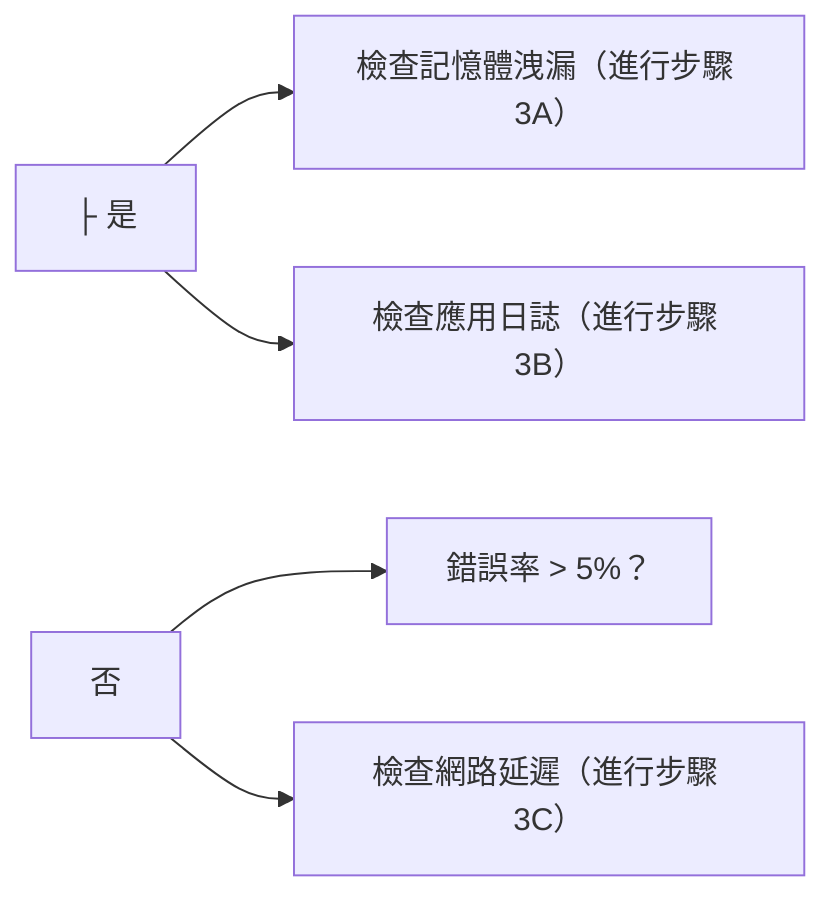

# 操作手冊：{議題標題}

> **最後更新**: YYYY-MM-DD
> **所有者**: 團隊/人員名稱
> **嚴重性**: 致命 | 高 | 中 | 低

## 快速參考

| 屬性 | 值 |
|----------|-------|
| **議題類型** | 效能 | 可用性 | 安全性 | 資料 | 其他 |
| **受影響的服務** | 服務名稱 |
| **典型耗時** | X 分鐘/小時 |
| **頻率** | 少見 | 偶爾 | 頻繁 |
| **最後發生** | YYYY-MM-DD |

## 症狀

### 使用者可見的症狀

- 症狀 1: 描述
- 症狀 2: 描述
- 症狀 3: 描述

### 系統症狀

- 症狀 1: 描述（例如，CPU 使用率 > 90%）
- 症狀 2: 描述（例如，錯誤率 > 5%）
- 症狀 3: 描述（例如，回應時間 > 5 秒）

### 日誌模式

```text
要尋找的日誌模式範例：
ERROR [時間戳] ServiceName: 錯誤訊息模式
```

## 影響

### 嚴重級別

**嚴重性**: 致命 | 高 | 中 | 低

**嚴重性標準**:

- **致命**: 完整服務中斷、資料遺失、安全漏洞
- **高**: 主要功能不可用、明顯效能下降
- **中**: 次要功能受影響、部分使用者受影響
- **低**: 影響最小、有替代方案

### 受影響的使用者

- **使用者群組 1**: 影響描述
- **使用者群組 2**: 影響描述
- **估計受影響的使用者**: 數字或百分比

### 業務影響

- **收入影響**: 描述和估計金額
- **SLA 影響**: 哪些 SLA 處於風險
- **聲譽影響**: 描述
- **合規性影響**: 任何監管關注

### 受影響的組件

- 組件 1: 影響描述
- 組件 2: 影響描述
- 組件 3: 影響描述

## 偵測

### 自動化偵測

**主要警報**:

- **警報名稱**: 監控系統中的警報名稱
- **警報條件**: 觸發警報的條件
- **警報渠道**: Slack/PagerDuty/電子郵件
- **警報連結**: [連結到警報配置]

**次要警報**:

- 警報 1: 描述
- 警報 2: 描述

### 監控儀表板

- **主要儀表板**: [儀表板名稱](儀表板連結)
  - 要檢查的關鍵指標: 指標 1、指標 2、指標 3
- **次要儀表板**: [儀表板名稱](儀表板連結)
  - 要檢查的關鍵指標: 指標 1、指標 2

### 手動偵測

**如何手動驗證議題**:

1. 步驟 1: 描述
2. 步驟 2: 描述
3. 步驟 3: 描述

**要檢查的指令**:

```bash
# 檢查服務健康狀態
kubectl get pods -n production | grep service-name

# 檢查日誌
kubectl logs -f deployment/service-name -n production --tail=100

# 檢查指標
curl http://service-name:8080/actuator/metrics/http.server.requests
```

## 診斷

### 步驟 1: 驗證議題

**目標**: 確認議題正在發生

**操作**:

```bash
# 指令 1: 檢查服務狀態
kubectl get pods -n production

# 指令 2: 檢查最近的日誌
kubectl logs deployment/service-name -n production --since=10m

# 指令 3: 檢查指標
# 存取監控儀表板並驗證指標
```

**預期結果**:

- 結果 1: 描述
- 結果 2: 描述

**如果議題已確認**: 進行步驟 2
**如果議題未確認**: 檢查誤報

### 步驟 2: 識別根本原因

**目標**: 確定什麼原因導致議題

**常見原因**:

1. **原因 1**: 描述
   - 如何驗證: 指令或檢查
   - 指標: 要尋找的內容

2. **原因 2**: 描述
   - 如何驗證: 指令或檢查
   - 指標: 要尋找的內容

3. **原因 3**: 描述
   - 如何驗證: 指令或檢查
   - 指標: 要尋找的內容

**診斷指令**:

```bash
# 檢查資源使用量
kubectl top pods -n production

# 檢查資料庫連接
# 檢查 DB 連接的指令

# 檢查外部依賴項
# 檢查外部服務的指令
```

**決策樹**:



### 步驟 3: 收集其他資訊

**要收集的資訊**:

- [ ] 最近的部署（過去 24 小時）
- [ ] 最近的配置變更
- [ ] 流量模式（目前 vs 正常）
- [ ] 錯誤日誌（過去 1 小時）
- [ ] 資源使用率趨勢
- [ ] 外部依賴項狀態

**指令**:

```bash
# 取得最近的部署
kubectl rollout history deployment/service-name -n production

# 取得配置
kubectl get configmap service-config -n production -o yaml

# 取得資源使用歷史
# 從監控系統查詢
```

## 解決方案

### 立即行動（前 5 分鐘）

**優先級**: 制止出血

1. **操作 1**: 描述

   ```bash
   # 要執行的指令
   ```

   **預期結果**: 描述
   **驗證**: 如何驗證它有效

2. **操作 2**: 描述

   ```bash
   # 要執行的指令
   ```

   **預期結果**: 描述
   **驗證**: 如何驗證它有效

3. **操作 3**: 描述

   ```bash
   # 要執行的指令
   ```

   **預期結果**: 描述
   **驗證**: 如何驗證它有效

### 短期修復（接下來 30 分鐘）

**優先級**: 將服務恢復至可接受的水平

1. **修復 1**: 描述

   ```bash
   # 要執行的指令
   ```

   **預期結果**: 描述
   **回滾**: 如果這不起作用，如何回滾

2. **修復 2**: 描述

   ```bash
   # 要執行的指令
   ```

   **預期結果**: 描述
   **回滾**: 如果這不起作用，如何回滾

### 根本原因修復（接下來 1-2 小時）

**優先級**: 永久解決議題

1. **永久修復 1**: 描述
   - 實施步驟
   - 測試需求
   - 部署計畫

2. **永久修復 2**: 描述
   - 實施步驟
   - 測試需求
   - 部署計畫

### 按根本原因進行解決方案

#### 如果根本原因是：高 CPU 使用率

**解決步驟**:

1. 步驟 1: 描述
2. 步驟 2: 描述
3. 步驟 3: 描述

#### 如果根本原因是：資料庫連接問題

**解決步驟**:

1. 步驟 1: 描述
2. 步驟 2: 描述
3. 步驟 3: 描述

#### 如果根本原因是：外部服務失敗

**解決步驟**:

1. 步驟 1: 描述
2. 步驟 2: 描述
3. 步驟 3: 描述

## 驗證

### 驗證檢查清單

實施修復後，驗證：

- [ ] **指標 1**: 回到正常範圍（< X）
- [ ] **指標 2**: 回到正常範圍（< Y）
- [ ] **錯誤率**: 低於閾值（< Z%）
- [ ] **回應時間**: 低於閾值（< N 毫秒）
- [ ] **使用者報告**: 無新投訴
- [ ] **警報**: 已清除或已確認
- [ ] **日誌**: 無錯誤模式

### 驗證指令

```bash
# 檢查服務健康狀態
kubectl get pods -n production | grep service-name

# 檢查指標
curl http://service-name:8080/actuator/health

# 檢查日誌中的錯誤
kubectl logs deployment/service-name -n production --since=5m | grep ERROR

# 執行煙霧測試
./scripts/smoke-test.sh production
```

### 驗證時間線

- **立即**（0-5 分鐘）: 服務回應
- **短期**（5-15 分鐘）: 指標回到正常
- **中期**（15-60 分鐘）: 無症狀重複發生
- **長期**（1-24 小時）: 持續正常運作

## 預防

### 立即預防措施

1. **措施 1**: 描述
   - 實施: 如何實施
   - 時間線: 何時實施

2. **措施 2**: 描述
   - 實施: 如何實施
   - 時間線: 何時實施

### 長期預防策略

1. **策略 1**: 描述
   - 所有者: 團隊/人員
   - 時間線: 時間線
   - 成功標準: 如何測量成功

2. **策略 2**: 描述
   - 所有者: 團隊/人員
   - 時間線: 時間線
   - 成功標準: 如何測量成功

### 監控改進

- **改進 1**: 為 X 新增警報
- **改進 2**: 為 Y 新增儀表板
- **改進 3**: 為 Z 新增自動化檢查

### 流程改進

- **改進 1**: 描述
- **改進 2**: 描述
- **改進 3**: 描述

## 升級

### 升級路徑

| 級別 | 聯絡 | 何時升級 | 回應時間 SLA |
|-------|---------|------------------|-------------------|
| L1 | 待命工程師 | 立即 | 5 分鐘 |
| L2 | 團隊主管 | 如果 L1 無法在 15 分鐘內解決 | 10 分鐘 |
| L3 | 工程經理 | 如果 L2 無法在 30 分鐘內解決 | 15 分鐘 |
| L4 | CTO | 嚴重影響 > 1 小時 | 30 分鐘 |

### 聯絡資訊

**待命工程師**:

- PagerDuty: [連結到排程]
- Slack: #oncall-channel

**團隊主管**:

- 名稱: 人員名稱
- 電話: +X-XXX-XXX-XXXX
- Slack: @username

**主題專家**:

- **專家 1**（領域）: @username
- **專家 2**（領域）: @username

### 升級觸發器

立即升級，如果：

- 議題影響 > X% 的使用者
- 收入影響 > $Y
- 資料遺失或安全漏洞
- 無法在 15 分鐘內診斷
- 無法在 30 分鐘內解決
- SLA 違反迫在眼前

## 溝通

### 內部溝通

**Slack 頻道**:

- **#incidents**: 用於事件更新
- **#engineering**: 用於技術討論
- **#leadership**: 用於執行更新

**更新頻率**:

- **致命**: 每 15 分鐘
- **高**: 每 30 分鐘
- **中**: 每小時

**更新模板**:

```text
🚨 事件更新 - [時間戳]
狀態: 調查中 | 已識別 | 監控中 | 已解決
影響: [描述]
目前行動: [我們正在做什麼]
ETA: [預期解決時間]
下次更新: [時間]
```

### 外部溝通

**狀態頁面**: [連結到狀態頁面]

**客戶溝通**:

- **何時溝通**: 客戶通知的標準
- **溝通渠道**: 電子郵件、狀態頁面、社交媒體
- **訊息模板**: [連結到模板]

**利益相關者溝通**:

- **要通知誰**: 利益相關者清單
- **何時通知**: 標準
- **溝通方式**: 電子郵件、電話、Slack

## 事件後

### 事件後評估（PIR）

**排程 PIR**: 解決後 48 小時內

**PIR 參與者**:

- 事件回應者
- 團隊主管
- 產品經理
- 相關利益相關者

**PIR 議程**:

1. 事件時間線
2. 根本原因分析
3. 什麼進展順利
4. 什麼可以改進
5. 行動項目

### 文件更新

解決後，更新：

- [ ] 此操作手冊，含取得的經驗
- [ ] 監控警報（如需要）
- [ ] 架構文件（如相關）
- [ ] 訓練材料（如需要）

### 後續行動

- [ ] **行動 1**: 描述 - 所有者 - 截止日期
- [ ] **行動 2**: 描述 - 所有者 - 截止日期
- [ ] **行動 3**: 描述 - 所有者 - 截止日期

### 取得的經驗

**進展順利的事項**:

- 項目 1
- 項目 2

**可以改進的事項**:

- 項目 1
- 項目 2

**行動項目**:

- [ ] 行動 1: 描述
- [ ] 行動 2: 描述

## 相關文件

- [架構文件](../../viewpoints/README.md)
- [監控指南](../monitoring/monitoring-strategy.md)
- [部署指南](../deployment/deployment-process.md)
- [相關操作手冊 1](./related-runbook-1.md)
- [相關操作手冊 2](./related-runbook-2.md)

## 附錄

### 有用的指令參考

```bash
# Kubernetes 指令
kubectl get pods -n production
kubectl logs -f deployment/service-name -n production
kubectl describe pod pod-name -n production
kubectl top pods -n production

# 資料庫指令
# 新增相關的資料庫指令

# 監控指令
# 新增相關的監控指令
```

### 有用的連結

- [監控儀表板](連結)
- [日誌彙總](連結)
- [部署管道](連結)
- [配置管理](連結)

### 變更歷史

| 日期 | 版本 | 作者 | 變更 |
|------|---------|--------|---------|
| YYYY-MM-DD | 1.0 | 名稱 | 初始版本 |
| YYYY-MM-DD | 1.1 | 名稱 | 根據事件更新 |

---

**操作手冊模板版本**: 1.0
**最後模板更新**: 2025-01-17
