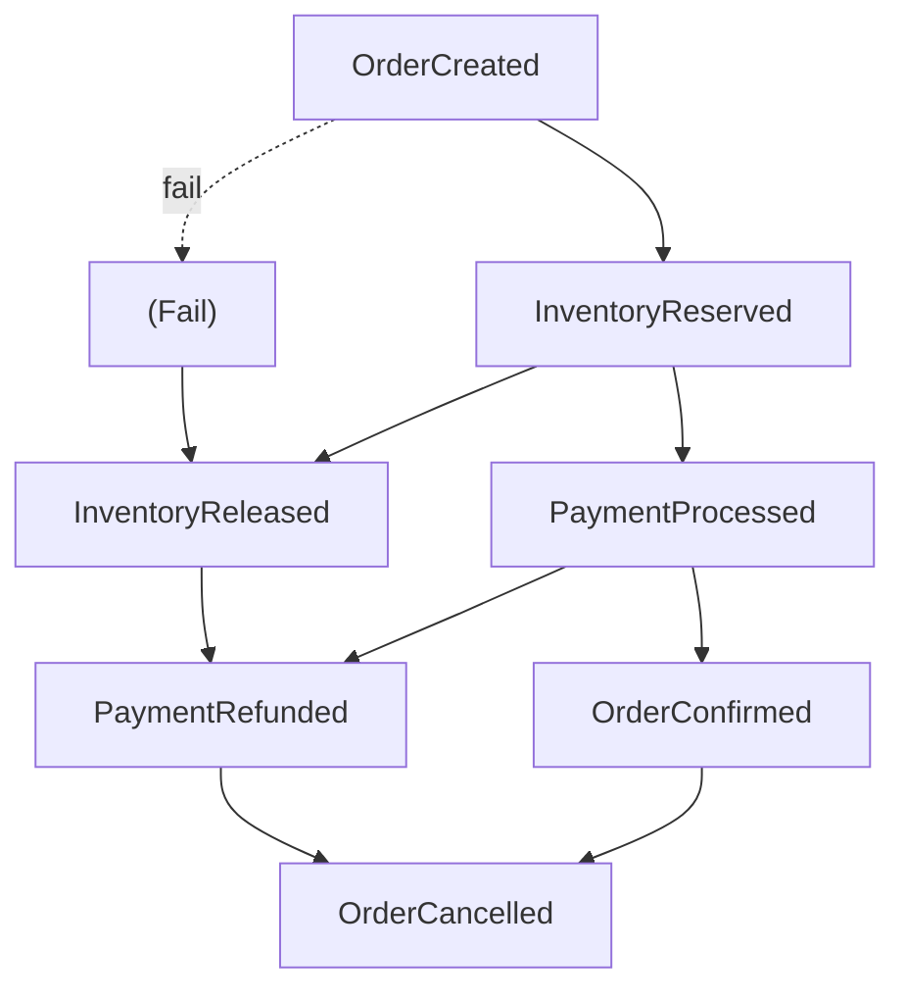

# Concurrency Viewpoint Overview

> **Viewpoint**: Concurrency
> **Purpose**: 描述系統如何處理並行操作和管理共享資源
> **Audience**: Architects, Developers, Operations Team, Performance Engineers

## 目的

Concurrency Viewpoint 描述 E-Commerce Platform 如何管理並行操作、處理多個同時的請求,以及確保分散式環境中的資料一致性。這個觀點對於理解系統可擴展性、效能和可靠性至關重要。

## 關鍵關注點

此觀點處理以下關注點:

1. **並行請求處理**: 系統如何處理多個同時的使用者請求
2. **資料一致性**: 系統如何在並行存取下維護資料完整性
3. **資源競爭**: 系統如何管理對共享資源的存取
4. **同步機制**: 使用哪些技術來協調並行操作
5. **狀態管理**: 系統如何在分散式環境中管理狀態
6. **負載下的效能**: 並行性如何影響系統效能和可擴展性

## Concurrency Model 概述

### 事件驅動架構

E-Commerce Platform 使用**事件驅動架構**作為其主要的 concurrency model。這種方法提供:

- **鬆散耦合**: 元件透過事件溝通,減少直接依賴
- **非同步處理**: 非關鍵操作非同步處理
- **可擴展性**: Event consumers 可以獨立擴展
- **韌性**: 一個元件的失敗不會串聯到其他元件


*圖 1: 整體 concurrency model 顯示同步、非同步和事件驅動處理層*

### 混合同步-非同步模型

系統採用混合模型,結合:

**同步操作** (Request-Response):

- 需要立即回應的使用者介面 API 呼叫
- 需要即時確認的付款處理
- 需要立即可用性狀態的庫存檢查
- 需要立即驗證的訂單提交

**非同步操作** (Event-Driven):

- Email 和 SMS 通知
- 分析和報告
- 與外部系統的庫存同步
- 背景資料處理

### Concurrency 層級

系統在多個層級處理並行性:

1. **應用程式層級**
   - Spring Boot thread pools 用於 HTTP 請求處理
   - Async task executors 用於背景處理
   - Kafka consumers 用於事件處理

2. **資料庫層級**
   - Connection pooling (HikariCP)
   - Transaction isolation levels
   - Optimistic 和 pessimistic locking

3. **分散式層級**
   - Redis distributed locks
   - 透過 Kafka 的事件驅動協調
   - API rate limiting 和 throttling

## Concurrency 挑戰

### 挑戰 1: 庫存管理

**問題**: 多個客戶同時嘗試購買庫存中的最後一件商品。

**解決方案**:

- Distributed locking (Redis) 用於庫存保留
- Optimistic locking 搭配版本號碼
- 庫存保留逾時機制
- 失敗訂單的補償邏輯

### 挑戰 2: 訂單處理

**問題**: 確保訂單處理步驟按正確順序執行,避免 race conditions。

**解決方案**:

- Saga pattern 用於分散式交易
- Event sourcing 用於訂單狀態追蹤
- 冪等 event handlers
- Exponential backoff 的重試機制

### 挑戰 3: 付款處理

**問題**: 防止同一訂單的重複付款收費。

**解決方案**:

- Payment API 呼叫的 idempotency keys
- 資料庫 unique constraints
- 付款處理期間的 distributed locks
- Payment status 調解

### 挑戰 4: 購物車一致性

**問題**: 在多個使用者工作階段和裝置間維護購物車一致性。

**解決方案**:

- Redis-based session storage
- Optimistic locking 用於購物車更新
- 多裝置存取的購物車合併策略
- 定期清理被放棄的購物車

## Concurrency 策略

### 1. 無狀態設計

**原則**: 應用程式服務是無狀態的以實現水平擴展。

**實作**:

- 應用程式伺服器中無記憶體內 session state
- 驗證使用 JWT tokens (無狀態)
- Redis 用於 distributed session storage
- 資料庫用於持久狀態

**優點**:

- 容易水平擴展
- 不需要 session affinity
- 簡化部署和回滾
- 更好的容錯能力

### 2. 樂觀並行控制

**原則**: 假設衝突很少發生;發生時檢測並解決。

**實作**:

- JPA `@Version` annotation 用於 entity versioning
- 更新前檢查版本
- 版本衝突的重試邏輯
- 使用者友善的衝突解決

**使用案例**:

- Product catalog 更新
- Customer profile 更新
- Shopping cart 修改
- 非關鍵庫存更新

### 3. 悲觀並行控制

**原則**: 存取前鎖定資源以防止衝突。

**實作**:

- 資料庫 row-level locks (`SELECT ... FOR UPDATE`)
- Redis distributed locks (Redisson)
- Lock timeout 設定
- Deadlock 檢測和預防

**使用案例**:

- 關鍵庫存操作
- 付款處理
- 訂單確定
- 高競爭資源

### 4. 事件驅動協調

**原則**: 透過 domain events 協調分散式操作。

**實作**:

- Kafka 用於 event streaming
- Event sourcing 用於稽核軌跡
- 冪等 event handlers
- Failed events 的 dead letter queues

**使用案例**:

- 跨 context 溝通
- 非同步通知
- 分析和報告
- Workflow 編排

## Thread 管理


*圖 2: 不同處理層的 thread pool 設定*

### HTTP 請求處理

**設定**:

```yaml
server:
  tomcat:
    threads:
      max: 200          # Maximum threads
      min-spare: 10     # Minimum idle threads
    accept-count: 100   # Queue size for pending requests
    max-connections: 10000
```

**特性**:

- 每個 HTTP 請求一個 thread
- Thread pool 由 Tomcat 管理
- 同步操作使用 blocking I/O
- 非同步操作使用 non-blocking I/O

### 非同步任務執行

**設定**:

```java
@Configuration
@EnableAsync
public class AsyncConfiguration {
    @Bean(name = "taskExecutor")
    public Executor taskExecutor() {
        ThreadPoolTaskExecutor executor = new ThreadPoolTaskExecutor();
        executor.setCorePoolSize(10);
        executor.setMaxPoolSize(50);
        executor.setQueueCapacity(100);
        executor.setThreadNamePrefix("async-task-");
        executor.initialize();
        return executor;
    }
}
```

**使用案例**:

- Email 發送
- SMS 通知
- 報告生成
- 資料匯出

### Kafka 事件處理


*圖 3: Event processing concurrency model with partition assignment and consumer groups*

**設定**:

```yaml
spring:
  kafka:
    consumer:
      concurrency: 3    # Threads per consumer
      max-poll-records: 100
    listener:
      concurrency: 5    # Concurrent listeners
```

**特性**:

- 每個 topic 多個 consumer threads
- 平行事件處理
- Partition 內的有序處理
- 自動 offset 管理

## Transaction 管理

### Transaction 邊界

**原則**: 保持 transactions 簡短和專注。

**實作**:

- Application service 層級的 `@Transactional`
- 查詢使用唯讀 transactions
- 獨立操作使用分開的 transactions
- 盡可能避免分散式 transactions

### Transaction Isolation Levels

**預設**: `READ_COMMITTED`

**理由**:

- 防止 dirty reads
- 允許並行讀取
- 一致性和效能的良好平衡
- 適合大多數電子商務操作

**特殊案例**:

- `SERIALIZABLE` 用於關鍵財務操作
- `READ_UNCOMMITTED` 用於分析 (唯讀)

### 分散式 Transaction 處理

**方法**: Saga Pattern (Choreography-based)

**實作**:

1. 每個服務發佈 domain events
2. 其他服務回應事件
3. 回滾的補償事件
4. Contexts 間的最終一致性

**範例**: Order Processing Saga



## 狀態管理

### Session State

**儲存**: Redis (distributed session store)

**設定**:

```yaml
spring:
  session:
    store-type: redis
    timeout: 30m
    redis:
      flush-mode: on-save
```

**特性**:

- 在所有應用程式實例間共享
- 自動過期
- 可序列化的 session attributes
- Redis cluster 的高可用性

### Application State

**原則**: 最小化可變的共享狀態。

**指南**:

- 使用 immutable value objects
- 避免 static mutable fields
- 需要時使用 thread-safe collections
- 偏好無狀態服務

### Cache State

**儲存**: Redis (distributed cache)

**策略**:

- Cache-aside pattern
- TTL-based expiration
- 透過事件的 cache invalidation
- Cache miss 時回退到資料庫

## 同步機制

### Distributed Locking

**技術**: Redis with Redisson

**使用案例**:

- 庫存保留
- 訂單處理
- 付款處理
- 關鍵資源存取

**設定**:

```java
@Configuration
public class RedissonConfiguration {
    @Bean
    public RedissonClient redissonClient() {
        Config config = new Config();
        config.useSingleServer()
            .setAddress("redis://localhost:6379")
            .setConnectionPoolSize(50)
            .setConnectionMinimumIdleSize(10);
        return Redisson.create(config);
    }
}
```

### 資料庫鎖定

**Optimistic Locking**:

```java
@Entity
public class Product {
    @Version
    private Long version;
    // ... other fields
}
```

**Pessimistic Locking**:

```java
@Lock(LockModeType.PESSIMISTIC_WRITE)
@Query("SELECT i FROM Inventory i WHERE i.productId = :productId")
Inventory findByProductIdForUpdate(@Param("productId") String productId);
```

### 基於事件的同步

**機制**: Kafka topics with ordered partitions

**保證**:

- 同一 partition 中的事件按順序處理
- At-least-once delivery
- 冪等 event handlers
- 失敗的 dead letter queue

## 效能考量

### Concurrency vs. 效能權衡

**高並行性優點**:

- 更好的資源利用
- 更高的吞吐量
- 改善的可擴展性

**高並行性成本**:

- 增加的 context switching
- Lock contention
- 記憶體開銷
- 除錯複雜性

### 最佳化策略

1. **最小化 Lock 範圍**
   - 只鎖定必要的部分
   - 盡快釋放 locks
   - 使用細粒度鎖定

2. **減少 Lock Contention**
   - 分割資料以減少衝突
   - 盡可能使用 optimistic locking
   - 實作帶 backoff 的重試

3. **非同步處理**
   - 卸載非關鍵操作
   - 使用 message queues
   - 批次處理以提高效率

4. **Connection Pooling**
   - 重用資料庫連線
   - 設定適當的 pool sizes
   - 監控 pool 利用率

## 監控和可觀察性

### 關鍵指標

**Thread Pool Metrics**:

- Active threads
- Queue size
- Rejected tasks
- Average task execution time

**Lock Metrics**:

- Lock acquisition time
- Lock hold time
- Lock contention rate
- Deadlock occurrences

**Transaction Metrics**:

- Transaction duration
- Rollback rate
- Deadlock rate
- Connection pool usage

**Event Processing Metrics**:

- Event processing lag
- Event processing rate
- Failed event count
- Dead letter queue size

### 監控工具

- **Micrometer**: Application metrics
- **CloudWatch**: AWS infrastructure metrics
- **X-Ray**: Distributed tracing
- **Grafana**: Visualization dashboards
- **Prometheus**: Metrics collection

## 相關文件

### 詳細文件

- [Synchronous vs Asynchronous Operations](sync-async-operations.md) - Operation classification →
- [Synchronization Mechanisms](synchronization.md) - Detailed synchronization techniques →
- [State Management](state-management.md) - State handling strategies →

### 相關 Viewpoints

- [Functional Viewpoint](../functional/overview.md) - System capabilities
- [Information Viewpoint](../information/overview.md) - Data management
- [Deployment Viewpoint](../deployment/overview.md) - Infrastructure
- [Operational Viewpoint](../operational/overview.md) - Operations

### 相關 Perspectives

- [Performance Perspective](../../perspectives/performance/overview.md) - Performance requirements
- [Availability Perspective](../../perspectives/availability/overview.md) - Reliability requirements
- [Scalability Perspective](../../perspectives/performance/scalability.md) - Scaling strategies

---

**Document Status**: Active
**Last Review**: 2025-10-23
**Next Review**: 2025-11-23
**Owner**: Architecture Team
