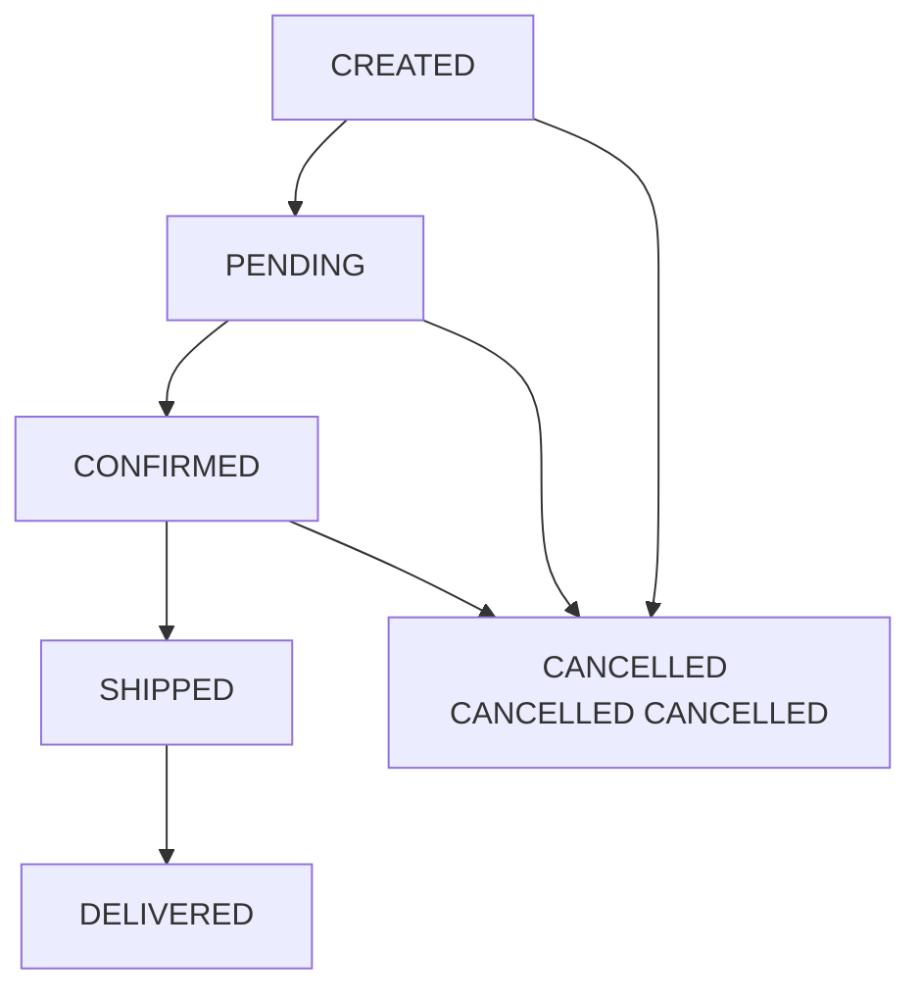

# State Management

> **Viewpoint**: Concurrency
> **Purpose**: 記錄系統如何在分散式環境中管理狀態
> **Audience**: Architects, Developers, Operations Team

## 概述

本文件描述 E-Commerce Platform 如何在分散式元件間管理狀態,確保並行環境中的一致性、可擴展性和可靠性。

## 狀態管理原則

### 1. 預設無狀態

**原則**: 應用程式服務應該是無狀態的以實現水平擴展。

**優點**:

- 容易水平擴展
- 不需要 session affinity
- 簡化部署和回滾
- 更好的容錯能力
- Load balancing 靈活性

**實作**:

- 應用程式伺服器中無記憶體內 session state
- 所有狀態儲存在外部系統 (資料庫、快取)
- JWT tokens 用於驗證 (自包含)
- 冪等操作

### 2. 外部化狀態

**原則**: 將狀態儲存在專用的可擴展儲存系統中。

**狀態儲存選項**:

- **Database (PostgreSQL)**: 持久的、交易性狀態
- **Cache (Redis)**: 暫時的、快速存取狀態
- **Message Queue (Kafka)**: Event state 和歷史
- **Object Storage (S3)**: 檔案和媒體狀態

### 3. 最終一致性

**原則**: 接受非關鍵狀態的最終一致性。

**使用案例**:

- 分析和報告
- 搜尋索引
- 快取更新
- 跨 context 資料同步

## 狀態分類

### 1. 使用者 Session State

#### 驗證狀態

**儲存**: JWT Token (無狀態)

**實作**:

```java
@Component
public class JwtTokenProvider {

    private final String jwtSecret;
    private final long jwtExpirationMs = 86400000; // 24 hours

    public String generateToken(UserDetails userDetails) {
        Map<String, Object> claims = new HashMap<>();
        claims.put("userId", userDetails.getUsername());
        claims.put("roles", userDetails.getAuthorities());

        return Jwts.builder()
            .setClaims(claims)
            .setSubject(userDetails.getUsername())
            .setIssuedAt(new Date())
            .setExpiration(new Date(System.currentTimeMillis() + jwtExpirationMs))
            .signWith(SignatureAlgorithm.HS512, jwtSecret)
            .compact();
    }

    public boolean validateToken(String token) {
        try {
            Jwts.parser().setSigningKey(jwtSecret).parseClaimsJws(token);
            return true;
        } catch (JwtException e) {
            return false;
        }
    }
}
```

**特性**:

- 自包含 (無伺服器端儲存)
- 無狀態驗證
- 無法撤銷 (直到過期)
- 包含使用者身分和角色

**Token 撤銷策略**:

```java
@Component
public class TokenBlacklistService {

    private final RedisTemplate<String, String> redisTemplate;

    public void revokeToken(String token) {
        String tokenId = extractTokenId(token);
        long expirationTime = extractExpiration(token);
        long ttl = expirationTime - System.currentTimeMillis();

        if (ttl > 0) {
            redisTemplate.opsForValue().set(
                "blacklist:" + tokenId,
                "revoked",
                Duration.ofMillis(ttl)
            );
        }
    }

    public boolean isTokenRevoked(String token) {
        String tokenId = extractTokenId(token);
        return redisTemplate.hasKey("blacklist:" + tokenId);
    }
}
```

---

#### Shopping Cart State

**儲存**: Redis (Distributed Session)

**設定**:

```yaml
spring:
  session:
    store-type: redis
    timeout: 30m
    redis:
      flush-mode: on-save
      namespace: spring:session
```

**實作**:

```java
@Service
public class ShoppingCartService {

    private final RedisTemplate<String, ShoppingCart> cartTemplate;

    public ShoppingCart getCart(String sessionId) {
        String key = "cart:" + sessionId;
        ShoppingCart cart = cartTemplate.opsForValue().get(key);

        if (cart == null) {
            cart = new ShoppingCart(sessionId);
            saveCart(cart);
        }

        return cart;
    }

    public void saveCart(ShoppingCart cart) {
        String key = "cart:" + cart.getSessionId();
        cartTemplate.opsForValue().set(
            key,
            cart,
            Duration.ofMinutes(30)
        );
    }

    public void addItem(String sessionId, CartItem item) {
        ShoppingCart cart = getCart(sessionId);
        cart.addItem(item);
        saveCart(cart);
    }
}
```

**特性**:

- 在所有應用程式實例間共享
- 自動過期 (30 分鐘)
- 應用程式重啟後仍存在
- 支援多裝置存取

**購物車合併策略** (多裝置):

```java
@Service
public class CartMergeService {

    public ShoppingCart mergeCart(String sessionId, String userId) {
        ShoppingCart sessionCart = getSessionCart(sessionId);
        ShoppingCart userCart = getUserCart(userId);

        if (userCart == null) {
            // First login, convert session cart to user cart
            userCart = sessionCart;
            userCart.setUserId(userId);
        } else {
            // Merge session cart into user cart
            for (CartItem item : sessionCart.getItems()) {
                userCart.addOrUpdateItem(item);
            }
        }

        saveUserCart(userCart);
        deleteSessionCart(sessionId);

        return userCart;
    }
}
```

---

### 2. Application State

#### Domain Entity State

**儲存**: PostgreSQL (Primary Database)

**狀態轉換**:

```java
@Entity
@Table(name = "orders")
public class Order {

    @Id
    private String id;

    @Enumerated(EnumType.STRING)
    private OrderStatus status;

    @Version
    private Long version;  // Optimistic locking

    public void submit() {
        validateTransition(OrderStatus.CREATED, OrderStatus.PENDING);
        this.status = OrderStatus.PENDING;
        collectEvent(OrderSubmittedEvent.create(this.id));
    }

    public void confirm() {
        validateTransition(OrderStatus.PENDING, OrderStatus.CONFIRMED);
        this.status = OrderStatus.CONFIRMED;
        collectEvent(OrderConfirmedEvent.create(this.id));
    }

    public void cancel() {
        if (this.status == OrderStatus.SHIPPED) {
            throw new IllegalStateException("Cannot cancel shipped order");
        }
        this.status = OrderStatus.CANCELLED;
        collectEvent(OrderCancelledEvent.create(this.id));
    }

    private void validateTransition(OrderStatus from, OrderStatus to) {
        if (this.status != from) {
            throw new IllegalStateException(
                String.format("Cannot transition from %s to %s", this.status, to)
            );
        }
    }
}
```

**狀態機**:



---

#### Aggregate State

**儲存**: Database + Event Store

**Event Sourcing Pattern**:

```java
@Service
public class OrderEventSourcingService {

    private final EventStore eventStore;
    private final OrderRepository orderRepository;

    public Order rebuildFromEvents(String orderId) {
        List<DomainEvent> events = eventStore.getEventsForAggregate(orderId);

        Order order = new Order();
        for (DomainEvent event : events) {
            order.apply(event);
        }

        return order;
    }

    public void saveWithEvents(Order order) {
        // Save current state
        orderRepository.save(order);

        // Store events for audit trail
        for (DomainEvent event : order.getUncommittedEvents()) {
            eventStore.store(event);
        }

        order.markEventsAsCommitted();
    }
}
```

---

### 3. Cache State

#### Application-Level Cache

**儲存**: Redis (Distributed Cache)

**設定**:

```java
@Configuration
@EnableCaching
public class CacheConfiguration {

    @Bean
    public CacheManager cacheManager(RedisConnectionFactory connectionFactory) {
        RedisCacheConfiguration config = RedisCacheConfiguration.defaultCacheConfig()
            .entryTtl(Duration.ofMinutes(30))
            .serializeKeysWith(
                RedisSerializationContext.SerializationPair
                    .fromSerializer(new StringRedisSerializer())
            )
            .serializeValuesWith(
                RedisSerializationContext.SerializationPair
                    .fromSerializer(new GenericJackson2JsonRedisSerializer())
            );

        return RedisCacheManager.builder(connectionFactory)
            .cacheDefaults(config)
            .withCacheConfiguration("products",
                config.entryTtl(Duration.ofHours(1)))
            .withCacheConfiguration("customers",
                config.entryTtl(Duration.ofMinutes(15)))
            .build();
    }
}
```

**快取使用**:

```java
@Service
@CacheConfig(cacheNames = "products")
public class ProductService {

    @Cacheable(key = "#productId")
    public Product findById(String productId) {
        return productRepository.findById(productId)
            .orElseThrow(() -> new ProductNotFoundException(productId));
    }

    @CacheEvict(key = "#product.id")
    public Product updateProduct(Product product) {
        return productRepository.save(product);
    }

    @CacheEvict(allEntries = true)
    public void clearProductCache() {
        // Cache cleared automatically
    }
}
```

**快取失效策略**:

```java
@Component
public class CacheInvalidationHandler extends AbstractDomainEventHandler<ProductUpdatedEvent> {

    private final CacheManager cacheManager;

    @Override
    public void handle(ProductUpdatedEvent event) {
        Cache productCache = cacheManager.getCache("products");
        if (productCache != null) {
            productCache.evict(event.productId());
        }
    }
}
```

---

### 4. 暫時狀態

#### Request-Scoped State

**儲存**: Thread-Local Variables

**實作**:

```java
@Component
public class RequestContextHolder {

    private static final ThreadLocal<RequestContext> contextHolder = new ThreadLocal<>();

    public static void setContext(RequestContext context) {
        contextHolder.set(context);
    }

    public static RequestContext getContext() {
        return contextHolder.get();
    }

    public static void clear() {
        contextHolder.remove();
    }
}

@Component
public class RequestContextFilter implements Filter {

    @Override
    public void doFilter(ServletRequest request, ServletResponse response, FilterChain chain)
            throws IOException, ServletException {
        try {
            RequestContext context = new RequestContext(
                extractUserId(request),
                extractTraceId(request),
                Instant.now()
            );
            RequestContextHolder.setContext(context);

            chain.doFilter(request, response);
        } finally {
            RequestContextHolder.clear();
        }
    }
}
```

---

#### Background Job State

**儲存**: Database (Job Status Table)

**實作**:

```java
@Entity
@Table(name = "background_jobs")
public class BackgroundJob {

    @Id
    private String id;

    @Enumerated(EnumType.STRING)
    private JobStatus status;

    private String jobType;
    private String parameters;
    private String result;
    private String errorMessage;

    private LocalDateTime createdAt;
    private LocalDateTime startedAt;
    private LocalDateTime completedAt;

    private int retryCount;
    private int maxRetries = 3;
}

@Service
public class BackgroundJobService {

    @Async("taskExecutor")
    public CompletableFuture<Void> executeJob(String jobId) {
        BackgroundJob job = jobRepository.findById(jobId).orElseThrow();

        try {
            job.setStatus(JobStatus.RUNNING);
            job.setStartedAt(LocalDateTime.now());
            jobRepository.save(job);

            // Execute job logic
            String result = processJob(job);

            job.setStatus(JobStatus.COMPLETED);
            job.setResult(result);
            job.setCompletedAt(LocalDateTime.now());
            jobRepository.save(job);

        } catch (Exception e) {
            handleJobFailure(job, e);
        }

        return CompletableFuture.completedFuture(null);
    }

    private void handleJobFailure(BackgroundJob job, Exception e) {
        job.setRetryCount(job.getRetryCount() + 1);

        if (job.getRetryCount() >= job.getMaxRetries()) {
            job.setStatus(JobStatus.FAILED);
            job.setErrorMessage(e.getMessage());
        } else {
            job.setStatus(JobStatus.PENDING);
        }

        jobRepository.save(job);
    }
}
```

---

## 狀態一致性策略

### 1. 強一致性

**使用案例**: 財務交易、庫存更新、訂單處理

**實作**: 具有適當 isolation levels 的資料庫 transactions

```java
@Transactional(isolation = Isolation.SERIALIZABLE)
public void processPayment(String orderId, PaymentDetails payment) {
    Order order = orderRepository.findById(orderId).orElseThrow();

    // Strong consistency required
    order.processPayment(payment);
    orderRepository.save(order);
}
```

---

### 2. 最終一致性

**使用案例**: 分析、搜尋索引、快取更新

**實作**: 事件驅動更新

```java
@Component
public class SearchIndexUpdater extends AbstractDomainEventHandler<ProductUpdatedEvent> {

    @Override
    @Async
    public void handle(ProductUpdatedEvent event) {
        // Eventually consistent - search index updated asynchronously
        Product product = productRepository.findById(event.productId()).orElseThrow();
        searchIndexService.updateProduct(product);
    }
}
```

---

### 3. 因果一致性

**使用案例**: 使用者活動流、通知排序

**實作**: 序列號碼和排序

```java
@Component
public class ActivityFeedService {

    public void addActivity(String userId, Activity activity) {
        long sequence = getNextSequence(userId);
        activity.setSequence(sequence);

        activityRepository.save(activity);
    }

    public List<Activity> getActivities(String userId, long afterSequence) {
        return activityRepository.findByUserIdAndSequenceGreaterThan(
            userId,
            afterSequence,
            Sort.by("sequence").ascending()
        );
    }
}
```

---

## 狀態同步模式

### 1. Read-Through Cache

```java
@Service
public class ProductCacheService {

    public Product getProduct(String productId) {
        // Try cache first
        Product product = cache.get(productId);

        if (product == null) {
            // Cache miss - read from database
            product = productRepository.findById(productId).orElseThrow();
            cache.put(productId, product);
        }

        return product;
    }
}
```

### 2. Write-Through Cache

```java
@Service
public class ProductCacheService {

    public Product updateProduct(Product product) {
        // Update database first
        Product saved = productRepository.save(product);

        // Then update cache
        cache.put(product.getId(), saved);

        return saved;
    }
}
```

### 3. Write-Behind Cache

```java
@Service
public class ProductCacheService {

    public void updateProduct(Product product) {
        // Update cache immediately
        cache.put(product.getId(), product);

        // Asynchronously update database
        asyncExecutor.execute(() -> {
            productRepository.save(product);
        });
    }
}
```

---

## 狀態遷移和版本控制

### Entity Versioning

```java
@Entity
@Table(name = "customers")
public class Customer {

    @Id
    private String id;

    @Column(name = "schema_version")
    private int schemaVersion = 2;  // Current version

    // V1 fields
    private String name;
    private String email;

    // V2 fields (added later)
    @Column(name = "phone_number")
    private String phoneNumber;

    @Column(name = "preferred_language")
    private String preferredLanguage;
}
```

### 狀態遷移

```java
@Component
public class CustomerStateMigration {

    public Customer migrateToV2(Customer customer) {
        if (customer.getSchemaVersion() < 2) {
            // Migrate from V1 to V2
            if (customer.getPhoneNumber() == null) {
                customer.setPhoneNumber("");  // Default value
            }
            if (customer.getPreferredLanguage() == null) {
                customer.setPreferredLanguage("en");  // Default value
            }
            customer.setSchemaVersion(2);
            customerRepository.save(customer);
        }
        return customer;
    }
}
```

---

## 監控和可觀察性

### 狀態指標

**關鍵指標**:

- Cache hit/miss ratio
- Session count and duration
- State transition rates
- State consistency lag
- State storage size

**實作**:

```java
@Component
public class StateMetrics {

    private final MeterRegistry meterRegistry;

    @Scheduled(fixedRate = 60000)
    public void recordStateMetrics() {
        // Cache metrics
        meterRegistry.gauge("cache.size", cacheManager.getCache("products").size());

        // Session metrics
        meterRegistry.gauge("sessions.active", sessionRepository.countActiveSessions());

        // State storage metrics
        meterRegistry.gauge("state.database.size", getDatabaseSize());
        meterRegistry.gauge("state.redis.memory", getRedisMemoryUsage());
    }
}
```

---

## 最佳實踐

### 1. 最小化有狀態元件

- 偏好無狀態服務
- 將狀態外部化到專用儲存
- 使用 immutable data structures
- 避免 static mutable fields

### 2. 選擇適當的儲存

- **Database**: 持久的、交易性狀態
- **Cache**: 暫時的、快速存取狀態
- **Session Store**: 使用者 session state
- **Event Store**: 稽核軌跡和歷史

### 3. 處理狀態失敗

- 實作重試邏輯
- 使用 circuit breakers
- 提供 fallback 機制
- 監控狀態一致性

### 4. 最佳化狀態存取

- 策略性使用快取
- 批次狀態更新
- 最小化狀態大小
- 使用適當的資料結構

---

## 相關文件

- [Concurrency Viewpoint Overview](overview.md) - Overall concurrency model ←
- [Synchronous vs Asynchronous Operations](sync-async-operations.md) - Operation classification ←
- [Synchronization Mechanisms](synchronization.md) - Locking and coordination ←
- [Information Viewpoint](../information/overview.md) - Data management
- [Performance Perspective](../../perspectives/performance/overview.md) - Performance optimization

---

**Document Status**: Active
**Last Review**: 2025-10-23
**Next Review**: 2025-11-23
**Owner**: Architecture Team
