# Synchronous vs Asynchronous Operations

> **Viewpoint**: Concurrency
> **Purpose**: 定義哪些操作是 synchronous 對比 asynchronous，以及決策標準
> **Audience**: Architects、Developers、Performance Engineers

## 概述

本文件將所有主要系統操作分類為 synchronous 或 asynchronous，解釋每種分類的理由，並提供未來開發中做出這些決策的指南。

## 決策標準

### 何時使用 Synchronous Operations

在以下情況使用 synchronous（blocking）operations：

1. **需要立即回應**
   - 使用者正在等待結果
   - 結果影響下一個使用者動作
   - 需要即時驗證

2. **需要強一致性**
   - 操作必須在繼續前完成
   - 資料必須立即一致
   - 必須維持 transaction 邊界

3. **簡單的錯誤處理**
   - 錯誤可以立即回報給使用者
   - 不需要複雜的重試邏輯
   - 可以直接回滾

4. **低延遲操作**
   - 操作在 < 500ms 內完成
   - 沒有外部 service 依賴
   - 僅 database 操作

### 何時使用 Asynchronous Operations

在以下情況使用 asynchronous（non-blocking）operations：

1. **不需要立即回應**
   - 使用者不需要等待
   - 結果可以稍後傳遞
   - Fire-and-forget 可接受

2. **長時間執行的操作**
   - 操作需要 > 2 秒
   - 涉及外部 service 呼叫
   - 需要批次處理

3. **最終一致性可接受**
   - 資料可以最終一致
   - 不需要立即一致性
   - 可以進行補償動作

4. **可擴展性優勢**
   - 從 request thread 卸載工作
   - 更好的資源利用
   - 改善系統吞吐量

## Synchronous Operations

### Customer Management

#### User Registration

**Type**: Synchronous
**Rationale**: 使用者需要立即確認帳戶建立

**Flow**:

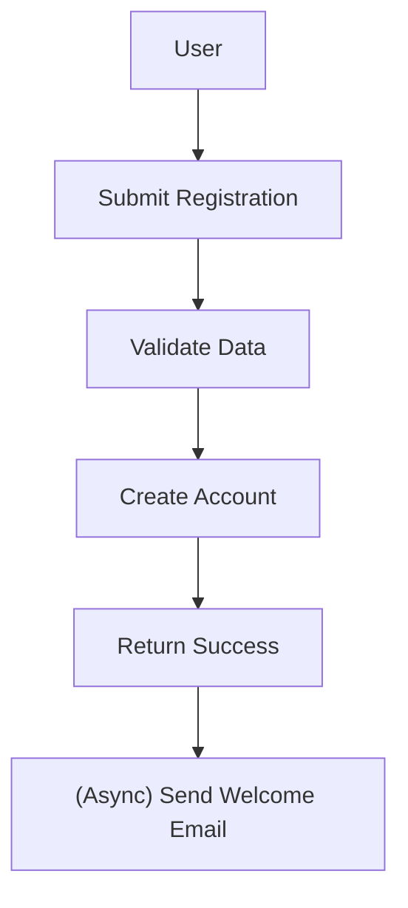

**Response Time**: < 1 秒
**Error Handling**: 立即回饋給使用者

---

#### User Login

**Type**: Synchronous
**Rationale**: 使用者需要立即的認證結果

**Flow**:

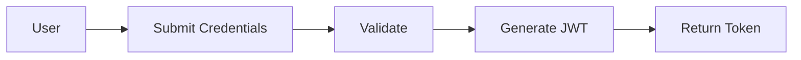

**Response Time**: < 500ms
**Error Handling**: 立即錯誤訊息

---

#### Profile Update

**Type**: Synchronous
**Rationale**: 使用者期望立即確認變更

**Flow**:

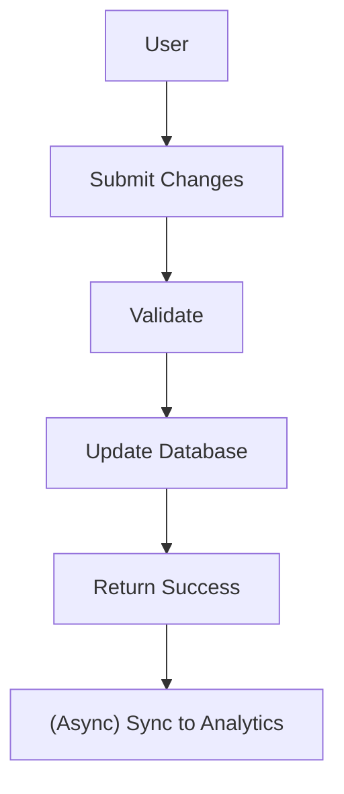

**Response Time**: < 1 秒
**Error Handling**: 立即驗證錯誤

---

### Product Catalog

#### Product Search

**Type**: Synchronous
**Rationale**: 使用者需要立即的搜尋結果

**Flow**:

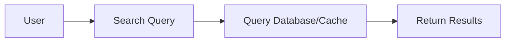

**Response Time**: < 500ms
**Error Handling**: 空結果或錯誤訊息

---

#### Product Details

**Type**: Synchronous
**Rationale**: 使用者需要立即的產品資訊

**Flow**:

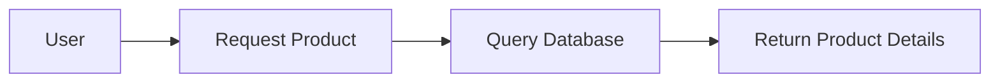

**Response Time**: < 300ms
**Error Handling**: 產品找不到錯誤

---

### Shopping Cart

#### Add to Cart

**Type**: Synchronous
**Rationale**: 使用者需要立即確認

**Flow**:

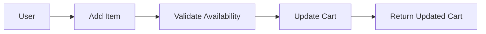

**Response Time**: < 500ms
**Error Handling**: 缺貨錯誤

---

#### Update Cart Quantity

**Type**: Synchronous
**Rationale**: 使用者需要立即更新購物車

**Flow**:

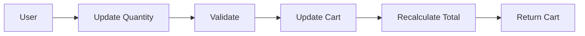

**Response Time**: < 500ms
**Error Handling**: 無效數量錯誤

---

### Order Management

#### Order Submission

**Type**: Synchronous（with async follow-up）
**Rationale**: 使用者需要立即的訂單確認

**Flow**:

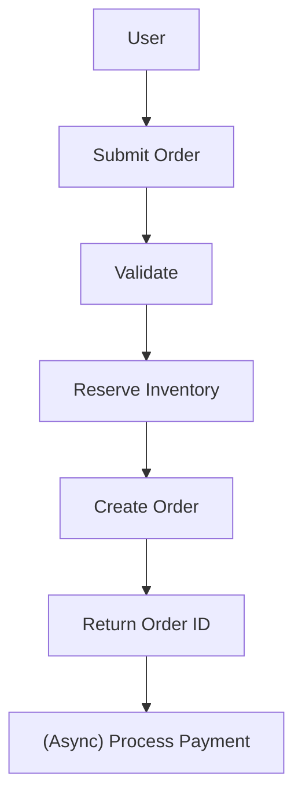

**Response Time**: < 2 秒
**Error Handling**: 驗證錯誤、庫存錯誤

---

#### Order Status Query

**Type**: Synchronous
**Rationale**: 使用者需要目前的訂單狀態

**Flow**:

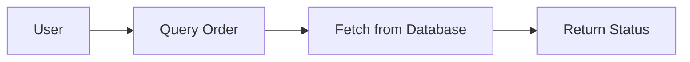

**Response Time**: < 500ms
**Error Handling**: 訂單找不到

---

### Payment Processing

#### Payment Authorization

**Type**: Synchronous
**Rationale**: 必須在訂單完成前確認付款

**Flow**:

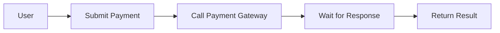

**Response Time**: < 3 秒
**Error Handling**: 付款被拒、timeout 錯誤

**Note**: 從使用者角度來看是 synchronous，但內部使用來自 payment gateway 的 async callbacks。

---

#### Payment Status Check

**Type**: Synchronous
**Rationale**: 使用者需要目前的付款狀態

**Flow**:

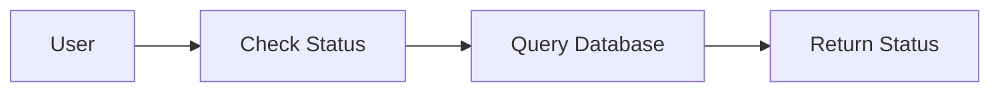

**Response Time**: < 500ms
**Error Handling**: 付款找不到

---

### Inventory Management

#### Inventory Check

**Type**: Synchronous
**Rationale**: 使用者需要立即的可用性資訊

**Flow**:


**Response Time**: < 300ms
**Error Handling**: 產品找不到

---

#### Inventory Reservation

**Type**: Synchronous
**Rationale**: 必須在建立訂單前確認保留

**Flow**:

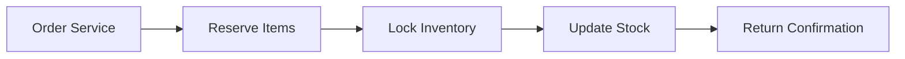

**Response Time**: < 1 秒
**Error Handling**: 庫存不足錯誤

---

## Asynchronous Operations

### Notification Services

#### Email Notifications

**Type**: Asynchronous
**Rationale**: 使用者不需要等待 email 傳送

**Flow**:

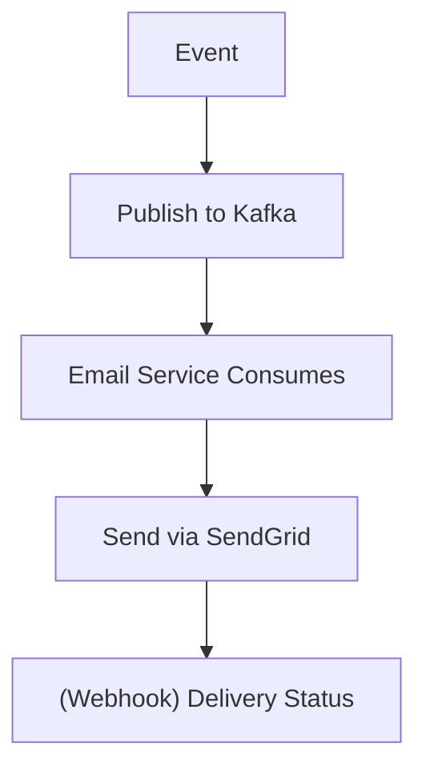

**Processing Time**: 1-5 秒
**Error Handling**: 使用 exponential backoff 重試、dead letter queue

**Email Types**:

- 訂單確認
- 出貨通知
- 密碼重設
- 歡迎 email
- 促銷 emails

---

#### SMS Notifications

**Type**: Asynchronous
**Rationale**: 使用者不需要等待 SMS 傳送

**Flow**:

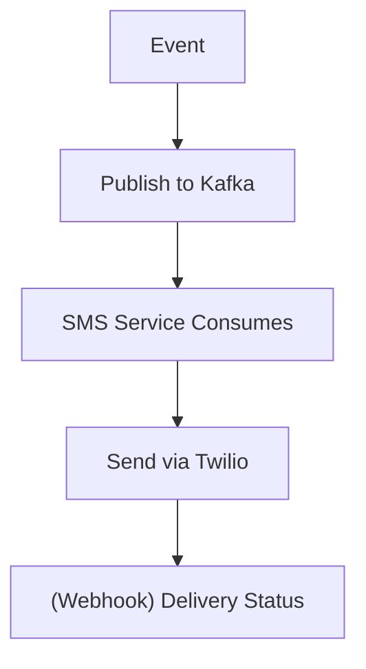

**Processing Time**: 1-3 秒
**Error Handling**: 重試 3 次，fallback 到 email

**SMS Types**:

- 訂單狀態更新
- 配送通知
- 驗證碼（時效性）

---

### Analytics and Reporting

#### User Behavior Tracking

**Type**: Asynchronous
**Rationale**: Analytics 不影響使用者體驗

**Flow**:

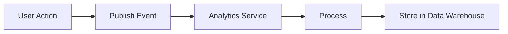

**Processing Time**: 數分鐘到數小時
**Error Handling**: 記錄並繼續，不影響使用者

---

#### Sales Reports

**Type**: Asynchronous
**Rationale**: 報表可以在背景產生

**Flow**:

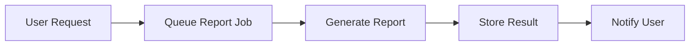

**Processing Time**: 數分鐘到數小時
**Error Handling**: 重試，通知使用者失敗

---

#### Business Intelligence

**Type**: Asynchronous（Batch）
**Rationale**: BI 處理是資源密集型

**Flow**:

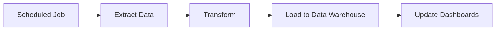

**Processing Time**: 數小時
**Error Handling**: 警告 operations team

---

### Inventory Synchronization

#### Warehouse Inventory Sync

**Type**: Asynchronous
**Rationale**: 外部系統同步不需要立即

**Flow**:

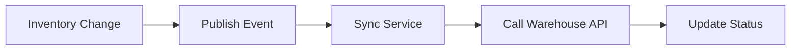

**Processing Time**: 數秒到數分鐘
**Error Handling**: 使用 backoff 重試，重複失敗時警告

---

#### Supplier Inventory Updates

**Type**: Asynchronous（Batch）
**Rationale**: 供應商更新是定期的

**Flow**:

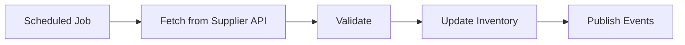

**Processing Time**: 數分鐘
**Error Handling**: 記錄失敗，下次循環重試

---

### Order Processing

#### Order Fulfillment Workflow

**Type**: Asynchronous（Event-Driven）
**Rationale**: 多步驟流程，有外部依賴

**Flow**:

```mermaid
graph LR
    N1["OrderCreated"]
    N2["InventoryReserved"]
    N1 --> N2
    N3["PaymentProcessed"]
    N2 --> N3
    N4["OrderConfirmed"]
    N3 --> N4
    N5["ShippingScheduled"]
    N4 --> N5
```

**Processing Time**: 數秒到數分鐘
**Error Handling**: Saga pattern 搭配補償

---

#### Shipping Label Generation

**Type**: Asynchronous
**Rationale**: 外部 shipping API 呼叫

**Flow**:

```mermaid
graph LR
    N1["OrderConfirmed"]
    N2["Queue Label Job"]
    N1 --> N2
    N3["Call Shipping API"]
    N2 --> N3
    N4["Generate Label"]
    N3 --> N4
    N5["Store PDF"]
    N4 --> N5
```

**Processing Time**: 5-30 秒
**Error Handling**: 重試 3 次，警告 operations

---

### Data Processing

#### Image Processing

**Type**: Asynchronous
**Rationale**: CPU 密集型操作

**Flow**:

```mermaid
graph LR
    N1["Image Upload"]
    N2["Queue Processing Job"]
    N1 --> N2
    N3["Resize/Optimize"]
    N2 --> N3
    N4["Store in S3"]
    N3 --> N4
    N5["Update Database"]
    N4 --> N5
```

**Processing Time**: 數秒到數分鐘
**Error Handling**: 重試，處理失敗時使用原始檔案

---

#### Data Export

**Type**: Asynchronous
**Rationale**: 大量資料

**Flow**:

```mermaid
graph LR
    N1["User Request"]
    N2["Queue Export Job"]
    N1 --> N2
    N3["Generate CSV/Excel"]
    N2 --> N3
    N4["Upload to S3"]
    N3 --> N4
    N5["Send Download Link"]
    N4 --> N5
```

**Processing Time**: 數分鐘到數小時
**Error Handling**: 通知使用者失敗

---

#### Data Import

**Type**: Asynchronous（Batch）
**Rationale**: 大量資料，需要驗證

**Flow**:

```mermaid
graph LR
    N1["File Upload"]
    N2["Queue Import Job"]
    N1 --> N2
    N3["Validate"]
    N2 --> N3
    N4["Process"]
    N3 --> N4
    N5["Update Database"]
    N4 --> N5
    N6["Generate Report"]
    N5 --> N6
```

**Processing Time**: 數分鐘到數小時
**Error Handling**: 部分成功處理、錯誤報告

---

### Cache Management

#### Cache Warming

**Type**: Asynchronous
**Rationale**: 背景優化

**Flow**:

```mermaid
graph LR
    N1["Scheduled Job"]
    N2["Identify Popular Items"]
    N1 --> N2
    N3["Fetch from Database"]
    N2 --> N3
    N4["Populate Cache"]
    N3 --> N4
```

**Processing Time**: 數分鐘
**Error Handling**: 記錄失敗，下次循環重試

---

#### Cache Invalidation

**Type**: Asynchronous（Event-Driven）
**Rationale**: 最終一致性可接受

**Flow**:

```mermaid
graph LR
    N1["Data Update"]
    N2["Publish Event"]
    N1 --> N2
    N3["Cache Service"]
    N2 --> N3
    N4["Invalidate Cache Keys"]
    N3 --> N4
```

**Processing Time**: 數毫秒到數秒
**Error Handling**: 以 TTL 為基礎的過期作為 fallback

---

## Hybrid Operations

某些操作同時使用 synchronous 和 asynchronous patterns：

### Order Submission（Hybrid）

**Synchronous Part**:

- 驗證訂單資料
- 檢查庫存可用性
- 保留庫存
- 建立訂單記錄
- 回傳訂單 ID 給使用者

**Asynchronous Part**:

- 處理付款
- 傳送確認 email
- 通知倉庫
- 更新 analytics
- 同步到外部系統

**Rationale**: 使用者需要立即的訂單確認，但後續動作可以是 asynchronous。

---

### Product Review Submission（Hybrid）

**Synchronous Part**:

- 驗證評論資料
- 檢查使用者資格
- 儲存評論（待審核）
- 回傳成功給使用者

**Asynchronous Part**:

- 內容審核
- 垃圾訊息偵測
- 情緒分析
- 通知賣家
- 更新產品評分

**Rationale**: 使用者需要立即的提交確認，但處理可以是 asynchronous。

---

### Password Reset（Hybrid）

**Synchronous Part**:

- 驗證 email
- 產生重設 token
- 回傳成功訊息

**Asynchronous Part**:

- 傳送重設 email
- 記錄安全事件

**Rationale**: 使用者需要立即確認，但 email 傳送可以是 asynchronous。

---

## Implementation Patterns

### Synchronous Implementation

**Spring MVC Controller**:

```java
@RestController
@RequestMapping("/api/v1/products")
public class ProductController {

    @GetMapping("/{id}")
    public ResponseEntity<ProductResponse> getProduct(@PathVariable String id) {
        // Synchronous - blocks until complete
        Product product = productService.findById(id);
        return ResponseEntity.ok(ProductResponse.from(product));
    }
}
```

**Characteristics**:

- Request thread 會 block 直到完成
- 直接回傳結果
- 立即錯誤處理
- 簡單的流程控制

---

### Asynchronous Implementation

**Spring Async Method**:

```java
@Service
public class EmailService {

    @Async("taskExecutor")
    public CompletableFuture<Void> sendOrderConfirmation(String orderId) {
        // Asynchronous - returns immediately
        try {
            Order order = orderRepository.findById(orderId).orElseThrow();
            emailClient.send(order.getCustomerEmail(), "Order Confirmation", ...);
            return CompletableFuture.completedFuture(null);
        } catch (Exception e) {
            return CompletableFuture.failedFuture(e);
        }
    }
}
```

**Characteristics**:

- 立即回傳
- 在獨立 thread 中執行
- 結果透過 Future 取得
- 需要錯誤處理策略

---

### Event-Driven Implementation

**Event Publisher**:

```java
@Service
@Transactional
public class OrderApplicationService {

    public void submitOrder(SubmitOrderCommand command) {
        // Synchronous part
        Order order = orderService.createOrder(command);
        orderRepository.save(order);

        // Asynchronous part - publish event
        domainEventService.publishEventsFromAggregate(order);
    }
}
```

**Event Consumer**:

```java
@Component
public class OrderConfirmationEmailHandler extends AbstractDomainEventHandler<OrderCreatedEvent> {

    @Override
    @Async
    public void handle(OrderCreatedEvent event) {
        // Asynchronous processing
        emailService.sendOrderConfirmation(event.orderId());
    }
}
```

**Characteristics**:

- 解耦的元件
- 最終一致性
- 可擴展的處理
- 對失敗具有彈性

---

## Performance Implications

### Synchronous Operations

**Advantages**:

- 容易理解和除錯
- 立即的錯誤回饋
- 強一致性
- 可預測的行為

**Disadvantages**:

- 阻塞 request thread
- 有限的可擴展性
- Timeout 風險
- 資源競爭

**Best For**:

- 面向使用者的操作
- 關鍵路徑操作
- 需要立即回饋的操作

---

### Asynchronous Operations

**Advantages**:

- 更好的資源利用
- 更高的吞吐量
- Non-blocking
- 改善的可擴展性

**Disadvantages**:

- 複雜的錯誤處理
- 最終一致性
- 更難除錯
- 需要監控

**Best For**:

- 背景處理
- 外部 service 呼叫
- 批次操作
- 非關鍵操作

---

## Monitoring and Observability

### Synchronous Operation Metrics

- **Response Time**: p50、p95、p99 延遲
- **Error Rate**: 4xx 和 5xx 錯誤
- **Throughput**: 每秒請求數
- **Timeout Rate**: 超過 timeout 的操作

### Asynchronous Operation Metrics

- **Queue Depth**: 佇列中的待處理任務
- **Processing Time**: 從佇列到完成的時間
- **Success Rate**: 成功 vs 失敗的操作
- **Retry Rate**: 重試次數
- **Dead Letter Queue Size**: 失敗的操作

---

## Decision Matrix

| Criteria | Synchronous | Asynchronous |
|----------|-------------|--------------|
| 使用者等待結果 | ✅ Yes | ❌ No |
| Response time < 2s | ✅ Yes | ❌ No |
| 需要強一致性 | ✅ Yes | ❌ No |
| 外部 service 呼叫 | ❌ No | ✅ Yes |
| 長時間執行的操作 | ❌ No | ✅ Yes |
| 最終一致性可接受 | ❌ No | ✅ Yes |
| 背景處理 | ❌ No | ✅ Yes |
| 批次操作 | ❌ No | ✅ Yes |

---

## Related Documentation

- [Concurrency Viewpoint Overview](overview.md) - 整體 concurrency 模型 ←
- [Synchronization Mechanisms](synchronization.md) - Locking 和協調 →
- [State Management](state-management.md) - State 處理策略 →
- [Performance Perspective](../../perspectives/performance/overview.md) - Performance 需求

---

**Document Status**: Active
**Last Review**: 2025-10-23
**Next Review**: 2025-11-23
**Owner**: Architecture Team
