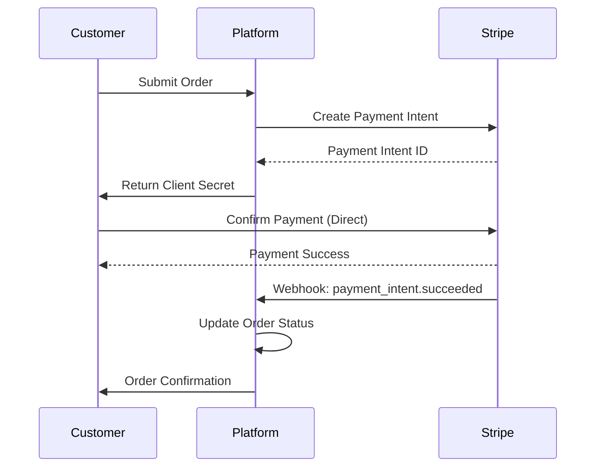
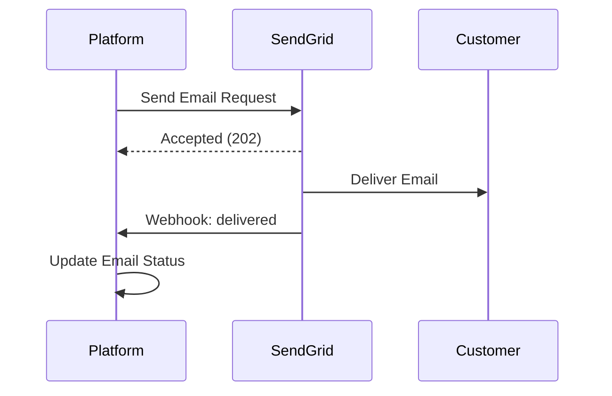
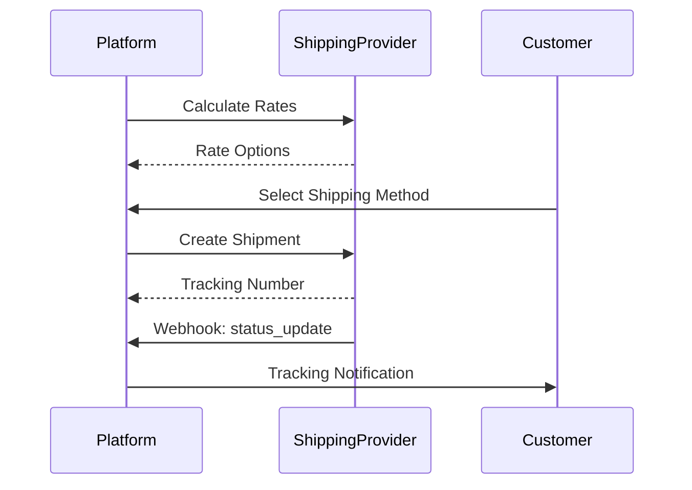
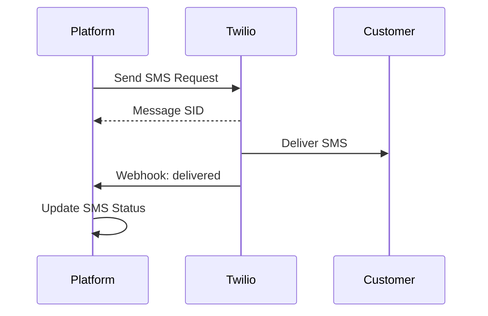

# External Systems Integration

> **Viewpoint**: Context
> **目的**：記錄所有外部系統整合及其介面
> **對象**：Architects、Developers、Operations Team、Integration Team

## 概述

本文件描述電子商務平台整合的所有外部系統，包括整合模式、資料流、錯誤處理和營運考量。

## 外部系統目錄

### Payment Gateway

**系統**：Stripe Payment Gateway
**類型**：Third-party SaaS
**關鍵性**：關鍵
**整合模式**：Synchronous API + Webhooks

#### 目的

處理客戶付款、管理付款方式、處理退款，並確保 PCI-DSS 合規。

#### 整合詳情

**使用的 API Endpoints**

- `POST /v1/payment_intents` - 建立付款意圖
- `POST /v1/payment_intents/{id}/confirm` - 確認付款
- `POST /v1/refunds` - 處理退款
- `GET /v1/payment_methods` - 列出付款方式
- `POST /v1/customers` - 在 Stripe 中建立客戶

**驗證**

- API Key 驗證（Bearer token）
- 測試和生產環境使用分開的 keys
- Keys 儲存在 AWS Secrets Manager
- 每 90 天輪換 Key

**資料流**

**消費的 Webhook Events**

- `payment_intent.succeeded` - 付款成功
- `payment_intent.payment_failed` - 付款失敗
- `charge.refunded` - 退款已處理
- `customer.updated` - 客戶資訊已更新

**錯誤處理**

- 重試邏輯：3 次嘗試，指數退避
- Circuit breaker：連續 5 次失敗後開啟
- 備援：將付款排入佇列以進行手動處理
- 逾時：API 呼叫 30 秒

**速率限制**

- 每個 API key 每秒 100 個請求
- 突發容量：200 個請求
- 監控：使用率超過 80% 時警示

**SLA**

- 可用性：99.99%
- 回應時間：< 500ms（第 95 百分位）
- 支援：24/7 郵件和電話支援

**成本模型**

- 每筆成功交易 2.9% + $0.30
- 無月費
- 退款費用：每筆退款 $0.30

**安全考量**

- PCI-DSS Level 1 認證
- 所有付款資料傳輸加密（TLS 1.3）
- 我們的系統不儲存卡片資料
- 定期付款使用 Tokenization

**監控**

- 付款成功率
- 付款處理時間
- 付款失敗原因
- Webhook 傳送成功率

---

### Email Service

**系統**：SendGrid
**類型**：Third-party SaaS
**關鍵性**：高
**整合模式**：Asynchronous API + Webhooks

#### 目的

發送交易郵件（訂單確認、配送通知）和行銷郵件給客戶。

#### 整合詳情

**使用的 API Endpoints**

- `POST /v3/mail/send` - 發送郵件
- `POST /v3/mail/batch` - 發送批次郵件
- `GET /v3/stats` - 取得郵件統計資料
- `POST /v3/templates` - 管理郵件範本

**驗證**

- API Key 驗證
- Keys 儲存在 AWS Secrets Manager
- 交易和行銷郵件使用分開的 keys

**資料流**

**郵件類型**

- 訂單確認
- 配送通知
- 密碼重設
- 歡迎郵件
- 促銷活動
- 帳戶通知

**消費的 Webhook Events**

- `delivered` - 郵件已成功傳送
- `open` - 收件者已開啟郵件
- `click` - 郵件中的連結已被點擊
- `bounce` - 郵件退回
- `spam_report` - 標記為垃圾郵件
- `unsubscribe` - 使用者取消訂閱

**錯誤處理**

- 重試邏輯：5 次嘗試，指數退避
- 失敗郵件的 Dead letter queue
- 備援：記錄錯誤並警示維運團隊
- 逾時：API 呼叫 10 秒

**速率限制**

- 10,000 封郵件/小時（交易）
- 100,000 封郵件/天（行銷）
- 監控：使用率超過 80% 時警示

**SLA**

- 可用性：99.95%
- 傳送率：> 98%
- 支援：24/7 郵件支援，企業版提供電話支援

**成本模型**

- 每月 $14.95，包含 40,000 封郵件
- 每封額外郵件 $0.00085
- 免費方案：100 封郵件/天

**安全考量**

- 已配置 DKIM 和 SPF
- 郵件傳輸使用 TLS 加密
- 所有行銷郵件包含取消訂閱連結
- 符合 GDPR 的資料處理

**監控**

- 郵件傳送率
- 退回率
- 開啟率
- 點擊率
- 垃圾郵件投訴率

---

### Shipping Providers

**系統**：FedEx、UPS、DHL
**類型**：Third-party APIs
**關鍵性**：高
**整合模式**：Synchronous API + Webhooks

#### 目的

計算運費、建立運送標籤、追蹤貨件，並管理配送物流。

#### 整合詳情

**常見 API 操作**

- 費率計算
- 標籤產生
- 貨件追蹤
- 地址驗證
- 取件排程

**驗證**

- FedEx 和 UPS 使用 OAuth 2.0
- DHL 使用 API Key
- 憑證儲存在 AWS Secrets Manager
- Token 刷新自動化

**資料流**

**FedEx 整合**

**API Endpoints**

- `POST /rate/v1/rates/quotes` - 取得運費
- `POST /ship/v1/shipments` - 建立貨件
- `POST /track/v1/trackingnumbers` - 追蹤貨件

**速率限制**：每小時 1,000 個請求
**SLA**：99.9% 可用性
**成本**：基於量的定價

**UPS 整合**

**API Endpoints**

- `POST /api/rating/v1/Rate` - 取得運費
- `POST /api/shipments/v1/ship` - 建立貨件
- `GET /api/track/v1/details/{trackingNumber}` - 追蹤貨件

**速率限制**：每小時 500 個請求
**SLA**：99.9% 可用性
**成本**：基於量的定價

**DHL 整合**

**API Endpoints**

- `POST /rates` - 取得運費
- `POST /shipments` - 建立貨件
- `GET /tracking/{trackingNumber}` - 追蹤貨件

**速率限制**：每小時 2,000 個請求
**SLA**：99.5% 可用性
**成本**：基於量的定價

**錯誤處理**

- 重試邏輯：3 次嘗試，指數退避
- 備援：嘗試替代運送提供者
- Circuit breaker：連續 5 次失敗後開啟
- 逾時：API 呼叫 15 秒

**監控**

- API 回應時間
- 每個提供者的成功率
- 運費準確性
- 追蹤更新頻率

---

### SMS Notification Service

**系統**：Twilio
**類型**：Third-party SaaS
**關鍵性**：中
**整合模式**：Asynchronous API + Webhooks

#### 目的

發送訂單更新、配送警示和驗證碼的 SMS 通知。

#### 整合詳情

**使用的 API Endpoints**

- `POST /2010-04-01/Accounts/{AccountSid}/Messages.json` - 發送 SMS
- `GET /2010-04-01/Accounts/{AccountSid}/Messages/{MessageSid}.json` - 取得訊息狀態

**驗證**

- Account SID 和 Auth Token
- 憑證儲存在 AWS Secrets Manager

**資料流**

**SMS 類型**

- 訂單狀態更新
- 配送通知
- 雙因素驗證碼
- 促銷訊息（需選擇加入）

**消費的 Webhook Events**

- `delivered` - SMS 已傳送
- `failed` - SMS 傳送失敗
- `undelivered` - SMS 未傳送

**錯誤處理**

- 重試邏輯：3 次嘗試
- 備援：改發送郵件通知
- 逾時：10 秒

**速率限制**

- 每秒 1,000 則訊息
- 監控：使用率超過 80% 時警示

**SLA**

- 可用性：99.95%
- 傳送率：> 95%
- 支援：24/7 郵件和電話

**成本模型**

- 每則 SMS $0.0075（美國）
- 每則 SMS $0.02 - $0.10（國際）
- 無月費

**安全考量**

- 端到端加密
- 行銷訊息需要選擇加入
- 提供選擇退出機制
- 符合 TCPA

**監控**

- SMS 傳送率
- 傳送失敗原因
- 回應時間
- 每則訊息成本

---

### Cloud Infrastructure

**系統**：Amazon Web Services (AWS)
**類型**：Cloud Platform
**關鍵性**：關鍵
**整合模式**：SDK + Infrastructure as Code

#### 目的

提供運算、儲存、網路和受管服務的雲端基礎設施。

#### 使用的服務

**運算**

- EKS (Elastic Kubernetes Service) - Container 編排
- Lambda - Serverless functions
- EC2 - 虛擬機（bastion hosts）

**儲存**

- RDS PostgreSQL - 主要資料庫
- ElastiCache Redis - 快取層
- S3 - 圖片和檔案的物件儲存

**訊息傳遞**

- MSK (Managed Streaming for Apache Kafka) - Event streaming
- SQS - Message queuing
- SNS - Pub/sub 通知

**網路**

- VPC - Virtual private cloud
- ALB - Application load balancer
- Route 53 - DNS 管理
- CloudFront - CDN

**安全**

- IAM - Identity and access management
- Secrets Manager - Secrets 儲存
- KMS - Key management
- WAF - Web application firewall

**可觀測性**

- CloudWatch - 日誌和監控
- X-Ray - 分散式追蹤
- CloudTrail - 稽核日誌

**驗證**

- Service-to-service 使用 IAM roles
- 人員存取使用 IAM users
- 生產環境存取需要 MFA

**Infrastructure as Code**

- AWS CDK (TypeScript)
- Git 版本控制
- 透過 CI/CD 自動部署

**成本管理**

- 已配置預算警示
- 成本分配標籤
- 可預測工作負載使用 Reserved instances
- 批次處理使用 Spot instances

**安全考量**

- 最小權限 IAM 政策
- 靜態和傳輸中加密
- VPC security groups 和 NACLs
- 定期安全稽核

**監控**

- 服務健康儀表板
- 成本監控
- 安全警示
- 效能指標

---

## 整合模式

### 同步整合

**何時使用**

- 需要即時資料
- 需要立即回應
- 交易操作

**實作**

- REST API 呼叫
- 逾時配置
- 指數退避的重試邏輯
- Circuit breaker 模式

**範例**：付款處理、運費計算

### 非同步整合

**何時使用**

- 非關鍵操作
- 批次處理
- 事件驅動工作流程

**實作**

- Message queues (SQS)
- Event streaming (Kafka)
- Webhook callbacks
- Dead letter queues

**範例**：郵件通知、SMS 警示

### Webhook 整合

**何時使用**

- 外部系統需要通知我們
- 事件驅動更新
- 非同步 callbacks

**實作**

- 公開 Webhook endpoint
- 簽章驗證
- 冪等性處理
- 重試機制

**範例**：付款狀態更新、運送追蹤更新

## 錯誤處理策略

### 重試邏輯

**暫時性錯誤**

- 網路逾時
- 超過速率限制
- 暫時性服務不可用

**重試配置**

- 最大嘗試次數：根據關鍵性 3-5 次
- 退避策略：指數退避加抖動
- 逾時：服務特定（10-30 秒）

### Circuit Breaker

**目的**：防止級聯失敗

**狀態**

- 關閉：正常運作
- 開啟：失敗超過閾值，停止呼叫
- 半開啟：測試服務是否已復原

**配置**

- 失敗閾值：連續 5 次失敗
- 逾時：60 秒
- 成功閾值：2 次成功呼叫以關閉

### 備援策略

**Payment Gateway 失敗**

- 將付款排入佇列以進行手動處理
- 通知維運團隊
- 顯示使用者友善的錯誤訊息

**Email Service 失敗**

- 將郵件儲存在 dead letter queue
- 服務復原後重試
- 記錄以供手動跟進

**Shipping Provider 失敗**

- 嘗試替代提供者
- 如果可用則使用快取費率
- 通知維運團隊

## 安全考量

### API Key 管理

**儲存**

- 所有 API keys 使用 AWS Secrets Manager
- 每 90 天自動輪換
- dev/staging/production 使用分開的 keys

**存取控制**

- 服務存取使用 IAM roles
- 最小權限原則
- 啟用稽核日誌

### 資料保護

**傳輸中**

- 所有外部通訊使用 TLS 1.3
- 關鍵服務使用 Certificate pinning
- 高安全性整合使用 Mutual TLS

**靜態**

- 敏感資料加密
- 不儲存付款卡資料
- 定期付款使用 Tokenization

### 合規

**PCI-DSS**

- Payment gateway 處理卡片資料
- 我們的系統不儲存卡片資料
- 年度合規稽核

**GDPR**

- 與供應商簽訂資料處理協議
- 實作刪除權
- 支援資料可攜性

## 監控和警示

### 關鍵指標

**可用性**

- 外部服務正常運行時間
- API 回應時間
- 錯誤率

**效能**

- 請求延遲（p50、p95、p99）
- 吞吐量（每秒請求數）
- 佇列深度

**業務**

- 付款成功率
- 郵件傳送率
- 運費準確性

### 警示

**關鍵警示**（呼叫值班人員）

- Payment gateway 不可用
- 資料庫連線失敗
- 高錯誤率（> 5%）

**警告警示**（郵件/Slack）

- 錯誤率上升（> 1%）
- 回應時間慢（> 2s）
- 接近速率限制（> 80%）

**資訊警示**（儀表板）

- 超過成本閾值
- 異常流量模式
- 服務降級

## 營運程序

### 服務中斷回應

**偵測**

- 自動監控警示
- 客戶回報
- 外部狀態頁面

**回應**

1. 確認警示
2. 檢查服務狀態頁面
3. 如果可用則啟動備援
4. 通知利害關係人
5. 監控復原
6. 解決後進行事後檢討

### 供應商溝通

**定期審查**

- 季度業務審查
- 月度營運同步
- 週度事件審查（如需要）

**升級聯絡**

- 技術支援：24/7 郵件/電話
- 帳戶經理：營業時間
- 緊急升級：關鍵問題

### 成本優化

**定期審查**

- 月度成本分析
- 季度供應商談判
- 年度合約續約

**優化策略**

- 協商量折扣
- 可預測負載使用 Reserved capacity
- 替代供應商評估

## 相關文件

- [Context Viewpoint Overview](overview.md) - 系統脈絡
- [System Scope and Boundaries](scope-and-boundaries.md) - 範圍內/外的內容
- [Stakeholders](stakeholders.md) - 利害關係人關注點
- [Security Perspective](../../perspectives/security/overview.md) - 安全要求
- [Operational Viewpoint](../operational/overview.md) - 營運程序

---

**文件狀態**：使用中
**最後審查**：2025-10-23
**下次審查**：2025-11-23
**負責人**：Integration Team
