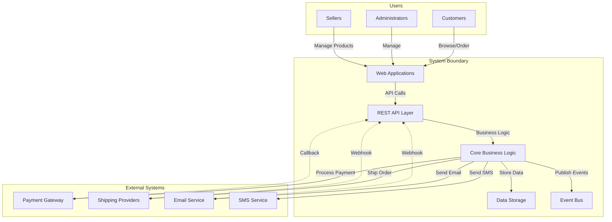

# System Scope and Boundaries

> **Viewpoint**: Context
> **目的**：定義系統範圍內的內容以及範圍外的邊界
> **對象**：Product Managers、Business Analysts、Architects、Developers

## 概述

本文件定義電子商務平台的範圍和邊界，清楚劃分系統提供的功能與外部系統處理的功能或完全不在範圍內的功能。

## 系統範圍

### 範圍內

電子商務平台提供以下能力：

#### 核心電子商務功能

**Customer Management**

- 客戶註冊和個人檔案管理
- 客戶驗證和授權
- 客戶偏好設定管理
- 客戶分群和會員等級

**Product Catalog**

- 產品資訊管理
- 產品分類和分類法
- 產品搜尋和篩選
- 產品推薦
- 庫存追蹤和可用性

**Shopping Experience**

- 購物車管理
- 產品瀏覽和搜尋
- 願望清單功能
- 產品評論和評分
- 價格比較和促銷

**Order Management**

- 訂單建立和提交
- 訂單狀態追蹤
- 訂單歷史記錄和重新訂購
- 訂單取消和修改
- 退貨和退款處理

**Payment Processing**

- 付款方式管理
- 付款交易處理
- 付款狀態追蹤
- 退款處理
- 付款安全和 PCI 合規

**Logistics and Delivery**

- 配送地址管理
- 配送方式選擇
- 運費計算
- 訂單追蹤和通知
- 配送狀態更新

**Promotions and Pricing**

- 促銷活動管理
- 折扣代碼應用
- 動態定價規則
- 組合和套裝優惠
- 忠誠計劃整合

**Seller Management**（多賣家支援）

- 賣家註冊和入職
- 賣家產品管理
- 賣家訂單履行
- 賣家績效追蹤
- 佣金和付款管理

**Notifications**

- 訂單確認郵件
- 配送通知
- 促銷通訊
- 系統警示和提醒
- 客戶服務通知

#### 平台能力

**API Services**

- 所有核心功能的 RESTful API
- API 驗證和速率限制
- API 版本控制和文件
- 事件通知的 Webhook 支援

**Event-Driven Architecture**

- Domain event 發布和消費
- 非同步處理
- 稽核追蹤的 Event sourcing
- 跨 context 通訊

**Data Management**

- 交易資料儲存
- 資料一致性和完整性
- 資料備份和復原
- 資料歸檔和保留

**Security**

- 使用者驗證（基於 JWT）
- 角色型存取控制（RBAC）
- 資料加密（靜態和傳輸中）
- 安全稽核記錄
- GDPR 合規功能

**Observability**

- 應用程式效能監控
- 分散式追蹤
- 業務指標和分析
- 錯誤追蹤和警示
- 日誌聚合和分析

### 範圍外

以下能力明確**不在**電子商務平台提供範圍內：

#### 外部服務

**Payment Gateway Operations**

- 信用卡處理基礎設施
- 付款詐欺偵測演算法
- PCI-DSS 認證和合規基礎設施
- 銀行帳戶驗證
- 加密貨幣付款處理

**Shipping and Logistics Operations**

- 實體倉庫管理
- 運送承運商營運
- 最後一哩配送服務
- 國際海關處理
- 包裹追蹤基礎設施

**Email Delivery Infrastructure**

- 郵件伺服器營運
- 郵件傳送率管理
- 垃圾郵件過濾和信譽管理
- 郵件範本渲染（提供基本範本）

**Content Delivery Network (CDN)**

- 靜態資產託管和分發
- 圖片優化和轉換
- 影片串流基礎設施
- 地理內容分發

#### 業務營運

**Inventory Management**

- 實體庫存盤點
- 倉庫營運
- 庫存補貨決策
- 供應商關係管理

**Customer Service Operations**

- 即時聊天支援（提供整合）
- 電話支援營運
- 社群媒體客戶服務
- 客戶服務培訓和管理

**Marketing Campaign Execution**

- 郵件行銷活動管理（提供整合）
- 社群媒體廣告
- 搜尋引擎行銷
- 聯盟行銷管理

**Financial Operations**

- 會計和簿記
- 稅金計算和申報
- 財務報表和合規
- 薪資處理

**Legal and Compliance**

- 法律文件準備
- 監管合規監控
- 智慧財產權管理
- 合約談判和管理

#### 技術基礎設施

**Cloud Infrastructure Management**

- AWS 帳戶管理
- 基礎設施容量規劃
- 成本優化策略
- 災難復原站點管理

**Network Operations**

- DNS 管理
- SSL 憑證管理
- DDoS 防護
- 網路安全監控

**Development Tools**

- 原始碼儲存庫託管
- CI/CD pipeline 基礎設施
- 開發環境配置
- 程式碼品質分析工具

## 系統邊界

### 邊界定義

系統邊界由以下介面定義：

#### 入站介面

**User Interfaces**

- Consumer Web Application (Angular)
- CMC Management Console (Next.js)
- Mobile Applications（未來，透過 API）

**API Interfaces**

- REST API endpoints
- Webhook receivers
- Event consumers (Kafka)

**Integration Interfaces**

- Payment gateway callbacks
- Shipping provider webhooks
- Email service webhooks

#### 出站介面

**External Service Integrations**

- Payment gateway API 呼叫
- Shipping provider API 呼叫
- Email service API 呼叫
- SMS notification service 呼叫

**Event Publishing**

- Domain events 到 Kafka topics
- Webhook 通知到外部系統

**Data Export**

- 分析資料匯出
- 報表資料匯出
- 稽核日誌匯出

### 邊界圖

## Bounded Context Boundaries

### Context Map

系統組織成 13 個 bounded contexts，每個都有清晰的邊界：

#### 核心 Contexts

**Customer Context**

- **範圍**：客戶身分、個人檔案、偏好設定、驗證
- **邊界**：不處理訂單、付款或產品
- **整合**：發布 customer events，不消費 events

**Order Context**

- **範圍**：訂單生命週期、訂單項目、訂單狀態
- **邊界**：不處理付款處理或配送
- **整合**：發布 order events，消費 customer 和 product events

**Product Context**

- **範圍**：產品目錄、類別、屬性
- **邊界**：不處理庫存或定價
- **整合**：發布 product events，不消費 events

**Inventory Context**

- **範圍**：庫存水平、預留、可用性
- **邊界**：不處理產品詳細資訊或訂單
- **整合**：發布 inventory events，消費 order 和 product events

**Payment Context**

- **範圍**：付款交易、付款方式、退款
- **邊界**：不處理訂單詳細資訊或客戶資訊
- **整合**：發布 payment events，消費 order events

#### 支援 Contexts

**Shopping Cart Context**

- **範圍**：購物車項目、購物車管理、結帳準備
- **邊界**：不建立訂單或處理付款
- **整合**：發布 cart events，消費 product 和 customer events

**Pricing Context**

- **範圍**：價格計算、定價規則、折扣
- **邊界**：不處理促銷或訂單
- **整合**：發布 pricing events，消費 product events

**Promotion Context**

- **範圍**：促銷活動、折扣代碼、規則
- **邊界**：不處理定價或訂單
- **整合**：發布 promotion events，消費 order events

**Delivery Context**

- **範圍**：配送地址、配送方式、追蹤
- **邊界**：不處理訂單詳細資訊或庫存
- **整合**：發布 delivery events，消費 order events

**Seller Context**

- **範圍**：賣家個人檔案、賣家產品、賣家績效
- **邊界**：不處理訂單或付款
- **整合**：發布 seller events，消費 product 和 order events

**Review Context**

- **範圍**：產品評論、評分、評論審核
- **邊界**：不處理產品或客戶
- **整合**：發布 review events，消費 product 和 customer events

**Notification Context**

- **範圍**：通知範本、傳送、偏好設定
- **邊界**：不處理業務邏輯或資料
- **整合**：消費所有 contexts 的 events，發布 notification events

**Observability Context**

- **範圍**：指標、日誌、追蹤、監控
- **邊界**：不處理業務邏輯或資料
- **整合**：消費所有 contexts 的 events 以進行監控

### Context 整合規則

**整合模式**

- Contexts 僅透過 domain events 通訊
- Contexts 之間不直接存取資料庫
- Contexts 之間不直接 API 呼叫
- Shared kernel 限於常見的 value objects

**資料所有權**

- 每個 context 獨佔擁有其資料
- Contexts 之間不共享資料庫表
- Contexts 之間的最終一致性
- 稽核追蹤的 Event sourcing

## 範圍演進

### 未來範圍考量

以下能力可能在未來版本中加入系統範圍：

**階段 2 增強功能**

- 進階推薦引擎
- 即時庫存同步
- 多幣別支援
- 進階分析和報表

**階段 3 增強功能**

- 行動應用程式支援
- 社群商務整合
- 訂閱和定期訂單
- 進階賣家分析

**階段 4 增強功能**

- AI 驅動的客戶服務
- 擴增實境產品預覽
- 基於區塊鏈的供應鏈追蹤
- 語音商務整合

### 範圍變更流程

**範圍變更請求**

1. 提交範圍變更提案
2. 影響分析（技術、業務、資源）
3. 利害關係人審查和批准
4. 架構審查和設計
5. 實作規劃
6. 文件更新

**批准權限**

- 次要範圍變更：Tech Lead 批准
- 主要範圍變更：Architecture Board 批准
- 策略範圍變更：Executive 批准

## 相關文件

- [Context Viewpoint Overview](overview.md) - 系統脈絡和關係
- [External Systems](external-systems.md) - 外部系統整合
- [Stakeholders](stakeholders.md) - 利害關係人關注點和需求
- [Functional Viewpoint](../functional/overview.md) - 系統能力
- [Bounded Contexts](../functional/bounded-contexts.md) - Context 詳細資訊

---

**文件狀態**：使用中
**最後審查**：2025-10-23
**下次審查**：2025-11-23
**負責人**：Architecture Team
