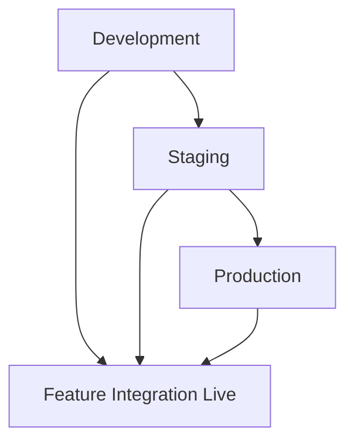

# Deployment Viewpoint Overview

> **Viewpoint**: Deployment
> **Purpose**: 描述 E-Commerce Platform 的實體基礎設施和部署架構
> **Audience**: Architects, DevOps Engineers, Operations Team, Security Team

## 目的

Deployment Viewpoint 描述 E-Commerce Platform 如何部署在 AWS 基礎設施上,包括實體架構、網路拓撲和部署流程。這個觀點對於理解系統可擴展性、可用性、安全性和營運需求至關重要。

## 關鍵關注點

此觀點處理以下關注點:

1. **基礎設施架構**: AWS 服務如何設定和整合
2. **高可用性**: 系統如何達成 99.9% uptime SLO
3. **可擴展性**: 系統如何擴展以處理不同負載
4. **安全性**: 網路安全和存取控制如何實作
5. **災難復原**: 系統如何從故障中復原
6. **部署流程**: 程式碼變更如何部署到生產環境
7. **成本最佳化**: 基礎設施成本如何管理

## 部署模型

### Cloud-Native 架構

E-Commerce Platform 部署為 AWS 上的 **cloud-native application**,利用 managed services 來實現可擴展性、可靠性和營運效率。

**關鍵特性**:

- **容器化 Microservices**: 應用程式在 EKS 上的 Docker containers 中執行
- **Managed Databases**: PostgreSQL on RDS 用於關聯式資料
- **Managed Caching**: Redis on ElastiCache 用於分散式快取
- **Managed Messaging**: Kafka on MSK 用於 event streaming
- **Infrastructure as Code**: AWS CDK 用於基礎設施供應
- **GitOps**: GitHub Actions 用於 CI/CD 自動化

### Multi-Environment 策略

平台維護三個環境,採用漸進式部署:



**環境特性**:

| 環境 | 目的 | 基礎設施 | 資料 | 部署 |
|-------------|---------|----------------|------|------------|
| **Development** | 功能開發和測試 | 最小資源, 單一 AZ | 合成測試資料 | 合併到 `develop` 時自動部署 |
| **Staging** | 整合測試和驗證 | 類生產, 多 AZ | 匿名化的生產資料 | 需要手動核准 |
| **Production** | 即時客戶流量 | 完整冗餘, 多 AZ | 真實客戶資料 | 手動核准 + canary deployment |

## 基礎設施元件

### 1. Compute Layer (Amazon EKS)

**目的**: 執行容器化 microservices 並自動擴展

**設定**:

- **Cluster**: 跨多 AZ 的 EKS cluster 搭配 managed node groups
- **Node Groups**:
  - General purpose (t3.large): 3-10 nodes
  - Memory optimized (r5.xlarge): 2-5 nodes for data-intensive services
- **Auto-scaling**: Cluster Autoscaler + Horizontal Pod Autoscaler
- **Namespaces**: 依 bounded context 邏輯分離

**關鍵功能**:

- 零停機時間的 rolling updates
- 高可用性的 pod disruption budgets
- 每個 namespace 的 resource quotas and limits
- Pod-to-pod 通訊的 network policies

### 2. Database Layer (Amazon RDS)

**目的**: 交易資料的持久儲存

**設定**:

- **Engine**: PostgreSQL 15.x
- **Instance**: db.r5.xlarge (primary), db.r5.large (replicas)
- **Deployment**: Multi-AZ with automatic failover
- **Read Replicas**: 2 replicas for read scaling
- **Storage**: 500GB GP3 SSD with auto-scaling up to 2TB
- **Backup**: Automated daily backups with 7-day retention

**關鍵功能**:

- < 2 分鐘的自動 failover
- 最多 7 天的 point-in-time recovery
- Encryption at rest (AES-256)
- Encryption in transit (TLS 1.2+)

### 3. Caching Layer (Amazon ElastiCache)

**目的**: 分散式快取和 session 儲存

**設定**:

- **Engine**: Redis 7.x
- **Cluster Mode**: Enabled with 3 shards
- **Nodes**: cache.r5.large (3 primary + 3 replicas)
- **Deployment**: Multi-AZ with automatic failover
- **Persistence**: AOF (Append-Only File) enabled

**關鍵功能**:

- Sub-millisecond latency
- 自動 failover 和 recovery
- Data encryption at rest and in transit
- Backup and restore capabilities

### 4. Messaging Layer (Amazon MSK)

**目的**: Event streaming 和非同步通訊

**設定**:

- **Kafka Version**: 3.5.x
- **Brokers**: 3 brokers across 3 AZs
- **Instance**: kafka.m5.large
- **Storage**: 1TB EBS per broker
- **Replication**: Factor of 3 for durability

**關鍵功能**:

- 高吞吐量 (MB/s per broker)
- 自動 broker replacement
- Topic-level encryption
- 與 CloudWatch 整合以進行監控

### 5. Load Balancing (Application Load Balancer)

**目的**: 分配流量並提供 SSL termination

**設定**:

- **Type**: Application Load Balancer (Layer 7)
- **Deployment**: Multi-AZ for high availability
- **SSL/TLS**: ACM-managed certificates with auto-renewal
- **Health Checks**: HTTP health checks every 30 seconds
- **Stickiness**: Session affinity for stateful operations

**關鍵功能**:

- Path-based routing to microservices
- Host-based routing for multi-tenant support
- WebSocket support for real-time features
- WAF integration for security

## 高可用性設計

### Multi-AZ Deployment

所有關鍵元件部署在同一區域的 **3 個 Availability Zones**:

```text
┌─────────────────────────────────────────────────────────────┐
│                         Region: us-east-1                    │
├─────────────────────────────────────────────────────────────┤
│  AZ-1 (us-east-1a)  │  AZ-2 (us-east-1b)  │  AZ-3 (us-east-1c) │
├─────────────────────┼─────────────────────┼─────────────────┤
│  EKS Node Group     │  EKS Node Group     │  EKS Node Group  │
│  RDS Primary        │  RDS Standby        │  Read Replica    │
│  Redis Primary      │  Redis Replica      │  Redis Replica   │
│  Kafka Broker 1     │  Kafka Broker 2     │  Kafka Broker 3  │
│  ALB Target         │  ALB Target         │  ALB Target      │
└─────────────────────┴─────────────────────┴─────────────────┘
```

### 故障場景和復原

| 元件 | 故障場景 | 復原機制 | RTO | RPO |
|-----------|------------------|-------------------|-----|-----|
| **EKS Node** | Node failure | Auto-scaling replaces node, pods rescheduled | < 5 min | 0 (stateless) |
| **RDS Primary** | Database failure | Automatic failover to standby | < 2 min | 0 (synchronous replication) |
| **Redis Primary** | Cache failure | Automatic failover to replica | < 1 min | < 1 min (AOF) |
| **Kafka Broker** | Broker failure | Automatic leader election | < 30 sec | 0 (replication factor 3) |
| **ALB** | Load balancer failure | AWS-managed automatic recovery | < 1 min | N/A |
| **AZ Failure** | Entire AZ down | Traffic routed to healthy AZs | < 5 min | 0 |

## 可擴展性策略

### 水平擴展

**Application Layer (EKS)**:

- **Cluster Autoscaler**: 根據待處理 pods 新增/移除 nodes
- **Horizontal Pod Autoscaler (HPA)**: 根據 CPU/memory/custom metrics 擴展 pods
- **Target Metrics**:
  - CPU utilization: 70%
  - Memory utilization: 80%
  - Request rate: 1000 req/s per pod

**Database Layer (RDS)**:

- **Read Scaling**: 新增 read replicas (最多 5 個)
- **Write Scaling**: Primary instance 的垂直擴展
- **Connection Pooling**: HikariCP with max 20 connections per service

**Caching Layer (ElastiCache)**:

- **Horizontal Scaling**: 新增 shards to cluster
- **Vertical Scaling**: 升級 node types
- **Read Scaling**: 每個 shard 新增 replicas

**Messaging Layer (MSK)**:

- **Broker Scaling**: 新增 brokers to cluster
- **Partition Scaling**: 增加每個 topic 的 partitions
- **Consumer Scaling**: 新增 consumer instances

### Auto-Scaling 設定

```yaml
# Example HPA configuration
apiVersion: autoscaling/v2
kind: HorizontalPodAutoscaler
metadata:
  name: order-service-hpa
spec:
  scaleTargetRef:
    apiVersion: apps/v1
    kind: Deployment
    name: order-service
  minReplicas: 3
  maxReplicas: 20
  metrics:
  - type: Resource
    resource:
      name: cpu
      target:
        type: Utilization
        averageUtilization: 70
  - type: Resource
    resource:
      name: memory
      target:
        type: Utilization
        averageUtilization: 80
  behavior:
    scaleUp:
      stabilizationWindowSeconds: 60
      policies:
      - type: Percent
        value: 50
        periodSeconds: 60
    scaleDown:
      stabilizationWindowSeconds: 300
      policies:
      - type: Percent
        value: 10
        periodSeconds: 60
```

## 安全架構

### 網路安全

**Defense in Depth**:

1. **Perimeter**: WAF on ALB for application-layer protection
2. **Network**: Security groups for fine-grained access control
3. **Application**: JWT authentication and RBAC authorization
4. **Data**: Encryption at rest and in transit

**Security Groups**:

- **ALB Security Group**: Allow HTTPS (443) from internet
- **EKS Node Security Group**: Allow traffic from ALB and within cluster
- **RDS Security Group**: Allow PostgreSQL (5432) from EKS nodes only
- **Redis Security Group**: Allow Redis (6379) from EKS nodes only
- **MSK Security Group**: Allow Kafka (9092) from EKS nodes only

### 資料加密

**At Rest**:

- RDS: AWS KMS encryption with customer-managed keys
- ElastiCache: Encryption enabled with AWS-managed keys
- EBS Volumes: Encrypted with AWS-managed keys
- S3 Buckets: Server-side encryption (SSE-S3)

**In Transit**:

- ALB to Clients: TLS 1.2+ with ACM certificates
- ALB to EKS: TLS 1.2+ with internal certificates
- Application to RDS: TLS 1.2+ with RDS certificates
- Application to Redis: TLS 1.2+ enabled
- Application to Kafka: TLS 1.2+ with SASL authentication

## 災難復原

### 備份策略

**RDS Backups**:

- **Automated Backups**: Daily snapshots with 7-day retention
- **Manual Snapshots**: Before major changes, retained indefinitely
- **Point-in-Time Recovery**: Up to 7 days
- **Cross-Region Replication**: Snapshots copied to secondary region

**ElastiCache Backups**:

- **Automated Backups**: Daily snapshots with 7-day retention
- **Manual Snapshots**: Before major changes

**MSK Backups**:

- **Topic Retention**: 7 days for all topics
- **Offset Backups**: Consumer group offsets backed up

**Application State**:

- **Configuration**: Stored in Git and AWS Systems Manager Parameter Store
- **Secrets**: Stored in AWS Secrets Manager with automatic rotation

### 復原程序

**RTO/RPO 目標**:

- **RTO (Recovery Time Objective)**: < 1 hour
- **RPO (Recovery Point Objective)**: < 5 minutes

**復原場景**:

1. **Service Failure**: 自動 pod restart and rescheduling
2. **Database Failure**: 自動 failover to standby
3. **AZ Failure**: 流量路由到健康的 AZs
4. **Region Failure**: 手動 failover to DR region (Phase 1 未實作)

## 成本最佳化

### 資源最佳化

**Compute**:

- 使用 Spot Instances 用於非關鍵工作負載 (最多節省 70%)
- 根據實際使用量調整 instances 大小
- 對可預測工作負載使用 Savings Plans

**Storage**:

- 對 EBS volumes 使用 GP3 而非 GP2 (節省 20%)
- 對不常存取的資料啟用 S3 Intelligent-Tiering
- 清理舊 snapshots 和未使用的 volumes

**Networking**:

- 使用 VPC endpoints 以避免 NAT Gateway 成本
- 最佳化 AZs 間的資料傳輸
- 對靜態內容使用 CloudFront CDN

### 成本監控

**工具**:

- AWS Cost Explorer for cost analysis
- AWS Budgets for cost alerts
- Custom CloudWatch dashboards for resource utilization

**每月成本估算** (Production):

- EKS Cluster: $150 (control plane) + $800 (nodes) = $950
- RDS: $600 (primary) + $400 (replicas) = $1,000
- ElastiCache: $450
- MSK: $600
- ALB: $50
- Data Transfer: $200
- **Total**: ~$3,250/month

## 部署流程

### CI/CD Pipeline

**階段**:

1. **Build**: 編譯程式碼, 執行 unit tests, 建置 Docker images
2. **Test**: 執行 integration tests, security scans
3. **Deploy to Dev**: 合併到 `develop` 時自動部署
4. **Deploy to Staging**: 需要手動核准
5. **Deploy to Production**: 手動核准 + canary deployment

**部署策略**:

- **Rolling Deployment**: 大多數服務的預設 (零停機時間)
- **Blue-Green Deployment**: 用於重大更新 (即時回滾)
- **Canary Deployment**: 用於高風險變更 (漸進式推出)

### 回滾程序

**自動回滾觸發條件**:

- Error rate > 5% for 5 minutes
- Response time > 3s (p95) for 5 minutes
- Health check failures > 50%

**手動回滾**:

- 一鍵回滾到先前版本
- 回滾時間: < 5 minutes

## 監控和可觀察性

### 關鍵指標

**基礎設施指標**:

- EKS: Node CPU/memory, pod count, cluster health
- RDS: CPU/memory, connections, replication lag
- ElastiCache: CPU/memory, cache hit rate, evictions
- MSK: Broker CPU/memory, partition count, consumer lag

**應用程式指標**:

- Request rate, error rate, response time
- Business metrics (orders, revenue, conversions)
- Custom metrics via Prometheus

**Dashboards**:

- CloudWatch dashboards for AWS resources
- Grafana dashboards for application metrics
- Custom dashboards for business metrics

## 相關文件

- [Physical Architecture](physical-architecture.md) - Detailed component configurations
- [Network Architecture](network-architecture.md) - VPC and security group details
- [Deployment Process](deployment-process.md) - CI/CD pipeline and deployment strategies
- [Operational Viewpoint](../operational/overview.md) - Monitoring and operations

---

**Document Version**: 1.0
**Last Updated**: 2025-10-23
**Owner**: DevOps Team
