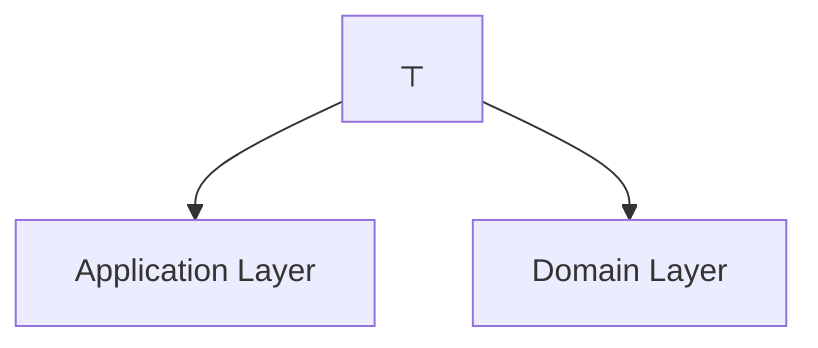

# Development Viewpoint Overview

> **Last Updated**: 2025-10-23
> **Status**: Active
> **Stakeholders**: Developers, Build Engineers, Architects

## 目的

Development Viewpoint 從開發者角度描述系統如何結構化,著重於程式碼組織、模組結構和開發實踐。這個觀點幫助開發者理解:

- 程式碼庫如何組織
- 使用哪些架構模式
- 模組如何相互依賴
- 如何導覽和貢獻程式碼庫

## 關鍵關注點

此觀點處理以下關注點:

1. **程式碼組織**: 程式碼如何結構化以支援可維護性和可擴展性?
2. **模組結構**: 模組如何組織以及它們的責任是什麼?
3. **依賴管理**: 依賴規則是什麼以及如何強制執行?
4. **建置流程**: 系統如何建置、測試和打包?
5. **開發環境**: 開發需要哪些工具和設定?
6. **程式碼品質**: 程式碼品質如何維護和強制執行?

## 架構方法

### Hexagonal Architecture (Ports and Adapters)

系統遵循 **Hexagonal Architecture** (也稱為 Ports and Adapters pattern) 結合 **Domain-Driven Design (DDD)** tactical patterns。這種架構確保:

- **Domain Independence**: 業務邏輯與技術關注點隔離
- **Testability**: Core domain 可以在沒有基礎設施的情況下測試
- **Flexibility**: 易於替換基礎設施實作
- **Maintainability**: 清晰的關注點分離

### 層級結構



### 依賴規則

架構強制執行嚴格的依賴規則:

1. **Domain Layer**: 對任何其他層都沒有依賴
   - 包含純業務邏輯
   - 定義 repository interfaces
   - 定義 domain events
   - 沒有 framework 依賴 (除了 Java standard library)

2. **Application Layer**: 只依賴 Domain Layer
   - 編排 use cases
   - 協調 domain objects
   - 發佈 domain events
   - 管理 transactions

3. **Infrastructure Layer**: 依賴 Domain Layer
   - 實作 repository interfaces
   - 實作 external service adapters
   - 處理持久化 (JPA entities)
   - 管理訊息傳遞 (Kafka, Redis)

4. **Interfaces Layer**: 依賴 Application 和 Domain Layers
   - 暴露 REST APIs
   - 處理 HTTP requests/responses
   - 管理 authentication/authorization
   - 轉換 DTOs 為 domain objects

## 程式碼組織

### Root Package 結構

```text
solid.humank.genaidemo/
├── domain/              # Domain Layer
│   ├── customer/       # Customer Bounded Context
│   ├── order/          # Order Bounded Context
│   ├── product/        # Product Bounded Context
│   ├── payment/        # Payment Bounded Context
│   ├── inventory/      # Inventory Bounded Context
│   ├── promotion/      # Promotion Bounded Context
│   ├── logistics/      # Logistics Bounded Context
│   ├── notification/   # Notification Bounded Context
│   ├── review/         # Review Bounded Context
│   ├── shoppingcart/   # Shopping Cart Bounded Context
│   ├── pricing/        # Pricing Bounded Context
│   ├── seller/         # Seller Bounded Context
│   ├── delivery/       # Delivery Bounded Context
│   └── shared/         # Shared Kernel
├── application/        # Application Layer
│   ├── customer/       # Customer Use Cases
│   ├── order/          # Order Use Cases
│   └── ...
├── infrastructure/     # Infrastructure Layer
│   ├── customer/       # Customer Infrastructure
│   ├── order/          # Order Infrastructure
│   ├── config/         # Configuration
│   ├── event/          # Event Publishing
│   └── ...
└── interfaces/         # Interfaces Layer
    ├── rest/           # REST API Controllers
    └── web/            # Web UI Controllers
```

### Bounded Context 組織

每個 bounded context 在 domain layer 中遵循一致的結構:

```text
domain/{context}/
├── model/
│   ├── aggregate/      # Aggregate Roots
│   ├── entity/         # Entities (non-root)
│   ├── valueobject/    # Value Objects
│   └── specification/  # Business Rules
├── events/             # Domain Events
├── repository/         # Repository Interfaces
├── service/            # Domain Services
└── validation/         # Validation Logic
```

### 範例: Customer Bounded Context

```text
domain/customer/
├── model/
│   ├── aggregate/
│   │   └── Customer.java              # Aggregate Root
│   ├── entity/
│   │   └── CustomerProfile.java       # Entity
│   ├── valueobject/
│   │   ├── CustomerId.java            # Value Object
│   │   ├── Email.java                 # Value Object
│   │   └── MembershipLevel.java       # Value Object
│   └── specification/
│       └── CustomerEligibilitySpec.java
├── events/
│   ├── CustomerCreatedEvent.java      # Domain Event
│   └── CustomerProfileUpdatedEvent.java
├── repository/
│   └── CustomerRepository.java        # Repository Interface
├── service/
│   └── CustomerDomainService.java     # Domain Service
└── validation/
    └── CustomerValidator.java
```

## 模組依賴

### 技術堆疊

#### Backend Core

- **Java**: 21 (LTS)
- **Spring Boot**: 3.4.5
- **Spring Framework**: 6.x
- **Gradle**: 8.x

#### Data & Persistence

- **Spring Data JPA**: For repository implementations
- **Hibernate**: ORM framework
- **Flyway**: Database migrations
- **H2**: In-memory database (dev/test)
- **PostgreSQL**: Production database

#### Testing

- **JUnit 5**: Unit testing framework
- **Mockito**: Mocking framework
- **AssertJ**: Fluent assertions
- **Cucumber 7**: BDD testing
- **ArchUnit**: Architecture testing

#### API & Documentation

- **SpringDoc OpenAPI 3**: API documentation
- **Swagger UI**: API exploration

#### Observability

- **Spring Boot Actuator**: Metrics and health checks
- **AWS X-Ray**: Distributed tracing
- **Micrometer**: Metrics collection

### 依賴管理

依賴透過 Gradle 的 version catalog 管理:

```gradle
// gradle/libs.versions.toml
[versions]
spring-boot = "3.4.5"
java = "21"

[libraries]
spring-boot-starter-web = { module = "org.springframework.boot:spring-boot-starter-web" }
spring-boot-starter-data-jpa = { module = "org.springframework.boot:spring-boot-starter-data-jpa" }
```

### 禁止的依賴

為了維護架構完整性,某些依賴是禁止的:

1. **Domain Layer**:
   - ❌ No Spring Framework annotations (除了 domain services 的 `@Component`)
   - ❌ No JPA annotations
   - ❌ No infrastructure libraries
   - ✅ Only Java standard library and domain-specific libraries

2. **Application Layer**:
   - ❌ No infrastructure implementations
   - ❌ No REST/HTTP libraries
   - ✅ Only domain interfaces and Spring transaction management

3. **All Layers**:
   - ❌ No circular dependencies
   - ❌ No direct database access from domain/application layers

## 開發實踐

### Domain-Driven Design (DDD)

程式碼庫遵循 DDD tactical patterns:

1. **Aggregates**: Consistency boundaries with aggregate roots
2. **Entities**: Objects with identity
3. **Value Objects**: Immutable objects defined by their attributes
4. **Domain Events**: Capture business events
5. **Repositories**: Persistence abstraction
6. **Domain Services**: Stateless business logic

### Event-Driven Architecture

系統使用 domain events 用於:

- **Cross-Context Communication**: Bounded contexts 透過事件溝通
- **Eventual Consistency**: 非同步資料同步
- **Audit Trail**: 關鍵操作的 event sourcing
- **Integration**: 外部系統整合

### Test-Driven Development (TDD)

開發遵循 TDD 實踐:

1. **Red**: 撰寫失敗的測試
2. **Green**: 撰寫最少程式碼以通過測試
3. **Refactor**: 改善程式碼品質

### Behavior-Driven Development (BDD)

業務需求以 Gherkin scenarios 捕獲:

```gherkin
Feature: Customer Registration
  Scenario: Successful customer registration
    Given a new customer with valid information
    When they submit the registration form
    Then they should receive a confirmation email
    And their account should be created
```

## 建置系統

### Gradle Build 結構

```text
project/
├── build.gradle                # Root build configuration
├── settings.gradle             # Project settings
├── gradle.properties           # Build properties
├── app/
│   └── build.gradle           # Application module
└── gradle/
    ├── libs.versions.toml     # Version catalog
    └── wrapper/               # Gradle wrapper
```

### 關鍵 Gradle 任務

```bash
# Build and test
./gradlew build                 # Full build with tests
./gradlew clean build          # Clean build

# Testing
./gradlew test                 # Run all tests
./gradlew unitTest             # Run unit tests only
./gradlew integrationTest      # Run integration tests
./gradlew cucumber             # Run BDD tests

# Code Quality
./gradlew archUnit             # Architecture tests
./gradlew jacocoTestReport     # Code coverage report
./gradlew pmdMain              # Static analysis

# Development
./gradlew bootRun              # Run application
./gradlew bootJar              # Create executable JAR
```

## 程式碼品質標準

### 自動化品質檢查

1. **Architecture Compliance**: ArchUnit tests 強制執行架構規則
2. **Code Coverage**: 需要最少 80% line coverage
3. **Static Analysis**: PMD 和 SpotBugs 用於程式碼品質
4. **Style Checks**: Checkstyle 用於一致的格式化
5. **Dependency Analysis**: Gradle dependency verification

### 品質關卡

合併程式碼前:

- ✅ All tests pass
- ✅ Code coverage ≥ 80%
- ✅ No ArchUnit violations
- ✅ No critical PMD/SpotBugs issues
- ✅ Code review approved

## 開發環境

### 必要工具

1. **Java Development Kit (JDK)**: Java 21
2. **IDE**: IntelliJ IDEA (recommended) or VS Code
3. **Build Tool**: Gradle 8.x (via wrapper)
4. **Version Control**: Git
5. **Container Runtime**: Docker Desktop
6. **Database Client**: DBeaver or similar

### 可選工具

1. **API Testing**: Postman or Insomnia
2. **Database**: PostgreSQL (for local testing)
3. **Message Broker**: Kafka (via Docker)
4. **Cache**: Redis (via Docker)

### IDE 設定

#### IntelliJ IDEA

1. **Code Style**: Import `config/intellij-code-style.xml`
2. **Inspections**: Enable all Java inspections
3. **Plugins**:
   - Lombok
   - Spring Boot
   - Cucumber for Java
   - PlantUML integration

#### VS Code

1. **Extensions**:
   - Java Extension Pack
   - Spring Boot Extension Pack
   - Cucumber (Gherkin) Full Support
   - PlantUML

## 導覽

### 相關文件

- [Module Organization](module-organization.md) - Detailed package structure
- [Dependency Rules](dependency-rules.md) - Architecture constraints
- [Build Process](build-process.md) - Build and deployment

### 相關 Viewpoints

- [Functional Viewpoint](../functional/README.md) - Business capabilities
- [Information Viewpoint](../information/README.md) - Data models
- [Deployment Viewpoint](../deployment/README.md) - Infrastructure

### 相關 Perspectives

- [Evolution Perspective](../../perspectives/evolution/README.md) - Maintainability
- [Development Resource Perspective](../../perspectives/development-resource/README.md) - Team skills

### 開發指南

- [Local Environment Setup](../../development/setup/local-environment.md)
- [Coding Standards](../../development/coding-standards/java-standards.md)
- [Testing Strategy](../../development/testing/testing-strategy.md)

---

**Next**: [Module Organization](module-organization.md) →
