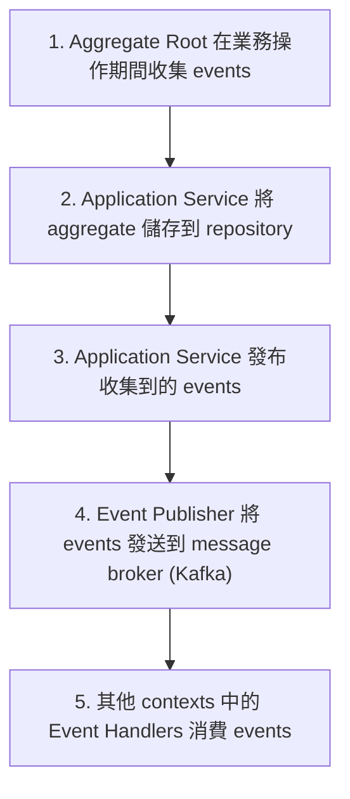
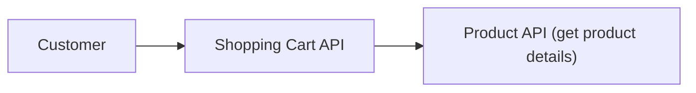

# Functional Interfaces

> **Status**: ✅ Active
> **Last Updated**: 2025-10-22
> **Owner**: API Team

## Overview

本文件描述 Enterprise E-Commerce Platform 的功能介面。系統暴露兩種主要的介面類型：

1. **REST APIs**：用於即時操作的同步 request-response 介面
2. **Domain Events**：用於跨 context 通訊的非同步 event-driven 介面

所有介面遵循一致的設計原則，並使用 OpenAPI 3.0 規格記錄。

## Interface Design Principles

### REST API Principles

- **RESTful Design**：遵循 REST 架構約束
- **Resource-Oriented**：URLs 代表資源，而非動作
- **HTTP Semantics**：正確使用 HTTP methods 和 status codes
- **Versioning**：基於 URL 的版本控制（`/api/v1/`）
- **Consistency**：一致的命名、錯誤處理和回應格式

### Domain Event Principles

- **Event Sourcing**：Events 是已發生事件的不可變記錄
- **Past Tense**：Event 名稱使用過去式（例如，`OrderSubmitted`）
- **Self-Contained**：Events 包含所有必要的資料
- **Idempotent Handling**：Event handlers 可以安全地多次處理 events
- **Schema Evolution**：Events 支援向後相容的 schema 變更

---

## REST API Interfaces

### API Base URL

- **Development**：`http://localhost:8080/api/v1`
- **Staging**：`https://staging-api.example.com/api/v1`
- **Production**：`https://api.example.com/api/v1`

### Authentication

所有 API endpoints（公開 endpoints 除外）需要 JWT 驗證：

```http
Authorization: Bearer {jwt_token}
```

**Public Endpoints**（不需驗證）：

- `GET /api/v1/products` - List products
- `GET /api/v1/products/{id}` - Get product details
- `GET /api/v1/products/search` - Search products
- `POST /api/v1/customers` - Register customer

### Common Response Format

#### Success Response

```json
{
  "data": {
    "id": "resource-id",
    "...": "resource fields"
  },
  "meta": {
    "timestamp": "2025-10-22T10:00:00Z",
    "version": "1.0"
  }
}
```

#### Error Response

```json
{
  "error": {
    "code": "ERROR_CODE",
    "message": "Human-readable error message",
    "details": {
      "field": "fieldName",
      "reason": "Validation failure reason"
    }
  },
  "meta": {
    "timestamp": "2025-10-22T10:00:00Z",
    "traceId": "trace-id-for-debugging"
  }
}
```

### API Endpoints by Bounded Context

#### Customer Context APIs

| Method | Endpoint | Description | Auth Required |
|--------|----------|-------------|---------------|
| POST | `/api/v1/customers` | Register new customer | No |
| GET | `/api/v1/customers/{id}` | Get customer details | Yes |
| PUT | `/api/v1/customers/{id}` | Update customer profile | Yes |
| GET | `/api/v1/customers/{id}/orders` | List customer orders | Yes |
| POST | `/api/v1/customers/{id}/addresses` | Add delivery address | Yes |
| PUT | `/api/v1/customers/{id}/addresses/{addressId}` | Update address | Yes |
| DELETE | `/api/v1/customers/{id}/addresses/{addressId}` | Remove address | Yes |
| GET | `/api/v1/customers/{id}/reward-points` | Get reward points | Yes |
| PUT | `/api/v1/customers/{id}/preferences` | Update preferences | Yes |

**Detailed Documentation**：[Customer API Reference](../../api/rest/endpoints/customers.md)

#### Order Context APIs

| Method | Endpoint | Description | Auth Required |
|--------|----------|-------------|---------------|
| POST | `/api/v1/orders` | Create new order | Yes |
| GET | `/api/v1/orders/{id}` | Get order details | Yes |
| GET | `/api/v1/orders` | List orders (with filters) | Yes |
| POST | `/api/v1/orders/{id}/submit` | Submit order for processing | Yes |
| POST | `/api/v1/orders/{id}/cancel` | Cancel order | Yes |
| GET | `/api/v1/orders/{id}/history` | Get order history | Yes |
| GET | `/api/v1/orders/{id}/invoice` | Download invoice | Yes |

**Detailed Documentation**：[Order API Reference](../../api/rest/endpoints/orders.md)

#### Product Context APIs

| Method | Endpoint | Description | Auth Required |
|--------|----------|-------------|---------------|
| GET | `/api/v1/products` | List products | No |
| GET | `/api/v1/products/{id}` | Get product details | No |
| GET | `/api/v1/products/search` | Search products | No |
| GET | `/api/v1/products/categories` | List categories | No |
| POST | `/api/v1/products` | Create product | Yes (Admin) |
| PUT | `/api/v1/products/{id}` | Update product | Yes (Admin/Seller) |
| DELETE | `/api/v1/products/{id}` | Delete product | Yes (Admin) |
| GET | `/api/v1/products/{id}/reviews` | Get product reviews | No |

**Detailed Documentation**：[Product API Reference](../../api/rest/endpoints/products.md)

#### Shopping Cart Context APIs

| Method | Endpoint | Description | Auth Required |
|--------|----------|-------------|---------------|
| GET | `/api/v1/carts/{customerId}` | Get customer cart | Yes |
| POST | `/api/v1/carts/{customerId}/items` | Add item to cart | Yes |
| PUT | `/api/v1/carts/{customerId}/items/{productId}` | Update item quantity | Yes |
| DELETE | `/api/v1/carts/{customerId}/items/{productId}` | Remove item | Yes |
| DELETE | `/api/v1/carts/{customerId}` | Clear cart | Yes |
| POST | `/api/v1/carts/{customerId}/checkout` | Checkout cart | Yes |

**Detailed Documentation**：[Shopping Cart API Reference](../../api/rest/endpoints/carts.md)

#### Payment Context APIs

| Method | Endpoint | Description | Auth Required |
|--------|----------|-------------|---------------|
| POST | `/api/v1/payments` | Initiate payment | Yes |
| GET | `/api/v1/payments/{id}` | Get payment status | Yes |
| POST | `/api/v1/payments/{id}/refund` | Process refund | Yes (Admin) |
| GET | `/api/v1/payments/{id}/receipt` | Download receipt | Yes |

**Detailed Documentation**：[Payment API Reference](../../api/rest/endpoints/payments.md)

#### Delivery Context APIs

| Method | Endpoint | Description | Auth Required |
|--------|----------|-------------|---------------|
| GET | `/api/v1/deliveries/{orderId}` | Get delivery status | Yes |
| GET | `/api/v1/deliveries/track/{trackingNumber}` | Track delivery | No |
| POST | `/api/v1/deliveries/{id}/update-status` | Update status | Yes (Logistics) |

**Detailed Documentation**：[Delivery API Reference](../../api/rest/endpoints/deliveries.md)

#### Inventory Context APIs

| Method | Endpoint | Description | Auth Required |
|--------|----------|-------------|---------------|
| GET | `/api/v1/inventory/{productId}` | Get stock level | Yes (Admin/Seller) |
| POST | `/api/v1/inventory/{productId}/replenish` | Add stock | Yes (Admin/Seller) |
| GET | `/api/v1/inventory/low-stock` | List low stock items | Yes (Admin) |

**Detailed Documentation**：[Inventory API Reference](../../api/rest/endpoints/inventory.md)

#### Promotion Context APIs

| Method | Endpoint | Description | Auth Required |
|--------|----------|-------------|---------------|
| GET | `/api/v1/promotions/active` | List active promotions | No |
| POST | `/api/v1/promotions/validate-coupon` | Validate coupon code | Yes |
| POST | `/api/v1/promotions` | Create promotion | Yes (Admin) |
| PUT | `/api/v1/promotions/{id}` | Update promotion | Yes (Admin) |
| DELETE | `/api/v1/promotions/{id}` | Delete promotion | Yes (Admin) |

**Detailed Documentation**：[Promotion API Reference](../../api/rest/endpoints/promotions.md)

#### Review Context APIs

| Method | Endpoint | Description | Auth Required |
|--------|----------|-------------|---------------|
| GET | `/api/v1/reviews` | List reviews (by product) | No |
| POST | `/api/v1/reviews` | Submit review | Yes |
| PUT | `/api/v1/reviews/{id}` | Update review | Yes |
| DELETE | `/api/v1/reviews/{id}` | Delete review | Yes |
| POST | `/api/v1/reviews/{id}/approve` | Approve review | Yes (Admin) |
| POST | `/api/v1/reviews/{id}/reject` | Reject review | Yes (Admin) |

**Detailed Documentation**：[Review API Reference](../../api/rest/endpoints/reviews.md)

#### Seller Context APIs

| Method | Endpoint | Description | Auth Required |
|--------|----------|-------------|---------------|
| POST | `/api/v1/sellers` | Register seller | No |
| GET | `/api/v1/sellers/{id}` | Get seller profile | No |
| PUT | `/api/v1/sellers/{id}` | Update seller profile | Yes (Seller) |
| GET | `/api/v1/sellers/{id}/products` | List seller products | No |
| POST | `/api/v1/sellers/{id}/approve` | Approve seller | Yes (Admin) |

**Detailed Documentation**：[Seller API Reference](../../api/rest/endpoints/sellers.md)

---

## Domain Event Interfaces

### Event Structure

所有 domain events 遵循一致的結構：

```java
public record CustomerCreatedEvent(
    CustomerId customerId,           // Aggregate ID
    CustomerName customerName,       // Event data
    Email email,                     // Event data
    MembershipLevel membershipLevel, // Event data
    UUID eventId,                    // Event metadata
    LocalDateTime occurredOn         // Event metadata
) implements DomainEvent {

    @Override
    public String getEventType() {
        return "CustomerCreated";
    }

    @Override
    public String getAggregateId() {
        return customerId.getValue();
    }
}
```

### Event Publishing Flow



### Domain Events by Context

#### Customer Context Events

| Event Name | Trigger | Consumers |
|------------|---------|-----------|
| `CustomerCreatedEvent` | Customer registration | Notification, Observability |
| `CustomerProfileUpdatedEvent` | Profile update | Notification, Observability |
| `CustomerStatusChangedEvent` | Status change | Notification, Order |
| `MembershipLevelUpgradedEvent` | Spending threshold reached | Notification, Pricing |
| `DeliveryAddressAddedEvent` | Address added | Observability |
| `RewardPointsEarnedEvent` | Order completed | Notification |
| `RewardPointsRedeemedEvent` | Points used | Notification, Pricing |

**Detailed Documentation**：[Customer Events Reference](../../api/events/contexts/customer-events.md)

#### Order Context Events

| Event Name | Trigger | Consumers |
|------------|---------|-----------|
| `OrderCreatedEvent` | Order created | Observability |
| `OrderSubmittedEvent` | Order submitted | Inventory, Payment, Pricing, Notification |
| `OrderConfirmedEvent` | Payment & inventory confirmed | Delivery, Notification, Customer |
| `OrderCancelledEvent` | Order cancelled | Inventory, Payment, Notification |
| `OrderShippedEvent` | Order shipped | Notification, Customer |
| `OrderDeliveredEvent` | Order delivered | Review, Customer, Notification |
| `OrderCompletedEvent` | Order completed | Customer, Seller, Observability |

**Detailed Documentation**：[Order Events Reference](../../api/events/contexts/order-events.md)

#### Product Context Events

| Event Name | Trigger | Consumers |
|------------|---------|-----------|
| `ProductCreatedEvent` | Product created | Inventory, Observability |
| `ProductUpdatedEvent` | Product updated | Shopping Cart, Observability |
| `ProductPriceChangedEvent` | Price changed | Shopping Cart, Pricing, Notification |
| `ProductStatusChangedEvent` | Status changed | Shopping Cart, Inventory |
| `ProductDiscontinuedEvent` | Product discontinued | Shopping Cart, Inventory |

**Detailed Documentation**：[Product Events Reference](../../api/events/contexts/product-events.md)

#### Inventory Context Events

| Event Name | Trigger | Consumers |
|------------|---------|-----------|
| `InventoryReservedEvent` | Stock reserved | Order, Observability |
| `InventoryReleasedEvent` | Reservation released | Order, Observability |
| `InventoryReplenishedEvent` | Stock added | Product, Notification |
| `InventoryDepletedEvent` | Stock depleted | Product, Shopping Cart, Notification |
| `StockLevelChangedEvent` | Stock level changed | Product, Observability |

**Detailed Documentation**：[Inventory Events Reference](../../api/events/contexts/inventory-events.md)

#### Payment Context Events

| Event Name | Trigger | Consumers |
|------------|---------|-----------|
| `PaymentInitiatedEvent` | Payment started | Observability |
| `PaymentCompletedEvent` | Payment successful | Order, Customer, Delivery, Notification |
| `PaymentFailedEvent` | Payment failed | Order, Notification |
| `RefundProcessedEvent` | Refund completed | Customer, Notification |

**Detailed Documentation**：[Payment Events Reference](../../api/events/contexts/payment-events.md)

#### Delivery Context Events

| Event Name | Trigger | Consumers |
|------------|---------|-----------|
| `DeliveryScheduledEvent` | Delivery scheduled | Order, Notification |
| `DeliveryDispatchedEvent` | Package dispatched | Order, Notification |
| `DeliveryInTransitEvent` | In transit | Order, Notification |
| `DeliveryDeliveredEvent` | Delivered | Order, Review, Customer, Notification |
| `DeliveryFailedEvent` | Delivery failed | Order, Notification |

**Detailed Documentation**：[Delivery Events Reference](../../api/events/contexts/delivery-events.md)

#### Promotion Context Events

| Event Name | Trigger | Consumers |
|------------|---------|-----------|
| `PromotionCreatedEvent` | Promotion created | Pricing, Observability |
| `PromotionActivatedEvent` | Promotion activated | Pricing, Notification |
| `PromotionExpiredEvent` | Promotion expired | Pricing |
| `CouponAppliedEvent` | Coupon applied | Pricing, Observability |
| `CouponRedeemedEvent` | Coupon redeemed | Pricing, Observability |

**Detailed Documentation**：[Promotion Events Reference](../../api/events/contexts/promotion-events.md)

#### Review Context Events

| Event Name | Trigger | Consumers |
|------------|---------|-----------|
| `ReviewSubmittedEvent` | Review submitted | Product, Seller, Notification |
| `ReviewApprovedEvent` | Review approved | Product, Notification |
| `ReviewRejectedEvent` | Review rejected | Notification |
| `ReviewUpdatedEvent` | Review updated | Product, Observability |

**Detailed Documentation**：[Review Events Reference](../../api/events/contexts/review-events.md)

#### Seller Context Events

| Event Name | Trigger | Consumers |
|------------|---------|-----------|
| `SellerRegisteredEvent` | Seller registered | Notification, Observability |
| `SellerApprovedEvent` | Seller approved | Notification |
| `SellerSuspendedEvent` | Seller suspended | Product, Notification |
| `SellerRatingUpdatedEvent` | Rating updated | Observability |

**Detailed Documentation**：[Seller Events Reference](../../api/events/contexts/seller-events.md)

---

## Interface Contracts

### REST API Contracts

#### Request Validation

- 使用 Bean Validation annotations 驗證所有 request bodies
- 無效的 requests 回傳 `400 Bad Request` 並包含欄位級錯誤
- 在 API layer 執行必填欄位

#### Response Guarantees

- 成功的操作回傳適當的 2xx status codes
- 失敗的操作回傳適當的 4xx/5xx status codes
- 所有回應都包含 timestamp 和 trace ID 以便除錯

#### Idempotency

- 支援帶有 idempotency keys 的 POST 操作
- PUT 操作本質上是 idempotent
- DELETE 操作是 idempotent（刪除不存在的資源回傳 404）

### Domain Event Contracts

#### Event Schema Stability

- Event schemas 有版本控制
- 新欄位作為可選項新增以保持向後相容
- Breaking changes 需要新的 event type

#### Delivery Guarantees

- **At-least-once delivery**：Events 可能被交付多次
- **Ordering**：來自同一 aggregate 的 events 是有序的
- **Durability**：Events 在發布前持久化

#### Event Handling

- Handlers 必須是 idempotent
- Handlers 不得拋出例外（使用 dead letter queue）
- Handlers 非同步處理 events

---

## API Versioning Strategy

### URL Versioning

- 目前版本：`/api/v1/`
- 未來版本：`/api/v2/`、`/api/v3/`

### Deprecation Policy

- 棄用前至少提前 6 個月通知
- 回應中包含棄用標頭：

  ```http
  Deprecation: true
  Sunset: 2026-04-22T23:59:59Z
  Link: </api/v2/customers>; rel="successor-version"
  ```

### Backward Compatibility

- 同一版本中的附加變更（新欄位、新 endpoints）
- Breaking changes 需要新版本
- 舊版本至少支援 12 個月

---

## Rate Limiting

### Rate Limit Rules

| Endpoint Type | Limit | Window |
|---------------|-------|--------|
| Public endpoints | 100 requests | per minute |
| Authenticated endpoints | 1000 requests | per minute |
| Admin endpoints | 5000 requests | per minute |
| Search endpoints | 50 requests | per minute |

### Rate Limit Headers

```http
X-RateLimit-Limit: 1000
X-RateLimit-Remaining: 999
X-RateLimit-Reset: 1640000000
```

### Rate Limit Exceeded Response

```http
HTTP/1.1 429 Too Many Requests
Retry-After: 60

{
  "error": {
    "code": "RATE_LIMIT_EXCEEDED",
    "message": "Rate limit exceeded. Please try again later."
  }
}
```

---

## Error Handling

### Standard Error Codes

| Error Code | HTTP Status | Description |
|------------|-------------|-------------|
| `VALIDATION_ERROR` | 400 | Request validation failed |
| `AUTHENTICATION_REQUIRED` | 401 | Authentication required |
| `AUTHORIZATION_FAILED` | 403 | Insufficient permissions |
| `RESOURCE_NOT_FOUND` | 404 | Resource not found |
| `CONFLICT` | 409 | Business rule violation |
| `RATE_LIMIT_EXCEEDED` | 429 | Too many requests |
| `INTERNAL_ERROR` | 500 | Internal server error |
| `SERVICE_UNAVAILABLE` | 503 | Service temporarily unavailable |

### Error Response Examples

#### Validation Error

```json
{
  "error": {
    "code": "VALIDATION_ERROR",
    "message": "Request validation failed",
    "details": {
      "fieldErrors": [
        {
          "field": "email",
          "message": "Email format is invalid"
        },
        {
          "field": "password",
          "message": "Password must be at least 8 characters"
        }
      ]
    }
  },
  "meta": {
    "timestamp": "2025-10-22T10:00:00Z",
    "traceId": "abc-123-def"
  }
}
```

#### Business Rule Violation

```json
{
  "error": {
    "code": "INSUFFICIENT_INVENTORY",
    "message": "Cannot complete order due to insufficient inventory",
    "details": {
      "productId": "prod-123",
      "requested": 10,
      "available": 5
    }
  },
  "meta": {
    "timestamp": "2025-10-22T10:00:00Z",
    "traceId": "abc-123-def"
  }
}
```

---

## Integration Patterns

### Synchronous Integration (REST API)

**When to Use**：

- 需要立即回應的即時查詢
- 用戶發起的操作
- 同一 bounded context 內的操作

**Example**：



### Asynchronous Integration (Domain Events)

**When to Use**：

- 跨 context 工作流
- 可以最終一致的操作
- 通知和稽核軌跡

**Example**：

```text
Order Context publishes OrderSubmittedEvent
  → Inventory Context reserves stock
  → Payment Context processes payment
  → Notification Context sends confirmation
```

### Hybrid Integration

某些工作流使用兩種模式：

**Example: Order Submission**：

1. **Synchronous**：客戶透過 REST API 提交訂單
2. **Asynchronous**：訂單為 inventory、payment、delivery 發布 events
3. **Synchronous**：客戶透過 REST API 輪詢訂單狀態

---

## API Documentation Tools

### OpenAPI/Swagger

**Swagger UI**：`http://localhost:8080/swagger-ui.html`

**OpenAPI Spec**：`http://localhost:8080/v3/api-docs`

### Postman Collection

**Location**：`docs/api/rest/postman/ecommerce-api.json`

**Import Instructions**：

1. 開啟 Postman
2. 點擊 "Import"
3. 選擇 `ecommerce-api.json`
4. 配置環境變數（base URL、auth token）

### Code Examples

**Location**：`docs/api/rest/examples/`

**Languages**：

- cURL
- JavaScript/TypeScript
- Java
- Python

---

## Security Considerations

### Authentication

- JWT tokens，1 小時過期
- Refresh tokens，24 小時過期
- 刷新時輪換 Token

### Authorization

- 基於角色的存取控制（RBAC）
- 資源級權限
- Admin、Seller、Customer 角色

### Data Protection

- 傳輸中的敏感資料加密（TLS 1.3）
- 靜態敏感資料加密（AES-256）
- 日誌和錯誤訊息中遮罩 PII

**Detailed Documentation**：[Security Perspective](../../perspectives/security/overview.md)

---

## Performance Considerations

### Response Time Targets

- **Critical APIs**（auth、payment）：≤ 500ms（95th percentile）
- **Business APIs**（orders、customers）：≤ 1000ms（95th percentile）
- **Search APIs**：≤ 2000ms（95th percentile）

### Caching Strategy

- Product catalog：15 分鐘 TTL
- Customer profile：5 分鐘 TTL
- Inventory levels：1 分鐘 TTL

### Pagination

- 預設頁面大小：20 項目
- 最大頁面大小：100 項目
- 大型資料集使用基於游標的分頁

**Detailed Documentation**：[Performance Perspective](../../perspectives/performance/overview.md)

---

## Quick Links

- [Back to Functional Viewpoint](overview.md)
- [Bounded Contexts](bounded-contexts.md)
- [Use Cases](use-cases.md)
- [REST API Documentation](../../api/rest/README.md)
- [Domain Events Documentation](../../api/events/README.md)
- [Main Documentation](../../README.md)

## Change History

| Date | Version | Author | Changes |
|------|---------|--------|---------|
| 2025-10-22 | 1.0 | API Team | Initial version with REST APIs and domain events |

---

**Document Version**: 1.0
**Last Updated**: 2025-10-22
