# Data Flow

## 概述

本文件描述資料如何在系統中流動，包括 synchronous 和 asynchronous patterns、event-driven 通訊，以及資料同步策略。

## Data Flow Patterns

### 1. Command-Event Pattern（Write Operations）

系統中狀態變更的主要 pattern：

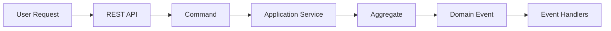

**Flow Steps**:

1. **User Request**: Client 傳送 HTTP request 到 REST API
2. **Command Creation**: Controller 從 request 建立 command 物件
3. **Application Service**: 編排 use case 執行
4. **Aggregate**: 執行商業邏輯並收集 events
5. **Event Publishing**: Application service 發布收集的 events
6. **Event Handlers**: 其他 contexts 非同步地對 events 做出反應

**Example: Order Submission**

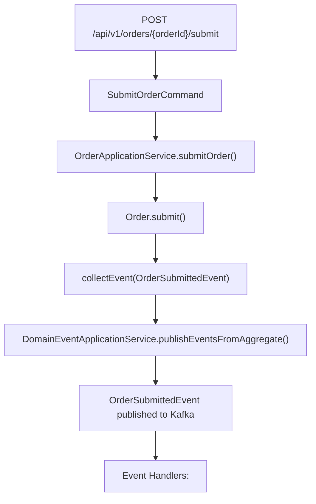

---

### 2. Query Pattern（Read Operations）

最佳化的讀取操作，沒有副作用：

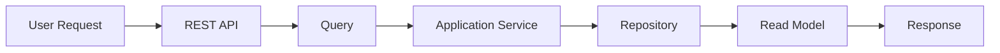

**Flow Steps**:

1. **User Request**: Client 傳送 HTTP GET request
2. **Query Creation**: Controller 建立 query 物件
3. **Application Service**: 執行 query 邏輯
4. **Repository**: 從 database 取得資料
5. **Read Model**: 資料的最佳化視圖
6. **Response**: DTO 回傳給 client

**Example: Get Customer Orders**

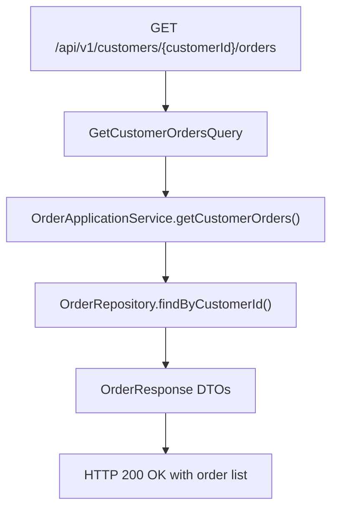

---

### 3. Event-Driven Integration Pattern

Bounded contexts 之間的非同步通訊：

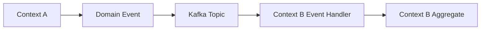

**Flow Steps**:

1. **Event Publication**: Context A 發布 domain event
2. **Message Bus**: Event 傳送到 Kafka topic
3. **Event Consumption**: Context B 消費 event
4. **Event Handler**: 處理 event 並更新本地狀態
5. **Idempotency Check**: 防止重複處理
6. **Local Update**: Context B 更新自己的資料

**Example: Inventory Reservation**

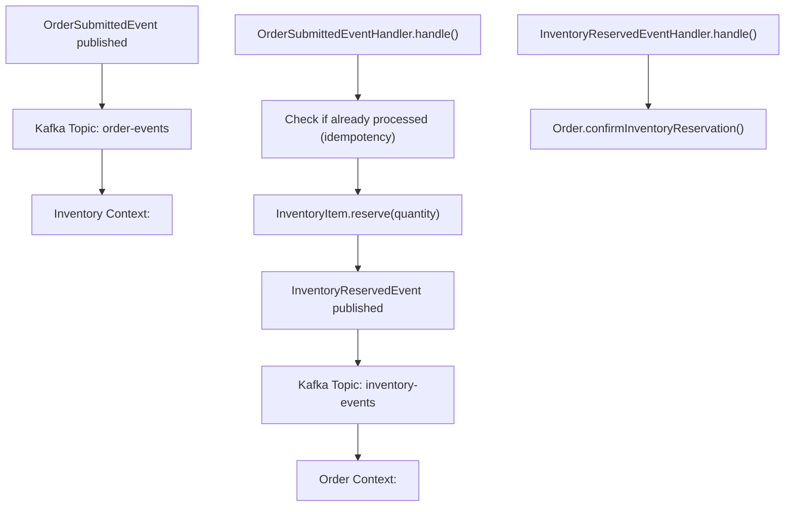

---

## Key Data Flows

### Order Processing Flow

從購物車到配送的完整流程：

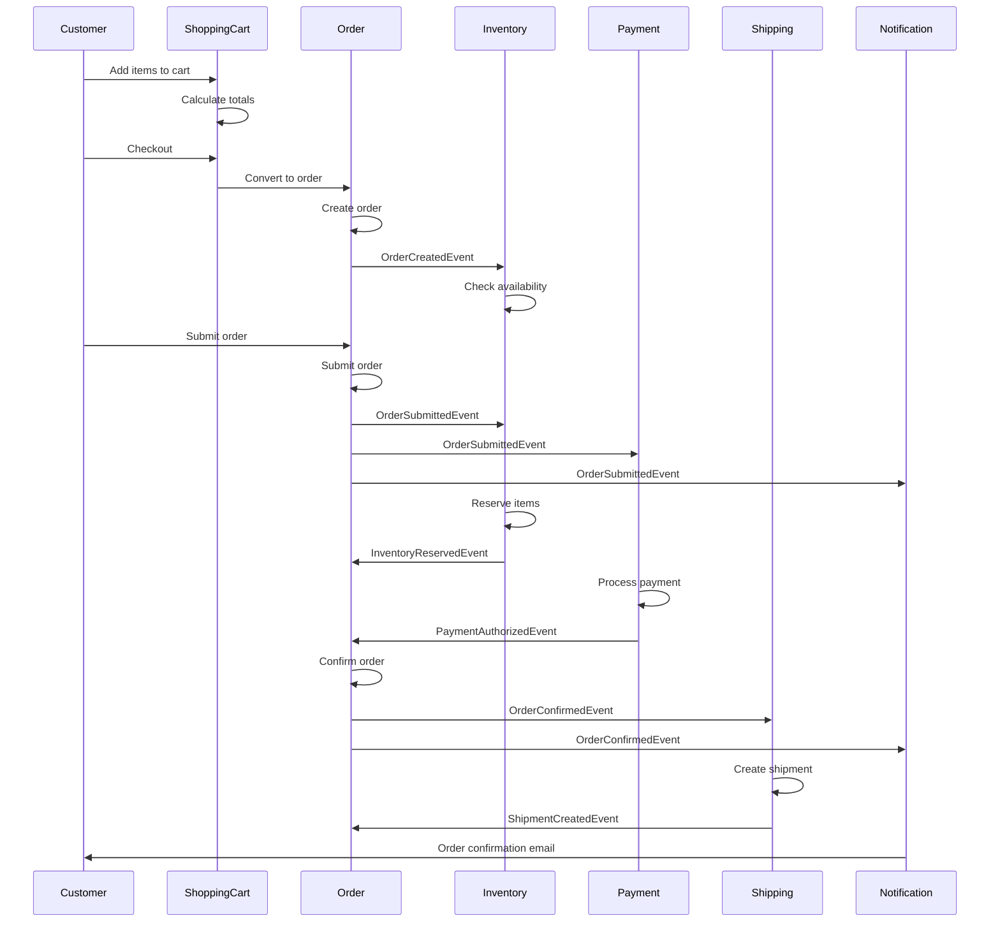

**Detailed Steps**:

1. **Cart Management**（Shopping Cart Context）
   - Customer 將商品加入購物車
   - Cart 使用當前價格計算總額
   - Cart 驗證商品可用性

2. **Order Creation**（Order Context）
   - Cart 轉換為訂單
   - Order 快照產品詳細資訊和價格
   - `OrderCreatedEvent` 發布

3. **Inventory Check**（Inventory Context）
   - 接收 `OrderCreatedEvent`
   - 檢查產品可用性
   - 可能發布 `LowStockAlertEvent`

4. **Order Submission**（Order Context）
   - Customer 提交訂單
   - Order 驗證商業規則
   - `OrderSubmittedEvent` 發布

5. **Inventory Reservation**（Inventory Context）
   - 接收 `OrderSubmittedEvent`
   - 為訂單保留庫存
   - `InventoryReservedEvent` 發布
   - 如果未履行，保留在 15 分鐘後過期

6. **Payment Processing**（Payment Context）
   - 接收 `OrderSubmittedEvent`
   - 授權付款
   - `PaymentAuthorizedEvent` 發布

7. **Order Confirmation**（Order Context）
   - 接收 `InventoryReservedEvent` 和 `PaymentAuthorizedEvent`
   - 確認訂單
   - `OrderConfirmedEvent` 發布

8. **Shipment Creation**（Shipping Context）
   - 接收 `OrderConfirmedEvent`
   - 建立出貨單
   - `ShipmentCreatedEvent` 發布

9. **Notification**（Notification Context）
   - 接收各種 events
   - 傳送訂單確認 email
   - 傳送出貨通知

---

### Customer Registration Flow

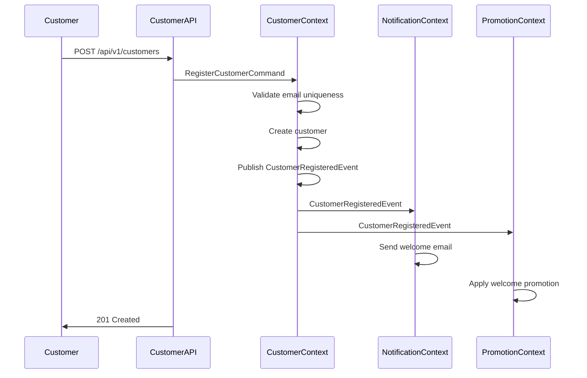

**Detailed Steps**:

1. **Registration Request**
   - Customer 提交註冊表單
   - API 驗證輸入格式

2. **Customer Creation**（Customer Context）
   - 驗證 email 唯一性
   - 建立 customer aggregate
   - 安全地雜湊密碼
   - `CustomerRegisteredEvent` 發布

3. **Welcome Email**（Notification Context）
   - 接收 `CustomerRegisteredEvent`
   - 傳送包含帳戶詳細資訊的歡迎 email
   - 記錄通知傳送

4. **Welcome Promotion**（Promotion Context）
   - 接收 `CustomerRegisteredEvent`
   - 套用歡迎折扣
   - 為首次購買建立優惠券代碼

---

### Product Review Flow

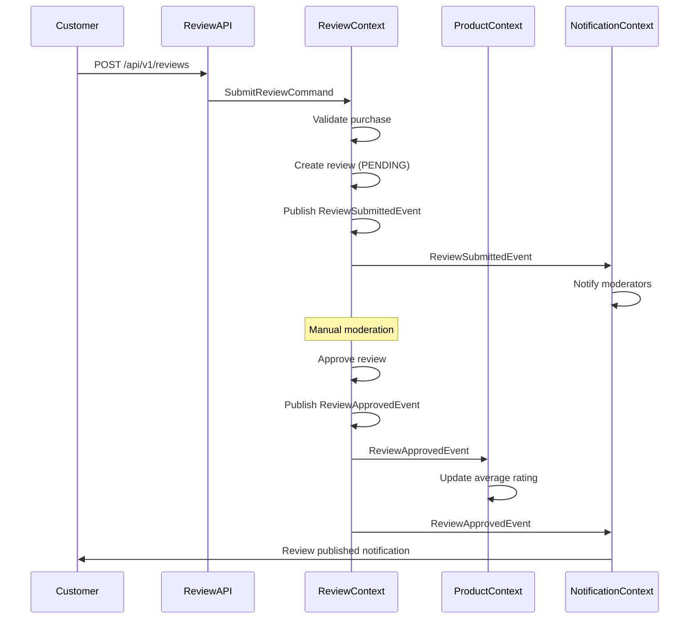

**Detailed Steps**:

1. **Review Submission**
   - Customer 為已購買的產品提交評論
   - API 驗證輸入

2. **Review Creation**（Review Context）
   - 驗證 customer 已購買產品
   - 建立狀態為 PENDING 的評論
   - `ReviewSubmittedEvent` 發布

3. **Moderation Notification**（Notification Context）
   - 接收 `ReviewSubmittedEvent`
   - 通知審核人員進行審查

4. **Review Approval**（Review Context）
   - 審核人員批准評論
   - 評論狀態變更為 APPROVED
   - `ReviewApprovedEvent` 發布

5. **Rating Update**（Product Context）
   - 接收 `ReviewApprovedEvent`
   - 重新計算平均評分
   - 更新產品評分 cache

6. **Customer Notification**（Notification Context）
   - 接收 `ReviewApprovedEvent`
   - 通知 customer 評論已發布

---

### Inventory Management Flow

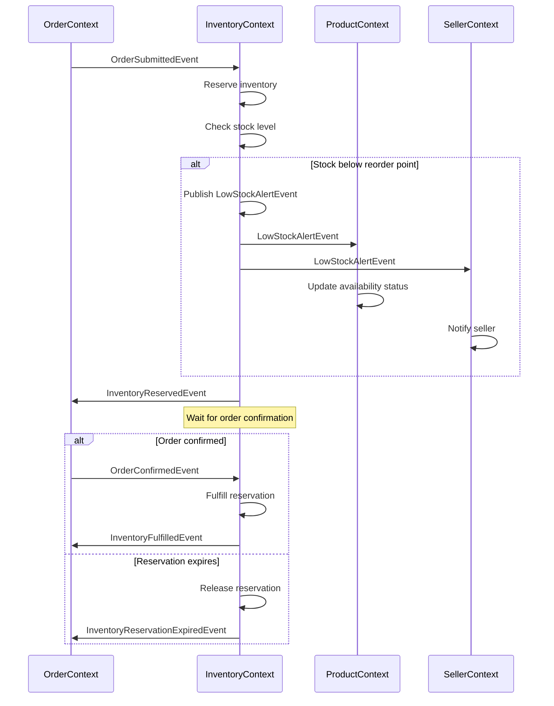

**Detailed Steps**:

1. **Reservation Request**
   - Order context 發布 `OrderSubmittedEvent`
   - Inventory context 接收 event

2. **Inventory Reservation**
   - 檢查可用數量
   - 建立保留記錄
   - 減少可用數量
   - `InventoryReservedEvent` 發布

3. **Low Stock Check**
   - 如果可用 < 重新訂購點
   - `LowStockAlertEvent` 發布
   - Product context 更新可用性
   - Seller context 通知賣家

4. **Reservation Fulfillment**
   - 訂單已確認 → 履行保留
   - 減少現有數量
   - `InventoryFulfilledEvent` 發布

5. **Reservation Expiration**
   - 如果在 15 分鐘內未履行
   - 釋放保留
   - 增加可用數量
   - `InventoryReservationExpiredEvent` 發布

---

## Data Synchronization Patterns

### 1. Real-Time Synchronization

**Use Case**: 必須立即一致的關鍵資料

**Pattern**: Synchronous API 呼叫

**Example**: Payment 授權

```java
@Service
public class OrderApplicationService {
    
    public void submitOrder(SubmitOrderCommand command) {
        Order order = orderRepository.findById(command.orderId());
        
        // Synchronous call to Payment context
        PaymentResult result = paymentService.authorizePayment(
            order.getTotalAmount(),
            command.paymentMethod()
        );
        
        if (result.isSuccess()) {
            order.submit();
            orderRepository.save(order);
        } else {
            throw new PaymentAuthorizationFailedException();
        }
    }
}
```

**Characteristics**:

- 立即一致性
- 較高延遲
- 緊密耦合
- 謹慎使用

---

### 2. Eventual Consistency

**Use Case**: 可以最終一致的非關鍵資料

**Pattern**: Asynchronous event 處理

**Example**: Customer profile 更新

```java
@Component
public class CustomerProfileUpdatedEventHandler 
    extends AbstractDomainEventHandler<CustomerProfileUpdatedEvent> {
    
    @Override
    @Transactional
    public void handle(CustomerProfileUpdatedEvent event) {
        // Update local cache of customer information
        customerCache.update(
            event.customerId(),
            event.customerName(),
            event.email()
        );
    }
}
```

**Characteristics**:

- 最終一致性（數秒到數分鐘）
- 較低延遲
- 鬆散耦合
- 偏好的 pattern

---

### 3. Snapshot Pattern

**Use Case**: 不應變更的歷史資料

**Pattern**: 在時間點複製資料

**Example**: 帶有產品詳細資訊的訂單項目

```java
@Entity
public class OrderItem {
    @Id
    private String id;
    
    // Reference to Product context
    private String productId;
    
    // Snapshot of product details at order time
    private String productName;
    private String productDescription;
    private Money unitPrice;
    
    // These values never change after order creation
}
```

**Characteristics**:

- 時間點一致性
- 不需要同步
- 不受來源變更影響
- 用於稽核追蹤

---

### 4. Cache-Aside Pattern

**Use Case**: 頻繁讀取、很少更新的資料

**Pattern**: Cache 搭配 lazy loading

**Example**: Product catalog caching

```java
@Service
public class ProductCacheService {
    
    @Cacheable(value = "products", key = "#productId")
    public ProductSummary getProduct(String productId) {
        // Cache miss - fetch from Product context
        return productClient.getProduct(productId);
    }
    
    @CacheEvict(value = "products", key = "#event.productId")
    @EventListener
    public void handleProductUpdated(ProductUpdatedEvent event) {
        // Invalidate cache on product update
    }
}
```

**Characteristics**:

- 從 cache 快速讀取
- 最終一致性
- 透過 events 進行 cache 失效
- 減少跨 context 呼叫

---

## Event Flow Architecture

### Event Publication

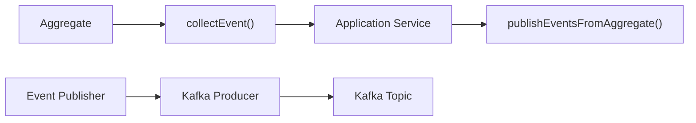

### Event Consumption

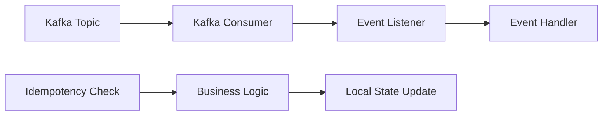

### Event Ordering

Events 依下列方式排序：

1. **Timestamp**: Event 中的 `occurredOn` 欄位
2. **Version**: Aggregate version 號碼
3. **Sequence**: Kafka partition 排序

### Event Idempotency

所有 event handlers 必須是 idempotent：

```java
@Component
public class OrderSubmittedEventHandler {
    
    @Transactional
    public void handle(OrderSubmittedEvent event) {
        // 1. Check if already processed
        if (processedEventRepository.existsByEventId(event.getEventId())) {
            return; // Already processed, skip
        }
        
        // 2. Process event
        inventoryService.reserveItems(event.orderId(), event.items());
        
        // 3. Mark as processed
        processedEventRepository.save(
            new ProcessedEvent(event.getEventId(), Instant.now())
        );
    }
}
```

---

## Data Flow Optimization

### 1. Batch Processing

用於大量 events：

```java
@Component
public class BatchEventProcessor {
    
    @Scheduled(fixedRate = 5000) // Every 5 seconds
    public void processBatch() {
        List<DomainEvent> events = eventQueue.pollBatch(100);
        
        // Process events in batch
        events.stream()
            .collect(Collectors.groupingBy(DomainEvent::getEventType))
            .forEach(this::processBatchByType);
    }
}
```

### 2. Parallel Processing

用於獨立 events：

```java
@Component
public class ParallelEventProcessor {

    @Async("eventExecutor")
    public CompletableFuture<Void> processEvent(DomainEvent event) {
        eventHandler.handle(event);
        return CompletableFuture.completedFuture(null);
    }
}
```

### 3. Circuit Breaker

用於具彈性的 event 處理：

```java
@Component
public class ResilientEventHandler {
    
    @CircuitBreaker(name = "eventProcessing", fallbackMethod = "fallback")
    @Retry(name = "eventProcessing", maxAttempts = 3)
    public void handle(DomainEvent event) {
        // Process event with circuit breaker protection
    }
    
    public void fallback(DomainEvent event, Exception ex) {
        // Send to dead letter queue
        deadLetterService.send(event, ex);
    }
}
```

---

## Data Flow Monitoring

### Key Metrics

- **Event Lag**: Event 發布和消費之間的時間
- **Processing Time**: 處理每個 event 的時間
- **Error Rate**: 失敗的 event 處理百分比
- **Throughput**: 每秒處理的 events
- **Queue Depth**: 待處理 events 的數量

### Monitoring Tools

- **Kafka Metrics**: Consumer lag、partition offset
- **Application Metrics**: 處理時間、錯誤計數
- **Distributed Tracing**: X-Ray 用於端到端流程
- **Dashboards**: CloudWatch、Grafana

---

## Related Documentation

- [Information Viewpoint Overview](overview.md)
- [Domain Models](domain-models.md)
- [Data Ownership](data-ownership.md)
- [Domain Events Catalog](../../api/events/README.md)
- [Concurrency Viewpoint](../concurrency/overview.md)

### Diagrams

- [Order Processing Flow](../../diagrams/generated/information/order-processing-flow.png)
- [Event-Driven Data Sync](../../diagrams/generated/information/event-data-sync.png)
- [Customer Registration Flow](../../diagrams/generated/information/customer-registration-flow.png)

---

**Document Status**: Active
**Last Review**: 2025-10-23
**Next Review**: 2026-01-23
**Owner**: Architecture Team
