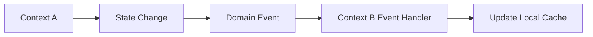
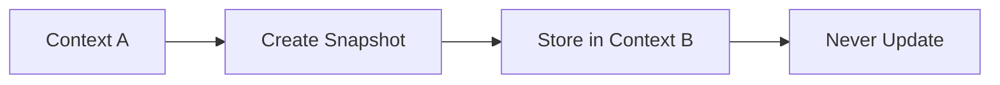
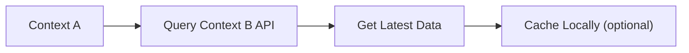

# Data Ownership

## 概述

本文件定義了系統中哪個 bounded context 擁有哪些資料。明確的資料所有權對於維護一致性、避免衝突以及實現 bounded contexts 的獨立演進至關重要。

## 所有權原則

### 1. 單一真相來源

每筆資料都有唯一的權威來源:

- **單一所有者**: 只有一個 bounded context 可以建立、更新或刪除一筆資料
- **唯讀存取**: 其他 contexts 可以透過事件或 APIs 讀取資料,但不能修改
- **不共享表格**: Contexts 不共享資料庫表格或 schemas

### 2. Bounded Context 自主性

每個 context 負責自己的資料:

- **獨立資料庫**: 每個 context 有自己的資料庫 schema
- **不直接存取資料庫**: Contexts 不查詢其他 contexts 的資料庫
- **事件驅動整合**: Contexts 透過 domain events 溝通
- **資料複製**: Contexts 可能快取來自其他 contexts 的資料以提升效能

### 3. 最終一致性

跨 context 的一致性是非同步達成的:

- **Domain Events**: 狀態變更透過事件溝通
- **Event Handlers**: Contexts 根據事件更新本地資料
- **補償**: 失敗的操作會被補償,而非回滾
- **冪等性**: Event handlers 是冪等的以處理重複事件

## 資料所有權矩陣

| 資料類型 | 所有者 Context | 讀取存取 | 寫入存取 | 備註 |
|-----------|--------------|-------------|--------------|-------|
| **Customer Profile** | Customer | 所有 contexts | 僅 Customer | 其他 contexts 快取 customer name/email |
| **Customer Address** | Customer | Order, Shipping | 僅 Customer | Shipping context 快取用於配送 |
| **Customer Preferences** | Customer | Notification, Promotion | 僅 Customer | 用於個人化 |
| **Order Details** | Order | Customer, Shipping, Payment | 僅 Order | Order status 透過事件分享 |
| **Order Items** | Order | Inventory, Shipping | 僅 Order | Product details 從 Product context 快取 |
| **Product Catalog** | Product | 所有 contexts | Product, Seller | 其他 contexts 快取 product name/price |
| **Product Specifications** | Product | Review, Order | 僅 Product | 快取用於顯示 |
| **Inventory Levels** | Inventory | Product, Order | 僅 Inventory | Stock levels 透過事件分享 |
| **Inventory Reservations** | Inventory | Order | 僅 Inventory | 訂單提交時建立 |
| **Payment Transactions** | Payment | Order, Customer | 僅 Payment | Payment status 透過事件分享 |
| **Payment Methods** | Payment | Customer | 僅 Payment | 安全儲存在 Payment context |
| **Shipment Tracking** | Shipping | Order, Customer | 僅 Shipping | Tracking updates 透過事件分享 |
| **Delivery Routes** | Delivery | Shipping | 僅 Delivery | 配送的最佳化路線 |
| **Promotions** | Promotion | Order, Pricing | 僅 Promotion | Active promotions 透過事件分享 |
| **Coupon Codes** | Promotion | Order | 僅 Promotion | 訂單提交時驗證 |
| **Product Reviews** | Review | Product, Customer | 僅 Review | Review summaries 透過事件分享 |
| **Review Ratings** | Review | Product | 僅 Review | Aggregated ratings 透過事件分享 |
| **Shopping Cart** | Shopping Cart | Customer, Order | 僅 Shopping Cart | 結帳時轉換為訂單 |
| **Cart Items** | Shopping Cart | Product | 僅 Shopping Cart | Product details 已快取 |
| **Pricing Rules** | Pricing | Order, Product | 僅 Pricing | 按需計算價格 |
| **Seller Profiles** | Seller | Product, Order | 僅 Seller | Seller info 在 Product context 中快取 |
| **Notification Templates** | Notification | 所有 contexts | 僅 Notification | 用於所有通知的模板 |
| **Notification Logs** | Notification | Customer | 僅 Notification | 已發送通知的稽核軌跡 |

## Context 特定所有權詳情

### Customer Context

**擁有**:

- Customer profiles (name, email, phone)
- Customer addresses (billing, shipping)
- Customer preferences (language, currency, notifications)
- Customer membership levels
- Customer authentication credentials

**責任**:

- 驗證客戶資訊
- 管理客戶生命週期 (registration, suspension, deletion)
- 為其他 contexts 發佈 customer events
- 維護客戶稽核軌跡

**透過 Events 分享的資料**:

- `CustomerRegisteredEvent` → 所有 contexts
- `CustomerProfileUpdatedEvent` → Order, Notification
- `CustomerAddressAddedEvent` → Order, Shipping
- `CustomerMembershipUpgradedEvent` → Promotion, Pricing

**被其他 Contexts 快取的資料**:

- Customer name (Order, Review, Notification)
- Customer email (Notification, Payment)
- Shipping address (Order, Shipping)

---

### Order Context

**擁有**:

- Order details (order date, status, totals)
- Order items (product references, quantities, prices)
- Order addresses (shipping, billing - snapshots)
- Order history and audit trail

**責任**:

- 驗證訂單業務規則
- 計算訂單總額
- 管理訂單生命週期 (creation, submission, fulfillment, cancellation)
- 協調訂單處理工作流程
- 為其他 contexts 發佈 order events

**透過 Events 分享的資料**:

- `OrderCreatedEvent` → Customer, Inventory
- `OrderSubmittedEvent` → Inventory, Payment, Notification
- `OrderConfirmedEvent` → Shipping, Customer
- `OrderCancelledEvent` → Inventory, Payment, Customer

**從其他 Contexts 快取的資料**:

- Product name and price (從 Product context)
- Customer name and email (從 Customer context)
- Promotion details (從 Promotion context)

**資料同步**:

- Product prices 在訂單建立時擷取快照
- Customer addresses 在訂單提交時擷取快照
- Inventory reservations 透過事件建立

---

### Product Context

**擁有**:

- Product catalog (name, description, category)
- Product specifications and attributes
- Product images and media
- Product pricing (base prices)
- Product status (active, discontinued)

**責任**:

- 維護產品目錄
- 驗證產品資訊
- 管理產品生命週期
- 為其他 contexts 發佈 product events
- 提供產品搜尋和篩選

**透過 Events 分享的資料**:

- `ProductCreatedEvent` → Inventory, Pricing
- `ProductUpdatedEvent` → Order, Shopping Cart
- `ProductPriceChangedEvent` → Pricing, Order
- `ProductDiscontinuedEvent` → Inventory, Order

**被其他 Contexts 快取的資料**:

- Product name (Order, Shopping Cart, Review)
- Product price (Order, Shopping Cart, Pricing)
- Product images (Order, Shopping Cart)

**資料同步**:

- Product availability 取決於 Inventory context
- Product reviews 由 Review context 管理
- Product pricing rules 由 Pricing context 管理

---

### Inventory Context

**擁有**:

- Inventory levels (on-hand, reserved, available)
- Inventory reservations (for pending orders)
- Warehouse locations
- Reorder points and quantities
- Inventory movements (receipts, adjustments)

**責任**:

- 追蹤跨倉庫的庫存水準
- 為訂單保留庫存
- 釋放過期的保留
- 觸發低庫存警報
- 管理庫存補貨

**透過 Events 分享的資料**:

- `InventoryReservedEvent` → Order
- `InventoryReservationExpiredEvent` → Order
- `InventoryFulfilledEvent` → Order, Shipping
- `LowStockAlertEvent` → Product, Seller

**被其他 Contexts 快取的資料**:

- Available quantity (Product context 用於顯示)
- Reservation status (Order context 用於追蹤)

**資料同步**:

- Reservations 在訂單提交時建立
- Reservations 在 15 分鐘後過期(若未履行)
- Inventory 在訂單出貨時減少

---

### Payment Context

**擁有**:

- Payment transactions (authorizations, captures, refunds)
- Payment methods (credit cards, PayPal, etc.)
- Payment status and history
- Payment gateway integration details
- Sensitive payment data (PCI-compliant storage)

**責任**:

- 安全處理付款
- 管理付款方式
- 處理付款失敗和重試
- 與 payment gateways 整合
- 維護 PCI-DSS 合規性

**透過 Events 分享的資料**:

- `PaymentAuthorizedEvent` → Order
- `PaymentCapturedEvent` → Order, Customer
- `PaymentFailedEvent` → Order, Notification
- `PaymentRefundedEvent` → Order, Customer

**被其他 Contexts 快取的資料**:

- Payment status (Order context)
- Last 4 digits of card (Customer context 用於顯示)

**資料同步**:

- Payment 在訂單提交時啟動
- Payment 在訂單確認時擷取
- Refunds 在訂單取消時處理

**安全考量**:

- 完整卡號永不儲存
- Payment tokens 用於定期付款
- 所有 payment data 在靜態和傳輸中都加密

---

### Shopping Cart Context

**擁有**:

- Active shopping carts
- Cart items (product references, quantities)
- Cart expiration and abandonment tracking
- Cart conversion to orders

**責任**:

- 管理購物車生命週期
- 計算購物車總額
- 處理購物車放棄
- 將購物車轉換為訂單
- 追蹤購物車分析

**透過 Events 分享的資料**:

- `ItemAddedToCartEvent` → Product, Pricing
- `CartAbandonedEvent` → Notification, Promotion
- `CartConvertedToOrderEvent` → Order

**從其他 Contexts 快取的資料**:

- Product name and price (從 Product context)
- Customer information (從 Customer context)
- Promotion details (從 Promotion context)

**資料同步**:

- Product prices 在載入購物車時刷新
- Carts 在 7 天不活動後過期
- Cart 在轉換為訂單後刪除

---

### Promotion Context

**擁有**:

- Promotion campaigns and rules
- Discount calculations
- Coupon codes and usage tracking
- Promotion eligibility rules
- Promotion analytics

**責任**:

- 定義促銷規則
- 驗證優惠券代碼
- 計算折扣
- 追蹤促銷使用情況
- 管理促銷生命週期

**透過 Events 分享的資料**:

- `PromotionActivatedEvent` → Order, Pricing
- `PromotionExpiredEvent` → Order, Pricing
- `PromotionAppliedEvent` → Order, Customer

**被其他 Contexts 快取的資料**:

- Active promotions (Order, Pricing contexts)
- Coupon code validity (Order context)

**資料同步**:

- Promotions 在訂單提交時套用
- Usage counts 在促銷套用時更新
- Expired promotions 自動停用

---

### Review Context

**擁有**:

- Product reviews and ratings
- Review comments and replies
- Review moderation status
- Review images and media
- Review analytics (average ratings, counts)

**責任**:

- 管理評論生命週期
- 審核評論
- 計算總合評分
- 發佈 review events
- 防止評論詐欺

**透過 Events 分享的資料**:

- `ReviewSubmittedEvent` → Product, Customer
- `ReviewApprovedEvent` → Product
- `ReviewRejectedEvent` → Customer

**被其他 Contexts 快取的資料**:

- Average rating (Product context)
- Review count (Product context)

**資料同步**:

- Reviews 連結到已驗證的購買
- Aggregate ratings 在評論批准時更新
- Review summaries 在 Product context 中快取

---

### Notification Context

**擁有**:

- Notification templates
- Notification logs and history
- Notification preferences
- Delivery status tracking
- Notification analytics

**責任**:

- 發送通知 (email, SMS, push)
- 管理通知模板
- 追蹤遞送狀態
- 處理通知失敗
- 尊重使用者偏好

**透過 Events 分享的資料**:

- `NotificationSentEvent` → Customer
- `NotificationFailedEvent` → Customer

**從其他 Contexts 快取的資料**:

- Customer email and phone (從 Customer context)
- Customer notification preferences (從 Customer context)
- Order details (從 Order context)

**資料同步**:

- Notifications 由來自其他 contexts 的事件觸發
- Delivery status 非同步追蹤
- Failed notifications 以 exponential backoff 重試

---

## 資料複製策略

### 何時複製資料

在以下情況下資料複製是可接受的:

1. **效能**: 避免跨 context 查詢可改善回應時間
2. **可用性**: 本地資料確保 context 在其他失敗時仍可用
3. **自主性**: Contexts 可以獨立運作
4. **讀取密集**: 資料頻繁讀取但很少更新

### 要複製什麼

常見的複製資料:

- **參考資料**: Customer name, product name (用於顯示)
- **快照**: Order items 包含訂單時的 product details
- **總合**: Review ratings, order counts (用於分析)
- **查找資料**: Category names, status labels

### 不要複製什麼

永不複製:

- **敏感資料**: Payment details, passwords
- **頻繁變更的資料**: Inventory levels, prices (改用事件)
- **大型資料**: Product images, documents (使用參照)
- **交易資料**: Payment transactions, order history

### 同步模式

#### 1. 事件驅動同步

- **使用案例**: Product price changes, customer profile updates
- **一致性**: 最終一致性
- **延遲**: 數秒到數分鐘

#### 2. Snapshot Pattern

- **使用案例**: Order items with product details
- **一致性**: 時間點一致性
- **延遲**: 立即 (不需要同步)

#### 3. Query Pattern

- **使用案例**: Real-time product availability check
- **一致性**: 強一致性
- **延遲**: 毫秒 (同步呼叫)

## 衝突解決

### 衝突類型

1. **寫入衝突**: 兩個 contexts 試圖修改相同資料
   - **解決方案**: 只有所有者 context 可以寫入 (設計上防止)

2. **讀取衝突**: 快取的資料過時
   - **解決方案**: 接受最終一致性或查詢所有者 context

3. **事件順序**: 事件順序錯亂到達
   - **解決方案**: 使用事件時間戳記和版本號碼

### 衝突預防

- **明確所有權**: 只有所有者 context 可以修改資料
- **Event Sourcing**: Events 提供稽核軌跡和順序
- **冪等 Handlers**: 重複事件不會造成問題
- **樂觀鎖定**: 版本號碼防止並行更新

## 資料治理

### 資料品質

- **所有者責任**: 所有者 context 確保資料品質
- **驗證**: API 和 domain layers 的輸入驗證
- **稽核軌跡**: Domain events 提供完整歷史
- **資料清理**: 定期清理過時的快取資料

### 資料隱私

- **GDPR 合規**: Customer context 處理資料主體請求
- **資料最小化**: 只快取必要的資料
- **資料保留**: 定義每個 context 的保留政策
- **資料刪除**: 透過事件串聯刪除

### 資料安全

- **加密**: 敏感資料在靜態和傳輸中加密
- **存取控制**: Context 邊界強制執行存取控制
- **稽核記錄**: 所有資料存取都被記錄
- **PCI 合規**: Payment context 維護 PCI-DSS 合規性

## 相關文件

- [Information Viewpoint Overview](overview.md)
- [Domain Models](domain-models.md)
- [Data Flow](data-flow.md)
- [Security Perspective](../../perspectives/security/overview.md)

---

**Document Status**: Active
**Last Review**: 2025-10-23
**Next Review**: 2026-01-23
**Owner**: Architecture Team
