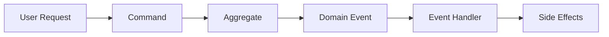
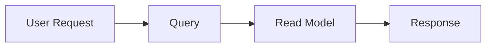
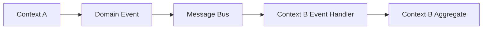

# Information Viewpoint

## Overview

Information Viewpoint 描述系統如何儲存、管理和分發資訊。它專注於系統內資料的結構、所有權、生命週期和品質，確保資訊準確、一致且對需要的人可存取。

### Purpose

此 viewpoint 處理以下關鍵關注點：

- **Data Structure**：資訊如何組織和結構化
- **Data Ownership**：哪些 bounded contexts 擁有哪些資料
- **Data Consistency**：如何在分散式 contexts 之間維護一致性
- **Data Flow**：資訊如何在系統中流動
- **Data Quality**：如何確保資料完整性和品質
- **Data Lifecycle**：資料如何建立、更新、歸檔和刪除

### Scope

此 viewpoint 涵蓋：

- 每個 bounded context 內的 domain models 和 entity 關係
- Value objects 及其驗證規則
- Aggregate 邊界和一致性保證
- Domain events 作為資料同步的主要機制
- 資料所有權和最終一致性策略
- Bounded contexts 之間的資料流模式

## Key Principles

### 1. Domain-Driven Design (DDD)

我們的資訊架構基於 DDD tactical patterns：

- **Aggregates**：將相關 entities 分組的一致性邊界
- **Entities**：具有唯一身份且隨時間變化的物件
- **Value Objects**：由其屬性定義的不可變物件
- **Domain Events**：代表狀態變更並實現最終一致性

### 2. Bounded Context Ownership

每個 bounded context 擁有自己的資料：

- **Single Source of Truth**：每個資料都有一個權威來源
- **No Shared Databases**：Contexts 不共享 database tables
- **Event-Driven Integration**：Contexts 透過 domain events 通訊
- **Eventual Consistency**：跨 context 一致性非同步實現

### 3. Event Sourcing Principles

雖然不使用完整的 event sourcing，我們應用關鍵原則：

- **Domain Events**：所有重要的狀態變更都會產生 events
- **Event Store**：Events 被持久化以供稽核和重播
- **Event-Driven Architecture**：Events 驅動跨 context 工作流
- **Immutable Events**：Events 在建立後永不修改

### 4. Data Quality

我們透過以下方式確保資料品質：

- **Validation at Boundaries**：在 API 和 domain layers 進行輸入驗證
- **Invariant Enforcement**：Aggregates 執行業務規則
- **Type Safety**：Value objects 提供類型安全的 domain primitives
- **Audit Trail**：Domain events 提供完整的稽核歷史

## Information Architecture

### Bounded Contexts and Data Ownership

我們的系統組織成 13 個 bounded contexts，每個擁有特定的資料：

| Bounded Context | Primary Data Owned | Key Aggregates |
|----------------|-------------------|----------------|
| Customer | Customer profiles, preferences | Customer |
| Order | Order details, order items | Order |
| Product | Product catalog, specifications | Product |
| Inventory | Stock levels, reservations | InventoryItem |
| Payment | Payment transactions, methods | Payment |
| Shipping | Shipment tracking, addresses | Shipment |
| Promotion | Discount rules, campaigns | Promotion |
| Notification | Notification templates, logs | Notification |
| Review | Product reviews, ratings | Review |
| Shopping Cart | Active carts, cart items | ShoppingCart |
| Pricing | Pricing rules, calculations | PriceList |
| Seller | Seller profiles, products | Seller |
| Delivery | Delivery schedules, routes | Delivery |

### Data Consistency Model

#### Strong Consistency (Within Aggregate)

- **Scope**：在單一 aggregate 邊界內
- **Mechanism**：ACID transactions
- **Guarantee**：立即一致性
- **Example**：將項目新增到訂單中維持訂單總額一致性

#### Eventual Consistency (Across Contexts)

- **Scope**：不同 bounded contexts 之間
- **Mechanism**：Domain events + event handlers
- **Guarantee**：非同步實現一致性
- **Example**：訂單下單透過 events 觸發庫存保留

### Data Flow Patterns

#### 1. Command-Event Pattern



- Commands 修改 aggregate state
- Aggregates 收集 domain events
- Application services 發布 events
- 其他 contexts 中的 event handlers 做出反應

#### 2. Query Pattern



- 查詢從優化的 read models 讀取
- 查詢沒有副作用
- 複雜查詢的 CQRS pattern

#### 3. Integration Pattern



- 透過 events 進行非同步通訊
- Contexts 之間鬆耦合
- 對暫時性故障具有彈性

## Data Management Strategies

### 1. Aggregate Design

**Principles**：

- 保持 aggregates 小而專注
- 每個 transaction 一個 aggregate
- 僅透過 ID 引用其他 aggregates
- 在 aggregate 邊界內執行 invariants

**Example**：Order Aggregate

```java
@AggregateRoot
public class Order {
    private OrderId id;
    private CustomerId customerId;  // Reference by ID
    private List<OrderItem> items;  // Owned entities
    private Money totalAmount;      // Calculated value
    private OrderStatus status;

    // Business methods enforce invariants
    public void submit() {
        validateOrderSubmission();
        this.status = OrderStatus.PENDING;
        collectEvent(OrderSubmittedEvent.create(...));
    }
}
```

### 2. Value Object Design

**Principles**：

- 設計上不可變（使用 Records）
- 在 constructor 中驗證
- 提供有意義的 domain types
- 取代 primitive obsession

**Example**：Email Value Object

```java
public record Email(String value) {
    public Email {
        if (value == null || !value.matches("^[A-Za-z0-9+_.-]+@(.+)$")) {
            throw new IllegalArgumentException("Invalid email format");
        }
    }
}
```

### 3. Domain Event Design

**Principles**：

- 不可變 records
- 過去式命名
- 包含所有必要的資料
- 包含 event metadata

**Example**：OrderSubmittedEvent

```java
public record OrderSubmittedEvent(
    OrderId orderId,
    CustomerId customerId,
    Money totalAmount,
    UUID eventId,
    LocalDateTime occurredOn
) implements DomainEvent {
    // Factory method with automatic metadata
    public static OrderSubmittedEvent create(...) { ... }
}
```

### 4. Repository Pattern

**Principles**：

- 介面在 domain layer
- 實現在 infrastructure layer
- 回傳 domain objects，而非 entities
- 每個 aggregate root 一個 repository

**Example**：OrderRepository

```java
// Domain layer interface
public interface OrderRepository {
    Optional<Order> findById(OrderId orderId);
    Order save(Order order);
}

// Infrastructure layer implementation
@Repository
public class JpaOrderRepository implements OrderRepository {
    // JPA implementation details
}
```

## Data Quality and Integrity

### Validation Layers

1. **API Layer**：使用 Bean Validation 進行輸入驗證
2. **Domain Layer**：在 aggregates 中進行業務規則驗證
3. **Database Layer**：約束和外鍵

### Audit Trail

- **Domain Events**：狀態變更的完整歷史
- **Event Store**：持久化的 event 日誌
- **Audit Queries**：從 events 重建 entity 歷史

### Data Migration

- **Flyway**：Database schema 版本控制
- **Event Upcasting**：處理 event schema 演進
- **Backward Compatibility**：在遷移期間維護相容性

## Technology Stack

### Persistence

- **Primary Database**：PostgreSQL（production）
- **Development Database**：H2（in-memory）
- **ORM**：Spring Data JPA + Hibernate
- **Schema Migration**：Flyway

### Event Store

- **Development**：基於 JPA 的 event store
- **Production**：EventStore DB（建議）
- **Alternative**：In-memory（僅測試）

### Caching

- **Distributed Cache**：Redis (ElastiCache)
- **Application Cache**：Spring Cache abstraction
- **Cache Strategy**：Cache-aside pattern

### Messaging

- **Event Bus**：Apache Kafka (MSK)
- **Message Format**：JSON
- **Delivery Guarantee**：At-least-once

## Related Documentation

### Detailed Information Models

- [Domain Models](domain-models.md) - 每個 context 的 Entity 關係
- [Data Ownership](data-ownership.md) - Context 所有權和邊界
- [Data Flow](data-flow.md) - 資訊流模式
- [Event Catalog](../../api/events/README.md) - 完整的 event 參考

### Related Viewpoints

- [Functional Viewpoint](../functional/overview.md) - 系統能力
- [Development Viewpoint](../development/overview.md) - 程式碼組織
- [Deployment Viewpoint](../deployment/overview.md) - Database 部署

### Related Perspectives

- [Security Perspective](../../perspectives/security/overview.md) - 資料保護
- [Performance Perspective](../../perspectives/performance/overview.md) - 查詢優化
- [Evolution Perspective](../../perspectives/evolution/overview.md) - Schema 演進

## Diagrams

### Entity Relationship Diagrams

- [Customer Context ER Diagram](../../diagrams/generated/information/customer-context-er.png)
- [Order Context ER Diagram](../../diagrams/generated/information/order-context-er.png)
- [Product Context ER Diagram](../../diagrams/generated/information/product-context-er.png)

### Data Flow Diagrams

- [Order Processing Data Flow](../../diagrams/generated/information/order-processing-flow.png)
- [Event-Driven Data Synchronization](../../diagrams/generated/information/event-data-sync.png)

### Aggregate Diagrams

- [Order Aggregate Structure](../../diagrams/generated/information/order-aggregate.png)
- [Customer Aggregate Structure](../../diagrams/generated/information/customer-aggregate.png)

---

**Document Status**: Active
**Last Review**: 2025-10-23
**Next Review**: 2026-01-23
**Owner**: Architecture Team
