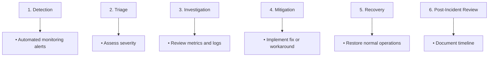

# Operational Viewpoint Overview

> **Viewpoint**: Operational
> **Purpose**: 定義 E-Commerce Platform 在生產環境中如何營運、監控和維護
> **Audience**: Operations Team, DevOps Engineers, SRE Team, Support Team

## 介紹

Operational Viewpoint 描述營運模型、監控策略、事件管理程序,以及維持 E-Commerce Platform 在生產環境中可靠且高效運作所需的維護活動。

### 目的

此觀點處理以下營運關注點:

- **監控和可觀察性**: 我們如何知道系統是健康的?
- **事件管理**: 我們如何偵測、回應和解決事件?
- **備份和復原**: 我們如何保護和還原資料?
- **維護和更新**: 我們如何執行例行維護和更新?
- **容量管理**: 我們如何確保足夠的資源?
- **效能管理**: 我們如何維持可接受的效能水準?

### 範圍

此觀點涵蓋:

- Production 環境營運
- 監控和告警基礎設施
- 事件回應程序
- 備份和災難復原
- 例行維護活動
- 容量規劃和擴展
- 效能最佳化
- 安全營運

## 營運模型

### 營運責任

```text
┌─────────────────────────────────────────────────────────────┐
│                    Operational Ownership                     │
├─────────────────────────────────────────────────────────────┤
│                                                               │
│  ┌──────────────────┐  ┌──────────────────┐                │
│  │   SRE Team       │  │  DevOps Team     │                │
│  ├──────────────────┤  ├──────────────────┤                │
│  │ • Monitoring     │  │ • CI/CD Pipeline │                │
│  │ • Alerting       │  │ • Infrastructure │                │
│  │ • Incident Mgmt  │  │ • Deployments    │                │
│  │ • Performance    │  │ • Automation     │                │
│  └──────────────────┘  └──────────────────┘                │
│                                                               │
│  ┌──────────────────┐  ┌──────────────────┐                │
│  │  Support Team    │  │  Dev Team        │                │
│  ├──────────────────┤  ├──────────────────┤                │
│  │ • User Issues    │  │ • Bug Fixes      │                │
│  │ • Escalation     │  │ • Feature Dev    │                │
│  │ • Documentation  │  │ • Code Quality   │                │
│  │ • Training       │  │ • Testing        │                │
│  └──────────────────┘  └──────────────────┘                │
│                                                               │
└─────────────────────────────────────────────────────────────┘
```

### 團隊責任

#### SRE Team

- **主要焦點**: 系統可靠性和效能
- **責任**:
  - 監控系統健康和效能
  - 回應事件和中斷
  - 執行事後審查
  - 實作可靠性改進
  - 定義和追蹤 SLIs/SLOs/SLAs
  - 容量規劃和預測
  - 效能最佳化

#### DevOps Team

- **主要焦點**: 基礎設施和部署自動化
- **責任**:
  - 管理 AWS 基礎設施 (EKS, RDS, ElastiCache, MSK)
  - 維護 CI/CD pipelines
  - 自動化部署流程
  - 實作 infrastructure as code (CDK)
  - 管理 secrets 和設定
  - 安全修補和更新

#### Support Team

- **主要焦點**: 使用者支援和問題解決
- **責任**:
  - 處理使用者回報的問題
  - 升級技術問題到 SRE/Dev 團隊
  - 維護知識庫
  - 提供使用者培訓
  - 追蹤支援指標

#### Development Team

- **主要焦點**: 功能開發和 bug 修復
- **責任**:
  - 開發新功能
  - 修復 bugs 和問題
  - 參與 on-call 輪值
  - 回應生產事件
  - 實作監控和記錄
  - 為新功能撰寫 runbooks

## Service Level Objectives (SLOs)

### 可用性 SLOs

| 服務 | 目標可用性 | 測量時間窗口 | 停機預算 |
|---------|-------------------|-------------------|-----------------|
| Order Service | 99.9% | 30 days | 43.2 minutes/month |
| Customer Service | 99.9% | 30 days | 43.2 minutes/month |
| Product Service | 99.95% | 30 days | 21.6 minutes/month |
| Payment Service | 99.99% | 30 days | 4.32 minutes/month |
| Search Service | 99.5% | 30 days | 3.6 hours/month |
| Overall Platform | 99.9% | 30 days | 43.2 minutes/month |

### 效能 SLOs

| 指標 | 目標 | 測量 | 百分位數 |
|--------|--------|-------------|------------|
| API Response Time | < 500ms | Per endpoint | p95 |
| Page Load Time | < 2s | Full page load | p95 |
| Database Query Time | < 100ms | Per query | p95 |
| Cache Hit Rate | > 90% | Redis operations | Average |
| Event Processing Latency | < 1s | Kafka to handler | p95 |

### 錯誤率 SLOs

| 服務 | 目標錯誤率 | 測量 |
|---------|------------------|-------------|
| API Endpoints | < 1% | 4xx + 5xx errors |
| Background Jobs | < 0.5% | Failed jobs |
| Event Processing | < 0.1% | Failed events |
| Payment Processing | < 0.01% | Failed transactions |

## 監控策略

### 可觀察性的三大支柱

#### 1. Metrics (定量資料)

**基礎設施 Metrics**:

- CPU utilization (target: < 70%)
- Memory usage (target: < 80%)
- Disk I/O (target: < 80%)
- Network throughput
- Pod/container health

**應用程式 Metrics**:

- Request rate (requests/second)
- Error rate (errors/second)
- Response time (p50, p95, p99)
- Active connections
- Queue depth

**業務 Metrics**:

- Orders per minute
- Revenue per hour
- Active users
- Conversion rate
- Cart abandonment rate

#### 2. Logs (事件資料)

**Log Levels**:

- **ERROR**: 需要立即關注的系統錯誤
- **WARN**: 潛在問題或效能降級
- **INFO**: 重要業務事件
- **DEBUG**: 詳細診斷資訊

**Log Aggregation**:

- 使用 CloudWatch Logs 的集中式記錄
- 結構化 JSON logging 格式
- Log retention: 30 days (hot), 1 year (cold)
- 關鍵錯誤的即時 log streaming

#### 3. Traces (請求流程)

**Distributed Tracing**:

- AWS X-Ray for request tracing
- 追蹤所有 API 請求
- 追蹤跨服務呼叫
- 識別效能瓶頸
- 關聯 logs 與 traces

### 監控工具

| 工具 | 目的 | 範圍 |
|------|---------|-------|
| CloudWatch | Metrics, logs, alarms | All AWS resources |
| X-Ray | Distributed tracing | Application requests |
| Prometheus | Custom metrics | Application metrics |
| Grafana | Visualization | Dashboards |
| PagerDuty | Incident alerting | On-call notifications |
| Slack | Team notifications | Non-critical alerts |

## 告警策略

### 告警嚴重性等級

#### Critical (P1)

- **回應時間**: 立即 (< 5 minutes)
- **通知**: PagerDuty + Phone + Slack
- **範例**:
  - 服務完全停止
  - Payment processing failures > 5%
  - Database unavailable
  - Data loss detected

#### High (P2)

- **回應時間**: < 15 minutes
- **通知**: PagerDuty + Slack
- **範例**:
  - 服務降級 (error rate > 5%)
  - Response time > 3s (p95)
  - High memory usage (> 90%)
  - Backup failures

#### Medium (P3)

- **回應時間**: < 1 hour
- **通知**: Slack
- **範例**:
  - Error rate > 1%
  - Response time > 1s (p95)
  - Cache hit rate < 80%
  - Disk usage > 80%

#### Low (P4)

- **回應時間**: 下一個工作日
- **通知**: Email + Slack
- **範例**:
  - 非關鍵警告
  - 容量規劃告警
  - Certificate expiration (> 30 days)

### 告警疲勞預防

**最佳實踐**:

- 設定適當的閾值以避免誤報
- 使用告警聚合 (群組相似告警)
- 在維護期間實作告警抑制
- 定期審查和調整告警
- 清晰、可執行的告警訊息
- 在告警中包含 runbook 連結

## 事件管理

### 事件回應流程



### 事件角色

#### Incident Commander

- **責任**:
  - 領導事件回應
  - 協調團隊活動
  - 做出關鍵決策
  - 與利害關係人溝通
  - 確保事後審查

#### Technical Lead

- **責任**:
  - 調查技術問題
  - 實作修復
  - 與工程師協調
  - 提供技術指導

#### Communications Lead

- **責任**:
  - 更新狀態頁面
  - 與客戶溝通
  - 通知內部利害關係人
  - 記錄事件時間軸

### 事件溝通

**內部溝通**:

- 為每個事件建立專屬 Slack channel
- 定期狀態更新 (每 15-30 分鐘)
- 清晰、簡潔的更新
- 包含影響評估

**外部溝通**:

- 更新狀態頁面 (status.ecommerce-platform.com)
- 重大事件的 email 通知
- 如需要,在社群媒體更新
- 事後摘要

## 維護時段

### 計劃性維護

**定期維護時段**:

- **頻率**: 每月
- **持續時間**: 2 hours
- **時間**: Sunday 2:00 AM - 4:00 AM EST
- **通知**: 7 days advance notice

**活動**:

- 安全修補
- 資料庫維護
- 基礎設施更新
- 效能最佳化
- 備份驗證

**緊急維護**:

- 關鍵安全修補
- 資料損毀修復
- 服務還原
- 最少提前通知 (如可能)

### 變更管理

**變更類別**:

1. **Standard Changes** (預先核准)
   - 例行部署
   - 設定更新
   - 擴展操作
   - 不需要核准

2. **Normal Changes** (需要核准)
   - 基礎設施變更
   - 資料庫 schema 變更
   - 主要功能發布
   - 需要變更單和核准

3. **Emergency Changes** (加速)
   - 安全修補
   - 關鍵 bug 修復
   - 服務還原
   - 需要實作後審查

## 容量管理

### 容量規劃流程

**每月審查**:

- 分析資源利用趨勢
- 根據業務指標預測成長
- 識別容量限制
- 規劃基礎設施擴展

**關鍵指標**:

- CPU utilization trends
- Memory usage trends
- Storage growth rate
- Network bandwidth usage
- Database connection pool usage

**擴展觸發條件**:

- CPU > 70% for 15 minutes → Scale up
- Memory > 80% for 15 minutes → Scale up
- Request queue depth > 100 → Scale out
- Response time > 1s (p95) → Investigate and scale

### Auto-Scaling 設定

**EKS Node Groups**:

- Minimum nodes: 3 (one per AZ)
- Maximum nodes: 20
- Target CPU utilization: 70%
- Scale-up cooldown: 3 minutes
- Scale-down cooldown: 10 minutes

**Application Pods**:

- Minimum replicas: 2
- Maximum replicas: 10
- Target CPU: 70%
- Target memory: 80%

## 效能管理

### 效能監控

**關鍵效能指標**:

- API response time (p50, p95, p99)
- Database query performance
- Cache hit rates
- Event processing latency
- Page load times

**效能基準**:

- 建立基準指標
- 追蹤效能趨勢
- 提早識別降級
- 主動最佳化

### 效能最佳化

**定期活動**:

- Database query optimization
- Index analysis and tuning
- Cache strategy review
- Code profiling
- Load testing

**效能測試**:

- 每週 load tests
- 每月 stress tests
- 每季 capacity tests
- Pre-release performance validation

## 安全營運

### 安全監控

**安全指標**:

- Failed authentication attempts
- Unauthorized access attempts
- Suspicious API activity
- Vulnerability scan results
- Security patch compliance

**安全告警**:

- Multiple failed login attempts
- Unusual API access patterns
- Privilege escalation attempts
- Data exfiltration indicators
- Malware detection

### 安全事件回應

**流程**:

1. 偵測安全事件
2. 遏制威脅
3. 調查範圍和影響
4. 根除威脅
5. 還原系統
6. 事後分析

**安全團隊聯絡**:

- Security Lead: <security@ecommerce-platform.com>
- Incident Response: <security-incident@ecommerce-platform.com>
- 24/7 Security Hotline: +1-XXX-XXX-XXXX

## 營運指標和 KPIs

### 系統可靠性指標

| 指標 | 目標 | 當前 | 趨勢 |
|--------|--------|---------|-------|
| Uptime | 99.9% | 99.95% | ↑ |
| MTBF (Mean Time Between Failures) | > 720 hours | 850 hours | ↑ |
| MTTR (Mean Time To Recovery) | < 30 minutes | 25 minutes | ↓ |
| Incident Count | < 5/month | 3/month | ↓ |
| Change Success Rate | > 95% | 97% | ↑ |

### 營運效率指標

| 指標 | 目標 | 當前 |
|--------|--------|---------|
| Deployment Frequency | Daily | 2-3/day |
| Deployment Success Rate | > 95% | 98% |
| Rollback Rate | < 5% | 2% |
| Alert Response Time | < 5 min | 3 min |
| Incident Resolution Time | < 2 hours | 1.5 hours |

## 相關文件

- [Monitoring and Alerting](monitoring-alerting.md) - Detailed monitoring configuration
- [Backup and Recovery](backup-recovery.md) - Backup strategies and recovery procedures
- [Operational Procedures](procedures.md) - Step-by-step operational procedures
- [Deployment Viewpoint](../deployment/overview.md) - Infrastructure and deployment details

## 營運聯絡資訊

### On-Call 輪值

**Primary On-Call**: Rotates weekly among SRE team
**Secondary On-Call**: Rotates weekly among DevOps team
**Escalation**: Engineering Manager

### 聯絡資訊

- **Operations Team**: <ops@ecommerce-platform.com>
- **SRE Team**: <sre@ecommerce-platform.com>
- **DevOps Team**: <devops@ecommerce-platform.com>
- **Support Team**: <support@ecommerce-platform.com>
- **Emergency Hotline**: +1-XXX-XXX-XXXX (24/7)

---

**Document Version**: 1.0
**Last Updated**: 2025-10-23
**Owner**: Operations Team
