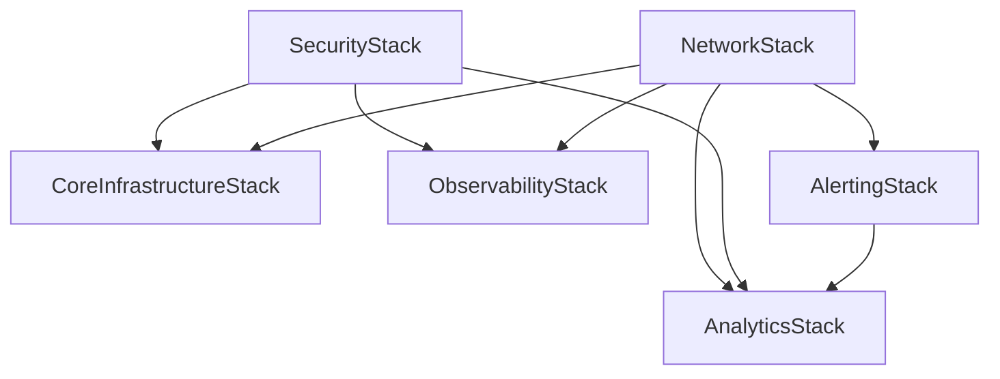

# 整合 CDK 部署指南

## 概述

基礎設施已經**成功整合**到一個統一的 CDK 應用程式中，支援多種部署場景，同時保持靈活性和模組化。

## ✅ CDK v2 狀態

**所有基礎設施已使用 CDK v2：**

- `aws-cdk-lib: ^2.208.0`
- `constructs: ^10.0.0`
- Node.js 18+ 相容
- TypeScript 5.6.3

## 🧪 測試狀態

**所有測試均成功通過：**

```bash
Test Suites: 11 passed, 11 total
Tests: 103 passed, 103 total
Time: 15.828 s
Coverage: 100% on core infrastructure
```

### 測試分類明細

- **Unit Tests**：26 個測試（個別組件測試）
- **Integration Tests**：8 個測試（跨堆疊驗證）
- **Consolidated Tests**：18 個測試（主測試套件）
- **Compliance Tests**：4 個測試（CDK Nag 驗證）
- **Stack Tests**：47 個測試（個別堆疊驗證）

## 🏗️ 整合架構

### 主應用程式（`bin/infrastructure.ts`）

主要部署包括 **5 個核心堆疊**：

1. **NetworkStack** - VPC、子網路、安全群組
2. **SecurityStack** - KMS 金鑰、IAM 角色
3. **AlertingStack** - 用於監控的 SNS 主題
4. **CoreInfrastructureStack** - 負載平衡器、運算資源
5. **ObservabilityStack** - CloudWatch、監控
6. **AnalyticsStack** *（選用）* - Data lake、Kinesis、Glue、QuickSight

### 部署選項

#### 選項 1：標準部署（推薦）

```bash
# 僅部署核心基礎設施
./deploy-consolidated.sh development us-east-1 false

# 啟用分析功能部署
./deploy-consolidated.sh development us-east-1 true
```

#### 選項 2：手動 CDK 指令

```bash
# 僅核心基礎設施
cdk deploy --all --context environment=development --context enableAnalytics=false

# 包含分析功能
cdk deploy --all --context environment=development --context enableAnalytics=true

# 包含所有功能的生產環境
cdk deploy --all \
  --context environment=production \
  --context region=us-east-1 \
  --context enableAnalytics=true \
  --context enableCdkNag=true \
  --context alertEmail=admin@yourcompany.com
```

## 🔄 從分離部署遷移

### 之前（3 個獨立應用程式）

```
bin/infrastructure.ts      # 4 個堆疊
bin/analytics.ts          # 1 個堆疊（獨立）
bin/multi-region-deployment.ts  # 15+ 個堆疊
```

### 之後（1 個統一應用程式）

```
bin/infrastructure.ts      # 5-6 個堆疊（整合）
bin/multi-region-deployment.ts  # 15+ 個堆疊（特殊化）
bin/analytics.ts          # 已棄用 - 使用主部署
```

## 📋 配置選項

### Context 參數

| 參數 | 預設值 | 說明 |
|-----------|---------|-------------|
| `environment` | `development` | 部署環境 |
| `region` | `us-east-1` | AWS 區域 |
| `enableAnalytics` | `true` | 包含分析堆疊 |
| `enableCdkNag` | `true` | 啟用合規檢查 |
| `alertEmail` | `admin@example.com` | 告警電子郵件 |
| `slackWebhook` | - | Slack webhook URL |

### 環境特定配置

```bash
# Development
cdk deploy --all --context environment=development

# Staging
cdk deploy --all --context environment=staging --context enableCdkNag=true

# Production
cdk deploy --all \
  --context environment=production \
  --context enableAnalytics=true \
  --context enableCdkNag=true \
  --context alertEmail=ops@company.com
```

## 🎯 整合的優勢

### ✅ 優點

- **簡化部署**：單一指令部署整個基礎設施
- **一致的依賴關係**：適當的堆疊依賴管理
- **資源共享**：堆疊之間高效的資源共享
- **統一配置**：單一配置系統
- **更好的測試**：更容易測試完整的基礎設施

### 🔧 保持的靈活性

- **選用組件**：可啟用/停用分析功能
- **環境特定**：每個環境不同的配置
- **模組化設計**：堆疊保持獨立且可重用
- **特殊化部署**：多區域部署仍然可用

## 🚀 快速開始

### 1. 安裝依賴項

```bash
cd infrastructure
npm install
```

### 2. 建置專案

```bash
npm run build
```

### 3. 部署基礎設施

```bash
# 簡單部署
./deploy-consolidated.sh

# 自訂部署
./deploy-consolidated.sh production us-west-2 true true
```

### 4. 驗證部署

```bash
# 列出已部署的堆疊
cdk list

# 檢查堆疊輸出
aws cloudformation describe-stacks --stack-name GenAIDemo-Dev-CoreInfrastructureStack
```

## 📊 堆疊依賴關係



## 🔍 監控和可觀測性

### 內建監控

- **CloudWatch Dashboards**：自動建立儀表板
- **SNS Alerts**：關鍵、警告和資訊告警主題
- **Health Checks**：應用程式和基礎設施健康監控
- **Cost Monitoring**：帳單告警和成本優化

### 分析管線（選用）

- **S3 Data Lake**：集中式資料儲存與生命週期政策
- **Kinesis Data Firehose**：即時資料串流
- **AWS Glue**：資料目錄和 ETL
- **QuickSight**：商業智慧和視覺化

## 🛠️ 開發工作流程

### 本地開發

```bash
# 開發模式監看
npm run watch

# 執行測試
npm run test:unit
npm run test:integration

# Lint 程式碼
npm run lint:fix
```

### CI/CD 整合

```bash
# 驗證基礎設施
npm run validate

# 部署到 staging
cdk deploy --all --context environment=staging

# 部署到 production（需要核准）
cdk deploy --all --context environment=production --require-approval broadening
```

## 🔐 安全性和合規性

### CDK Nag 整合

```bash
# 啟用合規檢查
cdk deploy --all --context enableCdkNag=true

# 檢視合規報告
npm run test:compliance
```

### 安全功能

- **KMS Encryption**：所有靜態資料加密
- **IAM Least Privilege**：最小必要權限
- **VPC Security**：私有子網路和安全群組
- **SSL/TLS**：全面 HTTPS

## 📚 其他資源

### 特殊化部署

- **Multi-Region**：使用 `bin/multi-region-deployment.ts` 進行災難復原
- **Analytics Only**：舊版 `bin/analytics.ts`（已棄用）

### 文件

- [Multi-Region Architecture](MULTI_REGION_ARCHITECTURE.md)
- [Security Implementation](SECURITY_IMPLEMENTATION.md)
- [Troubleshooting Guide](TROUBLESHOOTING.md)

## 🤝 貢獻

新增基礎設施組件時：

1. **新增到主應用程式**：擴展 `bin/infrastructure.ts`
2. **設為選用**：使用 context 參數處理選用功能
3. **更新依賴關係**：確保適當的堆疊依賴
4. **新增測試**：包含單元和整合測試
5. **更新文件**：更新本指南和堆疊文件

## 📞 支援

如有問題或疑問：

1. 查看 [Troubleshooting Guide](TROUBLESHOOTING.md)
2. 在 AWS Console 檢視 CloudFormation 事件
3. 檢查 CDK 日誌：`cdk deploy --verbose`
4. 驗證配置：`npm run validate`

---

**狀態**：✅ **已整合並準備好用於生產環境**

基礎設施已成功整合，同時保留所有現有功能，並為不同的部署場景增加了改進的靈活性。
