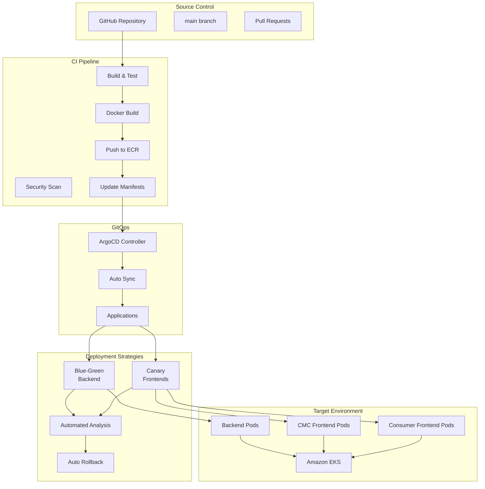
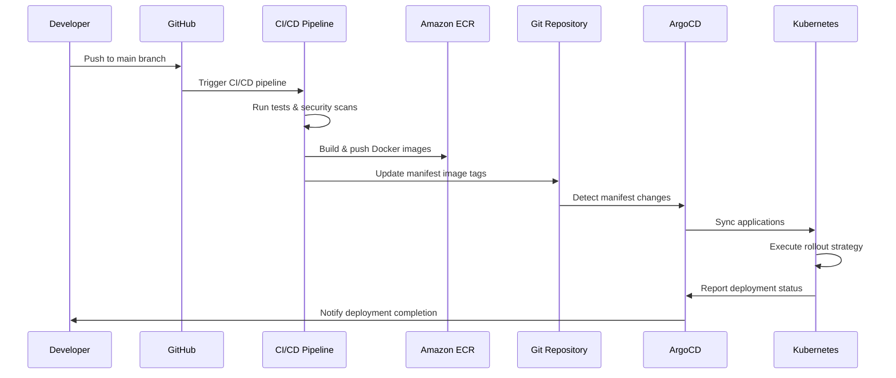

# GitOps with ArgoCD - GenAI Demo

本目錄包含使用 ArgoCD 和 Argo Rollouts 的 GenAI Demo 應用程式 GitOps 配置，用於進階部署策略。

## 🏗️ 架構概覽



## 📁 目錄結構

```
infrastructure/k8s/gitops/
├── applications/                    # ArgoCD Application 定義
│   ├── genai-demo-backend.yaml     # Backend application（Blue-Green）
│   ├── genai-demo-cmc-frontend.yaml # CMC Frontend（Canary）
│   └── genai-demo-consumer-frontend.yaml # Consumer Frontend（Canary）
├── projects/                       # ArgoCD Project 定義
│   └── genai-demo-project.yaml     # 具備 RBAC 和政策的 Project
└── README.md                       # 本文件

infrastructure/k8s/rollouts/
├── backend-blue-green.yaml         # Backend 的 Blue-Green rollout
├── cmc-frontend-canary.yaml        # CMC frontend 的 Canary rollout
└── consumer-frontend-canary.yaml   # Consumer frontend 的 Canary rollout

infrastructure/k8s/argocd/
├── namespace.yaml                  # ArgoCD namespace
├── install.yaml                    # 具備自訂配置的 ArgoCD 安裝
└── argo-rollouts.yaml             # Argo Rollouts 安裝

infrastructure/k8s/monitoring/
└── rollback-automation.yaml       # 基於指標的自動化回滾
```

## 🚀 部署策略

### Backend - Blue-Green Deployment

Backend 使用 Blue-Green 部署策略來實現零停機時間部署：

- **Active Service**：服務生產流量
- **Preview Service**：接收新版本進行測試
- **自動化分析**：監控成功率、回應時間和錯誤率
- **自動提升**：成功分析後提升
- **即時回滾**：偵測到問題時切換回先前版本

```yaml
strategy:
  blueGreen:
    activeService: genai-demo-backend-active
    previewService: genai-demo-backend-preview
    autoPromotionEnabled: false
    prePromotionAnalysis:
      templates:
      - templateName: success-rate
    postPromotionAnalysis:
      templates:
      - templateName: success-rate
```

### Frontends - Canary Deployment

CMC 和 Consumer frontends 都使用 Canary 部署，並漸進式流量轉移：

- **流量進度**：10% → 25% → 50% → 75% → 100%
- **每個步驟分析**：健康指標驗證
- **自動化回滾**：指標閾值違反時觸發
- **ALB 整合**：使用 AWS Application Load Balancer 進行流量路由

```yaml
strategy:
  canary:
    steps:
    - setWeight: 10
    - pause: { duration: 2m }
    - analysis: { templates: [frontend-success-rate] }
    - setWeight: 25
    - pause: { duration: 5m }
    # ... 繼續到 100%
```

## 📊 健康指標與分析

### 分析範本

#### Backend Success Rate Analysis

- **成功率**：≥ 95%
- **回應時間**：≤ 2 秒（95th percentile）
- **錯誤率**：≤ 5%
- **評估**：2.5 分鐘內進行 5 次檢查

#### Frontend Success Rate Analysis

- **成功率**：≥ 95%
- **回應時間**：≤ 1 秒（95th percentile）
- **錯誤率**：≤ 5%
- **評估**：2.5 分鐘內進行 5 次檢查

### 自動化回滾觸發器

系統會在以下情況下自動觸發回滾：

1. **錯誤率飆升**：連續 2+ 次檢查 > 5%
2. **高回應時間**：連續 3+ 次檢查 > 閾值
3. **低成功率**：連續 3+ 次檢查 < 95%
4. **服務不可用性**：健康檢查失敗
5. **分析失敗**：分析範本達到失敗限制

## 🔧 安裝與設定

### 先決條件

- Kubernetes cluster（建議 EKS）
- 已配置 kubectl
- 已安裝 Helm 3.x
- Prometheus 用於指標（選用但建議）

### 快速設定

1. **安裝 ArgoCD 和 Argo Rollouts**：

   ```bash
   ./infrastructure/scripts/setup-argocd.sh install
   ```

2. **驗證安裝**：

   ```bash
   ./infrastructure/scripts/setup-argocd.sh verify
   ```

3. **取得 ArgoCD 密碼**：

   ```bash
   ./infrastructure/scripts/setup-argocd.sh password
   ```

4. **存取 ArgoCD UI**：

   ```bash
   ./infrastructure/scripts/setup-argocd.sh port-forward
   ```

   然後開啟：<https://localhost:8080>

### 手動安裝步驟

1. **建立 Namespaces**：

   ```bash
   kubectl apply -f infrastructure/k8s/argocd/namespace.yaml
   ```

2. **安裝 ArgoCD**：

   ```bash
   kubectl apply -n argocd -f https://raw.githubusercontent.com/argoproj/argo-cd/v2.9.3/manifests/install.yaml
   kubectl apply -f infrastructure/k8s/argocd/install.yaml
   ```

3. **安裝 Argo Rollouts**：

   ```bash
   kubectl apply -f infrastructure/k8s/argocd/argo-rollouts.yaml
   ```

4. **設定 Applications**：

   ```bash
   kubectl apply -f infrastructure/k8s/gitops/projects/
   kubectl apply -f infrastructure/k8s/gitops/applications/
   ```

5. **部署 Rollout 配置**：

   ```bash
   kubectl apply -f infrastructure/k8s/rollouts/
   ```

## 🎯 使用與操作

### 監控部署

#### ArgoCD Dashboard

- **URL**：<https://argocd.kimkao.io>（或使用 port-forward 的 localhost:8080）
- **使用者名稱**：admin
- **密碼**：使用設定腳本取得

#### CLI 指令

```bash
# 監看 rollout 進度
kubectl argo rollouts get rollout genai-demo-backend -n genai-demo --watch
kubectl argo rollouts get rollout genai-demo-cmc-frontend -n genai-demo --watch

# 檢查應用程式同步狀態
kubectl get applications -n argocd

# 檢視分析執行
kubectl get analysisruns -n genai-demo

# 檢查 rollout 歷史記錄
kubectl argo rollouts history rollout genai-demo-backend -n genai-demo
```

### 手動操作

#### 提升 Rollout

```bash
kubectl argo rollouts promote genai-demo-backend -n genai-demo
```

#### 中止 Rollout

```bash
kubectl argo rollouts abort genai-demo-backend -n genai-demo
```

#### 回滾到先前版本

```bash
kubectl argo rollouts undo genai-demo-backend -n genai-demo
```

#### 重新啟動 Rollout

```bash
kubectl argo rollouts restart genai-demo-backend -n genai-demo
```

### 同步應用程式

#### 同步所有應用程式

```bash
argocd app sync genai-demo-backend genai-demo-cmc-frontend genai-demo-consumer-frontend
```

#### 強制重新整理

```bash
argocd app sync genai-demo-backend --force
```

## 🔄 CI/CD 整合

### GitHub Actions 工作流程

CI/CD 管線自動：

1. **建置和測試**：執行全面測試套件
2. **安全掃描**：執行漏洞掃描
3. **Docker 映像**：建置多架構映像
4. **更新 Manifests**：更新 rollout manifests 中的映像標籤
5. **提交變更**：將更新的 manifests 推送到 Git
6. **觸發同步**：ArgoCD 偵測變更並同步應用程式

### 部署流程



## 🛡️ 安全性與 RBAC

### ArgoCD Project 安全性

`genai-demo` project 包含：

- **Source Repository 限制**：僅允許的 repositories
- **Destination 限制**：特定 namespaces 和 clusters
- **Resource 白名單**：允許的 Kubernetes 資源
- **RBAC Roles**：Admin、Developer 和 ReadOnly 角色

### 同步視窗

部署由同步視窗控制：

- **Allow Window**：營業時間（週一至週五上午 9 點至下午 5 點）
- **Deny Window**：營業時間外用於生產應用程式
- **Manual Sync**：緊急部署始終允許

## 📈 監控與告警

### Prometheus 指標

系統公開指標用於：

- **Rollout 狀態**：部署進度和健康狀況
- **分析結果**：分析執行的成功/失敗率
- **應用程式健康**：整體應用程式狀態
- **同步狀態**：ArgoCD 同步成功/失敗率

### 告警

配置的告警用於：

- **回滾觸發**：自動回滾發生時
- **高錯誤率**：錯誤率超過閾值時
- **部署失敗**：rollouts 失敗時
- **同步失敗**：ArgoCD 同步失敗時

## 🔧 疑難排解

### 常見問題

#### Application 未同步

```bash
# 檢查應用程式狀態
kubectl get application genai-demo-backend -n argocd -o yaml

# 強制重新整理
argocd app sync genai-demo-backend --force
```

#### Rollout 卡住

```bash
# 檢查 rollout 狀態
kubectl argo rollouts get rollout genai-demo-backend -n genai-demo

# 檢查分析執行
kubectl get analysisruns -n genai-demo

# 中止並重試
kubectl argo rollouts abort genai-demo-backend -n genai-demo
kubectl argo rollouts retry genai-demo-backend -n genai-demo
```

#### 分析失敗

```bash
# 檢查分析執行詳情
kubectl describe analysisrun <analysis-run-name> -n genai-demo

# 檢查 Prometheus 連接性
kubectl exec -it <prometheus-pod> -n monitoring -- wget -qO- http://localhost:9090/../api/v1/query?query=up
```

### 日誌

#### ArgoCD 日誌

```bash
kubectl logs -f deployment/argocd-application-controller -n argocd
kubectl logs -f deployment/argocd-server -n argocd
```

#### Argo Rollouts 日誌

```bash
kubectl logs -f deployment/argo-rollouts -n argo-rollouts
```

#### 應用程式日誌

```bash
kubectl logs -f deployment/genai-demo-backend -n genai-demo
```

## 🔄 備份與復原

### ArgoCD 配置備份

```bash
# 匯出 applications
kubectl get applications -n argocd -o yaml > argocd-applications-backup.yaml

# 匯出 projects
kubectl get appprojects -n argocd -o yaml > argocd-projects-backup.yaml

# 匯出設定
kubectl get configmaps -n argocd -o yaml > argocd-configmaps-backup.yaml
```

### 災難復原

1. **重新安裝 ArgoCD**：使用設定腳本
2. **還原配置**：套用備份的 manifests
3. **同步應用程式**：強制同步所有應用程式
4. **驗證部署**：檢查 rollout 狀態

## 📚 其他資源

- ArgoCD Documentation
- Argo Rollouts Documentation
- GitOps Best Practices
- Kubernetes Deployment Strategies

## 🤝 貢獻

對 GitOps 配置進行變更時：

1. **本地測試**：使用 kubeval 驗證 manifests
2. **更新文件**：保持 README 和註釋的最新狀態
3. **遵循命名慣例**：使用一致的標籤
4. **安全性審查**：確保 RBAC 和安全政策
5. **漸進式推出**：在生產環境前在 development 測試
